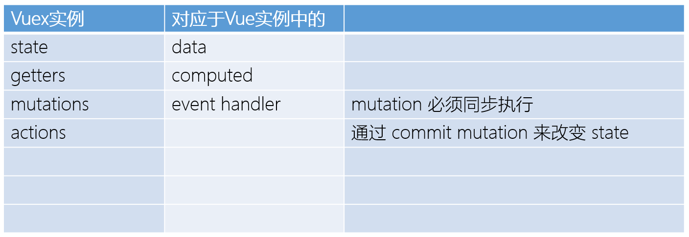
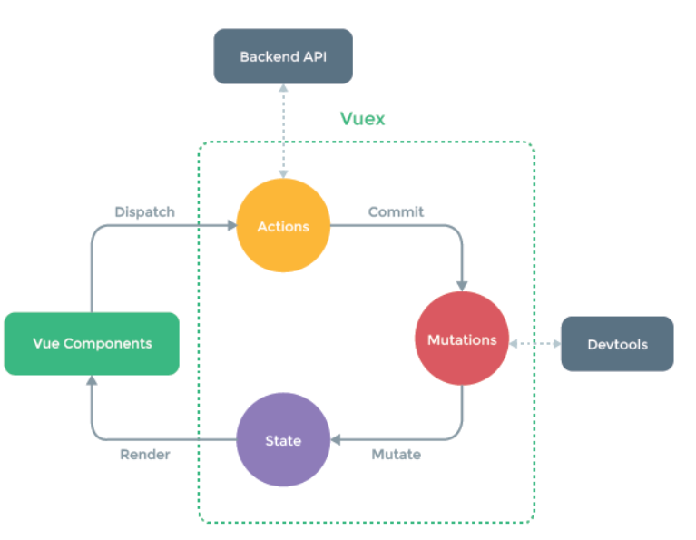

### 一、VueX



#### 前言

> 为什么一定要用VueX来维护全局的变量呢？

确实有一套自有的框架来更好的维护 全局的实例属性与方法，但这显示不是我们一定要使用 vuex的原因。因为这可以找到替代品。

根本原因如下

1. 框架内的变量变化监听问题 => vuex是依据框架而实现，其内将vuex数据也可以劫持绑定！
2. 其次它确实已经是一套完整的维护框架，非常实用。

#### 1、vueX在vue中的架构

不要混杂代码，应尽量抽离，以下是一个示范。

```js
# main.js
import store from '@/store/index'

new Vue ({
    el: '#app',
    store, // 当然你也可以使用 Vue.use()
})
```

对应的store文件夹下的index

此外你可以对其 进行进一步的封装与抽离的改造。

```js
import vuex from 'vuex'
const store = new vuex.Store({
   	state: ...,			// 可以看作data
    actions: ...,		// 异步总是希望通过 actions的方法来改变state
    getters: ...,		// computed
    modules: ...,		
    mutations: ...		// 同步总是希望通过 mutations中的方法来改变state
});
```

> 注意事项

- Vuex 通过 `store` 选项，提供了一种机制将状态从根组件“注入”到每一个子组件中

  （需调用 `Vue.use(Vuex)`）：

  

#### 2、 vuex

一切都在图里面了



#### 3、State （全局data）

> `单一状态树`

1. 访问

   ````js
   this.$store.state.count
   ````

2. 辅助函数

   若你不想如此访问，也有更便捷的方式提供.

   在计算属性中如此使用。

   ```js
   import { mapState } from 'vuex'
   
     computed: mapState({
       // 箭头函数可使代码更简练
       count: state => state.count,
   
       // 传字符串参数 'count' 等同于 `state => state.count`
       countAlias: 'count',
   
       // 为了能够使用 `this` 获取局部状态，必须使用常规函数
       countPlusLocalState (state) {
         return state.count + this.localCount
       }
     })
   
   更加简便
   computed: mapState([
     // 映射 this.count 为 store.state.count
     'count'
   ])
   
   computed: mapState([
     ...mapState({
        # 具体内容同上述的几处简单写法
       // ...
     })
   ])
   ```

#### 4、Getter （ Computed）

> Vuex 允许我们在 store 中定义“getter”（可以认为是 store 的计算属性）。就像计算属性一样，getter 的返回值会根据它的依赖被缓存起来，且只有当它的依赖值发生了改变才会被重新计算。

有时候我们想要这样做, 对stroe中的data进行派生

````js
computed: {
  doneTodosCount () {
    return this.$store.state.todos.filter(todo => todo.done).length
  }
}
````

故getter出现了

- 基础用法

  ```js
  #1 基础示范
  state: {
      todos: [
        { id: 1, text: '...', done: true },
        { id: 2, text: '...', done: false }
      ]
    },
    getters: {
      doneTodos: state => {
        return state.todos.filter(todo => todo.done)
      }
    }
  ```

- 基础用法2-  Getter 也可以接受其他 getter 作为第二个参数：

  ```js
  getters: {
    doneTodosCount: (state, getters) => {
      return getters.doneTodos.length
    }
  }
  ```
  
- 基础用法3 - 传递函数 `额外传参

  通过让 getter 返回一个函数，来实现给 getter 传参。在你对 store 里的数组进行查询时非常有用。

  注意： getter 在通过方法访问时，每次都会去进行调用，而不会缓存结果

  ```js
  getters: {
    // ...
    getTodoById: (state) => (id) => {
      return state.todos.find(todo => todo.id === id)
    }
  }
  
  store.getters.getTodoById(2) // -> { id: 2, text: '...', done: false }
  ```
  
- ⭐ 辅助函数：

  ```js
  import { mapGetters } from 'vuex'
  
  export default {
    // ...
    computed: {
    // 使用对象展开运算符将 getter 混入 computed 对象中
      ...mapGetters([
        'doneTodosCount',
        'anotherGetter',
        // ...
      ])
    }
  }
  
  你也可以这样， 自己来自定义一个名称来映射
  ...mapGetters({
    // 把 `this.doneCount` 映射为 `this.$store.getters.doneTodosCount`
    doneCount: 'doneTodosCount'
  })
  ```

#### 5、Mutations ( methods )

> 更改 Vuex 的 store 中的状态的唯一方法是提交 mutation

```js
  mutations: {
    increment (state) {
      // 变更状态
      state.count++
    }
  }
```

- ⭐ 你不能直接调用一个 mutation handler， 你应该是事件预先注册了一样，指定对应的type给与任务

  你应该直接触发这个任务

  ```js
  store.commit('increment')
  ```

- ### 提交载荷 （ payload ）

  ````js
    // 预先注册任务
    increment (state, n) {
      state.count += n
    }
    # 提交任务
    store.commit('increment', 10)
  ````

  ❗ 大多数情况下，载荷应该是一个对象， 这样你才可以传递更多的参数

  - 当你不想提交载荷时，特地去预先的处理一个对象，你可以使用这种类型的方式来提交！

  ```js
  store.commit({
    type: 'increment',
    amount: 10,
    count: 0,
  })
  
  
    increment (state, payload) {
      state.count += (payload.amount + payload.count)
    }
  ```

- ### Mutation 需遵守 Vue 的响应规则

  1. 在你的 store 中初始化好所有所需属性

  2. 当需要在对象上添加新属性时, 使用 `Vue.set(obj, 'newProp', 123)`

  3. 当需要在对象上添加新属性时, 使用 新对象替换老对象 比如对象展开拓展符。

     ```js
     state.obj = { ...state.obj, newProp: 123 }
     ```

- ### 使用常量替代 Mutation 事件类型

  这是一个示范, 用不用取决于你， 多人协作的大型项目很有必要。

  ````js
  # mutation-types.js
  export const SOME_MUTATION = 'SOME_MUTATION'
  ````

  ```js
  // store.js
  import Vuex from 'vuex'
  import { SOME_MUTATION } from './mutation-types'
  
  const store = new Vuex.Store({
    state: { ... },
    mutations: {
      // 我们可以使用 ES2015 风格的计算属性命名功能来使用一个常量作为函数名
      [SOME_MUTATION] (state) {
        // mutate state
      }
    }
  })
  ```

- ### Mutation 必须是同步函数

  devtools 不知道什么时候回调函数实际上被调用

  ——实质上任何在回调函数中进行的状态的改变都是不可追踪的,

  1. 这样的代码本身没有任何问题， 问题在于 devtool无法追踪，仅此而已。

  ```js
  mutations: {
    someMutation (state) {
      api.callAsyncMethod(() => {
        state.count++
      })
    }
  }
  ```

- ### 辅助函数

  1， 将 this.incrementBy(amount)映射为`this.$store.commit('incrementBy', amount)`

  ```js
  ...mapMutations([
        'increment', // 将 `this.increment()` 映射为 `this.$store.commit('increment')`
        // `mapMutations` 也支持载荷：
        'incrementBy' // 
      
  ]),
      # 换一个名字
      ...mapMutations({
        add: 'increment' // 将 `this.add()` 映射为 `this.$store.commit('increment')`
      })
  ```

  故

  1. this.$store.commit('xxx')
  2. mapMutations 映射

#### 6、Action

> 1. Action 提交的是 mutation，而不是直接变更状态
> 2. Action 可以包含任意异步操作。
>
> 注意
>
> actions中的参数 `context`
>
>  store 实例具有相同方法和属性的 context 对象， 其并非是 store实例本身

这是一个串性的调用

```js
const store = new Vuex.Store({
  state: {
    count: 0
  },
  mutations: {
    increment (state) {
      state.count++
    }
  },
  // 
  actions: {
    increment (context) {
      context.commit('increment')
    }
  },
  # 解构context 
  actions: {
     increment ({ commit }) {
        commit('increment')
  	 }
   }
})
```

- ### 实际使用

  Actions 支持同样的载荷方式和对象方式进行分发：

  ```js
  // 以载荷形式分发
  store.dispatch('incrementAsync', {
    amount: 10
  })
  
  // 以对象形式分发
  store.dispatch({
    type: 'incrementAsync',
    amount: 10
  })
  
  this.$store.dispatch('xxx')
  ```

- ### 辅助函数

  ````js
  ...mapActions([
        'increment', 
        'incrementBy'
      ]),
      ...mapActions({
        add: 'increment' // 将 `this.add()` 映射为 `this.$store.dispatch('increment')`
      })
  ````

- ### 回调Action

  > 我们如何才能知道 action的实际结束呢？

  ```js
  actions: {
    actionA ({ commit }) {
      return new Promise((resolve, reject) => {
        setTimeout(() => {
          commit('someMutation')
          resolve()
        }, 1000)
      })
    }
  }
  
  # 单独调用
  store.dispatch('actionA').then(() => {
    // ...
  })
    # 两个action之间有关系
    actionB ({ dispatch, commit }) {
      return dispatch('actionA').then(() => {
        commit('someOtherMutation')
      })
    }
  ```

#### 7、Module

> https://vuex.vuejs.org/zh/guide/modules.html

> Vuex 允许我们将 store 分割成**模块（module）**。每个模块拥有自己的 state、mutation、action、getter、甚至是嵌套子模块——从上至下进行同样方式的分割

```js
const moduleA = {
  state: () => ({ ... }),
  mutations: { ... },
  actions: { ... },
  getters: { ... }
}

const moduleB = {
  state: () => ({ ... }),
  mutations: { ... },
  actions: { ... }
}

const store = new Vuex.Store({
  modules: {
    a: moduleA,
    b: moduleB
  }
})

store.state.a // -> moduleA 的状态
store.state.b // -> moduleB 的状态
```

#### 8、 模块建议

```js
├── index.html
├── main.js
├── api
│   └── ... # 抽取出API请求
├── components
│   ├── App.vue
│   └── ...
└── store
    ├── index.js          # 我们组装模块并导出 store 的地方
    ├── actions.js        # 根级别的 action
    ├── mutations.js      # 根级别的 mutation
    └── modules
        ├── cart.js       # 购物车模块
```

#### 9、实际应用

##### 01|如何去监听vuex的值
