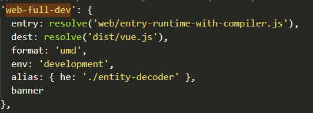
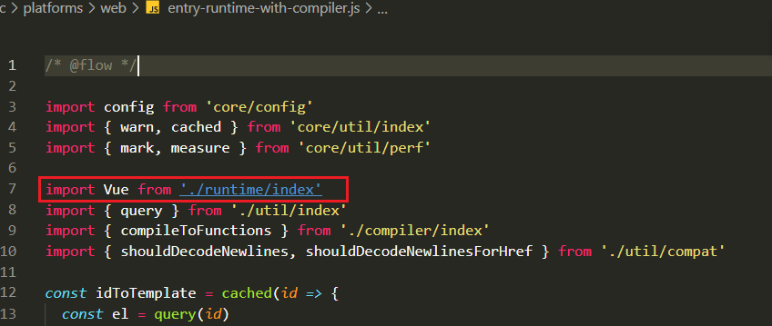
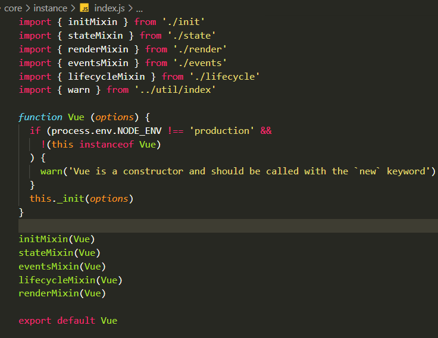
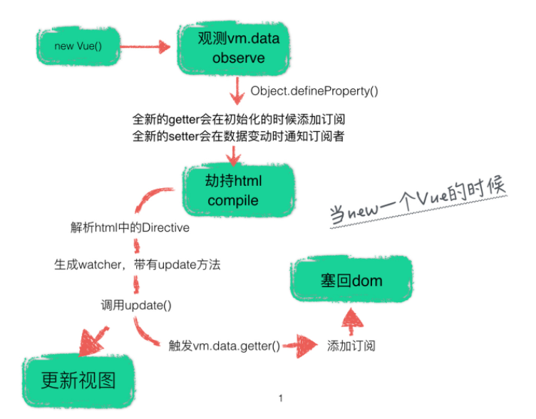

> 参考文章： http://hcysun.me/2017/03/03/Vue%E6%BA%90%E7%A0%81%E5%AD%A6%E4%B9%A0/
>
> 参考代码： https://github.com/vuejs/vue
>
> <span style='color: red;'>看庞大的代码应先关注于宏观</span>

## 1 寻找Vue构造函数

1.  检出 官方的vue项目， 使用 `npm run dev`命令 

   【既然是通过 npm run dev】来启动项目， 那看看此命令做了些什么？

   此处是由关于 roll的打包过程, 了解即可，最终目标是发现vue的构造函数在哪里
   
   ````json
   "dev": "rollup -w -c scripts/config.js --environment TARGET:web-full-dev",
   ````

   查询对应文件的对应目标如下
   
   

````js
if (process.env.TARGET) {
  module.exports = genConfig(builds[process.env.TARGET])
} else {
  exports.getBuild = name => genConfig(builds[name])
  exports.getAllBuilds = () => Object.keys(builds).map(name => genConfig(builds[name]))
}

// 此处等价于
module.exports = genConfig({
 	entry: resolve('web/entry-runtime-with-compiler.js'),
    dest: resolve('dist/vue.js'),
    format: 'umd',
    env: 'development',
    alias: { he: './entity-decoder' },
    banner
})
````

2. 入口文件

    > 这条线路上，经历了很多次的处理，未来
    
    ```js
   entry: path.resolve(__dirname, '../src/entries/web-runtime-with-compiler.js'),
   ```

   在入口文件中,  故我们应看此文件， 此文件暂时略。

- 第一次： 在`entry-runtime-with-compiler.js`中
  
   

````js
# 这是最终的入口Vue
1、 Vue.prototype.$mount
2、 Vue.compile
````

- 第二次：`runtime/index` 在```中我们又可以看到如下的一句话，故

````js
import Vue from 'core/index'

看一看在【runtime/index】中做了什么?
    
#1 install platform specific utils
Vue.config.mustUseProp = mustUseProp
Vue.config.isReservedTag = isReservedTag
Vue.config.isReservedAttr = isReservedAttr
Vue.config.getTagNamespace = getTagNamespace
Vue.config.isUnknownElement = isUnknownElement

#2  又一次处理了 mount
Vue.prototype.$mount // public mount method
````

- 第三次，在其`core/index`中

  > 此时

````js
import Vue from './instance/index'

在【core/index】中做了什么呢？
Object.defineProperty(Vue.prototype, '$isServer', {
  // 设置其get的返回值
  get: isServerRendering
})
Object.defineProperty(Vue, 'FunctionalRenderContext', {
  // 设置其值
  value: FunctionalRenderContext
})
````

- 第四次，在`instance/index`

  作用： Vue的构造函数上被添加了一些原型方法

六处文件构成了 Vue的构造函数的核心内容。




````js
# 1	initMixin(Vue) 		
=> './init' 提供了 initMixin方法 （mixin 的含义为 混合）
	Vue.prototype._init = function (options?: Object)

#2	stateMixin(Vue) 	
=> './state' 提供了 stateMixin

	Object.defineProperty(Vue.prototype, '$data', dataDef)	 # this.$data
	Object.defineProperty(Vue.prototype, '$props', propsDef) # this.$props为谁服务？
	Vue.prototype.$set = set		# 看到了老朋友 this.$set 原来是在这里声明的！
	Vue.prototype.$delete = del
	Vue.prototype.$watch

#3
eventsMixin(Vue)	=>  './events'
	Vue.prototype.$on
	Vue.prototype.$once
	Vue.prototype.$off
	Vue.prototype.$emit # 看到了老朋友 this.$set！ 
#4
lifecycleMixin(Vue)	=> 	'./lifecycle'
	Vue.prototype._update
	Vue.prototype.$forceUpdate # 倒是见过，不过不知道具体作用 this.$forceUpdate
	Vue.prototype.$destroy
#5
renderMixin(Vue)	=>  './render'
	Vue.prototype.$nextTick
	Vue.prototype._render
	installRenderHelpers 函数在原型上挂载了好多_o, _f, _k这类方法
````

※`Vue` 在经过 `initGlobalAPI` 之后，会变成这样：

```js
// src/core/index.js / src/core/global-api/index.js
Vue.config
Vue.util = util
Vue.set = set
Vue.delete = del
Vue.nextTick = util.nextTick
Vue.options = {
    components: {
        KeepAlive
    },
    directives: {},
    filters: {},
    _base: Vue
}
Vue.use
Vue.mixin
Vue.cid = 0
Vue.extend
Vue.component = function(){}
Vue.directive = function(){}
Vue.filter = function(){}

Vue.prototype.$isServer
Vue.version = '__VERSION__'
```


## 1  initMixin

````js
	initLifecycle(vm)
    /*初始化事件*/
    initEvents(vm)
    /*初始化render*/
    initRender(vm)
    /*调用beforeCreate钩子函数并且触发beforeCreate钩子事件*/
    callHook(vm, 'beforeCreate')
    initInjections(vm) // resolve injections before data/props
    /*初始化props、methods、data、computed与watch*/
    initState(vm)
    initProvide(vm) // resolve provide after data/props
    /*调用created钩子函数并且触发created钩子事件*/
    callHook(vm, 'created')
````


### initLifecycle

- 初始化生命周期

- hook

  hook的实现本质是 $emit回调生命周期函数实现的，

  故hook的回调与event有关系

### initEvents

？？？

### ⭐initState

#### ⭐ initProps

```js
parentListeners: 此变量在父组件初始化子组件前，会在options加入此变量，代表父组件的监听事件


```


#### ⭐initMethods

很简单， 若无值即空方法，若有值则将改变this为vm

````js
vm[key] = methods[key] == null ? noop : bind(methods[key], vm)
````

#### ⭐initData

1. 使用代理

   ````js
   proxy(vm, `_data`, keys[i])
   ````

2. 数据绑定

   - vue对数组原型方法的改写
   - 观察者 订阅器 监听者

   ```js
   1. observe(data, true /* asRootData */) =>  new Observer(value)
      => 若是数组 => augment(value, arrayMethods, arrayKeys)
   			  => observeArray => observe(items[i]) => ....
   	
      => 若是对象 => this.walk(value) => defineReactive
   
   2. defineReactive
   	形参val				 // 函数形参闭包
   	const dep = new Dep() // 闭包dep
       
       #1 可将getter视作 依赖收集的过程
       
   ```

   - 依赖收集 getter 

     > 此处Dep,target的生成与get的初次触发与 Comiple有关系！

     ```js
     const dep = new Dep()
     // 注意子父执行顺序
     let childOb = observe(val) 
     get: function reactiveGetter () {
           const value = getter ? getter.call(obj) : val
           // Dep.target即Watcher 具体watcher由 【compile】生成
           if (Dep.target) {
             /*进行依赖收集*/
             dep.depend()
             if (childOb) {
               /* 
               	子对象进行依赖收集，
               	其实就是将同一个watcher观察者实例放进了两个depend中，
               	一个是正在本身闭包中的depend，另一个是子元素的depend
               */
               childOb.dep.depend()
             }
             if (Array.isArray(value)) {
               dependArray(value)
             }
           }
           return value
         },
     ```

   - 订阅更新

     ```js
      set: function reactiveSetter (newVal) {
     	  .......
           /*新的值需要重新进行observe，保证数据响应式*/
           childOb = observe(newVal)
           /* dep对象通知所有的观察者 */
           dep.notify()
         }
     ```

   其他

   ```js
   #1 获取属性描述符
   const property = Object.getOwnPropertyDescriptor(obj, key)
   ```

#### ⭐initComputed

1.  为计算属性创建一个内部的监视器Watcher，保存在vm实例的`_computedWatchers`

   ````js
   watchers[key] = new Watcher(vm, getter, noop, computedWatcherOptions)
   ````

2. 然后，*定义计算属性*/ => `defineComputed` => 计算属性也是一个属性！

   ````js
   // userDef即 对应的值， 它可以是一个 对象（get、se	t）也可以是一个函数
   defineComputed(vm, key, userDef)
   
   #1 若只是函数，即computed传来的最常用的写法
   	sharedPropertyDefinition.get = createComputedGetter(key)
   	sharedPropertyDefinition.set = noop
   	Object.defineProperty(target, key, sharedPropertyDefinition)
   
   #2 若你传的不是函数 => 则认为是 get/set
   	2.1 若get不存在， 则取 userDef.cache中get => 依旧不存在 => createComputedGetter 
   	2.1 若set不存在， 则取 userDef.cache中set => 依旧不存在 => noop 
   ````

3. 创建计算属性的getter => `createComputedGetter`

   ⭐ `你访问的get其实是在访问一个 函数` => `由 watcher.value决定`

   由于 key永远不变，故用了函数柯里化闭包

   - 请注意此处是get， 也就是说每一次访问都是触发此函数！此处也是实现的核心

   ````js
   function createComputedGetter (key) {
     return function computedGetter () {
       const watcher = this._computedWatchers && this._computedWatchers[key]
       if (watcher) {
         /* 实际是脏检查，在计算属性中的依赖发生改变的时候dirty会变成true，
         	 在get的时候重新计算计算属性的输出值 */
         if (watcher.dirty) {
           watcher.evaluate()
         }
         /*依赖收集*/
         if (Dep.target) {
           watcher.depend()
         }
         return watcher.value
       }
     }
   }
   ````

4. 示范

   > - initComputed
   >
   >   会为`每一个computed属性`创建`watcher`, 且执行`defineComputed`
   >
   > - 例如
   >
   >   full属性new一个watcher， 并且设置了其
   >
   >   ```js
   >   {{full}}
   >   computed: {
   >       full() {
   >          return this.msg + 'world';
   >       },
   >   },
   >   ```

   - 在`compile`的时候 必然会触发 full属性，触发我们给与的get方法, 即computedGetter

     此时会进行依赖收集与脏值检查

     ```js
     // 若变化  
     evaluate () {
         this.value = this.get()
         this.dirty = false
     }
     
        /*获得getter的值并且重新进行依赖收集*/
     get () {
         /* 将自身watcher观察者实例设置给Dep.target，用以依赖收集。 */
         pushTarget(this)
         let value
         const vm = this.vm
     
         /*
           执行了getter操作，看似执行了渲染操作，其实是执行了依赖收集。
           在将Dep.target设置为自生观察者实例以后，执行getter操作。
           譬如说现在的的data中可能有a、b、c三个数据，getter渲染需要依赖a跟c，
           那么在执行getter的时候就会触发a跟c两个数据的getter函数，
           在getter函数中即可判断Dep.target是否存在然后完成依赖收集，
           将该观察者对象放入闭包中的Dep的subs中去。
           
         */
         
         # getter 便是计算属性传递过来的函数
         # 此时会连续触发对应的多个getter 由于我们对已经对data的数据进行了响应式处理！
         # initData已经被执行过了！
         # 注意 此时 Dep.target被设置目前所处的 计算属性的Watcher!
         value = this.getter.call(vm, vm)
         
         /*如果存在deep，则触发每个深层对象的依赖，追踪其变化*/
         if (this.deep) {
           /*递归每一个对象或者数组，触发它们的getter，
           使得对象或数组的每一个成员都被依赖收集，形成一个“深（deep）”依赖关系*/
           # 将他们联系起来！尤其在computed时
           traverse(value)
         }
     
         /*将观察者实例从target栈中取出并设置给Dep.target*/
         popTarget()
         this.cleanupDeps()
         return value
       }
     
     ```

     - 作用:     msg的订阅subs列表会有full的watcher，若牵涉更多属性以此类推
     - 

     > 1. 一旦msg改变， 其msg中的订阅依赖有 计算属性的full的 watcher, 故也会通知full进行一次更新
     >
     >    便可以实现动态性的更新！

   - 总结

     1. initData后再初始化 initComputed是保证computed依赖的data已设置get

     2. 每一个计算属性都会注册自己的Watcher

        并且注册一个getter方法，作为一种方式

     3. 首次compile时会触发其计算属性的get， 返回对应的函数值。

        因而也会触发所依赖的属性的getter， 其触发时候，再次将Dep.target打开，令其依赖的属性所有的订阅器中都有 computed的watcher

     4. 故实现了动态更新。 更改别处属性，会通知computed的watcher触发对应事件

   

#### ⭐initWatch

- vue将watcher分为了三类（根据其执行的handler大致可以区分）
  1. render-watcher
  2. user-watcher
  3. computed-watcher

watch有两种格式
1. 字符串 'msg.one'
2. 对象,  { handler: function(){}, deep: true }

```js
/*初始化watchers*/
createWatcher() =>  
vm.$watch(key, handler, options) =>

$watch = function() {
    const watcher = new Watcher(vm, expOrFn, cb, options)
    # 若immediate => cb.call(vm, watcher.value) 立即执行
   	# 1 deep: true
    	若你传入deep => 则其子属性也会被注册watcher
    
}
```


## vue的双向绑定



> 参考文档： https://segmentfault.com/a/1190000006599500
>
> 这是一个更好的参考文档： https://zhuanlan.zhihu.com/p/27111918
>
> sf是yyds！

- 关于vue： ``数据劫持` +  `发布者-订阅者模式`的方式

1. 数据劫持

   `Object.defineProperty()`来实现对属性的劫持，达到监听数据变动的目的

2. 发布者-订阅者模式

### 1 实现 Observe

- 对数据进行数据的劫持

  这里只是初步的实现，暂时不考虑数组一类数据

  ```js
  function observe (data) {
  	if (!data || typeof data !== 'object') return;
      Object.keys(data).forEach( key => {
         defineReactive(data, key, data[key]);
      });
  }
  # 此处存疑问， 我们进行的set修改真的成功了吗？ val毕竟可能不是引用类型吧？
  # 答: 经过解答, 闭包了形参， val 相当于常驻内存的常量，我们一直来维护这个形参变量
  function defineReactive(data, key, val) {
  	observe(val);
      Object.defineProperty(data, key, {
         configurable: false,
         enumerable: true,
          get:function() {
          	return val;
          }
          set:function(newVal) {
          	val = newVal
      	}
      });
  }
  ```

- 基础的数据劫持已经实现了，目前来实现通知订阅者。 发布者-订阅者模式

  ````js
  function observe(data) {}
  function defineReactive(data, key, val) {
      # 每一个属性都应该有一个
      var dep = new Dep();
  	observe(val); // 令其本身响应
  	Object.defineProperty(data, key, {
          ·······
          set: function(newVal) {
              val = newVal
              #   通知所有订阅者
              dep.notify();
          },
      });
  }
  
  # Dep是订阅者Watcher对应的数据依赖
  function Dep() {
      this.subs = [];
  }
  Dep.prototype = {
      addSub(sub) {
          this.subs.push(sub);
      }
      notify() {
          this.subs.forEach(function(sub) {
              sub.update();
          });
      },
  }
  ````

- 谁是订阅者？怎么往订阅器添加订阅者？

  订阅者应该是Watche

  ````js
  // Observer.js
  Object.defineProperty(data, key, {
      get: function() {
          // 由于需要在闭包内添加watcher，所以通过Dep定义一个全局target属性，
          // 暂存watcher, 添加完移除
          Dep.target && dep.addSub(Dep.target);
          return val;
      }
  });
  
  // Watcher.js
  Watcher.prototype = {
      get: function(key) {
          Dep.target = this;
          this.value = data[key];    // 这里会触发属性的getter，从而添加订阅者
          Dep.target = null;			
      }
  }
  ````

### 2 实现 Compile

- 简而言之， 编译为数据

- 对每个元素节点的指令进行扫描和解析，根据指令模板替换数据，以及绑定相应的更新函数

  1. 遍历所有节点及其子节点, 调用对应的指令渲染函数进行数据渲染，并调用对应的指令更新函数进行绑定
  2. 所谓的编译的流程就是读取了不同节点类型中的属性
  3. 这个例子只尝试实现v-model及{{}},
     - 若是元素节点，生成一个watcher，加一个监听，监听input输入值同时改变vm上的对应属性值
     - 若是文本节点，生成一个watcher，当vm的值大赛变化时改变文本节点的值

  ```js
  function compile (node, vm) {
  	let reg = /\{\{(.*)\}\}/
  	if (node.nodeType === 1) {
  		let attr = [].slice.call(node.attributes)
  		attr.map((i) => {
  			if (i.nodeName === 'v-model') {
  				let name = i.nodeValue
  				node.addEventListener('input', (e) => {
  					vm[name] = e.target.value
  				})
  				node.removeAttribute('v-model')
  				new Watcher(vm, node, name, 'input')
  			}
  		})
  	}
  	if (node.nodeType === 3) {
  		if (reg.test(node.nodeValue)) {
  			let name = RegExp.$1
  			name = name.trim()
  			new Watcher(vm, node, name, 'text')
  		}
  	}
  }
  ```

### 3 实现 Watcher

- Watcher订阅者作为`Observer和Compile`之间通信的桥梁

- Observer和Compile的桥梁, 能够订阅并收到每个属性变动的通知，执行指令绑定的相应回调函数，从而更新视图

  ```js
  
  function Watcher(vm, exp, cb) {
      this.cb = cb;
      this.vm = vm;
      this.exp = exp;
      // // 此处为了触发属性的getter => 目的是 添加subs
      this.value = this.get(); 
  }
  	
  Watcher.prototype = {
      get: function() {
          //  将当前订阅者指向自己
          Dep.target = this;
          //  触发getter，添加自己到属性订阅器中 => Dep.target && dep.addSub(Dep.target);
          var value = this.vm[exp] 
          // 添加完毕重置
          Dep.target = null;			
      	return value;
      },
      update: function() {
          this.run();    // 属性值变化收到通知
      },
      run: function() {
          var value = this.get(); // 取到最新值
          var oldVal = this.value;
          if (value !== oldVal) {
              this.value = value;
              this.cb.call(this.vm, value, oldVal); // 执行Compile中绑定的回调，更新视图
          }
      },
      
  }
  ```

### 4 MVVM实现

````js
function MVVM(options) {
    this.$options = options;
    var data = this._data = this.$options.data, me = this;
    // 属性代理，实现 vm.xxx -> vm._data.xxx
    Object.keys(data).forEach(function(key) {
        me._proxy(key);
    });
    observe(data, this);
    this.$compile = new Compile(options.el || document.body, this)
}

// 属性代理
MVVM.prototype = {
    _proxy: function(key) {
        var me = this;
        Object.defineProperty(me, key, {
            configurable: false,
            enumerable: true,
            get: function proxyGetter() {
                return me._data[key];
            },
            set: function proxySetter(newVal) {
                me._data[key] = newVal;
            }
        });
    }
};
````


## 响应式原理（数据绑定）

1. getter进行依赖收集
2. 每个setter方法就是一个观察者
3. 使用代理

## 依赖收集

1. 为什么需要依赖收集

   ````js
   new Vue({
       template: 
           `<div>
               <span>text1:</span> {{text1}}
               <span>text2:</span> {{text2}}
           <div>`,
       data: {
           text1: 'text1',
           text2: 'text2',
           text3: 'text3'
       }
   });
   ````

   问题：

   ```js
   this.text3 = '1000';
   ```

   此时的触发setter理应 不重新渲染。

   - data中的数据就会被getter收集到Dep的subs中去

2. watcher

   subs当中存在各类watcher， 我们喜欢称呼为订阅者。

   在修改data中数据的时候会【触发】dep对象的notify【通知】所有Watcher对象去修改对应视图

> 将观察者Watcher实例赋值给全局的Dep.target，然后触发render操作只有被Dep.target标记过的才会进行依赖收集。有Dep.target的对象会将Watcher的实例push到subs中，在对象被修改触发setter操作的时候dep会调用subs中的Watcher实例的update方法进行渲染。

### 

