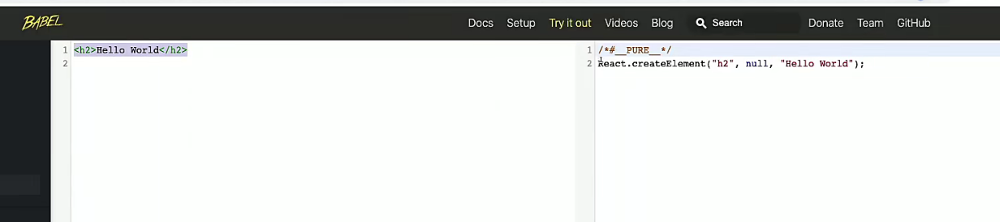
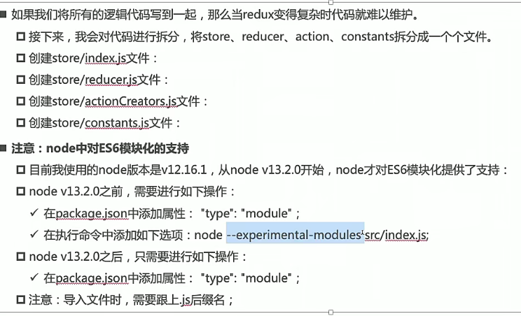

>code => Preference => user snippests 创建专属于你的用户片段
>
>你可以借助 snippet-generator.app此网站来进行快速生成json示范帮助你来生成。
>
>react准则: 
>
>1. all in js
>
>一个插件推荐
>
>1. React Snippets

### *  初次认识

1. react.js：React核心库。

2. react-dom.js：提供操作DOM的react扩展库。

3. babel.min.js：解析JSX语法代码转为JS代码的库。

````js
# 首先要引入这三个基本的库
<script type="text/babel">
    const VDOM = (
    	<h2 id="test">123</h2>
    )
	// 参数一: react内容
    ReactDom.render(VDOM, document.querySelector(' #App')); // 即可渲染
</script>
````

> 关于虚拟Dom
>
> 虚拟dom属性相对于原生属性极少，因为虚拟dom由react使用，不关心无关样式、属性。
>
> 不过虚拟dom依旧会转为 dom

### *  jsx规则

> JavaScripteXtension 拓展，但又像xml 故也称jsxml 用js表述我们的html
>
> 你不需要学习任何模块语法 => 如 v-for,  v-html这类 。

####  0 jsx

是 `React.createElement(components, props, ...children)`的语法糖 

也是它的本质。

React.createElement 创建一个 ReactElement对象， 最终构成 VDOM

```js
# 如此便不需要 babel 来帮助你编译
const message = React.createElement("h2", null, "hello react");
React.render(message, document.getElementBy("app"))  
```

使用babel来转化




#### 1 jsx绑定属性

- 样式类名 应使用 clasName 而不是 class

  内联样式应以键值对形式

  1. 若是 小写标签，回自动转为html标签
  2. 若是 大写标签，认为其是组件，并渲染组件方式。
  
  ````jsx
  #1 若是class
  const a = <h2 className = "test">123</h2>
  
  #2 若是style 必须是 表达式 且是键值对， 故两个括号
  const b = <span style={{color: "white"}}></span>
        
  #3 若是其他属性
  const c = </img>
  const d = </img>
  ````

#### 2 遍历

- 遍历

  1. react中的 {} 内仅可写 表达式，初次之外可以写数组，会自动遍历
  2. 但 {obj} 这种形式是不可的、

  ```jsx
  
  
  render() {
      const arr = [];
      // let xx in x 是取 key
      for(let movice of movices) {
          arr.push(movice);
      }
      return (
          # 方式一
      	<ul>
          	{
                 arr.map((item, index) => <li key={index}>{item}</li>)
              }
          </ul>
          # 方式二
          <ul>
      		{this.state.movices.map((item, index) => <li key={index}>{item}</li>)}
  		</ul>
      )
  }
  ```

  

  jsx中的注释

  ```js
  render() {
      return (
      	{/* 我是注释 */}
      )
  }
  ```

  jsx嵌入数据注意事项

  1. 这三种值不显示

     ```jsx
     <h2>
     	{null}
         {undefined}
         {false}
     </h2>
     ```

  2. 对象不可作为jsx子类

     ```jsx
     <h2>
     	{obj}
     </h2>
     ```

  3. jsx中的{} 不仅只放变量，也可放表达式

     - 运算符表达式
     - 三元表达式
     - 函数调用

     ```jsx
     const { name } = this.state;
     return (
     	<div>
         	{ name * 50 }
             { this.getName() }
         </div>
     )
     ```


#### 3 state（数据）

>  若我们想要使用 state => 则是类组件
>
> 不用state => 函数式组件， 仅适用于简单组件
>
> - class 才有资格谈实例， 才有可以访问到组件的实例对象的state

- 一个基本的例子， 不过这样初始化不好

  此外推荐 React 官方提供的 浏览器插件，其拓展了浏览器的控制台面板。

  ```jsx
  class Weather extends React.Component {
      constructor (props) {
          super(props);
          this.state = { isHot: true };
      }
      render() {
          return (<h1>{this.state.isHot}</h1>)
      }
  }
  ```
  
- 正确的state使用方式

  ````js
  class Car {
      render() {}
      // 在类中写赋值语法相当于直接在构造器中 进行 this.state = {...}
      state = { isHot: true}
  }
  ````
  
- setState

  1. this.setState 是 合并操作， 不过将state所有属性覆盖

  2. 每次调用 setState 都会重新执行一次 render函数！

      当然render会在初始化时也执行一次
      
  3. setState方法来自于React.Component父类的继承
  
  ```js
  change = () => {
      this.setState (
      	{
              isHot: true
          }
      )
  }
  ```

> 总结
>
> state  应该使用赋值的方式最简单也是最合适

#### 4 事件

##### 1 事件方法的进化

1. 如何访问 实例组件对象, 第一个演示，不要这么写！虽然他可以符合预期。

   > 为了访问到 其组件内部实例的 state 属性， 可以通过外部声明函数的形式， 将this闭包来访问。
   >
   >  但这种其实过于分散，不利于开发。

   - 当然真实开发这并不这么写，但我们在此处特地强调。

   - onClick 并不会帮你默认绑定this， 而是 change.apply(undefined)

   ```js
   #1
   let that;
   function change () {
       that.state.hot = false;
   }
   class Weather extends React.Component {
       constructor (props) {
           super(props);
           this.state = isHot: true;
           # 2
           that = this;
       }
       render() {
           return <h1 onClick="{change}">{this.state.isHot}</h1>
   
       }
   }
   ```

2. 这是一个错误的示范

   ```js
   class xxx {
       render() {
           return <h1 onClick="{this.change}">{this.state.isHot}</h1>
       }
       # 那如此
       change() { console.log(this) }
   }
   # 但此时 你会发现 this 的指向 为 undefined
   原因:	
   onClick = this.change, 此外react处理的时候绑定此函数this的也是undefined
   再次点击 相当于 change 调用, 故this指向不对。 可视作this的默认绑定形式
   ```

3. 如何访问 实例组件对象 

   > 1. 实例不存在 change， 故寻找原型change函数
   > 2. 原型上 change的 this 通过显示绑定
   > 3. 给实例添加change属性， 则每次onClick事件调用优先访问实例上属性

   ````jsx
   # 这种稍微常见一点,但也不推荐。
   class xxx extends React.Component{
       constructor() {
           this.change = this.change.bind(this);
       }
       render() {
           return <h1 onClick="{this.change}">{this.state.isHot}</h1>
       }
       change() { console.log(this) }
   }
   
   # 不建议如此做, 方法多次调用时候多次冗余bind的调用,过于愚蠢。
   class App extends React.Component{
       constructor() { 
       }
       render() {
           # 此时主动绑定此this也是同样效果 该this便是 App
           return <h1 onClick="{this.change.bind(this)}">{this.state.isHot}</h1>
       }
       change() { console.log(this) }
   }
   ````
   

##### 2 正确示范

   - 自定义方法： 使用 赋值 + 箭头函数 的形式
   - 显示绑定 固然会让this绑定失效，但不会令传参失效。

   ````jsx
   class Car {
       // 为什么写箭头函数，因为可以让 bind\call\apply 的this绑定失效
       render() {
           # 此时主动绑定此this也是同样效果 该this便是 App
           return <h1 onClick="{e => {this.change(item, index, e)}}">{this.state.isHot}</h1>
       }
       change = (item, index, e) => {
           this.setState({});
       }
   }
   ````

##### 3 事件委托

```jsx
return (
	<ul>
    	{
            this.state.movice.map(item => {
                return (
                	<li 
                        onClick={e => {this.liClick(item, e) } }>
                        {item}
                    </li>
                )
            })
        }
    </ul>
)
liClick = ((item, e) => { 
});
```


##### 4 event对象

> 使用 onXxxx 属性来指定事件的函数 【注意大小写】.
>
> 其使用的是 指定react 规定的事件， 而不是使用Dom原生。 目的是兼容

- react 希望不要滥用 ref， 故可以通过 e.target来回调想要的数据

  默认情况下会将event对象传递给方法。
  
  ````js
  <div onBlur={ this.eventBlur }
  
  eventBlur (event) {....}
  ````

##### 受控组件 与 非受控组件

- 现用现取 即为 非受控组件
- 类似于双绑机制， state同步的便是 受控组件。 依赖state

```js
<form action = 'xxx' onSubmit = {this.handleSubmit}
	// 非受控
	<input type='txt' name='user' ref= { c => this.userDom = c }
	// 受控
	<input type='txt' onChange = 'this.onChange'
```

#####  事件与 函数的柯里化

- 请看如下的示范

  > 事件绑定理应是 一个函数, 此处也应该返回一个函数
  >
  > 故我们巧用 函数柯里化, 帮助我们回调传参

  ```js
  // onClick
  <input onChange = { this.saveFormData('username') }
  
  saveFormData: type => {
      return 
          (e) => {
          	this.setState( {[type], e.target.value} )
          }
      }
  }
  
  # 当然可以不用函数柯里化!也是极其常见的方法
  <input onChange = { e => this.saveFormData('userName', e.traget.value)  }
  ```
  
  > - 高阶函数
  >
  >   通俗, 函数的 开始 与 结尾 其一为函数, 便可以称呼为高阶函数
  >
  >   1. 满足 其函数的参数为函数,则就可以称为高阶函数
  >   2. 其调用返回的值 为函数则可以称呼为高阶函数
  >
  >   举例: 
  >
  >   ```js
  >   setTimeout 传入函数参数
  >   数组的大多数方法也是高阶函数
  >   promise也传入函数了!
  >   ```
  >
  > - 函数柯里化
  >
  >   简而言之, 函数再次调用函数
  >
  >   ```js
  >   add(1)(2)(3)
  >   ```
  >   
  >   

#### 4 条件渲染

1. js => 适用于条件逻辑比较复杂的情况

   ```jsx
   render() {
       let text = null;
       if (this.state.isLogined) {
           text = <span>欢迎换来</span>
       }
       else {
           text = <span>请登录</span>
       }
       return (
       	<div>
           	{ text }
           </div>
       )
   }
   ```

2. 逻辑与 请牢记这种方式 将会销毁组件

   ```jsx
   <h2>{ isLogin && name }</h2>
   { isLogin && <h2>{ name }</h2> } 
   ```

3. v-show的模拟

   即使用 style属性动态切换。设置display: none

#### 5 props

- 传递props给与组件内部

  ````js
  ReactDom.render(<Person name="tom" age="18"/>)
  ````

- 调用

  ````js
  {this.props.name}
  ````

- 批量传递props

  ```` js
  # 相当于解构赋值， 可视作语法糖， 将 p 的属性一一赋予 props
  <Person {...p} /> 
  ````

  1. 关于解构赋值

     解构赋值可以用于函数传参

     ````js
     function hello (...numbers) {
         numbers[0]\ numbers[1]、 numbers[2] 这种来访问
     }
     还比如可以如此
     let p3 = { ...p3, name: '黄鹏'}
     ````

  2. 此处批量传递仅是语法糖，且按理 扩展语算符不可解构对象，但此处居然可以了，

     - 这里使用的原因 因为 react + babel 令其可以使用 ...p 这种形式
     - ...arr 是可以的， ...obj 是不可以的, 对于扩展预算符

- props的限制

  1. 初次认识 props 校验 、 默认值

  ````js
  class Person extneds React.Component {}
  Person.propTypes = {
      name: React.PropTypes.string // 这是 React15的版本
  }
  // 不过也可以如此
  # 你首先要引入 prop-types文件来使用 => 令全局有 PropType 对象
  Person.propTypes = {
      name: PropTypes.string // 这是 React15的版本
      sex: PropTypes.string.isRequired,
      speak: PropTypes.func
  }
  
  
  #默认值
  Person.defaultProps {
      sex: 1,
  }
  ````

  2. 更好的写法

     ```js
     class Person extends React.Component {
         static propTypes: {},
     	static defaultProps: {}
     }
     ```

  3. 函数组件使用props

     - 首先要明确的是 函数组件是无实例产生的， 故无法通过this来访问
       1. refs 无法获取
       2. state 无法获取
       3. props借助传参可以实现

     ````js
     function Person (props) {
         // 可以访问props
     }
     
     Person.propTypes = {}
     Person.defaultProps = {}
     
     <Person name="18">
     ````

#### 6 构造器

> 1. 为什么constructor 是可有可无的, 什么时候要用？
> 2. 关于 其中的super一定要用吗？

1. constructor一定要有吗？

   - 初始化 state时， 例如你要在构造器中初始化 state

   - 事件函数绑定实例时 比如 

     ```js
     // 实例属性     原型属性
     this.change = this.change.bind(this);
     ```

2. 为什么一定要先super ？

   ```js
   class Person extends React.Component {
       constructor (props) {
           super(props)
       }
   }
   ```

   - 若你想要 通过 this的实例方式来访问 props 那么你需要如此做

     ```js
     this.props.xxx
     ```

     但其实 construcor 本身接收参数便可以获得props，

     故super完全可以省略。


### * 脚手架

#### 了解PWA

1. PWA全称为Progressive Web App 渐进式Web应用
2. 一个PWA 首先是一个网页， 且可以通过Web技术编写网页应用
3. 随后加上 App Manifest 与 Service Woker实现 pwa的安装与离线
4. 这种web存在的形式，称呼为Web App

他解决了哪些问题？

1. 可添加在主屏幕上 => 网页作为图标安装到 手机上
2. 离线缓存， 即使用户无网络 也可离线使用
3. 实现消息推送
4. 其他 Native app的功能

#### 使用

1. 安装

   ```js
   npm install -g create-react-app // 不可有大写字母 
   ```

2. react项目创建时 默认有 manifest、serviceWoker

   若你不需要pwa项目 你最好删除他们。

3. 暴露配置文件，此命令不可逆

   ```js
   npm run eject => 
   	1. package.json #暴露出所有react脚手架的依赖
       2. scripts #其标签命令发生改变 => node script/start.js 暴露底层执行文件
       3. 
   ```

4. 初始化

   ```jsx
   import React from 'react';
   import ReactDom from 'react-dom';
   import App from './App.js'
   ReactDom.render(App, document.querySelector('#app') )
   ```

   注意你可以这么使用， 变得更加简洁。

   ```js
   import React, { Component } from 'react';
   ```

### * 组件开发

> 是否关注 UI的展示，是否关注数据的逻辑 以此划分组件。
>
> 1. 组件的名称开头必须是大写, jsx严格区分 标签的小写 与 组件的大写

#### 函数式组件

1. 无内部状态 => 故提出了hooks 支持函数式组件内支持状态

```jsx
function Person() {
    # this 指向的是undefined, 由于React开启严格模式  “use strick”
    “use strick” // 函数的局部式是支持开启严格模式的！
    let count = 0;
    return (	
        <h2>{count}</h2>
    )
}
ReactDom.render(<Person />, xxx)
```

#### 类组件

1. 类组件需要继承 React.Component
2. 类组件必须实现React

```jsx
class Person extend React.Component {
    render() {
        # 此时 render中的this指向为当前 组件的实例对象
        return (
            <div></div>
        )
    }
}
# new Person => 调用render => vdom转为 dom
ReactDom.render(<Person />, document.querySelector('#app'))
```

####  refs

> 官方不建议使用 this.$refs的形式，因为存在效率问题，不希望 refs有过多的对象！

1. 字符串创建

   ````js
   <input ref='input'>
   
   通过此访问，且此时是真实dom 
   this.$refs.input
   ````

2. 函数创建【建议】

   - 唯一的缺点是 每次进行更新的时候会执行两次。
     1. 第一次初始化，赋予 null
     2. 第二次才是真正的节点
   - 当 ref为内联函数时， 会将dom节点作为回调参数

   ```js
   <input ref ={(arg)=> curNode = this.inputVal = curNode}
   ```

   - 当然可以用普通函数形式

     ````js
     <input ref = "{this.saveDom}" />
     
     saveDom (node) {
     	this.inputNode = node;
     }
     ````

3. 对象形式 => createRef【建议】

   - 由于用几个便要创建几个，显得很不方便。大多数还是内联函数好用。

   ````js
   class Person {
       constructor() {
           # this.myRef1.current访问 dom
       	this.myRef1 = React.createRef(); 
   		this.myRef2 = React.createRef(); 
       }
   }
   
   <input ref={this.myRef1}
   <input ref={this.myRef2}
   ````

5. refs的种类

   - 组件对象
   - HTML元素

   ```js
   <Counter ref="{this.counterRef}"></Counter>
   // 父祖件调用子组件
   this.counterRef.current.increment();
   
   #2 若是函数组件
   你不能在函数式组件使用ref， 因为他们没有实例挂载。
   但某个情况需要获取【函数组件内的某个元素】
    你可以通过 【 React.forwardRef 】
   ```

#### 受控组件

> 例如表单元素，DOM提供默认处理表单的行为。
>
> React未禁止这种行为，但通常情况我们使用JS代码自行控制，React称呼其为受控组件。自己维护。

1. state为次组件唯一数据源，以此渲染

2. 此组件控制着用户输入过程时发生的操作

   这种被控制的表单输入元素便是【受控组件】

3. 受控组件，表单数据由React组件处理

```js
#1 便是受控组件
<input onChange="{ e => this.handlechange(e)}" value={this.state.username}

handleChange(e) {
    this.setState({
       username: e.targe.value 
    });
}
```

优化

````jsx
handleChange(event) {
    this.setState({
        [event.taret.name]: evemt.target.value
    })
}
````

#### 非受控组件

1. 数据由DOM节点处理
2. 使用ref获取DOM节点的数据

#### 高阶组件

1. 什么是高阶函数？ 

   高阶函数满足以下条件之一：

   - 接受函数输入

   - 输出函数

2. 什么是高阶组件

   高阶组件其参数为组件，返回值为新组件的函数。其实就是高阶函数，不过为了专用名词。

   ```js
   const EnhancedComponent = higherOrderComponent(WrappedComponent);
   ```

   

### * 组件通信

请参考老师的代码实现。


#### 1 父=>子

Main 为父组件， son 为 子组件。

- 官方文档提供了一个语法糖 【属性展开】

  ```jsx
  <children {...props}></children>
  ```

1. 父 => 子 使用props传递

   - name 属性 传递给 props

   - 不去书写 constructor 其 子组件 render也是没有任何问题的。Component的内部实现。

     1. super(props);

     2. super(); 

        this.props = props; 

     3. super() 也可以

   ````jsx
   # 类组件示范
   class Children() { 
       constructor(props) {
           //super(); this.props = props;
           // super(props);
           super();
       }
       render() {
           const { name } = this.props;
           return { name };
       }
   }
   
   render() {
       return (
       	<div>
           	<Children name="why" age={18}/>
           </div>
       )
   }
   # 函数式组件示范
   function Children(props) {
       const { name } = props;
       return { name };
   }
   ````

   

#### 2 子 => 父 

itemClick属性 赋值一个函数， 从而使之在父中执行。

注意 自定义事件 onClick的this指向问题,依旧是这三个规则

1. onClick = { this.crement.bind(this) }
2. increment = () => {}
3. onClick =  {e => { this.crement() } }

````jsx
父
constructor() {
  super();
  this.state = {
 	counter: 0
  }
}
render() {
    return (
    	<div>
        	<button onClick = {e => this.increment()}></button>
            <CounterButton onClick={this.increment} name=”why“></CounterButton>
        </div>
    )
}
increment = () =>{
    // 触发这里！
    this.setState({
        counter: this.state.counter + 1
    });
}

# 子 事件在 子组件，但执行的是父祖件的方法
class CounterButton () {
    render() {
        const { onClick } = this.props;
        return <button onClick="onClick"></button>
    }
}
````

#### 3 Context

非父子组件数据的共享

- React提供了一个组件共享值的方式， 不必组件树逐层传递props
- context目的便是全局数据共享。

其

1. React.createContext
   - 创建一个需要共享的Context
   - 若组件订阅了Context， 则此组件从离最近的Provider当取当前context值
   - defaultValue是组件在顶层查找过程中若未寻找到，则默认值
2. Context. Provider
   - 返回Provider React组件， 它承诺消费组件订阅context的变化
   - Provider接受value， 传递给消费组件
   - 一个Provider可有多个消费组件
   - Provider的value变化，其内部消费组件重新渲染

```jsx
const UserContext  = React.createContext({
   name: 'aaa',
   level: 99,
});
# 1. 若是类组件
class Chilldren extends Component{
    render() {
        // this.context 便是 【Cmp】的 Provider提供的值
    	console.log(this.context)
    }
} 
# 2. 若是函数组件， 其父组件不变
function Chilldren extends Component {
    return (
    	<UserContext.Consumer>
        {
        	value => {
                return {
                    <div>
                    	{this.context.name}
                    </div>
                }
            }        
        }
        </UserContext.Consumer>
    )
}

# 父组件
export default class Cmp extends Component{
    constructor() {
        this.state = {
            name: 'state',
            level: -1
        }
    }
    render() {
        return (
        	<div>
            	<UserContext.Provider value={this.state}>
                	<Chilldren></Chilldren>
                </UserContext>
            </div>
        )
    }
}
Chilldren.contextType = UserContext;
```

3. 若你有多个context共享

   - 真实开发使用redux， 了解此处即可。

   ````jsx
   <UserContext.Provider value={this.state}>
   	<ThemeContext.Provider value={{color: 'red'}}>
           <Profile></Profile>
       </ThemeContext.Provider>
   </UserContext.Provider>
   
   function Profile() {
       return (
       	<UserContext.Consumer>
               {
                   value => {
                       return (
                       	<ThemeContext>
                           	{
                                   theme => {
                                       return (
                                       	....
                                       )
                                   }
                               }
                           </ThemeContext>
                       )
                   }
               }
           </UserContext.Consumer>
       )
   }
   ````

#### 4 全局事件

1. 安装

   ````jsx
   yarn add events
   ````

2. 使用

   ```jsx
   import { EventEmitter } from 'events';
   
   const eventBus = new EventEmitter();
   
   render() {
       return <button onClick={ e => this.emmitEvent()}></button>
   }
   
   emmitEvent() {
       eventBus.emit('say', 'hello!', 123)
   }
   
   
   # 事件监听
   class ohterCmp from PureComponent {
       // 添加监听
       componentDidMount() {
           eventBus.addListener('say', this.handleSayListener);
       }
       // 解绑监听
       componentWillUnmount() {
           eventBus.removeListener('say')
       }
       
       handleSayListener(args) {
           console.log(args)
       }
   }
   ```

   

3. 

#### 组件传值-数据校验

```js
import PropTypes from 'prop-types';
ChildrenCpn.propTypes = {
    name: PropTypes.string,
}
```

### * Redux

- 为什么需要Redux？

  1. JS需要管理的状态越来越复杂。服务器数据、分页、UI渲染数据、用户操作数据等

  2. 管理不断变化的state是非常困难的

     - 状态之间会相互依赖， 一个状态变化引起另一个状态变化。
     - state因何变化、怎么样变化不好追踪。

  3. React没有提供方案解决。React目的是为了视图层DOM渲染。State由我们管理。

     - state管理、组件通过props通信、Context数据管理

     - state最终维护还是由我们决定

       UI = render （state）

  4. Redux 便是帮助我们管理State的状态容器，`提供了可预测的状态管理`

#### Redux核心理念

  1. 固定位置存储数据

  2. action

     更新数据一定要通过派发（dispatch）action更新。

     action仅是js对象，以此描述此次更新。真实开发，我们总是通过函数来返回一个action

  3. reducer

     reducer是一个纯函数，将state、action结合在一起生成新的state

#### Redux三大原则

  1. 单一数据源，不管多少个state你都应该存储在store中

  2. State是只读。

     唯一修改的途径只能是action。保证所有修改集中化处理，且按照严格的顺序执行。

  3. 使用纯函数reducer来执行修改

     1. 通过reducer将 旧state与action联系，并返回新的state
     2. 我们可以拆分reducer以此维护。

#### 单独示范

reducer、store、actions

这是一个简单的演示功能，其功能化、模块化需要抽离等等优化。

````jsx
const redux = require('redux');

const initialState = {
    counter: 0
}

// reducer
function reducer(state = initialState, action) {
	switch(action.type) {
        case "INCREMENT":
            // 保证纯函数
            return {...state, counter: state.count + 1}
        case "DECREMENT":
            return  {...state, counter: state.count - 1}
        case "ADD":
            return  {...state, counter: state.count + action.num}
    }
} 

// store
const store = redux.createStore(reducer);

// action
const action1 = { type: "INCREMENT" }
const action2 = { type: "DECREMENT" }
const action3 = { type: "ADD", num: 5}

// 订阅查看每次派发的情况
store.subscribe( ()=> {
	console.log(store.getState.counter)  
})

// 派发 dispath => reducer与action联系
store.dispatch(action1);
store.dispatch(action2);
store.dispatch(action3);
````



#### redux 与 react

1. 组件需要订阅 store
2. state作为props
3.    组件修改state应该dispatch触发action到达reducer以此更新store，从而触发订阅 subscribe

```jsx
import stroe '../store'
import { addAction } from '../store/action'

class Cmp extends PureComponent {
    constructor(props) {
        super(props);
        # 通过store来初始化
        this.state = {
            counter: store.getState().counter
        }
    }
	# 目的setState更新视图
    componentDidMount() {
        this.unSubscribe = store.subscribe(()=> {
			this.setState({
               counter: store.getState.counter 
            });
        })
    }
    # 卸载
	componentDidMount() {
        this.unSubscribe();
    }
    
    render() {
        return (
            <button onClick={ e => this.increment() }></button>
        )
    }

    increment() {
        store.dispatch(addAction(1));
    }
}
```

#### 手动封装connect

如上示范。第十六节课程。

- 每一次的redux在组件中的使用其逻辑存在大量的重复，你会发现redux总是在各处做同样的事情。
- 不同之处在于 state、dispatch

故我们可以做出这种优化

1. 抽离公共代码

   ```jsx
   创建 utils文件夹
   import {  PureComponent } from "react";
   import store from '../store'
   export function connection(mapStateToProps, mapDispatchProps) {
       // 返回高阶组件
       return function enhanceHOC(WrappedComponent) {
           return class extends PureComponent {
                   constructor(props) {
                       this.super(props);
                       this.state = {
                           storeState = mapStatetoProps(store.getState());
                       }
                   }
           		componentDidMount() {
                       this.unsubscribe = store.subscribe( ()=> {
                           # 此处目的是判断是否改变 --> 为了render
                           this.setState({
                               storeState: mapStateToProps(store.getState())
                           })
                       })
                   }
               	render() {
                       <WrappedComponent 
                           {...this.props}
                           {...mapStateToProps(store.getState())}
                           {...mapDispatchProps(store.dispatch)}
                       >
                       </WrappedComponent>
                   }
               	
               }
       	
       }
   }
   ```

2. 组件

   ````jsx
   import { connect } from 'utils/connect';
   import { decrement } from 'store/actions'
   
   
   class About extends Component {
       render() {
           return (
       		<div>
                   {this.props.counter}
                   <button onClick={e => props.decrement()}></button>
               </div>
           )
       }
       decrement {
           // 即可实现派发事件
           this.props.decrement();
       }
   }
   
   # 映射props
   const mapStateToProps = state => {
       return {
           counter: state.counter,
       }
   };
   # 映射方法
   const mapDispatchToProps = dispatch => {
       return {
           decrement: function() {
               dispatch(decrement());
           }
       }
   };
   # 我们使用此组件来在页面渲染
   export default connect(mapStateToProps, mapDispatchToProps)(About);                
   ````

#### connect手动封装进步

- 目前存在的问题

  目前我们的手动实现，我们依赖store.js 且需要手动修改store.js。故不存封装库。

  故我们不应该通过store导入方式，而是别的方式.

- context文件

  ````js
  import React from 'react';
  const StoreContext 	= React.createContext();
  export {
  	StoreContext
  }
  ````

- connect文件

  ````js
  import { StoreContext } from '../context';
  ''''''''
  constructor(props, context) {
      
  }
  ''''''''
  EnhanceComponent.contextType = StoreContext;
  return EnhanceComponent;
  ````

#### connect库

真实开发的示范

````js
````


### * 生命周期

> 例子 
>
> 1. 一个重复添加定时器的错误例子

原因: 每一次进行 setState 都会导致 render函数

````js
<div style={ {opcity: this.state.opcity } } // react语法 + 表达式

render() {
    setInterval(
    	() => {
            this.state.opcity--;
            this.setState ( {} );
        },
        1000
    )
}
````

> 2. 为什么生命周期是 是方法， 而不是赋值函数。 这跟this的绑定有关系。
>
>    你当然可以把生命周期写成 赋值 + 箭头函数的形式，完全没问题！
>
>    ECMAScript 2015 提供了一种简明地定义以生成器函数作为值的属性的方法。可是作声明函数，是一种简写手段

````js
方法：             render() {}

而不是这种赋值函数   render = () =>

render() {} 是一种简写语法， 其
````

1. 在内部 会如此调用 person.render(); 通过实例对象调用原型上的render方法【隐式this】

   故不会有任何的this指向问题！所以此处使用了简写。 

2. 而比如 onClick = 'change' 其函数不通过实例调用，会导致丢失。故必须要使用箭头函数的形式才可以解决此问题！

####  Mounting

1. construcor

   - 什么时候要用 constructor?
     1. 为对应的方法（事件）显示绑定this指向时
     2. 对state进行初始化的声明式，以初始化内部
   - 这种情景下都有更好的方案来替换， 故一般情况 【construcor】可忽略

2. render

   初始化时候会被调用一次。

   render方法告知 react 我们要渲染的内容。

   - 此后 React updates Dom and refs

   当render被调用时，它会检查 this.props 和 this.state的变化并返回以下类型之一

   - React元素

     1. 通过JSX创建， <div / >被React渲染成DOM节点。 <MyComponent />会被React渲染成自定义组件
     2. 无论是dom节点还是自定义组件，通过jsx创建的都例属于react元素

   - 数组 或 【fragments】

     render可以返回多个元素，暂略

   - Portals

     渲染子节点到不同的DOM子树中

   - 字符串 或 数值类型

     即文本

   - 布尔类型/ Null

     什么都不做

3. componentDidMount 

   组件挂载回调函数。在这里做哪些事情?

   1. 依赖于DOM操作的可以在此处进行
   2. 官方建议在此处发送网络请求
   3. 可以在此处添加一些订阅（也要在componentWillunMount中取消订阅）

   - componentWillMount

     组件将要挂载回调函数

#### Updating

1. render
   - New Props触发
   - setState时触发
   - foreceUpdate时触发、

   此后 React updates Dom and refs

2. componentDidUpdate

   - 组件更新后，可在此处对DOM操作
   - 若你对更新后的props进行比较，也可以选择控制网络请求
   - 三个参数
     1. preProps
     2. preState
     3. snapshot

3. shouldComponentUpdate

   `setState`会触发这里， 这里相当于阀门，控制是否update。

   不常用的生命周期。

4. componentWillReceiveProps

   警告： 初次无效！接收的是 空， 第二次才会真正接收到props

#### Unmounting

1. componentWillUnMount

   将要卸载组件。清除操作。

   - 清理订阅
   - 清理timer
   - 取消网络请求

#### 不常用的

1. getDerivedStateFromProps

2. shouldComponentUpdate

   - setState的优化方案

3. getSnapshotBeforeUpdate

   最近一次渲染前的回调。多用于UI渲染处理前的回调来获取相对应的事件。

   类似于 beforeUpdated

### * 其他

#### setState

1. 为什么要使用？

   告知React的重新渲染页面。直接修改state，React不支持监听。

2. 为什么可以使用? 

   继承自Component

3. 这是同步还是异步更新？为什么要如此设计呢？

   - 是一个异步更新。

   - 为什么？

     1. 显著提升性能。若同步， 因为多次的setState，每一次setState都会重新渲染界面。

        故异步便可获取多次setState从而批量更新这些。

     2. 同步更新了state，但没执行render函数，将会导致staate、props不能同步

        这是一个很严重的问题。不符合此预期。

        - 即 子组件接受的props属性在同步改变的时候也应该立刻变为其state的值。

4. setState的异步函数回调情况情况区分

   - 组件生命周期、React合成事件 为异步
   - setTimeout、原生DOM事件  为同步

   ````js
   #1 回调 异步
   this.setState({}, ()=> {})
   
   #2 生命周期 => 此时获取state也是符合预期的。
   componentDidUpdate() {}
   
   #3 定时器 【同步事件】
   this.setTimeou(()=> {
       this.setState({});
       console.log(this.state)
   }, 0)
   
   #4 浏览器原始DOM监听 【同步事件】
   document.querySelector("#button").addEventListener('click', (e) => {
       this.setState();
   })
   ````

5. 多次setState会被合并

   ```js
   increment() {
       
       // 但由于赋值操作，三次赋值后还是count++ 一次
       this.setState({count: count++});
       this.setState({count: count++});
       this.setState({count: count++});
       
       # 你可以这样, 此时可以。
       this.setState( (preState, props) => {
          return  {
              counter: preState.count++;
          }
       });
       this.setState( (preState, props) => {
          return  {
              counter: preState.count++;
          }
       });
   }
   ```

6. 为什么setState传入的数据是一个不可变的数据？ => setState不可变的力量

   你也可以这样, 使用【PureComponent】对我们的性能进行改进

   ````js
   export default class App extends PureComponent
   
   # 此时不会更新页面，因为你使用的 [PureComponent] 比较认为两者相等
   incrementAge(index) {
       this.state.friends[index].age += 1;
       this.setState({
           friends: this.state.friends
       })
   }
   
   ````

   你应该如此做 浅层拷贝，其引用地址不同，认为是不同的firends，页面刷新。

   ````js
   let friends = [...this.state.frineds];
   this.setState({friends: friends}); 
   ````

#### react更新流程

diff算法 => 两棵树的比较最先进的算法也是O的n3次方， react对其优化（偷工减料）=> O(n)

1. 同层节点比较，不如跨节点
2. 不同类型节点产生不同树结构
3. 开发时，通过key指定哪些节点不同渲染下保持稳定。

 示范

1. 不同类型元素，React卸载树，建立新树。

   Cmp 不会被复用，因为其父节点不同

   ```jsx
   <div>					<span>	
   	<Cmp></Cmp>				<Cmp></Cmp>
   </div>					</span>
   ```

2. 对比同一类型

   仅会修改属性。

   ```jsx
   <div className="before"></div>   =>   <div className="after"></div>
   ```

   若是同类型的子组件元素。

   - 便会更新其中的props => componentWillReceiveProps与componentWillUpdate方法
   - render方法

3. 子节点递归时

   若有差异产生mutation

   ```jsx
   <ul>				<ul>
   	<li>1</li>			<li>1</li>
       <li>2</li>			<li>2</li>
       <li>3</li>			<li>3333333</li>
       
   ```

   若有插入的时候时，若无key其所有的li都会被修改。若有key，则可以有一个较为智能的插入。

   1. key应该是唯一的

   2. 使用index作为key其性能没有任何优化。

      因为其 每一次的插入时候其index也会发生变化，其没有任何意义。建议使用id作为key。   


