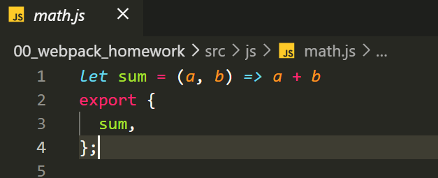
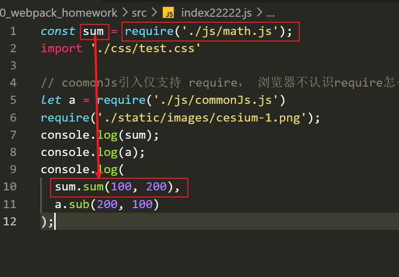
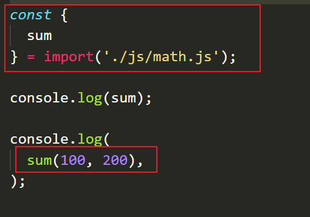
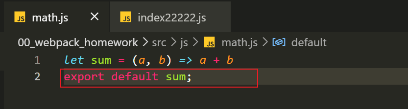
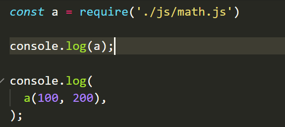
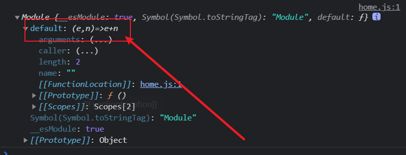

### 1 ESModule

> 1. ESMoudule是按显示导出的（静态的）， 导入的值是不可修改的
> 2. 只可在编译时且在头部。

#### 导出

1. 单个导出

   ```js
   export const name;
   export const fn = () => {};
   ```

2. 混合导出

   > `一个模块，只能有一个default`

   ```js
   # 这不是导出一个对象，是放置要导出的变量的引用列表
   export { name, fn };     
   
   # 导出一个对象
   export default { num3 };
   
   # 导出时, 可以给变量起别名
   export {
   	name as fName
   }
   
    ❌ 这是一个十分低级的错误语法: export a; 
   ```

#### 导入

1. 单独导入

   ````js
   import { name, age } from './index.js'
   
   import { name as lName } from '';
   
   import * as all from './index.js'
   
   import lsh from '';
   
   
   ````

2. 混合导入

   + 若变量名使用default 那么必须要使用as （default是保留字）

   ```js
   import msg, {name, age} from './index.js'
   
   import { default as all, name, age } from './index.js'
   ```


   ### ⭐ 注意事项

   


   1. 如果`a`是一个对象，改写`a`的属性是允许的。但你不应该这样干

   ```javascript
   import {a} from './xxx.js'
   a = {};  # Syntax Error : 'a' is read-only;
   
   // 改写对象虽然可以 但要看是否是 整体加载对象
   import * as circle from './circle'; 
   此时 circle虽然是对象， 但是不许你修改!
   ```

   2. 如果不带有路径，`只是一个模块名，那么必须有配置文件`，告诉 JavaScript 引擎该模块的位置。

   ```javascript
   import { myMethod } from 'util';
   ```

   3. `import`命令具有提升效果，会提升到整个模块的头部，首先执行。

   ````js
      foo();
      import { foo } from 'my_module';
   ````

   4. `import`是`静态执行`，所以不能使用表达式和变量，这些只有在运行时才能得到结果的语法结构

   ```javascript
      // 报错 使用了表达式, 无法编译
      import { 'f' + 'oo' } from 'my_module';
      
      // 报错 使用了变量， 无法编译
      let module = 'my_module';
      import { foo } from module;
      
      // 报错 使用了表达式 在运行时 无法进行import的操作!
      if (x === 1) {
        import { foo } from 'module1';
      } else {
        import { foo } from 'module2';
      }
   ```

   5. 多次加载import的时候只会执行一次！

   6. 深刻理解下 `export` 与 `export default `的用法

      >`export {}`这种写法 后面一定有 中括号
      >
      >再次强调！ `这不是导出一个对象，是放置要导出的变量的引用列表`
      >
      >👇言归正传
      >
      >`export` 与 `export default `的区别!
      >
      >⭐ import 是否回使用 `{}`是非常明显的区别

      ``` js
      1、export
      export {a} =>  import { a } from 'XXX' 
      export {a} =>  import   a   from 'XXX'  ❌ 打印结果是undefined
      
      
      2、 export default
      👆您希望用一个对象承接这些东西, 那么就必须遵守它的 export 的规则
      但不是没一个都原因去看 您的对应关系的, 所以可以如此
      export default {
        a,
        b
      }
      import a  from 'XXX'; 此时你就可以这样干了！ a.a 的调用
      但此时 import { a } from 'xxxx' 便是 ❌
      ```

      - 本质上 `export default`就是输出一个叫做`default`的变量或方法

        ```javascript
        import { default as foo } from 'modules';
        等价的关系
        import foo from 'modules';
        ```

   7. 

### 2 CommonJs

> 1. 基于Node环境使用！
> 2. 浏览器是不识别` module` 与 `require`的
> 3. `即对象`，你可以去修改其引入的值,但会导致之前导出的单值引用被覆盖

#### 导出

不建议省略`module`的写法 => 因为 module的存在标识了他是CommonJS

````js
exports = {}; // 省略写法

module.exports.name = xxx; // 不省略 module的写法
````


#### 导入

````js
let a = require('./index.js')
````

### 3、进阶

#### 1 ESModule的静态化优点

ES6 模块的设计思想是尽量的静态化，使得编译时就能确定模块的依赖关系，以及输入和输出的变量。

CommonJS 和 AMD 模块，都只能在运行时确定这些东西。比如，CommonJS 模块就是对象，输入时必须查找对象属性。

> CommonJS模块

```js

let { stat, exists, readfile } = require('fs');

// 等同于
let _fs = require('fs');
let stat = _fs.stat;
let exists = _fs.exists;
let readfile = _fs.readfile;
```

上面代码的实质是整体加载`fs`模块（即加载fs的所有方法），生成一个对象（fs），然后再从这个对象上面读取 3 个方法。这种加载称为“运行时加载”，因为只有运行时才能得到这个对象，导致完全没办法在编译时做“静态优化”。

> ESModule模块

```javascript
import { stat, exists, readFile } from 'fs';
```

- ES6 模块不是对象，而是通过`export`命令显式指定输出的代码，再通过`import`命令输入。
- 没法引用 ES6 模块本身，因为它不是对象. ES6 可以在编译时就完成模块加载
- 将来浏览器的新 API 就能用模块格式提供，不再必须做成全局变量或者`navigator`对象的属性。
- 不再需要对象作为命名空间（比如`Math`对象），未来这些功能可以通过模块提供。


#### 2、 第一个例子

我们使用了 export 导出， ESModule的方式导出， 这是静态的。

我们导出的内容只是一个module的地址， 故是需要结构赋值的。



1. 不解构赋值也可以 反正我们使用的都是



2. 这样呢？

   这完全就是一个错误的语法！ 不应该出现的这种错误，这返回的就是一个`Promise`

   import() 相当于是 一个函数！这个函数目的是异步的加载模块！

   

   ````js
   # 正确的应该是这样的syntax
   import {
     sum
   } from './js/math.js'
   ````

   首先 应该明白`import()`  => returns a Promise

   ⭐正确的写法

   ```cpp
   import("./specifier.js").then(
   	res => { res.sum(10 ,200) }
   )
   ```

3. 现在我们换一种方式导入



✔ 正确的方式：

````JS
import a from './js/math.js'
a(100, 200)

````

 ❌ 错误的方式示范:



> 出现的原因 是因为 导出的方式为 `export default`，这只是一个语法糖的写法
>
> > 本质是 export {  sum as default   }
>
> ```js
> import a from 'math.js';
> 
> import { default as a } from 'math'; // 语法糖
> ```
>
> 但 若用 require回报错的原因 则是因为 require 并不能将 `default` 使用 import自带的语法糖效果， 
>
> 所以 由于这层原理的关系， require在这种情况 应该: 
>
> 
>
> ````js
> const a = require('./js/math.js').default;
> ````

