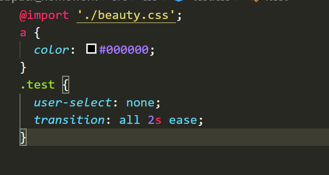
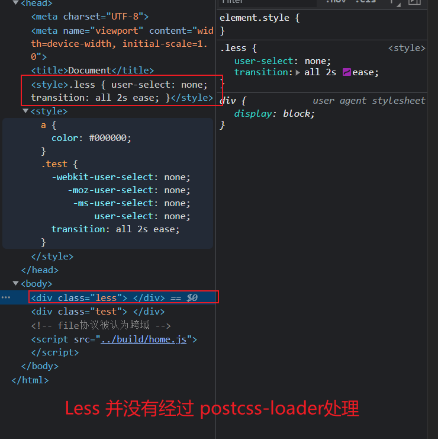

`Webpack`

## 序 注意事项

- 实际开发过程应该使用局部的webpack 、 webpack-cli 保证版本统一。

  package,json出现 devDependencies时， 也出现 package-lock.json的原因是什么？

  package,json中的 scripts命令会优先在 本地的node_modules中寻找。

  npx webpack 与 ./node_modules/./bin/webpack一致

- `若你要修改某个基础的配置， 你应该有这种【思想】

  1. 底层是可以通过命令行的， 所以一定有一个命令行语句可以提供。

     但了解皆可。

     ```js
     ../node_modules/.bin/webpack
     ```

  2. 既然是可以命令行执行 对应的配置的， 那么便有【scripts】，脚本提供。

     - 内置了一个脚本 

     - 也可以在 scripts中写脚本

       ````js
       1. npx webpack 
       2. "build": "webpack"
       ````

  3. 若其脚本命令中 是可以配置很多的，伴随命令行的增多， 脚本命令越来越长。

     故 提出 配置文件这种想法

     如 `webpack.config.js`的出现

- 为什么可以在 可以 require 一个 node_modules中不存在的 ‘path’ 呢？

  答： 因为 path是 nodeJs提供的 => node相当于一个环境 

  ​		 比如 npm install 都是node环境提供的， 而webpack也是基于node环境执行的。

  ​          npm run dev，其实就是配置在pakcage.json中的`npm脚本命令`

  ​		 ⭐ webpack是通过node运行的，但是vue文件是运行后的webpack来操作的，

  ​                不是直接由node执行的，所以无法访问node中的内置模块

  ​		 ⭐  nodejs的模块 require 先加载【`原生模块`】， 再去尝试 `文件模块`	 			
  
- 官方文档 https://webpack.docschina.org/concepts/#entry

  官方文档中极其详细讲述了本文章大部分的知识点。

## 一 新手村

当代前端问题

1. 模块化开发
2. 高级特性兼容问题
3. 热加载
4. 压缩丑化优化

目前我们使用的方式：

+ 当下通过三大框架，使用了 vue、react、angular的脚手架可以帮助我们搭建框架。
+ 而这些脚手架（其中之一的方式）都是基于 webpack 来实现的


> 什么是 webpack?
>
> 答：【静态】的【模块化】【打包】工具，是 现代化JS应用程序

+ 静态：最终打包后的资源是静态。
+ 模块化：webpack支持各种模块化开发。 
+ 打包：打包。
+ 现代化应用程序：当代需求的。
+ webpack的两大核心： loader 与 plugins

### 1 安装环境

1. Node环境
2. webpack (依赖node) 
3. webpack-cli (不是必须的)

### 2 webpack与webpack-cli的关系

webpack-cli 是webpack-cli 来解析的脚手架。若是手写 vue-cli 这种脚手架，并可以不需要安装 webpack-cli

````js
npm install webpack webpack-cli -g // 局部
								-D // 全局

webpack --config w.config.js
````

1. 执行webpack 执行 `node_modules`下的 `.bin`目录下的 webpack文件夹的 index.js文件
2. webpack进行执行时， 便会依赖 `webpack-cli`， 若未安装则报错。
   + `webpack-cli 执行才是webpack编译与打包的过程。`
   + 第三方脚手架则不需要 webpack-cli 如vue-service-cli
3. 判断标准的根本基础: 是否会使用 ./bin文件下的 webpack命令文件

### 3 初次场景

1. ESModule的引入

   ````js
   1. math.js
   export const mul = (num1, num2) => {
     return num1 * num2;
   }
   
   2. index.js
   import { sum, mul } from './js/math.js';
   
   3. index.html
   <script src="./src/index.js" type="module"></script>
   ````

2. CommonJs的引入

   ````js
   1. mathi.js
   const priceFormat = (price) => {  return "100.00";}
   module.exports = { priceFormat}
   
   2. index.js
   const {priceFormat } = require('./js/format');
   
   3. 
   <script src="./src/index.js" type="module"></script>
   ````

   + 导致一个问题, 浏览器并非是Node环境，并不自带 CommonJs

     即 不识别 `module.exports` 与 `require`关键字

   + `webpack`

     1. 使用webpack => 会多出 dist文件夹， 且有index.js文件
     2. webpack 默认对打包进行模块化，自动会对 CommonJs进行模块化处理。
     3. webpack默认处理规则处理 当前目录下的 src/index.js 文件作为入口文件。

### 4 webpack初次使用

上述的场景使用的 【webpack】使用的是全局的。但实际开发显示要以局部为主（webpack版本）

故我们要借助 package.json配置webpack版本 与 webpack-cli版本。

1. npm init -y / npm init => 生成package.json

2. 安装

   ````js
   npm install webpack webpack-cli -D
   ````

   此时 package.json 便有 属性 devDependencies 出现

   也会有 package-lock.json文件

3. 执行webpack局部命令

   + 第一个执行方式

   ```js
   ./node_module/.bin/webpack
   ```

   + 第二种

   ````js
   npx webpack
   ````

   + 第三种

   ````js
   在 package.json 中配置属性 
   	scripts: {
           "build": "webpack",
       }
   使用 npm run build 来执行.
   
   在package.json中便会优先去 node_module 即 局部中去执行webpack命令
   ````

4. 此时 我们在 index.html 中引入对应的 dist中的文件，便可以正常执行了

   > ⭐ webpack 会固定的寻找当前src目录下的index.js 作为入口js文件！
   >
   > ⭐ webpack 内置支持 模块转换【这也是为什么我们使用require示范的原因】
   >
   > ​         但 比如 ES6、SCSS等等需要配置loader来协助。

### 5  loader

> 概念

1. webpack 只能理解 JavaScript 和 JSON 文件.这是 webpack 开箱可用的自带能力
2. **loader** 让 webpack 能够去处理其他类型的文件，并将它们转换为有效 [模块](https://webpack.docschina.org/concepts/modules)，以供应用程序使用，以及被添加到`依赖图`中
3. ，loader 能够 `import` 导入任何类型的模块

### 6 依赖图

>  未被使用的 js文件会被打包吗❓    答： 不会`
>
> 故 => npm install -d 这种意义大吗？ 并不是很重要， 但规范还是应该遵守！

1. webpack 会根据 【命令行】 或【配置文件 】找到入口文件
2. 入口文件 会作为《依赖关系图》的基础，包含所需的所有模块
3. 遍历图结构，打包一个个模块。（不同文件需要不同的loader来打包才可以成功）


###  7 npm run build过程

>  build： “webpack” => 当然你可以指定对应的配置文件名称

执行 npm run build 时

1. 默认 认为 配置文件名为 webpack.config.js，则会寻找根目录下的 webpack.config.js文件。
2. 若找不到文件，则使用默认的一些配置。 比如`entry` 为 ./src/index.js 文件作为入口文件。
3. 若还是找不到，则报错

指定配置名

````js
cmd 中 => npx webpack --config ./wx.config.js

一般我们会这样在 package.json中配置
	"build": "webpack --config wk.config.js"
````

### 8 出入口的配置的示范

若是入口文件 index.js 的名称与其路径发生变更， 我们可以手动去修改这份webpack的配置。

1. 命令方式 指定入口名称

   ````js
   npx webpack --entry ./src/main.js --output-path ./build
   
   // npc 会强制本地， 而不会去全局寻找
   ````

2. package.json的脚本

   ````js
   	scripts: {
           "build": "webpack --entry ./src/main.js --output-path ./build",
       }
   ````

3. 使用 webpack.config.js

   根目录下建 【webpack.config.js】文件。

   + `path.resolve(__dirname` 获得是 当前的路径

   ````js
   const path = require('path'); // node提供了 path 插件
   module.exports = {
     entry: "./src/main.js", // 设置入口文件
     output: {
       filename: "bundle.js", // 设置出口文件名称
       // 必须是一个绝对路径
       path: path.resolve(__dirname, "./build") // 设置出口文件路径
     },
   }
   ````


## 二 初识（loader）

> ❓  什么是loader

1. loader是用于模块的 源代码的转换的（打包）， 比如css便是一个模块，我们通过import加载此模块，并进行打包的操作

2. webpack 本身并不会对各类文件进行主动的解析打包，故是需要loader来帮助的

   （为什么可以打包js？webpack内置对js的打包）

3. 在中文官网中有专门的tab页 列举了平时会使用的loader

4. webpack 支持使用 [loader](https://webpack.docschina.org/concepts/loaders) 对文件进行预处理。你可以构建包括 JavaScript 在内的任何静态资源。并且可以使用 Node.js 轻松编写自己的 loader

> 备注

1. 即便只是 css-loader 官方的文档写的极其详细

### 1 第一次使用loader

> **当我js文件中 *【import './css/beauty.css' 】*时**

ERROR in ./src/css/beauty.css 1:2
Module parse failed: Unexpected token (1:2)
`You may need an appropriate loader to handle this file type`, currently no loaders are configured to process this file. See https://webpack.js.org/concepts#loaders

> 示范：

 各类的文件非常多，处理css文件是一个示范，以后也会有更多的示范，不过本质上参考 webpack官网的loader是为关键的。

前提是`安装` css-loader

````js
npm install css-loader --save-dev // 开发时依赖
````

`使用`的方式： 虽然有三种，但实际开发只使用一种

1. 内联使用

   ````js
   import "css-loader! ../css/index.css" // 了解！
   ````

   快废弃的写法

   ````js
   "build": "webpack --module-bind 'css=css-loader' --config webpack.config.js" // 略
   ````

2. ⭐ webpack.config.js使用

   - rules` 属性`，里面包含两个必须属性：`test` 和 `use`

     > *“嘿，webpack 编译器，当你碰到「在* require()*/*impor *语句中被解析为 '.css' 的路径」时，在你对它打包之前，先* **use(使用)** `css-loader` *转换一下。”*

   ````js
   const path = require('path');
   
   module.exports = {
     entry: "./src/main.js",
     output: {
       filename: "bundle.js", // 必须是一个绝对路径
       path: path.resolve(__dirname, "./build")
     },
     // js中希望让css变为模块,  取module名称其实很好
     module: {
       rules: [
         {
   		// 识别出哪些文件会被转换。
           test: /\.css$/,
           // 定义出在进行转换时，应该使用哪个 loader
             use: [
              // 注意: 编写顺序(从下往上, 从右往做, 从后往前)
              { loader: "css-loader" },
               
           // loader: "css-loader"
         },
       ]
     }
   }
   -------------------------------------
   在您不需要进行option的配置的情况下
   use: [
     "css-loader", 
   ]
   -------------------------------------
   若仅需要一种loader情况下, 不写use也可以 =>  loader: "css-loader" 
   ````

3.  如上结束后，但打包报错

   ```cmd
   报错！ Module build failed (from ./node_modules/css-loader/dist/cjs.js):
   	  Error: Cannot find module 'colorette'
   css-loader默认需要 style-loader
   ```

   > css-loader的原理是: 创建`页内样式`，插入到对应的html页面中来。 <style></style>形式。

   虽然此时 可以正常进行打包 => 即 webpack可以正常取处理这个css静态文件，但实际上css样式文件并没有插入到页面。

   ````js
   1. npm install style-loader -D
   2. use: ["style-loader", "css-loader"] // 顺序要注意， 先解析后插入
   ````

4. less文件的处理

   > less 首先要转为 css才可以使用
   >
   > ⭐ less-loader 的原理依旧是 依赖 less这个转换工具的

   ````js
    npm install less less-loader --save-dev
   
   1. 手动部署
   npm install less -D 
   npx less ./src/css/index.less => index.css 手动构建
   
   2. 自动部署： 实际开发
   npm install less-loader -D
   rules: [
        {
           test: /\.less$/,
           use: [
             "style-loader",
             "css-loader",
             "less-loader"
           ]
         }
   ]
   ````

### 2 browerserlist

问题： 如何解决不同浏览器的兼容性问题 => 前端工程化

1. `第一步`: 要确定兼容哪些浏览器 ？

   `browerserlist`脚本可以帮助我们做到这件事情。

   > `browerserlist`
>
   > ⭐ 实现在不同的前端工具之间，共享目标浏览器和NodeJs的版本控制
   
   + autoprefiexer   => 自动添加 css的前缀样式
   + babel                 => 不同
   + postcss-preset-env
+ eslint-plugin-compat
   + postcss-normalize
   
   ````js
   npx browserslist // webpack 自带了这款, 
   
defaults: >0.5%, last 2 versions, Firefox ESR, not dead
   ````

   如何讲 browerslist提供的信息在多前端脚本中共享呢？

   答：既可以通过 package.json配置，也可以单独一个文件来维护。

   webpack中自带了browerserlist
   
   1. 方式一： 在package.json中配置、
   
      ````js
      "browerslist": [
          ">1%",
          "last 2 version",
          "not dead",
]
      ````
   
   2. 方式二： 在根目录下新建`.browserslistrc`
   
      `````js
      >1%
      last 2 version
      not dead
      `````

### 3 第一次使用post-css

> 通过JS来转换样式的工具, 是独立于webpack之外的一处脚本
>
> 比如：CSS的转换与适配（浏览器前缀， CSS样式的重置） => 主要是解决兼容问题 + 适配
>
> 前提： browserlist提供兼容信息

webpack所做的事情 无非是将单独取使用的工具 集成在一起 来自动使用了。

所以了解如何取单独的使用也是有一定的必要的。

#### 1 单独使用

1. 安装: 

   ````js
   cnpm install postcss -D
   cnpm install postcss-cli -D 
   ````

2. 新建一个test.css文件

   ````css
   :fullscreen {}
   .content {
     user-select: none;
     transition: all 2s ease;
   }
   ````

3. 单独使用:

   但会报错 => 因为没有配置对应的浏览器信息！

   ````js
   npx postcss -o result.css ./src/css/test.css
   
   # You did not set any plugins, parser, or stringifier. Right now, PostCSS does nothing. Pick plugins for 
   # your case on https://www.postcss.parts/ and use them in postcss.config.js.
   ````

4. 故我们会如此 => 安装 autoprefixer -D

   ````js
   // 提供配置的信息
   cnpm install autoprefixer -D 
   // 以配置的信息去执行该脚本        -o指的是输出文件路径
   npx postcss --use autoprefixer -o result.css ./src/css/test.css
   
   再次使用 result.css 中会自动为你做浏览器的自适配 => 添加前缀
   ````

#### 2 结合webpack去使用（自动化）

安装。 为了使用本 loader，你需要安装 postcss-loader 和 postcss：

````js
cnpm install postcss-loader -D
````

配置

`````js
module: {
    rules: [
      {
        test: /\.less/, // 匹配资源
        use: [
          "style-loader", 
          {
            loader: "css-loader",
            options: {
              importLoaders: 1
            }
          },
          {
          	loader: "postcss-loader",
            options: {
                postcssOptions: {
                    plugins: [
                        require("autoprefixer")
                    ]
                }
            }
          }
        ],
        // loader: "css-loader"
      },
`````

几处经验：

### 7 postcss-preset-env

> 现代CSS特性转为大部分浏览器可以理解的特性
>
> 例： color: #12345678, chrome支持八位，但很多浏览器不支持八位color
>
> PS： autoprefixer是兼容性（如添加浏览器前缀） 而转换特性为 postcss-preset-env

使用方式

1. 安装

   ````js
   npm install postcss-preset-env -D
   ````

2. 使用

   > postcss-preset-env插件的功能中其包括了autoprefixer！故不需要浏览器信息的插件引入！

   ````js
   		{
             	loader: "postcss-loader",
               options: {
                   postcssOptions: {
                       plugins: [
                           require("postcss-preset-env")
                       ]
                   }
               }
             }
   ````

3. 抽离配置

每一个postcss的配置项都太多了，有css、less。可以不可以像下面这样简单明了？

````js
use: ["style-loader", "css-loader", "postcss-loader"]
````

当然可以。像这样的，我们可以有配置文件。

````js
module.exports = {
    plugins: [
        require("postcss-preset-env")
    ]
}
````


### 8 postcss失效问题

#### 1 autoprefix

这样是不生效的。

`````js
use: ["style-loader", "css-loader", "postcss-loader"],
`````

若进行这样的配置 请再进行一次 `**postcss.config.js** `的配置。

因为postcss是依赖于 autoprefixer 的

#### 2 css再引入别的css

如下场景在ｉｎｄｅｘ．ｊｓ中引入 【index.css】

> index.css 引入 两个 外部的css样式

```javascript
@import ('./css/otherCss2.css') // 会被打包成行内块加进来
@import ('./css/otherCss2.less') // 会被打包成行内块加进来
```

你会发现你引入的 otherCss2.css 、otherCss2ess 都并没有被post-css-cli处理

> `原因:`
>
> post-css-loader => css-loader => style-loader
>
> @import 的语法是在 js中的（此时负责的模块为 css - loader ），
>
> 对js模块进行处理的时候，其post-css-loader模块的处理接触不到

像这样引用



你会发现变成这样



解决办法：

将importLoaders 设置为就可以。

importLoaders为主要看 `css-loader`后面还有几个loader，意思是当我处理css-loader的时候我会重新的回去几层。

或者说 到 css-loader 的时候我再去回调哪些 loader

````js
	{
        test: /\.less$/,
        use: [
          "style-loader",
          {
            loader: "css-loader",
            options: {
              importLoaders: 2 // 回调两层 即 less -> post -> css
            }
          },
          "postcss-loader",
          "less-loader"
        ]
      }
````


### 9 处理图片资源

> 场景： 当我们在css中放入 图片， 或者通过模块来引入文件资源的时候

````js
import zznhImage from "../img/zznh.png";

  // 创建一个img元素,设置src属性
  const imgEl = new Image();
  // imgEl.src = require("../img/zznh.png").default;
  imgEl.src = zznhImage;
  element.appendChild(imgEl);
````

> 解决办法

#### 9 file-loader

Ps: webpack-5 不需要file-loader

1. 安装 `npm install file-loader -D`

`````js
	 {
        test: /\.(png|jpe?g|gif|svg)$/,
        use: [
          {
            loader: 'file-loader',
            options: {
              name: "img/[name].[hash:6].[ext]",
              outputPath: 'img',
            }
          }
        ]
      }
`````

2. file-loader的占位符
   + [ext]： 后缀名
   + [hash] : 名
   + [contentHash] : 哈希
   + [hash:<length>] : 哈希长度
   + path: 路径

#### 2 url-loader

> url-loader 将较小的文件转为` base64 的URL`
>
> 打包以后不会出现图片的资源，而是base64，由浏览器解析Base64数据。
>
> PS： 虽然减少了file-loader的http请求！但若是过多的 base64 导致 浏览器解析缓慢。

+ 大图片 => file-loader
+ 小图片 => url-loader

使用 url-loader 的`limit`来实现！实现了一个动态的实现

````js
	{
        test: /\.(png|jpe?g|gif|svg)$/,
        use: [
          {
            loader: 'url-loader',
            options: {
              name: "img/[name].[hash:6].[ext]",
              limit: 100 * 1024
            }
          }
        ]
      }
````

### 10 assert module type

> webpack5前 使用各类loader加载资源
>
> webpack5 可以使用资源模块类型来代替  => 更便捷的使用

+ assert/resource 

  即 file-loader

+ assert/inline 

  即 url-loader

+ assert/source

  即 raw-loader => 导出源代码

+ assert

  即 url-loader => 这是灵活的， 大图片可以 file-loader 小图片则 base64

  

1. 设置输出资源的两种方式

   1. output直接配置

   `````js
   output: {
       filename: "bundle.js",
       // 必须是一个绝对路径
       path: path.resolve(__dirname, "./build"),
       assetModuleFilename: "img/[name].[hash:6][ext]"
     },
   `````

   2. 更加灵活的方式

   ````js
    	{
           test: /\.(png|jpe?g|gif|svg)$/,
           // type: "asset/resource", file-loader的效果
           // type: "asset/inline", url-loader
           type: "asset",
           generator: {
             filename: "img/[name].[hash:6][ext]"
           },
           parser: {
             dataUrlCondition: {
               maxSize: 100 * 1024
             }
           }
         },
   ````

2. 字体的使用示范

   + 字体若使用loader 则应该是 file-loader 或 url-loader, 也可以使用type来配置

   ````js
   	 {
           test: /\.ttf|eot|woff2?$/i,
           type: "asset/resource",
           generator: {
             filename: "font/[name].[hash:6][ext]"
           }
         }
   ````

## 三 Plugin

现在我们有两处希望优化的地方：

1. 打包后自动删除包再生成
2. index.html 这个文件自动引入我们打包后的文件

> webpack的另一个核心便是plugin
>
> loader用于转换模块类型， 而plugin 用于更加广泛的业务 。
>
> 业务场景： 打包优化、资源管理、环境变量注入

### 1 自动删除打包资源

> CleanWebpackPlugin

npm install clearn-webpack-plugin -D

````js
const { CleanWebpackPlugin } = require('clean-webpack-plugin');

plugins: [
    new CleanWebpackPlugin(),
]
````

### 2 index.html

> HtmlWebpackPlugin
>
> HtmlWebpackPlugin便可以实现 自动在build文件夹中创建 index.html并丑化
>
> 并引入对应得入口js文件 与 css文件（若你单独抽离css文件的话）

npm install html-webpack-plugin -D

````js
const HtmlWebpackPlugin = require('html-webpack-plugin');

plugins: [
    new HtmlWebpackPlugin(),
````

+ 手动修改模板引擎

````js
// 修改一下配置便可以实现
    new HtmlWebpackPlugin({
      title: "coderwhy webpack",
      template: "./public/index.html"
    }),
````

Vue也是如此做的， Vue的模板中有如下的内容

```js
而此处是编译时需要配置的全局常量
<link rel="icon" href="<%= BASE_URL %>favicon.ico">
    

此处去寻找 HtmlWebpackPlugin对象下的 title属性
<title><%= htmlWebpackPlugin.options.title %></title>

```

+ 全局常量

如何配置一个全局的常量呢？

### 3 全局常量

````js
const { DefinePlugin } = require('webpack');

new DefinePlugin({
      BASE_URL: '"./"'
 }),
````

### 4 复制

虽然我们从来没有引用过他们， 但有一些文件我们需要将其复制过去，

````js
const CopyWebpackPlugin = require('copy-webpack-plugin');

    new CopyWebpackPlugin({
      patterns: [
        {
          from: "public",
          globOptions: {
            ignore: [
              "**/index.html",
              "**/.DS_Store",
              "**/abc.txt"
            ]
          }
        }
      ]
    })
````

## 四、


