 

`Webpack`

## 序 注意事项

- 实际开发过程应该使用局部的webpack 、 webpack-cli 保证版本统一。

  package,json出现 devDependencies时， 也出现 package-lock.json的原因是什么？

  package,json中的 scripts命令会优先在 本地的node_modules中寻找。

  npx webpack 与 ./node_modules/./bin/webpack一致

- `若你要修改某个基础的配置， 你应该有这种【思想】

  1. 底层是可以通过命令行的， 所以一定有一个命令行语句可以提供。

     但了解皆可。

     ```js
     ../node_modules/.bin/webpack
     ```

  2. 既然是可以命令行执行 对应的配置的， 那么便有【scripts】，脚本提供。

     - 内置了一个脚本 

     - 也可以在 scripts中写脚本

       ````js
       1. npx webpack 
       2. "build": "webpack"
       ````

  3. 若其脚本命令中 是可以配置很多的，伴随命令行的增多， 脚本命令越来越长。

     故 提出 配置文件这种想法

     如 `webpack.config.js`的出现

- 为什么可以在 可以 require 一个 node_modules中不存在的 ‘path’ 呢？

  答： 因为 path是 nodeJs提供的 => node相当于一个环境 

  ​		 比如 npm install 都是node环境提供的， 而webpack也是基于node环境执行的。

  ​          npm run dev，其实就是配置在pakcage.json中的`npm脚本命令`

  ​		 ⭐ webpack是通过node运行的，但是vue文件是运行后的webpack来操作的，

  ​                不是直接由node执行的，所以无法访问node中的内置模块

  ​		 ⭐  nodejs的模块 require 先加载【`原生模块`】， 再去尝试 `文件模块`	 			
  
- 官方文档 https://webpack.docschina.org/concepts/#entry

  官方文档中极其详细讲述了本文章大部分的知识点。

## 一 新手村

当代前端问题

1. 模块化开发
2. 高级特性兼容问题
3. 热加载
4. 压缩丑化优化

目前我们使用的方式：

+ 当下通过三大框架，使用了 vue、react、angular的脚手架可以帮助我们搭建框架。
+ 而这些脚手架（其中之一的方式）都是基于 webpack 来实现的


> 什么是 webpack?
>
> 答：【静态】的【模块化】【打包】工具，是 现代化JS应用程序

+ 静态：最终打包后的资源是静态。
+ 模块化：webpack支持各种模块化开发。 
+ 打包：打包。
+ 现代化应用程序：当代需求的。
+ webpack的两大核心： loader 与 plugins

### 1 安装环境

1. Node环境
2. webpack (依赖node) 
3. webpack-cli (不是必须的)

### 2 webpack与webpack-cli的关系

webpack-cli 是webpack-cli 来解析的脚手架。若是手写 vue-cli 这种脚手架，并可以不需要安装 webpack-cli

````js
npm install webpack webpack-cli -g // 局部
								-D // 全局

webpack --config w.config.js
````

1. 执行webpack 执行 `node_modules`下的 `.bin`目录下的 webpack文件夹的 index.js文件
2. webpack进行执行时， 便会依赖 `webpack-cli`， 若未安装则报错。
   + `webpack-cli 执行才是webpack编译与打包的过程。`
   + 第三方脚手架则不需要 webpack-cli 如vue-service-cli
3. 判断标准的根本基础: 是否会使用 ./bin文件下的 webpack命令文件

### 3 初次场景

1. ESModule的引入

   ````js
   1. math.js
   export const mul = (num1, num2) => {
     return num1 * num2;
   }
   
   2. index.js
   import { sum, mul } from './js/math.js';
   
   3. index.html
   <script src="./src/index.js" type="module"></script>
   ````

2. CommonJs的引入

   ````js
   1. mathi.js
   const priceFormat = (price) => {  return "100.00";}
   module.exports = { priceFormat}
   
   2. index.js
   const {priceFormat } = require('./js/format');
   
   3. 
   <script src="./src/index.js" type="module"></script>
   ````

   + 导致一个问题, 浏览器并非是Node环境，并不自带 CommonJs

     即 不识别 `module.exports` 与 `require`关键字

   + `webpack`

     1. 使用webpack => 会多出 dist文件夹， 且有index.js文件
     2. webpack 默认对打包进行模块化，自动会对 CommonJs进行模块化处理。
     3. webpack默认处理规则处理 当前目录下的 src/index.js 文件作为入口文件。

### 4 webpack初次使用

上述的场景使用的 【webpack】使用的是全局的。但实际开发显示要以局部为主（webpack版本）

故我们要借助 package.json配置webpack版本 与 webpack-cli版本。

1. npm init -y / npm init => 生成package.json

2. 安装

   ````js
   npm install webpack webpack-cli -D
   ````

   此时 package.json 便有 属性 devDependencies 出现

   也会有 package-lock.json文件

3. 执行webpack局部命令

   + 第一个执行方式

   ```js
   ./node_module/.bin/webpack
   ```

   + 第二种

   ````js
   npx webpack
   ````

   + 第三种

   ````js
   在 package.json 中配置属性 
   	scripts: {
           "build": "webpack",
       }
   使用 npm run build 来执行.
   
   在package.json中便会优先去 node_module 即 局部中去执行webpack命令
   ````

4. 此时 我们在 index.html 中引入对应的 dist中的文件，便可以正常执行了

   > ⭐ webpack 会固定的寻找当前src目录下的index.js 作为入口js文件！
   >
   > ⭐ webpack 内置支持 模块转换【这也是为什么我们使用require示范的原因】
   >
   > ​         但 比如 ES6、SCSS等等需要配置loader来协助。

### 5  loader

> 概念

1. webpack 只能理解 JavaScript 和 JSON 文件.这是 webpack 开箱可用的自带能力
2. **loader** 让 webpack 能够去处理其他类型的文件，并将它们转换为有效 [模块](https://webpack.docschina.org/concepts/modules)，以供应用程序使用，以及被添加到`依赖图`中
3. ，loader 能够 `import` 导入任何类型的模块

### 6 依赖图

>  未被使用的 js文件会被打包吗❓    答： 不会`
>
> 故 => npm install -d 这种意义大吗？ 并不是很重要， 但规范还是应该遵守！

1. webpack 会根据 【命令行】 或【配置文件 】找到入口文件
2. 入口文件 会作为《依赖关系图》的基础，包含所需的所有模块
3. 遍历图结构，打包一个个模块。（不同文件需要不同的loader来打包才可以成功）


###  7 npm run build过程

>  build： “webpack” => 当然你可以指定对应的配置文件名称

执行 npm run build 时

1. 默认 认为 配置文件名为 webpack.config.js，则会寻找根目录下的 webpack.config.js文件。
2. 若找不到文件，则使用默认的一些配置。 比如`entry` 为 ./src/index.js 文件作为入口文件。
3. 若还是找不到，则报错

指定配置名

````js
cmd 中 => npx webpack --config ./wx.config.js

一般我们会这样在 package.json中配置
	"build": "webpack --config wk.config.js"
````

### 8 出入口的配置的示范

若是入口文件 index.js 的名称与其路径发生变更， 我们可以手动去修改这份webpack的配置。

1. 命令方式 指定入口名称

   ````js
   npx webpack --entry ./src/main.js --output-path ./build
   
   // npc 会强制本地， 而不会去全局寻找
   ````

2. package.json的脚本

   ````js
   	scripts: {
           "build": "webpack --entry ./src/main.js --output-path ./build",
       }
   ````

3. 使用 webpack.config.js

   根目录下建 【webpack.config.js】文件。

   + `path.resolve(__dirname` 获得是 当前的路径

   ````js
   const path = require('path'); // node提供了 path 插件
   module.exports = {
     entry: "./src/main.js", // 设置入口文件
     output: {
       filename: "bundle.js", // 设置出口文件名称
       // 必须是一个绝对路径
       path: path.resolve(__dirname, "./build") // 设置出口文件路径
     },
   }
   ````


## 二 初识（loader）

> ❓  什么是loader

1. loader是用于模块的 源代码的转换的（打包）， 比如css便是一个模块，我们通过import加载此模块，并进行打包的操作

2. webpack 本身并不会对各类文件进行主动的解析打包，故是需要loader来帮助的

   （为什么可以打包js？webpack内置对js的打包）

3. 在中文官网中有专门的tab页 列举了平时会使用的loader

4. webpack 支持使用 [loader](https://webpack.docschina.org/concepts/loaders) 对文件进行预处理。你可以构建包括 JavaScript 在内的任何静态资源。并且可以使用 Node.js 轻松编写自己的 loader

> 备注

1. 即便只是 css-loader 官方的文档写的极其详细

### 1 第一次使用loader

> **当我js文件中 *【import './css/beauty.css' 】*时**

ERROR in ./src/css/beauty.css 1:2
Module parse failed: Unexpected token (1:2)
`You may need an appropriate loader to handle this file type`, currently no loaders are configured to process this file. See https://webpack.js.org/concepts#loaders

> 示范：

 各类的文件非常多，处理css文件是一个示范，以后也会有更多的示范，不过本质上参考 webpack官网的loader是为关键的。

前提是`安装` css-loader

````js
npm install css-loader --save-dev // 开发时依赖
````

`使用`的方式： 虽然有三种，但实际开发只使用一种

1. 内联使用

   ````js
   import "css-loader! ../css/index.css" // 了解！
   ````

   快废弃的写法

   ````js
   "build": "webpack --module-bind 'css=css-loader' --config webpack.config.js" // 略
   ````

2. ⭐ webpack.config.js使用

   - rules` 属性`，里面包含两个必须属性：`test` 和 `use`

     > *“嘿，webpack 编译器，当你碰到「在* require()*/*impor *语句中被解析为 '.css' 的路径」时，在你对它打包之前，先* **use(使用)** `css-loader` *转换一下。”*

   ````js
   const path = require('path');
   
   module.exports = {
     entry: "./src/main.js",
     output: {
       filename: "bundle.js", // 必须是一个绝对路径
       path: path.resolve(__dirname, "./build")
     },
     // js中希望让css变为模块,  取module名称其实很好
     module: {
       rules: [
         {
   		// 识别出哪些文件会被转换。
           test: /\.css$/,
           // 定义出在进行转换时，应该使用哪个 loader
             use: [
              // 注意: 编写顺序(从下往上, 从右往做, 从后往前)
              { loader: "css-loader" },
               
           // loader: "css-loader"
         },
       ]
     }
   }
   -------------------------------------
   在您不需要进行option的配置的情况下
   use: [
     "css-loader", 
   ]
   -------------------------------------
   若仅需要一种loader情况下, 不写use也可以 =>  loader: "css-loader" 
   ````

3.  如上结束后，但打包报错

   ```cmd
   报错！ Module build failed (from ./node_modules/css-loader/dist/cjs.js):
   	  Error: Cannot find module 'colorette'
   css-loader默认需要 style-loader
   ```

   > css-loader的原理是: 创建`页内样式`，插入到对应的html页面中来。 <style></style>形式。

   虽然此时 可以正常进行打包 => 即 webpack可以正常取处理这个css静态文件，但实际上css样式文件并没有插入到页面。

   ````js
   1. npm install style-loader -D
   2. use: ["style-loader", "css-loader"] // 顺序要注意， 先解析后插入
   ````

4. less文件的处理

   > less 首先要转为 css才可以使用
   >
   > ⭐ less-loader 的原理依旧是 依赖 less这个转换工具的

   ````js
    npm install less less-loader --save-dev
   
   1. 手动部署
   npm install less -D 
   npx less ./src/css/index.less => index.css 手动构建
   
   2. 自动部署： 实际开发
   npm install less-loader -D
   rules: [
        {
           test: /\.less$/,
           use: [
             "style-loader",
             "css-loader",
             "less-loader"
           ]
         }
   ]
   ````

### 2 browerserlist

问题： 如何解决不同浏览器的兼容性问题 => 前端工程化

1. `第一步`: 要确定兼容哪些浏览器 ？

   `browerserlist`脚本可以帮助我们做到这件事情。

   > `browerserlist`
>
   > ⭐ 实现在不同的前端工具之间，共享目标浏览器和NodeJs的版本控制

   + autoprefiexer   => 自动添加 css的前缀样式
   + babel                 => 不同
   + postcss-preset-env
+ eslint-plugin-compat
   + postcss-normalize
   
   ````js
   npx browserslist // webpack 自带了这款, 
   
   ````

defaults: >0.5%, last 2 versions, Firefox ESR, not dead
   ````

   如何讲 browerslist提供的信息在多前端脚本中共享呢？

   答：既可以通过 package.json配置，也可以单独一个文件来维护。

   webpack中自带了browerserlist
   
   1. 方式一： 在package.json中配置、
   
      ````js
      "browerslist": [
          ">1%",
          "last 2 version",
          "not dead",
]
   ````

   2. 方式二： 在根目录下新建`.browserslistrc`
   
      `````js
      >1%
      last 2 version
      not dead
      `````

### 3 第一次使用post-css

> 通过JS来转换样式的工具, 是独立于webpack之外的一处脚本
>
> 比如：CSS的转换与适配（浏览器前缀， CSS样式的重置） => 主要是解决兼容问题 + 适配
>
> 前提： browserlist提供兼容信息

webpack所做的事情 无非是将单独取使用的工具 集成在一起 来自动使用了。

所以了解如何取单独的使用也是有一定的必要的。

#### 1 单独使用

1. 安装: 

   ````js
   cnpm install postcss -D
   cnpm install postcss-cli -D 
   ````

2. 新建一个test.css文件

   ````css
   :fullscreen {}
   .content {
     user-select: none;
     transition: all 2s ease;
   }
   ````

3. 单独使用:

   但会报错 => 因为没有配置对应的浏览器信息！

   ````js
   npx postcss -o result.css ./src/css/test.css
   
   # You did not set any plugins, parser, or stringifier. Right now, PostCSS does nothing. Pick plugins for 
   # your case on https://www.postcss.parts/ and use them in postcss.config.js.
   ````

4. 故我们会如此 => 安装 autoprefixer -D

   ````js
   // 提供配置的信息
   cnpm install autoprefixer -D 
   // 以配置的信息去执行该脚本        -o指的是输出文件路径
   npx postcss --use autoprefixer -o result.css ./src/css/test.css
   
   再次使用 result.css 中会自动为你做浏览器的自适配 => 添加前缀
   ````

#### 2 结合webpack去使用（自动化）

安装。 为了使用本 loader，你需要安装 postcss-loader 和 postcss：

````js
cnpm install postcss-loader -D
````

配置

`````js
module: {
    rules: [
      {
        test: /\.less/, // 匹配资源
        use: [
          "style-loader", 
          {
            loader: "css-loader",
            options: {
              importLoaders: 1
            }
          },
          {
          	loader: "postcss-loader",
            options: {
                postcssOptions: {
                    plugins: [
                        require("autoprefixer")
                    ]
                }
            }
          }
        ],
        // loader: "css-loader"
      },
`````

几处经验：

### 7 postcss-preset-env

> 现代CSS特性转为大部分浏览器可以理解的特性
>
> 例： color: #12345678, chrome支持八位，但很多浏览器不支持八位color
>
> PS： autoprefixer是兼容性（如添加浏览器前缀） 而转换特性为 postcss-preset-env

使用方式

1. 安装

   ````js
   npm install postcss-preset-env -D
   ````

2. 使用

   > postcss-preset-env插件的功能中其包括了autoprefixer！故不需要浏览器信息的插件引入！

   ````js
   		{
             	loader: "postcss-loader",
               options: {
                   postcssOptions: {
                       plugins: [
                           require("postcss-preset-env")
                       ]
                   }
               }
             }
   ````

3. 抽离配置

每一个postcss的配置项都太多了，有css、less。可以不可以像下面这样简单明了？

````js
use: ["style-loader", "css-loader", "postcss-loader"]
````

当然可以。像这样的，我们可以有配置文件。

````js
module.exports = {
    plugins: [
        require("postcss-preset-env")
    ]
}
````


### 8 postcss失效问题

#### 1 autoprefix

这样是不生效的。

`````js
use: ["style-loader", "css-loader", "postcss-loader"],
`````

若进行这样的配置 请再进行一次 `**postcss.config.js** `的配置。

因为postcss是依赖于 autoprefixer 的。

例： 

````js
 		{
            loader: "postcss-loader",
            options: {
              postcssOptions: {
                plugins: [
                  require("autoprefixer")
                ]
              }
            }
          },
````

#### 2 css再引入别的css

如下场景在ｉｎｄｅｘ．ｊｓ中引入 【index.css】[, 使用 postcss的时候注意此问题！]()

> index.css 引入 两个 外部的css样式

```javascript
@import ('./css/otherCss2.css') // 会被打包成行内块加进来
@import ('./css/otherCss2.less') // 会被打包成行内块加进来
```

你会发现你引入的 otherCss2.css 、otherCss2ess 都并没有被post-css-cli处理

> `原因:`
>
> post-css-loader => css-loader => style-loader
>
> @import 的语法是在 js中的（此时负责的模块为 css - loader ），
>
> 对js模块进行处理的时候，其post-css-loader模块的处理接触不到

像这样引用


你会发现变成这样


解决办法：

将importLoaders 设置为就可以。

importLoaders为主要看 `css-loader`后面还有几个loader，意思是当我处理css-loader的时候我会重新的回去几层。

或者说 到 css-loader 的时候我再去回调哪些 loader

````js
	{
        test: /\.less$/,
        use: [
          "style-loader",
          {
            loader: "css-loader",
            options: {
              importLoaders: 2 // 回调两层 即 less -> post -> css
            }
          },
          "postcss-loader",
          "less-loader"
        ]
      }
````


### 9 处理图片资源

> 场景： 当我们在css中放入 图片， 或者通过模块来引入文件资源的时候
>
> 番外：require一个node模块什么时候需要加上.default
>
>  https://www.cnblogs.com/PeunZhang/p/12736940.html
>
> > 前端代码上线前如果使用webpack打包编译的，babel@5及之前的版本可以把export和import转成node的module.exports和require ，但是babel@6版本开始不再把export default转成node的module.exports，参考

````js
import zznhImage from "../img/zznh.png";

  // 创建一个img元素,设置src属性
  const imgEl = new Image();
  // imgEl.src = require("../img/zznh.png").default;
  imgEl.src = zznhImage;
  element.appendChild(imgEl);
````

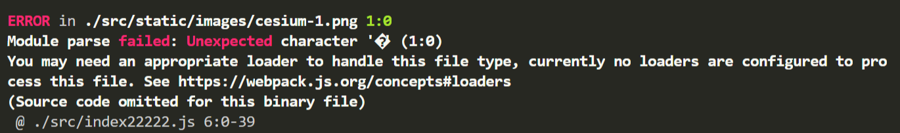

> 解决办法 => file-loader

#### 1 file-loader 

Ps: webpack-5 不需要file-loader

url-loader才是我们最终的解决方案！ 了解file-loader即可。

1. 安装 `npm install file-loader -D`

`````js
	 {
        test: /\.(png|jpe?g|gif|svg)$/,
        use: [
          {
            loader: 'file-loader',
            options: {
              name: "img/[name].[hash:6].[ext]",
              outputPath: 'img',
            }
          }
        ]
      }
`````

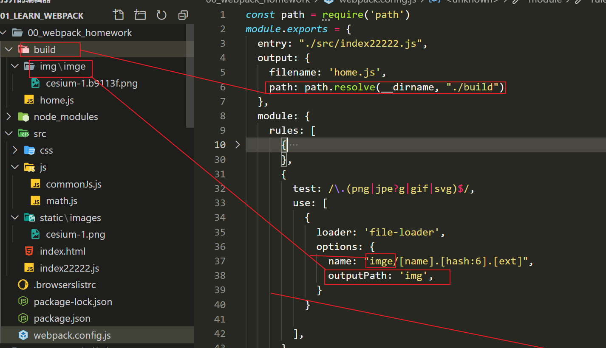

1. file-loader的占位符

   + [ext]： 后缀名
   + [hash] : 名
   + [contentHash] : 哈希
   + [hash:<length>] : 哈希长度
   + path: 路径

   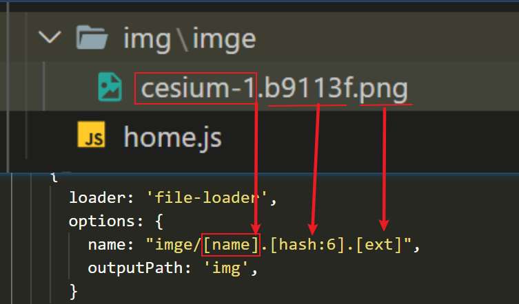


#### 2url-loader 

> url-loader 将较小的文件转为` base64 的URL`
>
> 打包以后不会出现图片的资源，而是base64，由浏览器解析Base64数据。
>
> PS： 虽然减少了file-loader的http请求！但若是过多的 base64 导致 浏览器解析缓慢。

+ 大图片 => file-loader
+ 小图片 => url-loader

使用 url-loader 的`limit`来实现！`实现了一个动态的实现

````js
	{
        test: /\.(png|jpe?g|gif|svg)$/,
        use: [
          {
            loader: 'url-loader',
            options: {
              name: "img/[name].[hash:6].[ext]",
              limit: 100 * 1024
            }
          }
        ]
      }
````

### 10 资源模块

> > 资源模块(asset module)是一种模块类型，它允许使用资源文件（字体，图标等）而无需配置额外 loader。
> >
> > 关键字： `资源模块`
>
> webpack5前 使用各类loader加载资源
>
> webpack5 可以使用资源模块类型来代替  => 更便捷的使用

+ `assert/resource `即 `file-loader`
+ `assert/inline  `     即 `url-loader`
+ `assert/source`     即 `raw-loader` => 导出源代码
+ `assert   `                      即 `url-loader` => 这是灵活的， 大图片可以 file-loader 小图片则 base64

注意事项：

````js
若使用这种方式，引入图片资源，资源模块会将其默认赋予default， 
# 故 此处应该去除 default

document.querySelector('#img').src  = require('./static/images/cesium-1.png').default ❌
````


1. 设置输出资源的两种方式

   1. output设置输出目录

   `````js
   output: {
       filename: "bundle.js",
       // 必须是一个绝对路径
       path: path.resolve(__dirname, "./build"),
       assetModuleFilename: "img/[name].[hash:6][ext]"
     },
   `````

   2. 另一种自定义输出文件名的方式是，将某些资源发送到指定目录

   ````js
    	{
           test: /\.(png|jpe?g|gif|svg)$/,
           // type: "asset/resource", file-loader的效果
           // type: "asset/inline", url-loader
           type: "asset",
           generator: {
             filename: "img/[name].[hash:6][ext]"
           },
           parser: {
             dataUrlCondition: {
               maxSize: 100 * 1024
             }
           }
         },
   ````

2. 字体的使用示范

   + 字体若使用loader 则应该是 file-loader 或 url-loader, 也可以使用type来配置

   ````js
   	 {
           test: /\.ttf|eot|woff2?$/i,
           type: "asset/resource",
           generator: {
             filename: "font/[name].[hash:6][ext]"
           }
         }
   ````

## 三 Plugin

现在我们有两处希望优化的地方：

> `webpack的另一个核心`便是plugin
>
> loader用于转换模块类型， 而plugin 用于更加`广泛的业务 `。
>
> 业务场景： 打包优化、资源管理、环境变量注入

### 1 ⭐  自动删除打包资源

> CleanWebpackPlugin
>
> 应用场景： 对应其实会替换掉，但可能有时候你更改webpack的配置路径，那么会有如下现象出现：
>
> 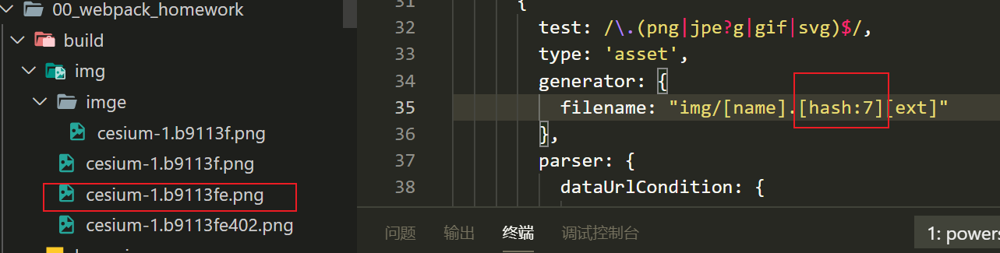

这是一个第三方库， 您在官网是无法找到的。

使用此插件再次打包以后就会自动帮你删除， 不会再出现上述的场景了。

````js
cnpm install clean-webpack-plugin -D

const { CleanWebpackPlugin } = require('clean-webpack-plugin');

plugins: [
    new CleanWebpackPlugin(),
]
````


### 2 ⭐  index.html 模板引擎

> HtmlWebpackPlugin
>
> HtmlWebpackPlugin便可以实现 自动在build文件夹中创建 index.html并丑化
>
> 并引入对应得入口js文件 与 css文件（若你单独抽离css文件的话）
>
> ⭐ 故实际开发的过程中， 我们仅需要 build 文件夹内容即可。

````js
cnpm install html-webpack-plugin -D

const HtmlWebpackPlugin = require('html-webpack-plugin');

plugins: [
    new HtmlWebpackPlugin(),
````

+ ⭐ 手动修改模板引擎 【参考一个模板再自动引入入口文件】

````js
// 修改一下配置便可以实现
    new HtmlWebpackPlugin({
      title: "coderwhy webpack",
      template: "./public/index.html"
    }),
````

Vue也是如此做的， Vue的模板中有如下的内容 在 public目录下

```js
而此处是编译时需要配置的全局常量
<link rel="icon" href="<%= BASE_URL %>favicon.ico">
    
此处去寻找 HtmlWebpackPlugin对象下的 title属性
<title><%= htmlWebpackPlugin.options.title %></title>
```


### 3 ⭐ 全局常量

>  `DefinePlugin` 允许在 **编译时** 将你代码中的变量替换为其他值或表达式
>
> - 这在需要根据`开发模式`与`生产模式`进行不同的操作时，非常有用
>
> ⭐ `process.env.NODE_ENV`  为production这是自带的一个属性！

目的： 设置好它，就可以`忘掉开发环境和生产环境的构建规则`

如何配置一个全局的常量呢？

````js
	const { DefinePlugin } = require('webpack');

    new DefinePlugin({
      'process.env': '"dev"',
      'process.env.info': JSON.stringify({
        name: 'ShuiTao',
        age: 23
      })
    })
````

### 4 复制

虽然我们从来没有引用过他们， 但有一些文件我们需要将其复制过去，

````js
const CopyWebpackPlugin = require('copy-webpack-plugin');

    new CopyWebpackPlugin({
      patterns: [
        {
          from: "public",
          globOptions: {
            ignore: [
              "**/index.html",
              "**/.DS_Store",
              "**/abc.txt"
            ]
          }
        }
      ]
    })
````


## 四 模块化原理

主要涉及与

1. commonJs的实现原理
2. ESModule的实现
3. CommonJs 加载 ESModule
4. ESModule 加载 CommonJs

> 准备工作

在使用前为方便我们查看源码， 应如此设置。

- mode: "development",

- devtool: "source-map",

#### 1 CommonJs

commonJs的实现极其简单。简单阅读就可以读懂代码。

````js
#1 调用此函数，并解构对象
const { dateFormat, priceFormat } = __webpack_require__("./src/js/format.js");

#2 
moduleId为 【./src/js/format.js"】 起名规则
__webpack_require__
	1.判断缓存中是否已经加载过, 若缓存过
    	return __webpack_module_cache__[moduleId].exports; 
	2. 若没有初始化， 
    	var module = __webpack_module_cache__[moduleId] = { exports: {} };
	3.  执行此函数,
		__webpack_modules__[moduleId](module, module.exports, __webpack_require__);
		return module.exports;
````

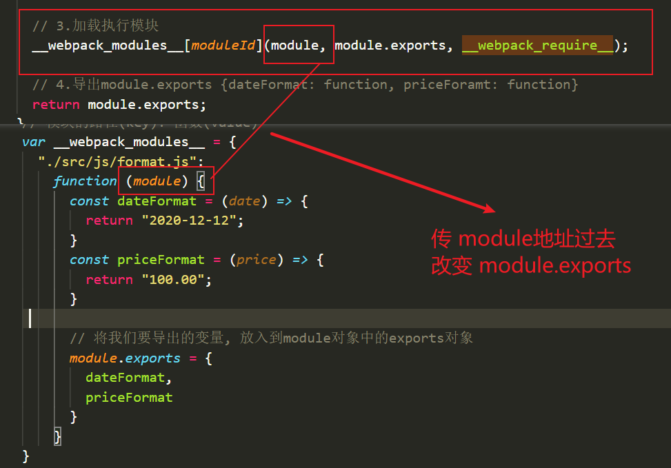


#### 2 ESMoudle

> ESModule

1. 初始 __webpack.require

   - o 对象判断是否存在一个属性， 功能性函数
   - 

   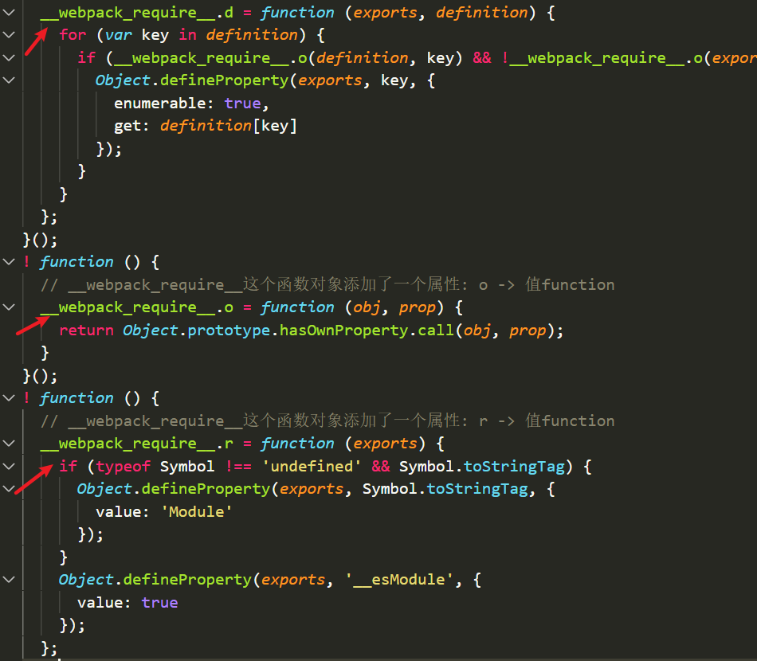

   ---


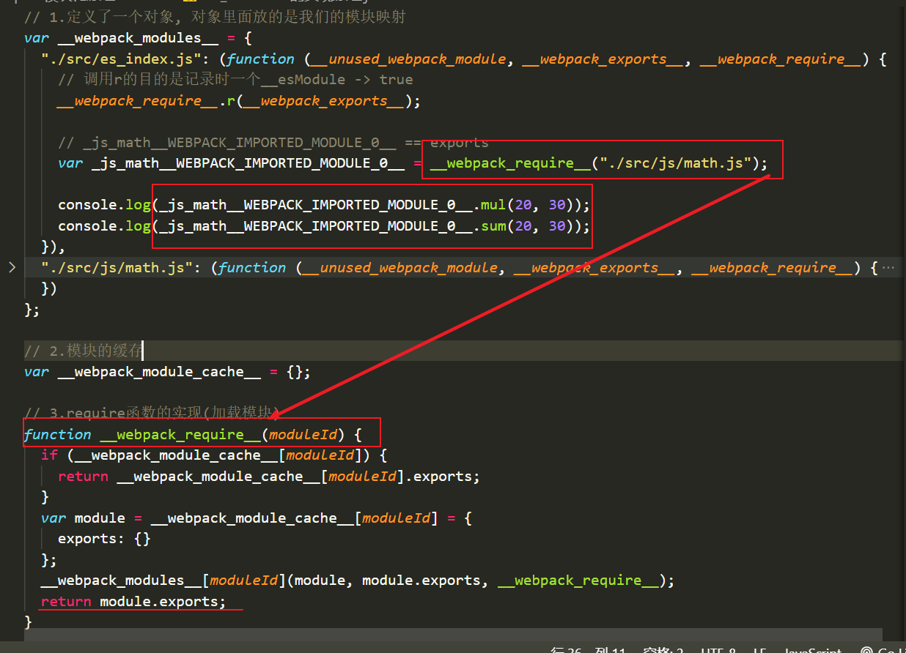


## 五 devtool: source-map

> 前言

1. source-map 指 浏览器中实际运行代码 或者说是 我们打包后的代码

> 为什么我们要设置 devtool ?
>
> 如何调式转换后格式不一致的代码呢？

若不去设置， 在进行debug的时候 由于引入的为压缩后的文件，导致我们debug非常困难。故我们需要一种方式可以帮助我们寻找到原始的源文件。

❗ source-map的功能：

1. 将【已压缩或已打包的代码】映射到【原始的源文件】 bundle.js.map便是这种文件

   这是浏览器重构了原始源的功能， 并可以在debug体现这一特点。

#### 1、初识

1. webpack中设置devtool: "source-map"

   打包以后会发现生成了 bundle.js.map文件

   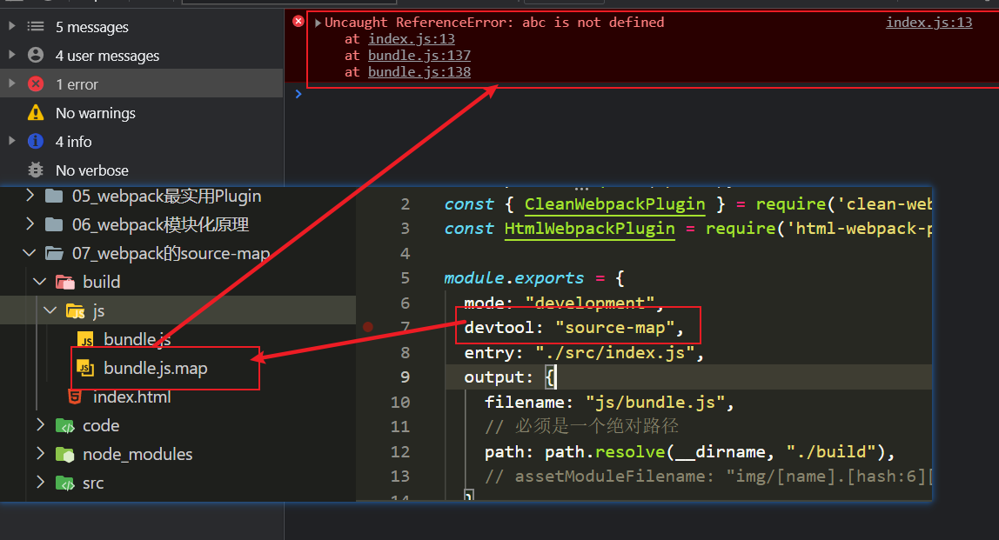

3. 浏览器source-map的依据是 

   结尾处的 ： //# sourceMappingURL=bundle.js.ma  这句注释

   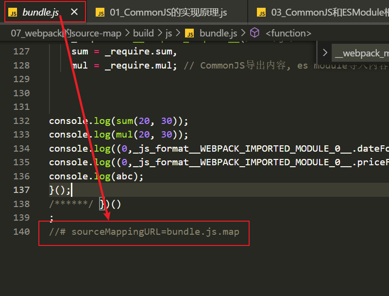 

   


4. 如何确定 我们的浏览器支持 source-map ? 

   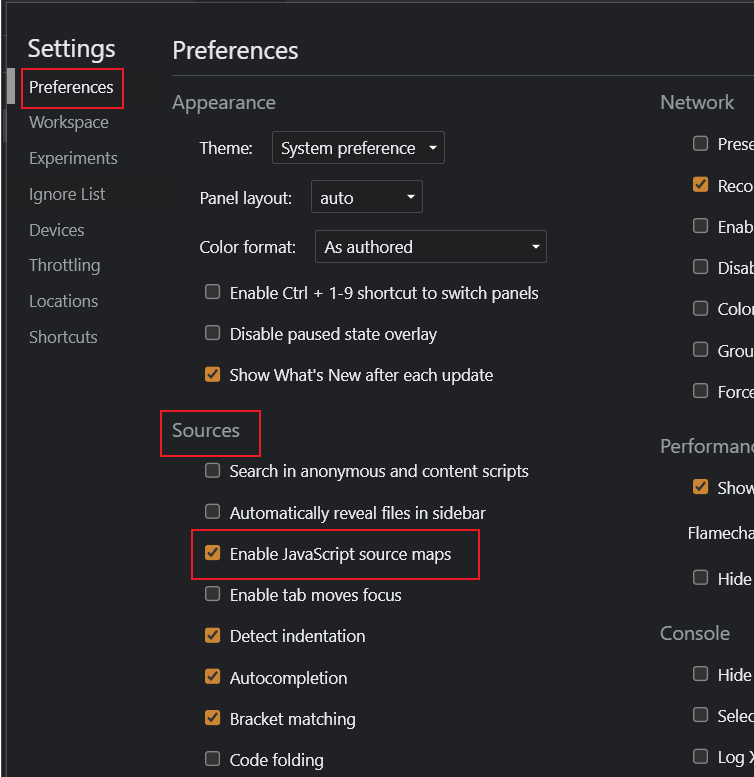

5. source-map文件

   1. 文件更大了， 这是因为其内还有对应的映射规则

      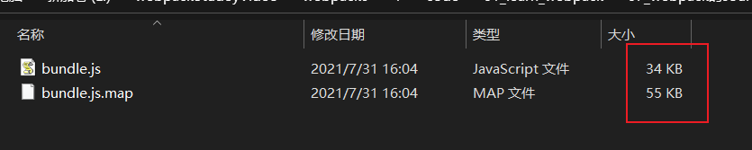

   2. bundle,js,map中有一些属性如下，了解即可。了解请百度。

#### 2、更详细的 source-map

在此仅讲述10类， 这10类具体会合成二十多种，但若具体应该参考文档。

1. false        

   不会生成source-map

2. 缺省值

   - mode为 develoment不支持缺省值的配置
   - production的环境默认值

3. eval

   - development的默认值， `不生成source-map`

   - 特别之处： 会令bundle.js的代码种 有eval (先转为string, 再用 eval)

   - 使用的原因： sourceUrl映射到对应的文件，更易于调试， 且映射速度极快。

     每次`eval的尾部都有注释`

   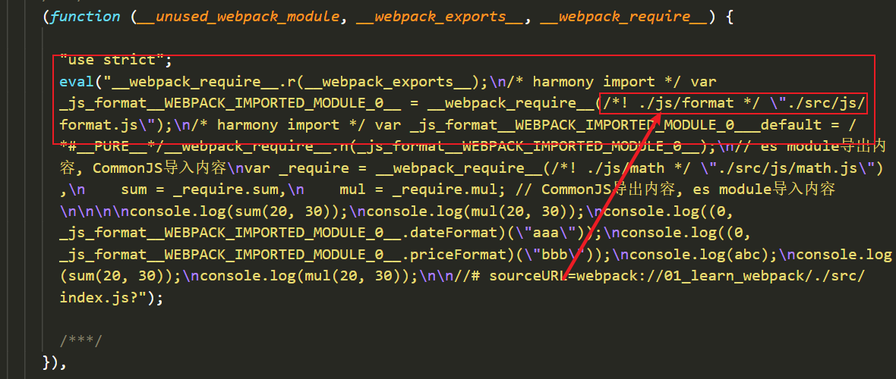

4. source-map 

   普通的source-map

5. eval-source-map

   source-map以Data-Url添加到bundle.js的eval函数后中，不再单独生成source-map文件

   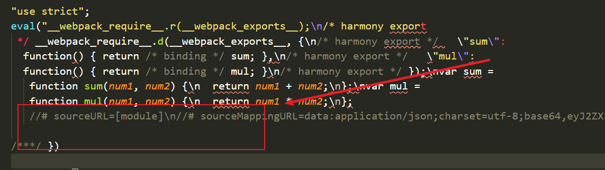

6. inline-source-map

   source-map以Data-Url添加到bundle.js的后，不再单独生成source-map文件

   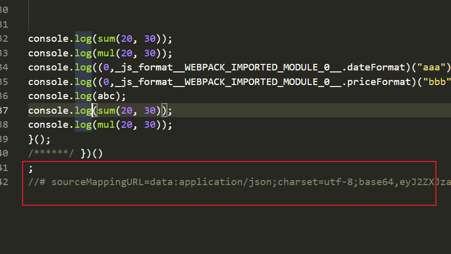

7. cheap-source-map

   更低的开销。不会生成列的映射，而只是映射到行。

   等同于 source-map， 区别在于映射到行。

8. cheap-module-source-map

   - 等同 cheap-source-map

   - 对来自loader的source-map处理的更好。可对通过loader进行打包的内容进行内容的修正。

     如 babel的ES6 => ES5的转换代码，会导致映射不一致。

   - 缘由： 

     loader对bundle.js进行一次修正后， 会导致映射的关系 与 源代码不一致， 造成了行数的误差，故此时理应来使用此模块source-map进行映射的修改才可以完全一致！

9. hidden-source-map

   - 删除 bundle.js的结尾注释
   - 删除打包文件对source-map的引用 => 多用于生成环境

10. nosources-source-map

    - debug不再可跳对应的位置了！
    - 对应的文件内容不再显示！仅是debug提示。


#### 3、实操建议

1. vue是直接使用source-map的， 简单粗暴！

2. 实际开发可以如此

   开发与测试 时候 使用的应是 cheap-module-source-map

   发布阶段 使用false即可。

---


## 六 Babel

> > 前言
>
> 1. 什么是babel?
>    
>    - Babel的出现是的开发者几乎不用考虑浏览器的支持情况，尽情享受最新语法的舒适。
> 2. babel可以做什么？
>    - 语法转换
>    - 通过 Polyfill 方式在目标环境中添加缺失的特性（通过第三方 polyfill 模块，例如 [core-js](https://github.com/zloirock/core-js)，实现）
>    - 源码转换 (codemods)
>    
>    简而言之： babel主要做两件事，一个是转换语法，一个是兼容新的API。

````js
 Babel 输入： ES2015 箭头函数 				    Babel 输出： ES5 语法实现的同等功能
[1, 2, 3].map((n) => n + 1);				[1, 2, 3].map(function(n) { return n + 1;});
````

### 1、单独使用

1.  cnpm install @babel/core -D   // 内核

    cnpm install  @babel/cli -D  // 这是为了单独使用特地安装的脚手架

2. npx babel src --out-dir result  

   将 src 目录下 所有的 js文件 进行babel的处理， 将其保存至 reuslt中

3. 此时 依旧会没有效果.  继续安装 并执行命令。

   原因： 并没有配置 babel要转换的内容。 故需要plugin来帮助我们。

   ```js
   cnpm install @babel/plugin-transform-arrow-functions -D
   
   npx babel src --out-dir result  --plugins=@babel/plugin-transform-arrow-functions
   ```

   此时成功, 对应箭头函数变为了 普通函数，同理其他转义如此、

4. 如 【上一步】的配置真是太过于麻烦，而且既然要适配，就应该全部适配。故 babel提供了 preset来简化操作。

   ```js
   // 插件的组合
   cnpm install --save-dev @babel/preset-env
   
   npx babel src --out -dir result --presets=@babel/preset-env
   ```

### 2、 babel的原理

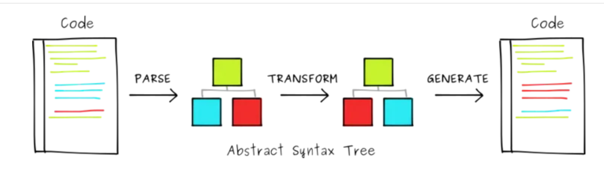

和编译器类似，babel 的转译过程也分为三个阶段，这三步具体是：

简而言之： ES6 => 原AST => 新AST => ES5 

- **解析** Parse
  将代码解析生成抽象语法树( 即AST )，也就是计算机理解我们代码的方式(扩展：一般来说每个 js 引擎都有自己的 `AST`，比如熟知的 `v8`，chrome 浏览器会把 js 源码转换为抽象语法树，再进一步转换为字节码或机器代码)，而 `babel` 则是通过 `babylon` 实现的 。简单来说就是一个对于 JS 代码的一个编译过程，进行了词法分析与语法分析的过程。
- **转换** Transform
  对于 AST 进行变换一系列的操作，babel 接受得到 AST 并通过 `babel-traverse` 对其进行遍历，在此过程中进行添加、更新及移除等操作。
- **生成** Generate
  将变换后的 AST 再转换为 JS 代码, 使用到的模块是 `babel-generator`。

而 `babel-core` 模块则是将三者结合使得对外提供的API做了一个简化。

### 3、preset、polyfill与 runtime

1. `@babel/preset-env`

   - 由来

    babel顺应民意，发布了babel-preset-env这个包，它一次性囊括了已发布的所有标准包。

   - 作用

     1. `认读ES6+代码`。不是帮我们把ES6+代码转成ES5.它的首要作用是认读ES6+代码

        在使用preset-env之前，babel是无法认识ES6+代码的，运行时会报Token错误。在使用preset-env之后，babel才能认识这些代码语法，并将它们抽象出AST树。

     2. `转码代码/转换语法`. babel preset说白了，就是一大堆babel plugin的集合。babel为插件提供了AST能力，而插件利用该能力，创建/修改AST。

   - 

2. `@babel/polyfill`

   > ❗ 请注意！此包已被抛弃， 不建议使用了！
   >
   > 你应该使用 `core-js`

   - 由来

     比如 【Promise】【for ... of 】这类语法，显示代码转换是无法转换的（或许可转，但有致命缺点）

     故 【@babel/polyfill】出现了。这个包是一个`纯运行时的包`，不是babel插件。

   - 作用

     直接改写全局变量，从而让运行环境支持经过present-env转码后的代码.

   - 场景

     比如以generator实现的语法时，例如 for...of 语法，则必须引入regenerator-runtime，因为转码后的代码会生成regeneratorRuntime这个全局变量

   - 


3. `@babel/plugin-transform-runtime`

   这是一个babel插件，使用这个插件的同时，必须同时安装@babel/runtime这个包，而且必须是安装在dependencies里面，而非devDependencies里面。


> 真实开发当然是要实现配置化。

```bash
npm install -D babel-loader @babel/core @babel/preset-env webpack
```

rules参考

````js
 	{
        test: /\.m?js$/,
        exclude: /(node_modules|bower_components)/,
        use: {
          loader: 'babel-loader',
          options: {
            presets: ['@babel/preset-env']
          },
          // 当然也可以使用插件
          plugins: ['@babel/plugin-proposal-object-rest-spread']
        }
     }
````

> 注意事项

1. 注： babel-loader 很慢！若发现打包缓慢，可以参考官网来优化它。

2. 默认情况下`@babel/preset-env`将使用[browserslist 配置源，](https://github.com/ai/browserslist#queries) *除非*设置了[targets](https://www.babeljs.cn/docs/babel-preset-env#targets)或[ignoreBrowserslistConfig](https://www.babeljs.cn/docs/babel-preset-env#ignorebrowserslistconfig)选项。[ post-css 也是如此]

   不过大多数情况不建议如此去使用，应该统一 css 与 js，不应该loader单独配置。

3. 你可能会看到 babel-preset-stage-X 这种写法， 了解即可， 是babel7之前的。

   目前 应写 preset-env。

   

> - 了解一下 stage-X preset吧 作为课外知识！
>
> 1. stage-0 

### 4. babel配置文件

1. 将webpack中的 babel-loader的options抽离出来

对于webpack的配置文件来说， 对 babel-loader的配置总是要写很多， 故我们可以使用配置文件。

- 配置文件可以 babel.config.js // cjs // mjs都可以
- 也可以这样 .babelrc.json/ js/cjs/ babelrc都可以

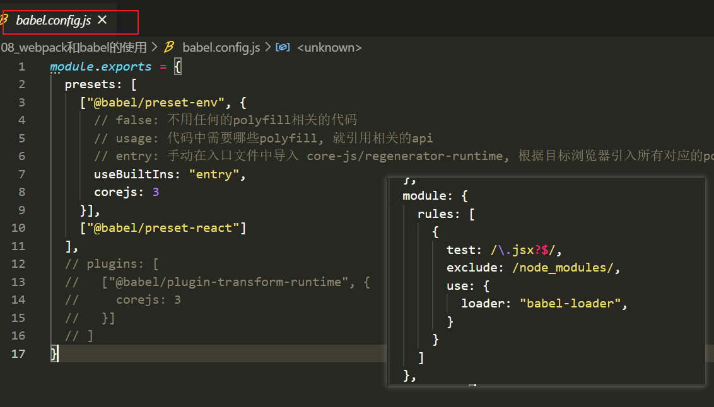

2. 多包管理

   顾名思义。 如babel中的 preset-env便是如此。

   将许多的plugin合在一起。

### 5 polyfill

> ❓ 什么是 polyfill

答： 填充， 引申为 【补丁】的含义，是为了帮助我们更好的使用js。

> 使用场景：

- 当我们使用ES6的新特性的Promise的时候，这个类是可能存在不兼容的情况的。故我们需要Polyfill来打补丁，来填充此特性。

1. 第一次使用

   警告 请不要再安装 @babel/polyfill 请直接安装core-js

   ````js
   ✔  cnpm install core-js regenerator-runtime --save’
   ❌ cnpm install @babel/polyfill --save # 好几年都不维护了 别坑自己了，求求你了
   
   
       {
           test: /\.m?js$/,
           exclude: /(node_modules|bower_components)/,
           use: {
             loader: 'babel-loader',
             options: {
               presets: [
                 [
                   '@babel/preset-env',
                   {
                     useBuiltIns: false || usage || entry,
                     corejs: 3, // 需要corejs的包
                   }
                 ]
               ],
               
             }
           }
         }
   ````

   - useBuiltIns 参数 它有三个值可选：false（默认）, entry, usage。

     1. false

     2. usage => 代码中涉及到的补丁 【按需加载】

        不需要你手工引入。babel会自动把 corejs库的模块放到你的每个js模块里。放置的原则就是：不仅面向目标targets来按需引入，而且还按照你代码中是否使用来引入。假如你的a.js里用了promise，那么他会把corejs中promise模块引入。

     3. entry  => 目标web需要加入的所有补丁/特性

        > 既然usage这么好，我们何苦要用entry呢？ 所以，`就用usage模式`吧！

        需要你手工在你的webpack 入口js里，引入一下corejs和regenerator-runtime这俩polyfill。babel编译后，会自动在入口js里，把你那2行换成面向目标targets按需引用的corejs模块。

        ```js
        import "core-js/stable";
        import "regenerator-runtime/runtime";
        ```

2. 再次强调！

   babel-polyfill被core-js取代！

   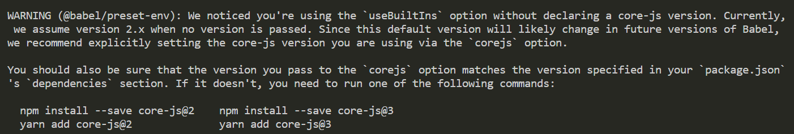

3. 关于 regeneratator 为什么要下载 ？ 

   例如 async 转换。 babel 会把 async 语法代码转成 generator 辅助函数，而 generator 辅助函数的功能需要依赖 `regenerator-runtime` 这个polyfill垫片。

   这个函数其实就是依赖全局需要引入 `regenerator-runtime` 这个 polyfill 。\

### 6. plugin-transform-runtime

> 一般情况下，@babel/plugin-transform-runtime插件不需要传入任何配置。在真正使用时，要配合@babel/preset-env同时使用，两者的corejs配置要一致，useESModules也要一致。

1. polyfill是全局的 => 即在全局的时候我们使用 useBuiltIns的配置属性

2. 在非全局的时候我们使用此插件。

   比如不希望我们的polyfill来污染第三方库的时候我们就可以使用此插件。

   @babel/plugin-transform-runtime主要有三个作用：

   - 当使用 `generators/async`的时候自动引入 `@babel/runtime/regenerator`
   - 为新特性的API添加实现。
   - 提取每个模块内联的helper们问引用
   -  transform-runtime这个插件添加的polyfill都是私有的，不会影响到全局环境，而且还是按需引入

   ```js
   {
     plugins: [
       ["@babel/plugin-transform-runtime", {
         "corejs": false, // 认为需要填充的API以被填充 corejs3会转换原型上的方法。
         "helpers": true, // 助手函数是否提取，同babel-plugin-transform
         "regenerator": true, // 同babel-plugin-transform
         "useESModules": false
       }]
     ]
   }
   ```

故

- 将preset-env所产生的helpers函数提出到一个独立文件中，从而减少代码量
- 建立运行时沙盒，避免像babel-polyfill一样，修改全局对象，造成全局污染

### 7. 示例

参考文章： https://www.tangshuang.net/7427.html

经过上文的分析只会，从特性、代码量等考虑，当我们要打包一个提供给其他团队使用的第三方包时，

1. 我们来分析一下如下配置：

```js
{
	"presets": [
		["@babel/preset-env", { "modules": false, "useBuiltIns": "usage", "corejs": 3 }]
	],
	"plugins": [
		["@babel/plugin-transform-runtime", { "corejs": 3 }]
	],
	"env": {
		"test": {
			"presets": [
				["@babel/preset-env", { "useBuiltIns": "usage", "corejs": 3 }]
			]
		}
	}
}
```

需要手动安装：

```js
# 构建时用
npm i -D @babel/plugin-transform-runtime @babel/preset-env @babel/core
# 运行时用
npm i core-js@3 @babel/runtime-corejs3 regenerator-runtime
```

这样，我们就可以定制我们自己的包了。

---

2. 而如果是构建整个应用，则不需要使用@babel/plugin-transform-runtime，配置如下：

```js
{
	"presets": [
		["@babel/preset-env", { "modules": false, "useBuiltIns": "usage", "corejs": 3 }]
	],
	"env": {
		"test": {
			"presets": [
				["@babel/preset-env", { "useBuiltIns": "usage", "corejs": 3 }]
			]
		}
	}
}
```

手动安装：

```js
# 构建时用
npm i -D @babel/preset-env @babel-core
# 运行时用
npm i core-js@3 regenerator-runtime
```

---

3. 但是，使用 useBulitIns: 'usage' 不能保证所有的第三方库也使用了上面提到的构建方法，在这种情况下，干脆直接将所有的polyfill全部包含在应用中，从而避免出现有些小问题。

```js
{
	"presets": [
		["@babel/preset-env", { "modules": false, "useBuiltIns": "entry", "corejs": 3 }]
	],
	"env": {
		"test": {
			"presets": [
				["@babel/preset-env", { "useBuiltIns": "entry", "corejs": 3 }]
			]
		}
	}
}
```

安装的包一样。并且，这个时候，你需要在你的 app 入口文件中增加如下两句：

```js
import 'core-js'
import 'regenerator-runtime'
```

### 8、jsx与ts

#### 1 jsx

1. babel可以直接对jsx进行转换为js， 仅需要配置preset-evn即可

   ```js
   cnpm install @babel/preset-react -D
   ```

   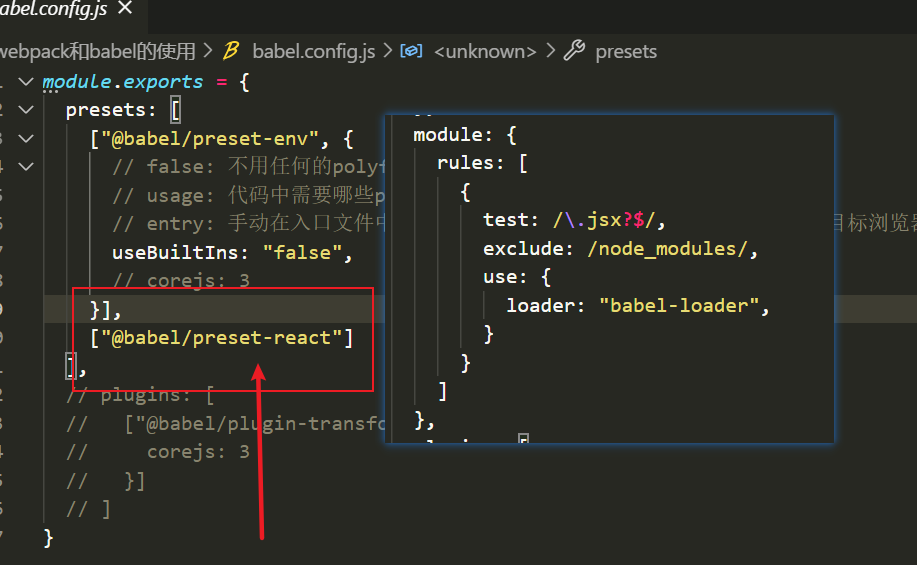

2. 不使用 preset也可以, 请使用以下 plugin
   - @babel/plugin-syntax-jsx
   - @babel/plugin-transform-react-jsx
   - @babel/plugin-transform-react-display-name

#### 2 typeScript

1. 单独使用

````js
cnpm install typescript -g
tsc index.ts
````

2. ts-lodaer

   - 即便你不特地装 typescript， 只下载ts-loader也是可以正常编译的。
   - 下载 ts-loader时候，若其依赖其他包，packag.json也会同时帮你下载依赖的包。

   配置loader 

   - 由于babel本身是支持编译ts的， 故不需要typescript、不需要ts-loader来处理。

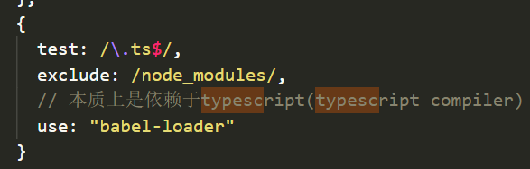

3. 问题： 

   报错：不识别ts文件！

   解决：需要预设设置。 

   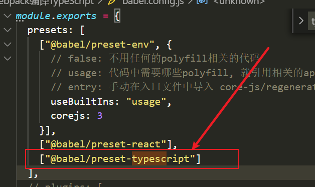

4. ts-loader 与 babel-loader

   - babel-loader是可以进行polyfill的， 但

     虽然 vscode可对 ts进行校验， 但 npm run build 不会因ts语法错误而编译失败

   - 而ts-loader是可以提供的， 即ts语法错误， ts-loader会提示报错， 编译失败。

   > 怎么样才可以两全其美呢？

   依旧是用 babel进行转化，但添加tsc进行校验。

   1. *"build"*: "npm run type-check & webpack --config wk.config.js",

   2. 使用这种方式

      - type-check 每次build前再执行一次命令
      - 添加watch 跟踪监听！仅执行一次就好。

      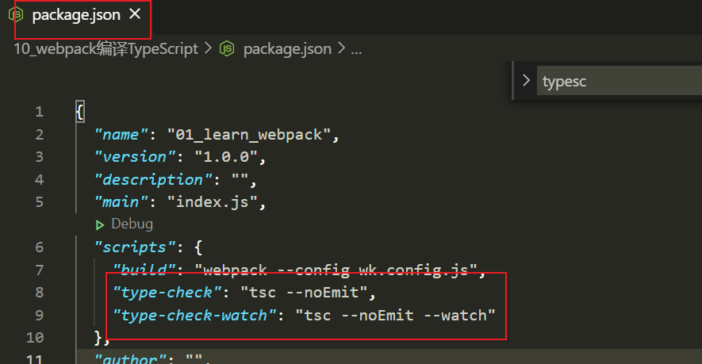

## 七 ESLint、Pretter与Vue

> a static program analysis 静态demo分析工具， 不用运行即可分析。
>
> 原理：demo => JS编译器 [Espree](https://github.com/eslint/espree)=> 语法分析 => AST树 => 遍历检测 => ESLint提示信息
>
> 

### 1 eslint 初次使用示范

1. cnpm install eslint -D

   单独使用试试看：npx eslint ./src/index.js

   需要配置文件才可以使用！

   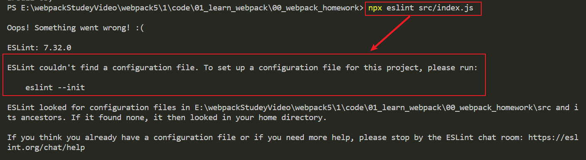

2. npx eslint --init

   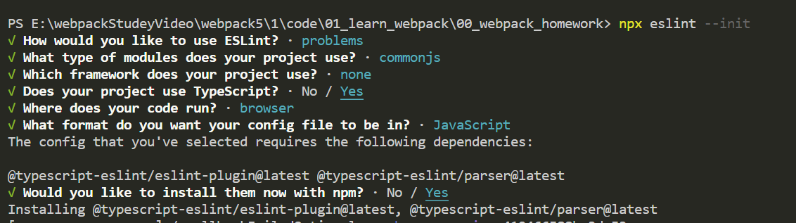

3. 配置对应文件后， 再次 npx eslint src/index.js

   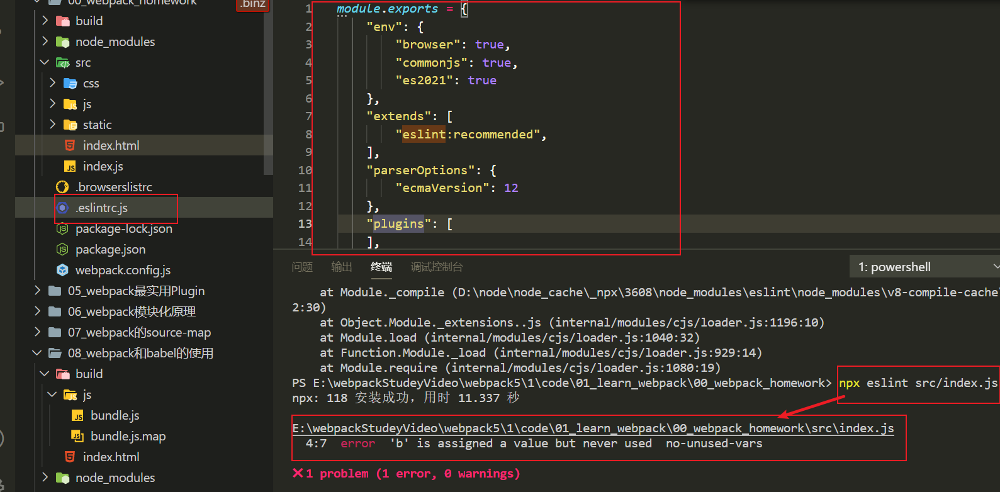

### 2 eslint的配置

> ESlint 被设计为完全可配置的，这意味着你可以关闭每一个规则而只运行基本语法验证，或混合和匹配 ESLint 默认绑定的规则和你的自定义规则，以让 ESLint 更适合你的项目

详情参考官方文档。

- env 环境
- extends 拓展
- parserOptions  编译设置
- plugins 插件
- rules 规则

```js
module.exports = {
  env: {
    browser: true,
    commonjs: true,
    es2021: true,
  },
  extends: ['plugin:vue/essential', 'airbnb-base'],
  parserOptions: {
    ecmaVersion: 12,
    parser: '@typescript-eslint/parser',
  },
  plugins: ['vue', '@typescript-eslint'],
  rules: {
    // 0 => off
    // 1 => warn
    // 2 => error
    'no-unused-vars': 0,
    quotes: ['warn', 'single'],
    'no-console': 0,
    'import/no-extraneous-dependencies': 0,
  },
};

```

1. 0  1 2 代表eslint的三个等级
2. rules可以通过数组配置详细的规则 与 等级 

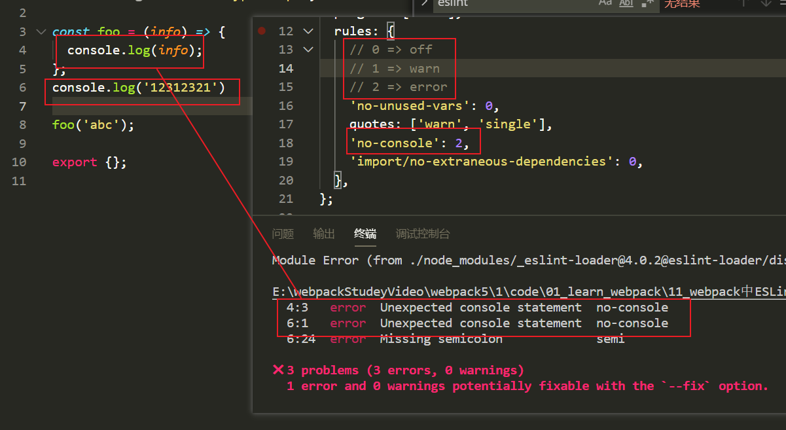

### 3 Prettier - Code formatter

> Prettier - Code formatter

1. 安装此插件 code formatter。 当然你也可以使用别的插件， 比如 beautify

   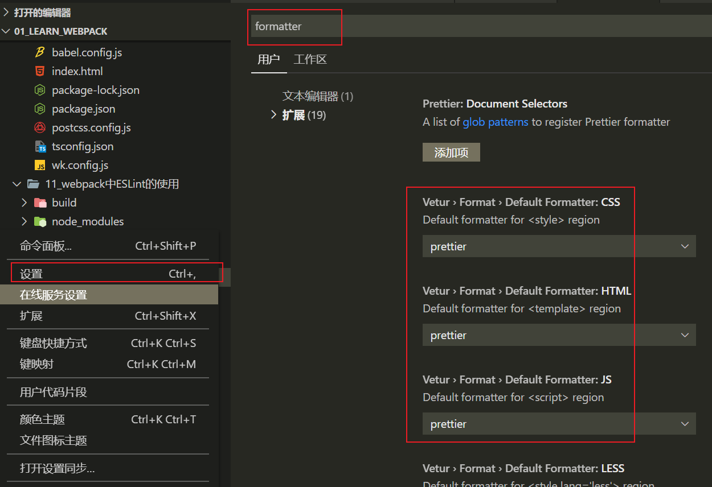

2. 配置文件 .prettierrc 来自定义其格式化

   ````js
   {
     "printWidth": 100,
     "singleQuote": true
   }
   ````

3. pretter 结合 eslint来使用

### 4 ❗ vue

1. 在 index.js的入口文件引入一个vue， 并引入vue文件作为vue的入口文件。

   

   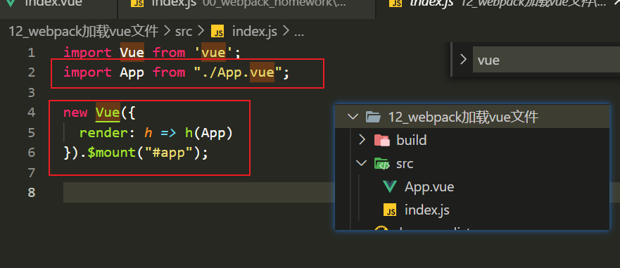

2. 安装并且配置好loader  此时编译回报错

   ❗ 由于我们使用的事 template方式， 故需要vue-template-compiler来协助。

   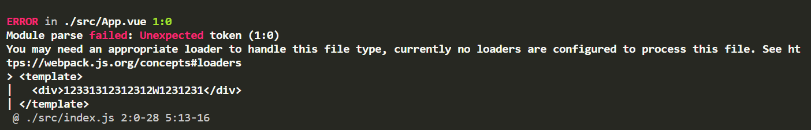

   这是由于 我们 cnpm install vue的时候 忘记 加 -D的后缀导致的问题

   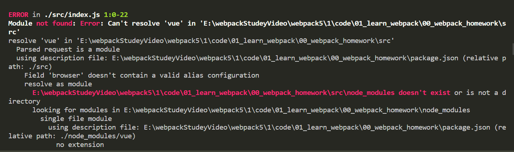

3. 配置

   配置rule 并配置 plugin

   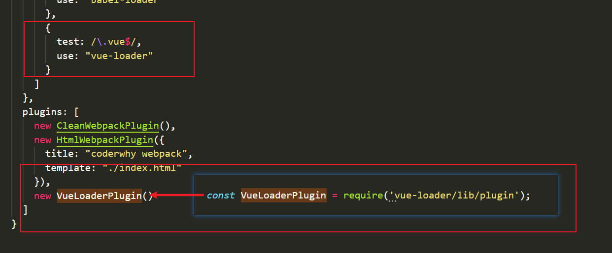


## 九、DevServe与HMR


- 当前

  我们通常访问 打包后的 build下的index.html文件, 或通过vsCode提供的插件的 open online serve插件来打开这个文件。

- 缺点

  我们每次访问都会重新进行 一次 `npm run build`命令， 在我们修改源代码的时候， 这种开发模式效率很慢，我们希望寻求一种热部署的方式。

- watch 与 dev 是互斥的 注意下。

###  watch

`build: "webpack --watch" `

1. 方式一

   build: "webpack --watch" =>在编译模式的时候 使用watch来监听源代码的改变

   当你的源码被修改后，重新编译。

   浏览器会重新读入文件！

2. 方式二

   webpack.config.js中添加 属性 watch： true

   进入 wacth模式。

   浏览器会重新读入文件！

> 总结

1. 借助open online serve插件使用一个服务来启动项目，这样好处是可以避免一些 module跨域问题， 并且位于watch模式的时候修改源代码，会实时重载 最近的index.js文件。

   live-serve用于发现文件的变化的。

2. 使用watch模式 => wacth来监听文件的变化的。

> 缺点

1. 所有的源代码都会被重新编译 => 在项目过大的时候尤其明显
2. 编译成功后有新的文件生成 会导致 浏览器每一次都会重新写入文件。
3. live-serve是vscode插件，我们应该保证这种没必要的开发环境。且此插件会重载所有页面，重载所有的内容。我们希望是局部刷新。

###  devServe

`"serve": "webpack serve" `

此时 控制会提示 ： `[WDS] Live Reloading enabled`

webpack-dev-serve

1. 第一步： cnpm install webpack-dev-server -D

2. 第二步:   配置 你应在 package.json中添加一项选项

   *"serve"*: "webpack serve" 

   ```javascript
   # 其外你也可以这样查询文档来配置
   devServer: {
       contentBase: path.join(__dirname, 'dist'),
       compress: true,
       port: 9000
    }
   ```

- 目前

  1. 会对所有的源码进行 重新编译， 会将编译的结果放入内存当中。

     每次都会生成新的文件！

  2. 他会帮我们做刷新整个页面这个操作！

- 番外， 其实你也可以定制你的webpack-serve的服务
  `webpack-dev-middleware`

  cnpm install webpack-dev-middleware express

  详情略！

### devServe => HMR

> Hot Module Replacement 即热部署, 模块热替换 

- 重载部份内容， 仅更新我们需要变化的内容， 而不需要重载所有页面！

- 修改css、js立会立即更新对应的内容 => 相当于修改 浏览器 devtool的工具

使用要求:

1. 不能为 watch mode， 即你的编译模式不应该是watch
2. 不能使用 webpack-dev-middleware 你不能自定义服务。

```js
  devServer: {
    hot: true,
  },
```

效果如下

1. HRM是可用的！ 					[WDS] Hot Module Replacement enabled.
2. HRMK在 等待WDS的信号  · [HMR] Waiting for update signal from WDS...

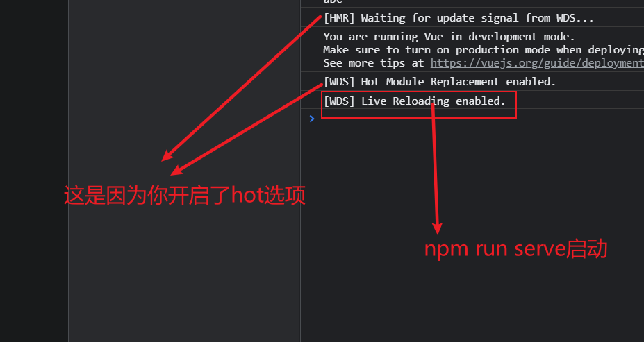

注意❗

你会发现这样依旧会对所有模块刷新， 浏览器刷新页面的效果。

故你需要在入口文件index.js中指定哪些模块需要热更新,

1. 如果你开启模块热更新
2. module.hot.accept("./math2.js") 请这样设置

```js
if (module.hot) {
  // math2.js 是热更新了！
  module.hot.accept("./math2.js")
  // 模块热更新成功后的回调事件， 每次更新都会回调。
  module.hot.accept("./math.js", () => {
    console.log("mat12321h模块发生了更新~");
  });
}
```

### react与vue的hrm

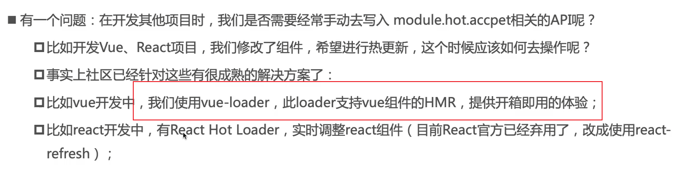

##### 1 react

react的热更新略。

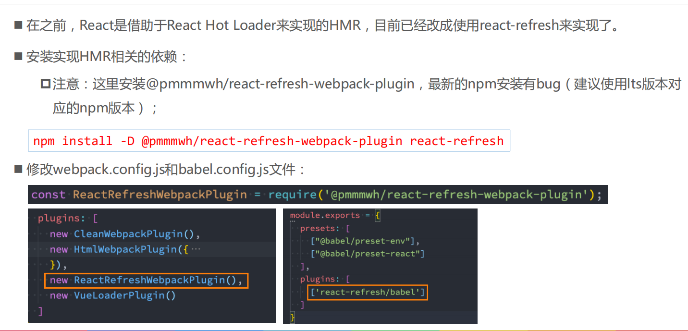

##### 2 vue

vue的HRM使用 vue-loader即可。

再额外使用 插件 

````js
const VueLoaderPlugin = require('vue-loader/lib/plugin');
````

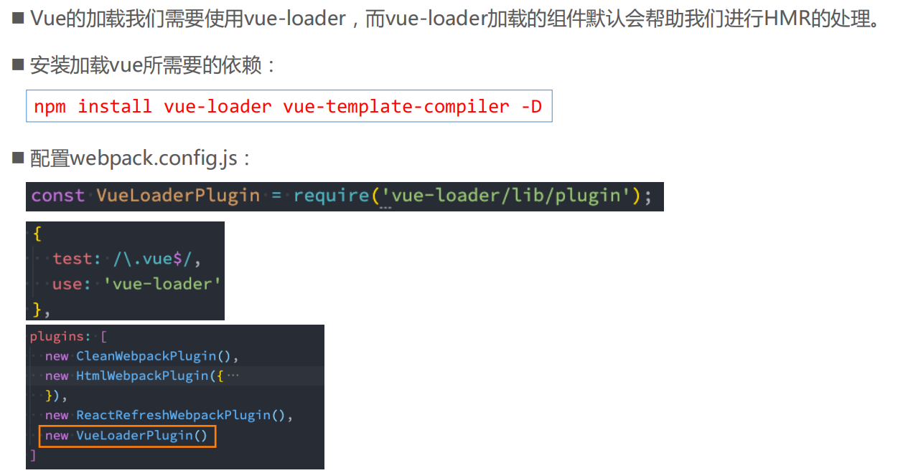

### hrm原理

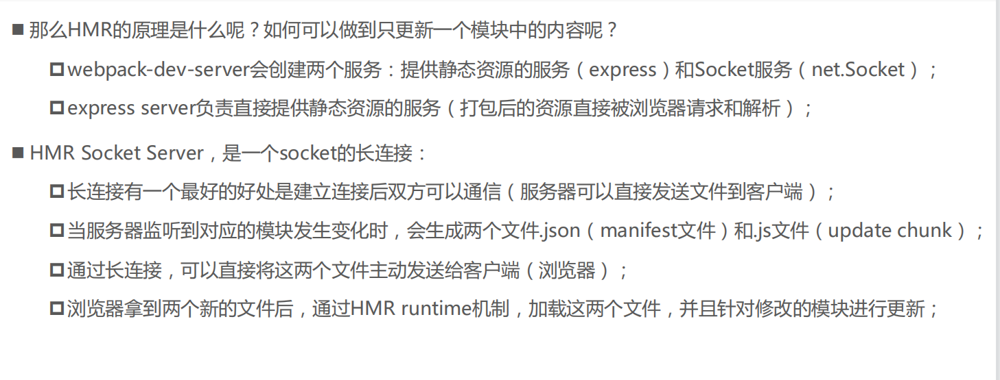

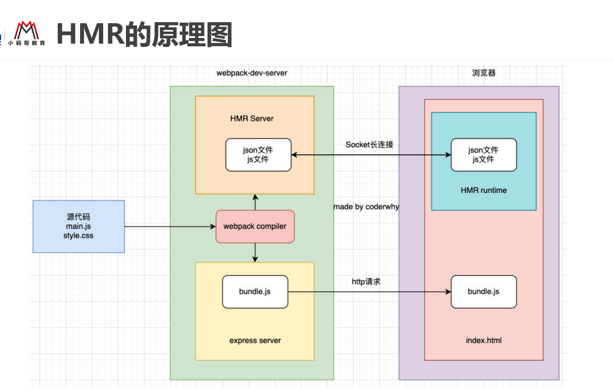

## 十、


### 1、output.publicPath

像 script的src、css的src或图片这类等等的引入，其 由 `output.publickPath + 文件名`组成

1. output.publicPath的默认值是一个空字符串

   ```js
   <script defer src="bundle.js"></script></head>
   ```

2. 若设置为  “/”

   浏览器会根据所在的域名+路径去请求对应的资源

   ```js
   <script defer src="/bundle.js"></script></head>
   ```

   


