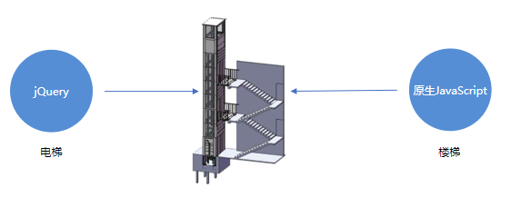
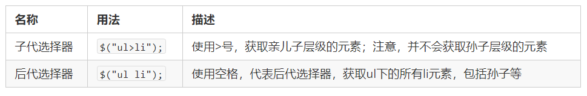
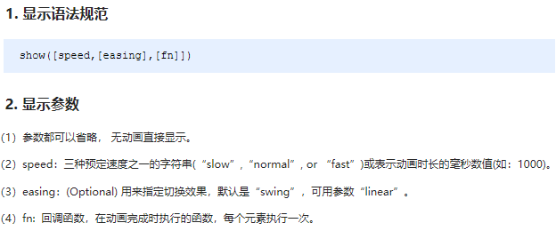
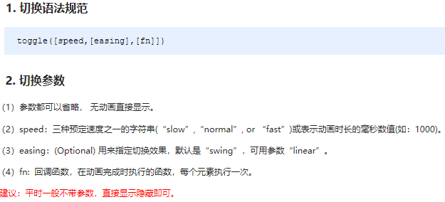
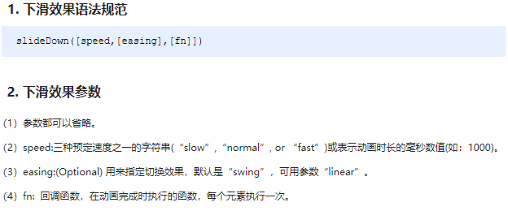
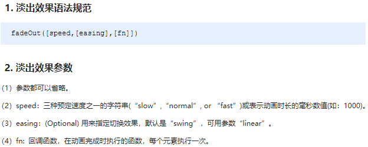
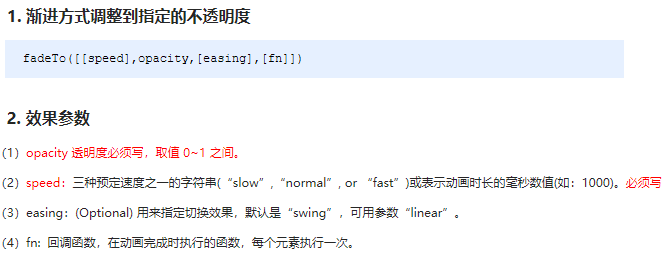

# day01 - jQuery

> 学习目标：
>
> 能够说出什么是 jQuery 
> 能够说出 jQuery 的优点
> 能够简单使用 jQuery
> 能够说出 DOM 对象和 jQuery 对象的区别
> 能够写出常用的 jQuery 选择器 
> 能够操作 jQuery 样式
> 能够写出常用的 jQuery 动画 


## 1.1. jQuery 介绍

### 1.1.1 JavaScript 库

​	JavaScript库：即 library，是一个封装好的特定的集合（方法和函数）。从封装一大堆函数的角度理解库，就是在这个库中，封装了很多预先定义好的函数在里面，比如动画animate、hide、show，比如获取元素等。

> 简单理解： 就是一个JS 文件，里面对我们原生js代码进行了封装，存放到里面。这样我们可以快速高效的使用这些封装好的功能了。
>
> 比如 jQuery，就是为了快速方便的操作DOM，里面基本都是函数（方法）。

​	常见的JavaScript 库：jQuery、Prototype、YUI、Dojo、Ext JS、移动端的zepto等，这些库都是对原生 JavaScript 的封装，内部都是用 JavaScript 实现的，我们主要学习的是 jQuery。

### 1.1.2 jQuery的概念

​	jQuery总体概况如下 :

- jQuery 是一个快速、简洁的 JavaScript 库，其设计的宗旨是“write Less，Do More”，即倡导写更少的代码，做更多的事情。

- j 就是 JavaScript；   Query 查询； 意思就是查询js，把js中的DOM操作做了封装，我们可以快速的查询使用里面的功能。

- jQuery 封装了 JavaScript 常用的功能代码，优化了 DOM 操作、事件处理、动画设计和 Ajax 交互。

- 学习jQuery本质： 就是学习调用这些函数（方法）。

- jQuery 出现的目的是加快前端人员的开发速度，我们可以非常方便的调用和使用它，从而提高开发效率。

  

### 1.1.3 jQuery的优点

1. 轻量级。核心文件才几十kb，不会影响页面加载速度。
2. 跨浏览器兼容，基本兼容了现在主流的浏览器。
3. 链式编程、隐式迭代。
4. 对事件、样式、动画支持，大大简化了DOM操作。
5. 支持插件扩展开发。有着丰富的第三方的插件，例如：树形菜单、日期控件、轮播图等。
6. 免费、开源。

## 1.2. jQuery 的基本使用

### 1.2.1 jQuery 的下载

​	jQuery的官网地址： https://jquery.com/，官网即可下载最新版本。

>  各个版本的下载：https://code.jquery.com/

​	版本介绍：

> 1x ：兼容 IE 678 等低版本浏览器， 官网不再更新
>
> 2x ：不兼容 IE 678 等低版本浏览器， 官网不再更新
>
> 3x ：不兼容 IE 678 等低版本浏览器， 是官方主要更新维护的版本

### 1.2.2. 体验jQuery

​	步骤：

- 引入jQuery文件。
- 在文档最末尾插入 script 标签，书写体验代码。
- $('div').hide() 可以隐藏盒子。

### 1.2.3. jQuery的入口函数

​	jQuery中常见的两种入口函数：

```javascript
// 第一种: 简单易用。
$(function () {   
    ...  // 此处是页面 DOM 加载完成的入口
}) ; 

// 第二种: 繁琐，但是也可以实现
$(document).ready(function(){
   ...  //  此处是页面DOM加载完成的入口
});
```

​	总结：

1. 等着 DOM 结构渲染完毕即可执行内部代码，不必等到所有外部资源加载完成，jQuery 帮我们完成了封装。
2. 相当于原生 js 中的 DOMContentLoaded。
3. 不同于原生 js 中的 load 事件是等页面文档、外部的 js 文件、css文件、图片加载完毕才执行内部代码。
4. 更推荐使用第一种方式。

### 1.2.4. jQuery中的顶级对象$

1.  \$是 jQuery 的别称，在代码中可以使用 jQuery 代替，但一般为了方便，通常都直接使用 $ 。
2.  \$是jQuery的顶级对象，相当于原生JavaScript中的 window。把元素利用$包装成jQuery对象，就可以调用jQuery 的方法。

### 1.2.5.  jQuery 对象和 DOM 对象

​	使用 jQuery 方法和原生JS获取的元素是不一样的，总结如下 : 

1. 用原生 JS 获取来的对象就是 DOM 对象
2. jQuery 方法获取的元素就是 jQuery 对象。
3. jQuery 对象本质是： 利用$对DOM 对象包装后产生的对象（伪数组形式存储）。

> 注意：
>
> 只有 jQuery 对象才能使用 jQuery 方法，DOM 对象则使用原生的 JavaScirpt 方法。


### 1.2.6.  jQuery 对象和 DOM 对象转换

​	DOM 对象与 jQuery 对象之间是可以相互转换的。因为原生js 比 jQuery 更大，原生的一些属性和方法 jQuery没有给我们封装. 要想使用这些属性和方法需要把jQuery对象转换为DOM对象才能使用。

```javascript
// 1.DOM对象转换成jQuery对象，方法只有一种
var box = document.getElementById('box');  // 获取DOM对象
var jQueryObject = $(box);  // 把DOM对象转换为 jQuery 对象

// 2.jQuery 对象转换为 DOM 对象有两种方法：
//   2.1 jQuery对象[索引值]
var domObject1 = $('div')[0]

//   2.2 jQuery对象.get(索引值)
var domObject2 = $('div').get(0)
 
```

总结：实际开发比较常用的是把DOM对象转换为jQuery对象，这样能够调用功能更加强大的jQuery中的方法。

## 1.3. jQuery 选择器

​	原生 JS 获取元素方式很多，很杂，而且兼容性情况不一致，因此 jQuery 给我们做了封装，使获取元素统一标准。

### 1.3.1. 基础选择器

```js
$("选择器")   //  里面选择器直接写 CSS 选择器即可，但是要加引号 
```

​	

### 1.3.2. 层级选择器

​	层级选择器最常用的两个分别为：后代选择器和子代选择器。

​	

**基础选择器和层级选择器案例代码**

```javascript
<body>
    <div>我是div</div>
    <div class="nav">我是nav div</div>
    <p>我是p</p>
    <ul>
        <li>我是ul 的</li>
        <li>我是ul 的</li>        
        <li>我是ul 的</li>
    </ul>
    <script>
        $(function() {
            console.log($(".nav"));
            console.log($("ul li"));
        })
    </script>
</body>
```

### 1.3.3. 筛选选择器

​	筛选选择器，顾名思义就是在所有的选项中选择满足条件的进行筛选选择。常见如下 :


**案例代码**

```js
<body>
    <ul>
        <li>多个里面筛选几个</li>
        <li>多个里面筛选几个</li>
        <li>多个里面筛选几个</li>
        <li>多个里面筛选几个</li>
        <li>多个里面筛选几个</li>
        <li>多个里面筛选几个</li>
    </ul>
    <ol>
        <li>多个里面筛选几个</li>
        <li>多个里面筛选几个</li>
        <li>多个里面筛选几个</li>
        <li>多个里面筛选几个</li>
        <li>多个里面筛选几个</li>
        <li>多个里面筛选几个</li>
    </ol>
    <script>
        $(function() {
            $("ul li:first").css("color", "red");
            $("ul li:eq(2)").css("color", "blue");
            $("ol li:odd").css("color", "skyblue");
            $("ol li:even").css("color", "pink");
        })
    </script>
</body>
```

另:  jQuery中还有一些筛选方法，类似DOM中的通过一个节点找另外一个节点，父、子、兄以外有所加强。


偏重于记忆，演示代码略。

### 1.3.4 知识铺垫

- jQuery 设置样式

```javascript
$('div').css('属性', '值')    
```

- jQuery 里面的排他思想

```javascript
// 想要多选一的效果，排他思想：当前元素设置样式，其余的兄弟元素清除样式。
$(this).css(“color”,”red”);
$(this).siblings(). css(“color”,””);
```

- 隐式迭代

```javascript
// 遍历内部 DOM 元素（伪数组形式存储）的过程就叫做隐式迭代。
// 简单理解：给匹配到的所有元素进行循环遍历，执行相应的方法，而不用我们再进行循环，简化我们的操作，方便我们调用。
$('div').hide();  // 页面中所有的div全部隐藏，不用循环操作
```

- 链式编程

```javascript
// 链式编程是为了节省代码量，看起来更优雅。
$(this).css('color', 'red').sibling().css('color', ''); 
```

### 1.3.5 案例：淘宝服饰精品案例
> 思路分析: 
> 1.核心原理：鼠标经过左侧盒子某个小li，就让内容区盒子相对应图片显示，其余的图片隐藏。
> 2.需要得到当前小li 的索引号，就可以显示对应索引号的图片
> 3.jQuery 得到当前元素索引号 $(this).index()
> 4.中间对应的图片，可以通过  eq(index) 方法去选择
> 5.显示元素 show()   隐藏元素 hide()

​	代码实现略。(详情参考源代码)

## 1.4.  jQuery 样式操作

​	jQuery中常用的样式操作有两种：css() 和 设置类样式方法

### 1.4.1. 方法1: 操作 css 方法

​	jQuery 可以使用 css 方法来修改简单元素样式； 也可以操作类，修改多个样式。

​	常用以下三种形式 : 

```javascript
// 1.参数只写属性名，则是返回属性值
var strColor = $(this).css('color');

// 2.  参数是属性名，属性值，逗号分隔，是设置一组样式，属性必须加引号，值如果是数字可以不用跟单位和引号
$(this).css(''color'', ''red'');

// 3.  参数可以是对象形式，方便设置多组样式。属性名和属性值用冒号隔开， 属性可以不用加引号
$(this).css({ "color":"white","font-size":"20px"});

```

​	注意：css() 多用于样式少时操作，多了则不太方便。

### 1.4.2. 方法2: 设置类样式方法

​	作用等同于以前的 classList，可以操作类样式， 注意操作类里面的参数不要加点。

​	常用的三种设置类样式方法：

```javascript
// 1.添加类
$("div").addClass("current");

// 2.删除类
$("div").removeClass("current");

// 3.切换类
$("div").toggleClass("current");

```

​	注意：

1. 设置类样式方法比较适合样式多时操作，可以弥补css()的不足。
2. 原生 JS 中 className 会覆盖元素原先里面的类名，jQuery 里面类操作只是对指定类进行操作，不影响原先的类名。

### 1.4.3. 案例：tab 栏切换

> 思路分析: 
> 1.点击上部的li，当前li 添加current类，其余兄弟移除类。
> 2.点击的同时，得到当前li 的索引号
> 3.让下部里面相应索引号的item显示，其余的item隐藏

​	代码实现略。(详情参考源代码)

## 1.5. jQuery 效果

​	jQuery 给我们封装了很多动画效果，最为常见的如下：

- 显示隐藏：show() / hide() / toggle() ;
- 划入画出：slideDown() / slideUp() / slideToggle() ; 
- 淡入淡出：fadeIn() / fadeOut() / fadeToggle() / fadeTo() ; 
- 自定义动画：animate() ;

> 注意：
>
> 动画或者效果一旦触发就会执行，如果多次触发，就造成多个动画或者效果排队执行。
>
> jQuery为我们提供另一个方法，可以停止动画排队：stop() ;

### 1.5.1. 显示隐藏

​	显示隐藏动画，常见有三个方法：show() / hide() / toggle() ;

​	语法规范如下:






**代码演示**

```javascript
<body>
    <button>显示</button>
    <button>隐藏</button>
    <button>切换</button>
    <div></div>
    <script>
        $(function() {
            $("button").eq(0).click(function() {
                $("div").show(1000, function() {
                    alert(1);
                });
            })
            $("button").eq(1).click(function() {
                $("div").hide(1000, function() {
                    alert(1);
                });
            })
            $("button").eq(2).click(function() {
              $("div").toggle(1000);
            })
            // 一般情况下，我们都不加参数直接显示隐藏就可以了
        });
    </script>
</body>
```

### 1.5.2. 滑入滑出

​	滑入滑出动画，常见有三个方法：slideDown() / slideUp() / slideToggle() ; 

​	语法规范如下:




**代码演示**

```javascript
<body>
    <button>下拉滑动</button>
    <button>上拉滑动</button>
    <button>切换滑动</button>
    <div></div>
    <script>
        $(function() {
            $("button").eq(0).click(function() {
                // 下滑动 slideDown()
                $("div").slideDown();
            })
            $("button").eq(1).click(function() {
                // 上滑动 slideUp()
                $("div").slideUp(500);
            })
            $("button").eq(2).click(function() {
                // 滑动切换 slideToggle()
                $("div").slideToggle(500);
            });
        });
    </script>
</body>
```

> 小案例：下拉菜单略（详情参看源码）。

### 1.5.3 淡入淡出

​	淡入淡出动画，常见有四个方法：fadeIn() / fadeOut() / fadeToggle() / fadeTo() ; 

​	语法规范如下:







**代码演示**

```javascript
<body>
    <button>淡入效果</button>
    <button>淡出效果</button>
    <button>淡入淡出切换</button>
    <button>修改透明度</button>
    <div></div>
    <script>
        $(function() {
            $("button").eq(0).click(function() {
                // 淡入 fadeIn()
                $("div").fadeIn(1000);
            })
            $("button").eq(1).click(function() {
                // 淡出 fadeOut()
                $("div").fadeOut(1000);
            })
            $("button").eq(2).click(function() {
                // 淡入淡出切换 fadeToggle()
                $("div").fadeToggle(1000);
            });
            $("button").eq(3).click(function() {
                //  修改透明度 fadeTo() 这个速度和透明度要必须写
                $("div").fadeTo(1000, 0.5);
            });
        });
    </script>
</body>
```

### 1.5.4 自定义动画

​	自定义动画非常强大，通过参数的传递可以模拟以上所有动画，方法为：animate() ;

​	语法规范如下:


**代码演示**

```javascript
<body>
    <button>动起来</button>
    <div></div>
    <script>
        $(function() {
            $("button").click(function() {
                $("div").animate({
                    left: 500,
                    top: 300,
                    opacity: .4,
                    width: 500
                }, 500);
            })
        })
    </script>
</body>
```

### 1.5.5 停止动画排队

​	动画或者效果一旦触发就会执行，如果多次触发，就造成多个动画或者效果排队执行。

​	停止动画排队的方法为：stop() ; 

- stop() 方法用于停止动画或效果。
- stop() 写到动画或者效果的前面， 相当于停止结束上一次的动画。

​        总结: 每次使用动画之前，先调用 stop() ,在调用动画。

### 1.5.6. 事件切换

​	jQuery中为我们添加了一个新事件 hover() ; 功能类似 css 中的伪类 :hover 。介绍如下

**语法**

```javascript
hover([over,]out)     // 其中over和out为两个函数
```

- over:鼠标移到元素上要触发的函数（相当于mouseenter）
- out:鼠标移出元素要触发的函数（相当于mouseleave）
- 如果只写一个函数，则鼠标经过和离开都会触发它

**hover事件和停止动画排列案例**

```javascript
<body>
    <ul class="nav">
        <li>
            <a href="#">微博</a>
            <ul><li><a href="">私信</a></li><li><a href="">评论</a></li><li><a href="">@我</a></li></ul>
        </li>
        <li>
            <a href="#">微博</a>
            <ul><li><a href="">私信</a></li><li><a href="">评论</a></li><li><a href="">@我</a></li></ul>
        </li>
    </ul>
    <script>
        $(function() {
            // 鼠标经过
            // $(".nav>li").mouseover(function() {
            //     // $(this) jQuery 当前元素  this不要加引号
            //     // show() 显示元素  hide() 隐藏元素
            //     $(this).children("ul").slideDown(200);
            // });
            // // 鼠标离开
            // $(".nav>li").mouseout(function() {
            //     $(this).children("ul").slideUp(200);
            // });
            // 1. 事件切换 hover 就是鼠标经过和离开的复合写法
            // $(".nav>li").hover(function() {
            //     $(this).children("ul").slideDown(200);
            // }, function() {
            //     $(this).children("ul").slideUp(200);
            // });
            // 2. 事件切换 hover  如果只写一个函数，那么鼠标经过和鼠标离开都会触发这个函数
            $(".nav>li").hover(function() {
                // stop 方法必须写到动画的前面
                $(this).children("ul").stop().slideToggle();
            });
        })
    </script>
</body>
```

### 1.5.7. 案例：王者荣耀手风琴效果

> 思路分析: 
> 1.鼠标经过某个小li 有两步操作：
> 2.当前小li 宽度变为 224px， 同时里面的小图片淡出，大图片淡入
> 3.其余兄弟小li宽度变为69px， 小图片淡入， 大图片淡出

​	代码实现略。(详情参考源代码)

## 1.6. 今日总结


