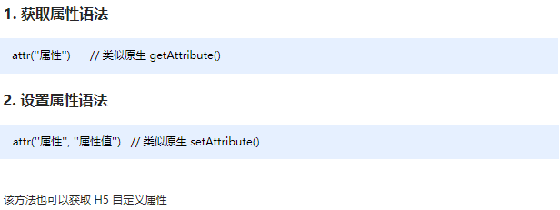
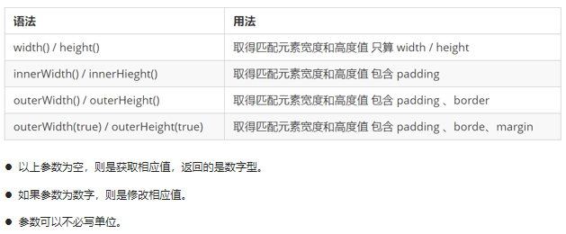
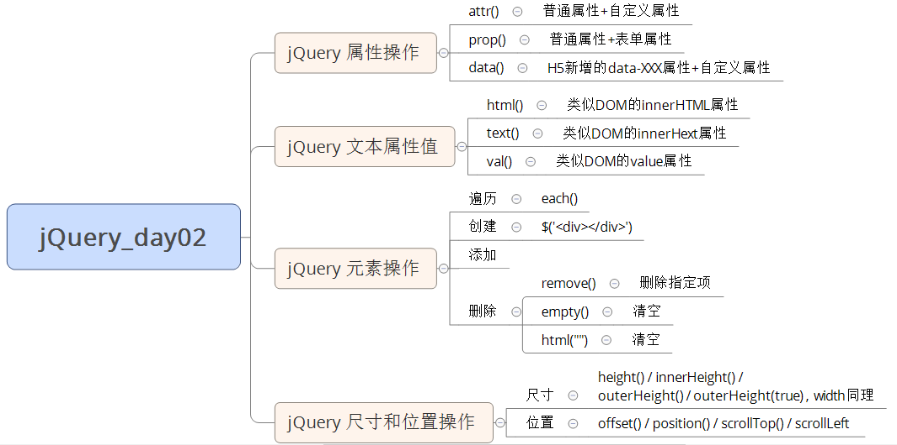

# day02 - jQuery

> 学习目标：
>
> 能够操作  jQuery 属性 
> 能够操作  jQuery 元素
> 能够操作  jQuery 元素尺寸、位置

## 1.1. jQuery 属性操作

​	jQuery 常用属性操作有三种：prop() / attr() / data() ;

### 1.1.1 元素固有属性值 prop()

​	所谓元素固有属性就是元素本身自带的属性，比如 <a> 元素里面的 href ，比如 <input> 元素里面的 type。 

**语法**


​	注意：prop() 除了普通属性操作，更适合操作表单属性：disabled / checked / selected 等。

### 1.1.2 元素自定义属性值 attr()

​	用户自己给元素添加的属性，我们称为自定义属性。 比如给 div 添加 index =“1”。 

**语法**



​	注意：attr() 除了普通属性操作，更适合操作自定义属性。（该方法也可以获取 H5 自定义属性）

### 1.1.3 数据缓存 data()

​	data() 方法可以在指定的元素上存取数据，并不会修改 DOM 元素结构。一旦页面刷新，之前存放的数据都将被移除。 

**语法**


​	注意：同时，还可以读取 HTML5 自定义属性  data-index ，得到的是数字型。

**演示代码**

```javascript
<body>
    <a href="http://www.itcast.cn" title="都挺好">都挺好</a>
    <input type="checkbox" name="" id="" checked>
    <div index="1" data-index="2">我是div</div>
    <span>123</span>
    <script>
        $(function() {
            //1. element.prop("属性名") 获取元素固有的属性值
            console.log($("a").prop("href"));
            $("a").prop("title", "我们都挺好");
            $("input").change(function() {
                console.log($(this).prop("checked"));
            });
            // console.log($("div").prop("index"));
            // 2. 元素的自定义属性 我们通过 attr()
            console.log($("div").attr("index"));
            $("div").attr("index", 4);
            console.log($("div").attr("data-index"));
            // 3. 数据缓存 data() 这个里面的数据是存放在元素的内存里面
            $("span").data("uname", "andy");
            console.log($("span").data("uname"));
            // 这个方法获取data-index h5自定义属性 第一个 不用写data-  而且返回的是数字型
            console.log($("div").data("index"));
        })
    </script>
</body>
```

### 1.1.4 案例：购物车案例模块-全选

> 1.全选思路：里面3个小的复选框按钮（j-checkbox）选中状态（checked）跟着全选按钮（checkall）走。
> 2.因为checked 是复选框的固有属性，此时我们需要利用prop()方法获取和设置该属性。
> 3.把全选按钮状态赋值给3小复选框就可以了。
> 4.当我们每次点击小的复选框按钮，就来判断：
> 5.如果小复选框被选中的个数等于3 就应该把全选按钮选上，否则全选按钮不选。
> 6.:checked 选择器      :checked 查找被选中的表单元素。

​	代码实现略。(详情参考源代码)

## 1.2. jQuery 文本属性值

​	jQuery的文本属性值常见操作有三种：html() / text() / val() ; 分别对应JS中的 innerHTML 、innerText 和 value 属性。

### 1.2.1 jQuery内容文本值

​	常见操作有三种：html() / text() / val() ; 分别对应JS中的 innerHTML 、innerText 和 value 属性，主要针对元素的内容还有表单的值操作。

**语法**


​	注意：html() 可识别标签，text() 不识别标签。

**演示代码**

```javascript
<body>
    <div>
        <span>我是内容</span>
    </div>
    <input type="text" value="请输入内容">
    <script>
        // 1. 获取设置元素内容 html()
        console.log($("div").html());
        // $("div").html("123");
        // 2. 获取设置元素文本内容 text()
        console.log($("div").text());
        $("div").text("123");
        // 3. 获取设置表单值 val()
        console.log($("input").val());
        $("input").val("123");
    </script>
</body>
```

### 1.2.2. 案例：购物车案例模块-增减商品数量

> 1.核心思路：首先声明一个变量，当我们点击+号（increment），就让这个值++，然后赋值给文本框。
> 2.注意1： 只能增加本商品的数量， 就是当前+号的兄弟文本框（itxt）的值。 
> 3.修改表单的值是val() 方法
> 4.注意2： 这个变量初始值应该是这个文本框的值，在这个值的基础上++。要获取表单的值
> 5.减号（decrement）思路同理，但是如果文本框的值是1，就不能再减了。

​	代码实现略。(详情参考源代码)

### 1.2.3. 案例：购物车案例模块-修改商品小计

> 1.核心思路：每次点击+号或者-号，根据文本框的值 乘以 当前商品的价格  就是 商品的小计
> 2.注意1： 只能增加本商品的小计， 就是当前商品的小计模块（p-sum）  
> 3.修改普通元素的内容是text() 方法
> 4.注意2： 当前商品的价格，要把￥符号去掉再相乘 截取字符串 substr(1)
> 5.parents(‘选择器’) 可以返回指定祖先元素  
> 6.最后计算的结果如果想要保留2位小数 通过 toFixed(2)  方法
> 7.用户也可以直接修改表单里面的值，同样要计算小计。 用表单change事件
> 8.用最新的表单内的值 乘以 单价即可  但是还是当前商品小计

​	代码实现略。(详情参考源代码)

## 1.3. jQuery 元素操作

​	jQuery 元素操作主要讲的是用jQuery方法，操作标签的遍历、创建、添加、删除等操作。

### 1.3.1. 遍历元素

​	jQuery 隐式迭代是对同一类元素做了同样的操作。 如果想要给同一类元素做不同操作，就需要用到遍历。

**语法1**


​	注意：此方法用于遍历 jQuery 对象中的每一项，回调函数中元素为 DOM 对象，想要使用 jQuery 方法需要转换。

**语法2**


​	注意：此方法用于遍历 jQuery 对象中的每一项，回调函数中元素为 DOM 对象，想要使用 jQuery 方法需要转换。

**演示代码**

```javascript
<body>
    <div>1</div>
    <div>2</div>
    <div>3</div>
    <script>
        $(function() {
            // 如果针对于同一类元素做不同操作，需要用到遍历元素（类似for，但是比for强大）
            var sum = 0;
            var arr = ["red", "green", "blue"];
            // 1. each() 方法遍历元素 
            $("div").each(function(i, domEle) {
                // 回调函数第一个参数一定是索引号  可以自己指定索引号号名称
                // console.log(i);
                // 回调函数第二个参数一定是 dom 元素对象，也是自己命名
                // console.log(domEle);  // 使用jQuery方法需要转换 $(domEle)
                $(domEle).css("color", arr[i]);
                sum += parseInt($(domEle).text());
            })
            console.log(sum);
            // 2. $.each() 方法遍历元素 主要用于遍历数据，处理数据
            // $.each($("div"), function(i, ele) {
            //     console.log(i);
            //     console.log(ele);
            // });
            // $.each(arr, function(i, ele) {
            //     console.log(i);
            //     console.log(ele);
            // })
            $.each({
                name: "andy",
                age: 18
            }, function(i, ele) {
                console.log(i); // 输出的是 name age 属性名
                console.log(ele); // 输出的是 andy  18 属性值
            })
        })
    </script>
</body>
```

### 1.3.2. 案例：购物车案例模块-计算总计和总额

> 1.把所有文本框中的值相加就是总额数量，总计同理。
> 2.文本框里面的值不同，如果想要相加需要用 each() 遍历，声明一个变量做计数器，累加即可。

​	代码实现略。(详情参考源代码)

### 1.3.3. 创建、添加、删除

​	jQuery方法操作元素的创建、添加、删除方法很多，则重点使用部分，如下：

**语法总和**


​	注意：以上只是元素的创建、添加、删除方法的常用方法，其他方法请参详API。

**案例代码**

```js
<body>
    <ul>
        <li>原先的li</li>
    </ul>
    <div class="test">我是原先的div</div>
    <script>
        $(function() {
            // 1. 创建元素
            var li = $("<li>我是后来创建的li</li>");
      
            // 2. 添加元素
            // 	2.1 内部添加
            // $("ul").append(li);  内部添加并且放到内容的最后面 
            $("ul").prepend(li); // 内部添加并且放到内容的最前面
            //  2.2 外部添加
            var div = $("<div>我是后妈生的</div>");
            // $(".test").after(div);
            $(".test").before(div);
      
            // 3. 删除元素
            // $("ul").remove(); 可以删除匹配的元素 自杀
            // $("ul").empty(); // 可以删除匹配的元素里面的子节点 孩子
            $("ul").html(""); // 可以删除匹配的元素里面的子节点 孩子
        })
    </script>
</body>
```

### 1.3.4 案例：购物车案例模块-删除商品模块

> 1.核心思路：把商品remove() 删除元素即可
> 2.有三个地方需要删除： 1. 商品后面的删除按钮 2. 删除选中的商品 3. 清理购物车
> 3.商品后面的删除按钮： 一定是删除当前的商品，所以从 $(this) 出发
> 4.删除选中的商品： 先判断小的复选框按钮是否选中状态，如果是选中，则删除对应的商品
> 5.清理购物车： 则是把所有的商品全部删掉

​	代码实现略。(详情参考源代码)

### 1.3.5 案例：购物车案例模块-选中商品添加背景

> 1.核心思路：选中的商品添加背景，不选中移除背景即可
> 2.全选按钮点击：如果全选是选中的，则所有的商品添加背景，否则移除背景
> 3.小的复选框点击： 如果是选中状态，则当前商品添加背景，否则移除背景
> 4.这个背景，可以通过类名修改，添加类和删除类

​	代码实现略。(详情参考源代码)

## 1.4.  jQuery 尺寸、位置操作

​	jQuery中分别为我们提供了两套快速获取和设置元素尺寸和位置的API，方便易用，内容如下。

### 1.4.1.  jQuery 尺寸操作

​	 jQuery 尺寸操作包括元素宽高的获取和设置，且不一样的API对应不一样的盒子模型。

**语法**



**代码演示**

```javascript
<body>
    <div></div>
    <script>
        $(function() {
            // 1. width() / height() 获取设置元素 width和height大小 
            console.log($("div").width());
            // $("div").width(300);

            // 2. innerWidth() / innerHeight()  获取设置元素 width和height + padding 大小 
            console.log($("div").innerWidth());

            // 3. outerWidth()  / outerHeight()  获取设置元素 width和height + padding + border 大小 
            console.log($("div").outerWidth());

            // 4. outerWidth(true) / outerHeight(true) 获取设置 width和height + padding + border + margin
            console.log($("div").outerWidth(true));
        })
    </script>
</body>
```

​	注意：有了这套 API 我们将可以快速获取和子的宽高，至于其他属性想要获取和设置，还要使用 css() 等方法配合。

### 1.4.2. jQuery 位置操作

​	jQuery的位置操作主要有三个： offset()、position()、scrollTop()/scrollLeft() , 具体介绍如下: 

**语法**


**代码演示**

```javascript
<body>
    <div class="father">
        <div class="son"></div>
    </div>
        
    <div class="back">返回顶部</div>
    <div class="container"></div>
   
    <script>
        $(function() {
            // 1. 获取设置距离文档的位置（偏移） offset
            console.log($(".son").offset());
            console.log($(".son").offset().top);
            // $(".son").offset({
            //     top: 200,
            //     left: 200
            // });
      
            // 2. 获取距离带有定位父级位置（偏移） position   如果没有带有定位的父级，则以文档为准
            // 这个方法只能获取不能设置偏移
            console.log($(".son").position());
            // $(".son").position({
            //     top: 200,
            //     left: 200
            // });
      
      		// 3. 被卷去的头部
      		$(document).scrollTop(100);
            // 被卷去的头部 scrollTop()  / 被卷去的左侧 scrollLeft()
            // 页面滚动事件
            var boxTop = $(".container").offset().top;
            $(window).scroll(function() {
                // console.log(11);
                console.log($(document).scrollTop());
                if ($(document).scrollTop() >= boxTop) {
                    $(".back").fadeIn();
                } else {
                    $(".back").fadeOut();
                }
            });
            // 返回顶部
            $(".back").click(function() {
                // $(document).scrollTop(0);
                $("body, html").stop().animate({
                    scrollTop: 0
                });
                // $(document).stop().animate({
                //     scrollTop: 0
                // }); 不能是文档而是 html和body元素做动画
            })
        })
    </script>
</body>
```

### 1.4.3. 案例：带有动画的返回顶部

> 1.核心原理： 使用animate动画返回顶部。
> 2.animate动画函数里面有个scrollTop 属性，可以设置位置
> 3.但是是元素做动画，因此 $(“body,html”).animate({scrollTop: 0})

​	代码实现略。(详情参考源代码)

### 1.4.4. 案例： 品优购电梯导航（上）

> 1.当我们滚动到 今日推荐 模块，就让电梯导航显示出来
> 2.点击电梯导航页面可以滚动到相应内容区域
> 3.核心算法：因为电梯导航模块和内容区模块一一对应的
> 4.当我们点击电梯导航某个小模块，就可以拿到当前小模块的索引号
> 5.就可以把animate要移动的距离求出来：当前索引号内容区模块它的offset().top
> 6.然后执行动画即可

​	代码实现略。(详情参考源代码)

### 1.4.5. 案例：品优购电梯导航（下）

> 1.当我们点击电梯导航某个小li， 当前小li 添加current类，兄弟移除类名
> 2.当我们页面滚动到内容区域某个模块， 左侧电梯导航，相对应的小li模块，也会添加current类， 兄弟移除current类。
> 3.触发的事件是页面滚动，因此这个功能要写到页面滚动事件里面。
> 4.需要用到each，遍历内容区域大模块。 each里面能拿到内容区域每一个模块元素和索引号
> 5.判断的条件：  被卷去的头部 大于等于 内容区域里面每个模块的offset().top
> 6.就利用这个索引号找到相应的电梯导航小li添加类。


​	代码实现略。(详情参考源代码)

## 1.5. 今日总结



