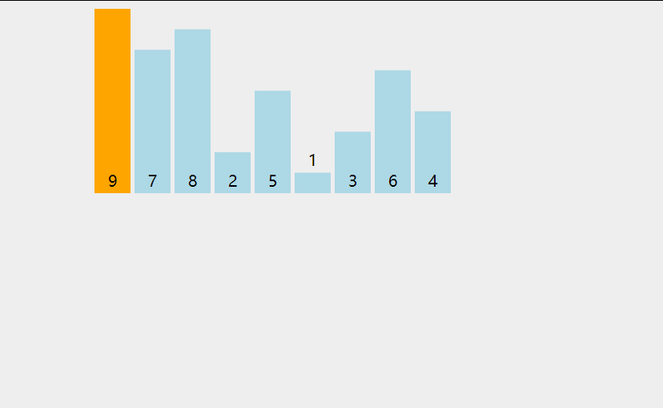

### 前言

> 关于我 
>
> 2021-10-25我并不太清楚何为算法的考题
>
> 故 遇到相对于较难、复杂以及我认为不会在前端算法的考题中出现的题目时便会跳过。
>
> 但并不代表我不再学习，目前以攻克leetCode的真题【中】为目标，以此为小目标

- 算法面试是什么？
  1. 算法优秀 不等同于 技术优秀
  2.  并不是要给出一个正确答案， 而是展示探讨一个问题的解决方案
- 我们应该如何学习算法？
  1. 分类练习
  2. 定期回顾和总结
  3. `数据结构`与`算法` => 明白数据结构才可算法


1. String.fromCharCode(97)  'a'.charCodeAt()
2. Array.from({length: 100}, () => new Array().fill(false));
3. new RegExp(/a/gi).match('aaaaaaaaa');
4. /[/d]/.test('1qsw1');
5. num += parseInt(ip, 10 ).toString(2).padStart(8,'0')
6. Math.sqrt() Math.pow
7. 判断 左 1 右 0的子网掩码
  ```js
  function isMask(ips) {
    // 查看是否 0 是否 在 最后一个 1 的后面
    // 简单说 从前往后走到第一个0的代价 一定是 大于 从后往前走到第一个1的代价
    return ips.indexOf('0') > ips.lastIndexOf(1); 
  }
  ```
8. 1
9. 
### 关于ES6


1. 声明展开 与 剩余参数

   - 剩余参数 other 是一个数组，相当于arguments
   -  ES5中我们可以使用apply 为此ES2015便有了扩展运算符

   ```js
   function fn(a, ...other) {
     console.log(other);
   }
   fn(1, 'hello', 'me', {a: 1});
   ```

2. 解构的妙用

   - 你可以利用数组解构去声明多个变量
   - 你可以利用数组形式更便捷的进行变量交换

   ```js
   let [x, y, z] = ['xxxx', 'yyyy', 'zzzz']; // 相当于 let x = 'xxxx'
   [x, y, z] = [z, y, x];
   
   #属性与变量key值相同时的简写也是属于对象解构
   let o  ={ x };
   
   # 简写方法名
   这种方式是声明式的，但由于总是以对象形式去调用故this总会如我们所愿。
   const me = {
       print() {}
   }
   ```

3. 类的属性存取器 => 实际的实现应该是definePeoperty的语法糖吧

   ```js
   class Person {
       constructor (name) {
           this._name = name;
       }
       get name() { return this._name};
       set name(val) { this._name = val; }
   }
   ```

4. 数组方法

   ```js
   # from
   let arr = [1, 2, 3];
   arr2 = Array.from(arr); 等价 arr2 = [...arr]; 
   
   # @@iterator
   返回一个包含数组键值对的迭代器对象
   
   # fill
   你可以用静态值填充数组
   
   # entries、keys、values 获取迭代器
   	# 数组的迭代器 等同values
   	let iterator = arr[ Symbol.iterator ]();
   	# 获取迭代器的值
   	iterator.next.value();
   
   1. entries 获取键与值的迭代器 => 其value为 键与值组成的长度为2的数组
   2. keys     获取键   的迭代器
   3. values   获取值   的迭代器
   ```

   


### 时间复杂度

- 常数操作

  1. 常数操作： 跟数据量无关系，每次都是固定时间完成的操作，称呼常数操作。

     比如 从数组从取值。进行加减乘除便是常数操作

  2. 非 常数操作： 获取链表的某一个值， 只能从前往后，跟数据量有关系。

- 时间复杂度

  1. 比如 有 aN²  + bN + C， 仅取高阶项，且不需要系数， 可称呼为其 O(N²)的复杂度。
  2. 评价算法好坏，先看【时间复杂度】再看【常数项时间】
  
- n 表示数据规模

  O ( f(n) ) 即表示 所表示的执行次数。

  

### 数据结构

> 线性结构： 一对一的线性关系
>
> 1. 顺序存储结构： 顺序存储的线性表称为顺序表
> 2. 链式存储结构： 链式存储的线性表称为链表。其存储元素不一定连续。
>
> - 线性结构有两种操作受限的场景 ⭐ 栈与队列 => 故栈与队列有分别两种不同实现的方式
> - 链表也是线性结构
>
> 非线性结构
>
> 1. 树
> 2. 图
> 3. 集合
> 4. 

#### 1 栈

> 先进后出, 可将数组的尾巴视作栈顶。
>
> 用数组模拟栈，我们仅对栈顶进行操作。故如此如此。

```js
class Stack {
    constructor() {
        this._items = [];
    }
    push(item) {
        this._items.push(item);
    }
    pop(item) {
        return this._items.pop(item)
    }
    peek () { return this._item[this._item.length - 1] }
    size () { return this._item.length }
    clear() { this._item = [] }
}
```

#### 2 队列

> 先进先出 FIFO

```js
class Queue {
    constructor {
        this._items = []
    }
	enqueue (item) {
        this._items.push(item)
    }
	dequeue () {
        return this._items.shift();
    }
	peek () {
        return this._items[0]
    }
	tail() {
        return this._items[this._items.length - 1]
    }
	
}
```

##### 双端队列

> 同时从前端和后端添加与移除的队列
>
> 即 同时遵守 先进先出与 后进先出。
>
> 双端队列： 队列 + 栈

```js
# 用数组实现更简单，不过书上给与的对象实现
class Deque {
    constructor () {
        // 控制队列的大小
        this.count = 0;
        // 追踪第一个元素
        this.lowestCount = 0;
        this.items = {};
    }
    addFront( element ) {
        if (this.isEmpty() ) this.addBack(element);
        else if (this.lowestCount > 0) {
            this.lowestCount--;
            this.items[this.lowestCount] = element;
        }
        // lowestCount为0 我们必须腾出第一位的位置
        else {
            for (let i = this.count; i > 0; i--) {
                this.items[i] = this.items[i - 1]
            }
            this.count++;
            this.lowerCount = 0;
            this._items[0] = element;
        }
    }
    // 向后加
    addBack(element) {
        this.items[this.count] = element;
        this.count++;
    }
    removeFront() {
        let result =  this.items[this.lowestCount];
        delete this.items[this.lowestCount]
        this.lowestCount++;
        return result;
    }
    removeBack() {}
}
```

##### 循环队列

- 队列容量为n
- 我们第一次实现的队列其实已经是一个循环队列了！ 你想想是不是呢？

```js
# full => push 
# empty => pop
```

1. 试想场景

   1 2 3 4 5 => x x x 4 5 =>

    此时我希望6  7 x 4 5 而不是 x x x 4 5 6 7 

2. 设计

   ```js
   # push
   head = ( head + 1 ) % N // 走到末尾的时候跳回来， 故 r + 1 不可。
   queue[head] = value;
   
   # pop
   tail = (tail + 1) % N; => 引发empty
   ```

3. 别的方式循环队列

   ⭐ tail 与 与 Rear 相关

   ⭐ head 便是head即可。

   ⭐ de 与 en 是毫无关系的独立工作

   当head指向另一个时候， 说明我将要删除它， 那么它肯定已存在了

   当tail指向另一个的时候，说明下一个位置我将要在这里 

   ```js
   /**
    * @param {number} k
    */
   var MyCircularQueue = function (k) {
     this.arr = new Array(k + 1);
     this.front = 0;
     this.tail = 0;
   };
   
   /** 
    * @param {number} value
    * @return {boolean}
    */
   MyCircularQueue.prototype.enQueue = function (value) {
     if (this.isFull()) {
       return false;
     } else {
       this.arr[this.tail] = value;
       this.tail = (this.tail + 1) % this.arr.length;
       return true;
     }
   };
   
   /**
    * @return {boolean}
    */
   MyCircularQueue.prototype.deQueue = function () {
     if (this.isEmpty()) {
       return false;
     } else {
       this.front = (this.front + 1) % this.arr.length;
       return true;
     }
   };
   
   /**
    * @return {number}
    */
   MyCircularQueue.prototype.Front = function () {
     if (this.isEmpty()) {
       return -1;
     } else {
       return this.arr[this.front]
     }
   };
   
   /**
    * @return {number}
    */
   MyCircularQueue.prototype.Rear = function () {
     if (this.isEmpty()) {
       return -1;
     } else {
       // 为什么不直接 -1是因为考虑到 最后一个位置, tail在第一位
       return this.arr[(this.tail - 1 + this.arr.length) % this.arr.length];
     }
   };
   
   /**
    * @return {boolean}
    */
   MyCircularQueue.prototype.isEmpty = function () {
     if (this.tail === this.front) {
       return true;
     } else {
       return false;
     }
   };
   
   /**
    * @return {boolean}
    */
   MyCircularQueue.prototype.isFull = function () {
     if ((this.tail + 1) % this.arr.length === this.front) {
       return true;
     } else {
       return false;
     }
   };
   
   ```

   

#### 3 链表

##### 实现一个链表

链表的好处: 添加与移动不需要移动其他元素

⭐ 你应该注意

1. 插入的index是否是从0开始计数，一般而言都是从0开始计数

   你应该注意 index 总是 下标位数！

2. 若恰好 index === count的时候应该如何处理？

   尤其是在插入判断时，按理此时 index 不存在故不插入，但若正好等于，其作为tail也无可厚非

3.  你应该注意

   每次去get的时候， 其 next 总是是取下一个的，故 你应该总是要比预期少一次。

   ```js
   # 方案一
   let i = 1; 
   while (i < count)
   
   # 方案二
   let i = 0;
   while ( i < count && target ) {}
   ```

   

单链表一般有以下方法

- `append` 在链表尾部添加一个元素
- `insert` 在指定位置插入元素
- `removeAt` 在指定位置删除元素
- `getNode` 获取指定位置的元素
- `print` 打印整个链表
- `indexOf` 查找链表中是否有某个元素，有则返回索引，没有则返回-1

```js
class LinkedList {
    constructor {
        this.head = null;
        this.count = 0;
    }
}
class Node {
    constructor (element) {
        this.element = element;
        this.next = null;
    }
}
```

此外我们要实现链表的方法

1. append

   - 若链表空节点，则head、tail皆是此节点
   - 若其已由，则更新tail即可

   ```js
   append (data) {
   	const node = new Node(element);
       let current;
       if (!this.head) {
           this.head = node;
           this.count++;
           return null;
       }
       // 尾部添加
       current = this.head;
       while ( current.next != null ) {
           current = current.next;
       }
       current.next = node;
       this.count++;
       return null;
   }
   ```

2. insert

   - 插入首部
   - 插入尾部
   - 插入中间

   ```js
   insert(element, index) {
   	if (index < 0 || index > this.count) return false;
       const node = new Node(element);
       if (index === 0) {
           node.next = this.head;
           this.head = node;
           this.count++;
           return true;
       }
       const preNode = this.getElementAt(index - 1);
       const target = preNode.next;
       preNode.next = node;
       node.next = target.next;
       this.count++;
       return true;
   }
   ```
   
3. getElementAt

   - 根据指定位置获取节点

   ```js
   getElementAt(index) {
       if (index < 0 || index > this.count) return undefined;
       let node = this.head;
       let i = 0;
       while ( (i++ < index ) && node) {
        	node = node.next;  
       }
       return node;
   }
   ```

4. removeAt

   - 删除头部
   - 删除尾部
   - 其他

   ```js
   removeAt (index) {
       // 越界
   	if (index < 0 || index > this.count ) return null;
   	// 首
       if (index === 0) {
       	this.head = this.head.next;
           this.count--;
           return this.head.element;
       }
       else {
           let preNode = this.getElementAt(index - 1);
           const value = preNode.next.element;
           preNode.next = preNode.next.next;
           this.count--;
           return value;
       }
   }
   ```


##### 3. 双向链表

- 普通的链表其一个节点只有链向下一个节点的链接

- 而双向链表，如图所示

- head的prev 与 tail的next都是一个 null 或者 undefined 之类的


```js
class DoubleNode extends Node {
    constructor(element, next, prev) {
        super(element, next);
        this.prev = prev;
    }
}
class DoubleLinkedList extends LinkedList {
    constructor () {
        // tail 是最后一个节点的next
        this.tail = undefined;
    }
    # 重写插入
    insert( element, index ) {
        if (index < 0 || index > this.count) return false;
        const node = new DoubleNode(element);
        // 首
        if (index === 0) {
            // 若为空链表
            if (this.head === null) {
                this.head = node;
                this.tail = node;
            }
            else {
                node.next = this.head;
                this.head.prev = node;
                this.head = node;
                
            }
        }
        // 尾
        else if ( index === this.count ){
            this.tail.next = node;
            node.prev = this.tail;
            this.tail = node;
        }
        // 中间
        else {
            const prevNode = this.getElementAt( index - 1);
            const nextNode = prev.next;
            node.next = nextNode;
            node.prev = prevNode;
            prevNode.next = node;
            nextNode.prev = node;            
        }
        this.count++;
        return true;
    }
	# 双向链表删除 => 与单向链表很相似
    removeAt (index) {
        if (index < 0 || index > count) return false;
        // 标识要删除的元素以返回
        let curNode;
        if (index === 0) {
            curNode = this.head;
            this.head = this.head.next;
            // 如果只有一项 更新tail 双链表额外处理此步
            if (this.count === 1) {
                this.tail = undefined; 
            }
            else {
                this.head.prev = undefined; // 双链表额外处理此步
            }
        }
        else if (index === count - 1) {
            curNode = this.tail;
            this.tail = this.tail.prev;
            this.tail.next = undefined;
        }
        else {
            curNode = this.getElementAt (index);
            const preNode = curNode.prev();
            preNode.next = curNode.next.next();
            preNode.next.prev = preNode; 
        }
        this.count--;
        return curNode.element;
    }
}
```


#### 4 集合 Set

> 1. 是无序
> 2. 项唯一
> 3. 你可以视作其 有数学中 有限集合的 概念

```js
class Set {
    constructor {
        this._items = {};
        this._length = 0;
    }
	add (value) {
      if ( this.has(value) ) return false;
      this._items[value] = value;
      this._length += 1;
      return true;
    }
	remove (value) {
        if ( !this.has(value) ) return false;
        delete this._items[value];
        this._length -= 1;
        return true;
    }
	value () { return Object.values(this._items) }
	has () { return Object.hasOwnProperty(value) }
	clear () { this._items = {}; this._lentgh = 0 }
	size() { return this._length }
}
```

##### 4.1 并集

将两个集合中的元素依次添加至新的集合中，并返回改集合

```js
union ( Set ) {
  	const unionSet = new Set();
  	const values = this.values();
  	values.forEach(item => unionSet.add(item));
  	const otherValues = otherSet.values();
  	otherValues.forEach(item => unionSet.add(item));
  	return unionSet;
}
```

##### 4.2 交集

- 以集合A作为参考，遍历集合B依次对比成员，B中的成员存在A中则添加至新集合C中，最后返回C

```js
intersection (otherSet) {
    const intersection = new Set();
    const values = otherSet.values;
	values.forEach(item => {
       if ( this.has(item) ) {
           intersection.add(item);
       } 
    });
    return intersection    
}
```

##### 4.3 差集

```js
// 差集
difference(otherSet) {
  const differenceSet = new Set();

  const values = this.values();
  values.forEach(item => {
    if (!otherSet.has(item)) {
      differenceSet.add(item);
    }
  })

  return differenceSet;
}
```

##### 4.4 子集

- 若其元素皆存在于本集合中代表子集

```js
isSubsetOf (Set) {
    const values = Set.values();
    for (let i = 0; i < values.length; i++) {
        if (  !this.has(values[i]) ) return false;
    }
    return true;
}
```

##### 4.5 ES6的Set

- ES6提供了我们Set，其成员值皆是唯一。

  ```js
  add(value) 添加某个值，返回Set结构本身
  delete(value) 删除某个值，返回一个布尔值，表示删除是否成功
  has(value) 返回一个布尔值，表示该值是否为Set的成员
  clear() 清除所有成员，没有返回值
  size 属性，返回成员总数
  ```

- 使用方式

  ```js
  直接通过数组创建：new Set([1,2,3,4])
  先实例再添加：const set = new Set(); set.add(1);
  ```

- 方法

  ```js
  keys() 返回键名的 迭代器
  values() 返回键值的 迭代器
  entries() 返回键值对的 迭代器
  forEach()/for-of 使用回调函数遍历每个成员
  ```
  
- 集合计算

  1. 并集

     ````js
     new Set([...set1, ...set2])
     ````

  2. 交集

     ````js
     new Set([...setA].filter(x => setB.has(x)))
     ````

  3. 差集

     ```js
     new Set([...setA].filter(x => !setB.has(x)))
     ```

  


#### 5 字典 Dictionary

> 1. 在字典中，存储的是`键-值对`，其中键名是用来查询特定元素的
>
> 2. 字典也称作`映射`
>
> 3. 集合 以 【值-值】形式，字典以【键-值】形式
>
> 4. chrome控制台中 memory标签的快照功能你便可以看到其对象的引用地址
>
>    字典往往也是用作与保存对象的引用地址的

##### 5.1 Dictionary

```js
// 虽然很简单，但也要明白基本的封装思想
class Dictionary {
    construtor () {
        this._table = {}
        this._length = 0;
    }
    set(key, value) {
        if ( !this._has(key) ) this._length++;
        this._tabls[key]  = value;
    }
    has(key) { return this._table.hasOwnProperty(key) }
    remove (key) {
       if (this._table.has(key) {
       		delete this._table[key];
        	this._length--;
        	return true;
       })
       return false;
    }
    keys() { return Object.keys(this._table) }
	values() { return Object.values(this._table) }
    get (key) { return  this._table[key]}
	clear () { this._table = {}; this._length = 0 }
}
```

##### 5.2 ES6的Map

若想希望使用对象作为key，建议直接使用Map结构

```js
set(key, value) // set方法设置键名key对应的键值为value，然后返回整个Map结构
get(key) 		// get方法读取key对应的键值，如果找不到key，返回undefined
delete(value)   // 删除某个值，返回一个布尔值，表示删除是否成功
has(value)      // 返回一个布尔值，表示该值是否为Map的成员
clear()         // 清除所有成员，没有返回值
size 属性，      // 返回成员总数

- `keys()`		       返回键名的遍历器
- `values()` 		   返回键值的遍历器
- `entries()` 		   返回键值对的遍历器
- `forEach()`/`for-of` 使用回调函数遍历每个成员
```

- 创建

  ```js
  直接通过数组创建：
  	const map = new Map([ ['name', '张三'], ['title', 'Author'] ]);
  先实例再添加：
  	const map = new Map();
  ```

#### 6 哈希表/散列表

> 散列表 你也可以称呼其为哈希表。 我们也会称呼其为HashTable类、HashMap类
>
> 是Dictionary类的一种散列表实现方式。
>
> 那么什么是【散列表/ 哈希表】 呢？

- 散列算法

  尽可能快地在数据结构之中找到一个值。散列函数便是给定一个键值，从而返回值的表中的地址。

  `js中的对象是基于哈希表结构的`

- defaultToString

  ```js
  function defaultToString(item) {
      if (item === null) return 'NULL'
      else if (item === undefined) return UNDEFINED
      else if (typeof item === 'string' || item instanceof String) return `${item}`
      return item.toString;
  }
  ```

- 散列函数 

  我们应该明白散列函数

  ```js
  loseHashCode (key) {
      if (typeof key === 'number') return key;
      const tableKey = this.toStrFn(key);
      let hash = 0;
      for (let i =0; i < tableKey.length; i++) {
          // charCodeAt返回Unicode编码值
          hash += tableKey[i].charCodeAt(i);
      }
      return hash % 37
  }
  // 我们取得散列表的名字太长 且为了更好的维护我们可以映射一层
  hasCode(key) {
      return this.loseHashCode(key);
  }
  ```

  > 不得不强调的是
  >
  > HashMap与Dicitionary类相似，不同之处在于哈希表/ 散列表中，
  >
  > 我们将key（hash）生成一个数， 并将valuePair保存在hash属性上。

- 创建散列表

  ```js
  # 虽然直接通过对象方式是可以创建的， 但依照封装准则，应该使用节点创建。
  class ValuePair {
      constructor (key, value) {
          this.key = key;
          this.value = value;
      }
      toString () {
          return `[${this.key} :${this.value}]`
      }
  }
  
  class HashTable {
      constructor {
          this.table = {}
      }
  	# 散列函数
  	// 更新散列表 我觉得是可以放置 不存在的值的
  	put (key, value) {
      	this.table[ this.hasCode[key] ] = new ValuePair( key, value );
          return true;
      }
  	get(key) {
         	const valuePair = this.table[ this.hasCode(key) ];
      	return valuePair ? undefined : valuePair.value;
      }
  	remove (key) { 
      	const hash = this.hasCode(key);
          const valuePair = this.table[hash];
          if (!valuePair) return false;
          else {
              delete this.table[hash];
              return true;
          }
      }
  }
  ```


> 目前以我们此种方式去创建希望会出现 hash重复的情况，这是本就不该出现的事情。
>
> 例如 【Sue】、【Jamie】其哈希值便是重复的。

##### 6.1 解决冲突 分离链接

- 解决冲突最简单的方法
-  为散列表的每一个位置`创建链表`将元素存储在里面 => 额外的存储空间

​	

```js
# 重写put、get、remove
class HashTableSeparateChaining {
    constructor() {
        this.table = {}
    }
}
put (key, value) {
    if (!key || !value) return false;
    const position = this.hasCode(key);
    if ( !this.table[position] ) {
        this.table[position] = new LinkedList();
    }
    this.table[position].push(new ValuePair(key, value));
    return true;
}
// 与链表get同理
get (key) {
	
}
```

##### 6.2 解决冲突-线性探查

##### 6.3 创建更好的散列函数

- 我们实现的并非是一个良好的散列函数，因为易诞生冲突。

- 更好的散列函数. 这并非是性能最好的，但他是社区最喜爱的散列函数！

  ```js
  djb2HashCode(key) {
      const tableKey = this.toStrFn(key);
      let hash = 5381; // 幻数 指 在编程中直接使用的常熟
      for (let i = 0; i < tableKey.length; i++) {
          hash = (hash * 33) + tableKey.charCodeAt(i);
      }
      return hash % 1013;
  }
  ```

  

##### 6.4 ES2015 Map类

> ES2015新增了Map类，可视作Dictionary

#### 7 Tree

##### 7.1 基本概念

1. 根节点
2. 内部节点： 存在至少一个子节点
3. 叶节点（外部节点）： 没有子元素的节点
4. 节点深度： 一个节点具有的属性，取决于它祖先节点的深度
5. 树的高度： 对于树来说，节点深度的最大值。或者你可以认为 根节点位于高度为0的位置。

##### 7.2 二叉搜索树

> 参考：　https://zhuanlan.zhihu.com/p/109535355

- 二叉树： 节点最多只有两个子节点。 二叉树在 计算机科学中应用非常广泛。

- 二叉搜索树（**BST**）

  1. 左侧节点存储值小（比父节点）
  2. 右侧节点存储值大（比父节点）
  3. 使用 指针（引用）表示节点关系。⭐ 在Tree中术语称呼其为【**边**】
  4. 二叉搜索树类似于双向链表。⭐ 在Tree中术语，我们称呼节点为【**键**】

  

##### 7.３实现一个二叉搜索树

1. insert: 从树中插键
2. search: 从树中查键
3. preOrderTraverse: 先序遍历方式 => 根节点 为 【先】
4. inOrderTraverse: 中序遍历方式 => 根节点为 【中】
5. postOrderTraverse: 后序遍历方式 => 根节点 为 【后】
6. min： 返回最小键
7. max： 返回最大键
8. remove： 从树中移除某键

##### 7.4 insert

```ts
class treeNode {
  key: number;
  left: Node | null;
  right: Node | null
  constructor (key: number) {
    this.key = key;
    this.left = null;
    this.right = null;
  }
}
class BinarySearchTree {
  root: treeNode;
  constructor() {
    this.root = null;
  }
  insert(key: any) {
    if (!this.root) {
      return this.root = new treeNode(key);
    }else {
      this.insertNode(this.root, key);
    }
  }
  insertNode(node, key) {
    if (key < node.key) {
      if (!node.left) node.left = new treeNode(key);
      else this.insertNode(node.left, key);
    }
    else {
      if (!node.right) node.right = new treeNode(key);
      else this.insertNode(node.right, key);
    }
  }
}
```

##### 7.5 遍历

###### 7.5.1 inOrderTraverse

- 上行顺序访问BST所有节点的遍历方式， 通俗点说从小到大
- 访问者模式 => 一种设计模式
- 你应当使用 【栈】的方式去理解递归

```js
inOrderTraverse(callback) {
    this.inOrderTraverseNode(this.root, callback);
}
inOrderTraverseNode(node, callBack) {
    # 递归实现 => node 作为 递归基线（停止递归继续执行的条件） 
    if (node) {
        // 左
        this.inOrderTraverseNode(node.left, callBack);
        // 中
        callBack(node.key);
        // 右
        this.inOrderTraverseNode(node.right, callBack);
    }
}

# 测试
const printNode = (value) => { console.log(value) }
bst.inOrderTraverse(printNode);
```

###### 7.5.2 preOrderTraverse

- 先序遍历  => 重在结构 =>  中 左 右
- 访问者模式

```js
preOrderTraverse ( callBack ) {
    this.preOrderTraverseNode(this.root, callBack);
}
preOrderTraverseNode(node, callback) {
    callback(node);
    preOrderTraverseNode(node.left, callback);
    preOrderTraverseNode(node.right, callback);
}
```

###### 7.5.3 后序排序

```js
inOrderTraverse ( callBack ) {
    this.preOrderTraverseNode(this.root, callBack);
}
inOrderTraverseNode(node, callback) {
    preOrderTraverseNode(node.left, callback);
    callback(node);
    preOrderTraverseNode(node.right, callback);
}
```

##### 7.6  搜索树的值（search）

###### 7.6.1 搜索最小值、最大值

```js
// 暴露给用户的方法
min() {
	return this.minNode(this.root);
}
max() {
    return this.maxNode(this.node);
}
minNode(node) {
    // 虽然用递归也可以实现，但毕竟栈堆积性能不好
	let current = node;
    while (current && current.left) {
        current = current.left;
    }
    return current;
}
maxNode(node) {
    let current = node;
    while (current && current.right) {
        current = current.right;
    }
    return current;
}

```

###### 7.6.2 搜索特定值

```js
  search(key) {
    return this.searchNode(key, this.root);
  }
  searchNode(key: number, node: treeNode) {
    if (node.key === key) {
      return node;
    }
    else if (node.key < key) {
      if (!node.right) return false;
      return this.searchNode(key, node.right);
    }
    else {
      if (!node.left) return false;
      return this.searchNode(key, node.left); 
    }
  }
```

##### 7.7 移除一个节点

```js
  remove(key) {
    return this.removeNode(key, this.root);
  }
  removeNode(key: number, node: treeNode) {
    // 键 不存在于树中
    if (!node) return node;
    // 小
    if (node.key < key) {
      node.left = this.removeNode(key, node.left);
      return node;
    }
    // 大
    else if (node.key > key) {
      node.right = this.removeNode(key, node.right)
      return node;
    }
    // 相等 => 分析子树
    else {
      // 若是叶子节点
      if (!node.left && !node.right) {
        node = null;
        return node;
      }
      // 仅存在一个叶子节点
      if (!node.left) {
        node = node.right;
        return node;
      }
      if (!node.right) {
        node = node.left;
        return node;
      }
      // 有两个叶子节点
      const aux = this.minNode(node.right);
      node.key = aux.key;
      node.right = this.removeNode(aux.key, node.right);
      return node;
    }

  }
}
```

###### 7.7.1 是叶子节点


###### 7.7.2 只有一个子节点


###### 7.7.3 两个叶子节点

⭐ 删除目标节点， 不代表删除其叶子节点

⭐删除目标节点， 其右侧子节点的最小值就应该替代此节点。


1. 当找到了要移除的节点后， 需要找到它右边子树的最小节点

   ```js
   const aux = this.minNode(node.right);
   ```

2. 用右侧子树的最小节点去更新这个节点的值

   ```js
   node.key = aux.key;
   ```

3. 将右侧子树最小节点移除（树不可拥有两个相同的键的节点）

   ```js
   node.right = this.removeNode(aux.key, node.right);
   ```

4. 向父节点返回更新后的节点的引用

   ````js
   return node; // 这个node 是
   ````

   


#### 8 图

##### 8.1 术语

> 图是一个庞大的主题
>
> 我们可以用图来解决一些问题， 比如搜索图中的一个特定顶点、搜索指定一条特定边、寻找图的一条路径、最短路径和环检测。

1. **图**

   是一组由【边】连接的【节点/顶点】， 任何二元关系都可以用图表示

2. **G = （ V, E）** 

   - V 为一组顶点
   - E一组边， 用于连接V中的顶点。

3. **相邻顶点**： 

   由一条边连接在一起的顶点称为**相邻顶点**

4. **度**：  

   一个顶点的**度**是其**相邻顶点**的数量

5. **路径**： 

   顶点的v1， v2， v3， ..., Vk的一个连续序列

   简单路径： 包含重复顶点的路径。

6. **环**：

    A D G A， 除去最后一个顶点，环也可看作是一个简单路径。

7. **连通**

   如果图中每两个顶点都存在路径，则此图是**连通**的

8. **有向图**、**无向图**

   有向图： 边有方向即为有向图。

   强连通： 两个顶点都存在路径则该图为强连通。例如C和D。

   加权：     如图所示。加权的边被赋予劝值。

   

##### 8.2 图的三种不同表示

###### 1 邻接矩阵

- 使用二维数组表示顶点连接

- 邻点A 与其相邻，其相邻节点为1， 否则为0

- 缺点：

  1. 非强连通（稀疏图）用此邻接矩阵表示，矩阵有很多0，浪费计算机存储空间
  2. 找定相邻顶点其必须迭代一整行。
  3. 顶点数量变化，二维数组不灵活

- 优点：

  这并非说邻接矩阵一无是处，找寻某顶点的相邻顶点时效率很高。


###### 2 邻接表

- 邻接表由图中每个顶点的相邻顶点列表组成

- 列表（数组）、链表、散列表、字典来表示相邻顶点列表

  

###### 3 关联矩阵


##### 8.3 图的数据结构

详见文件。

##### 8.4 图的搜索算法

- 必须追踪第一次访问的节点，并且追踪哪些节点未被探索

- 完全探索一个顶点要求我们查看该点的每一条边。

  对于每一条边连接的没有被访问过的顶点将其认为是 待访问顶点。

- 算法效率： 每个顶点最多两次访问。

- 连通图每个顶点每个边都会被访问。

- 广度优先与深度优先不同之处在于待访问顶点列表的数据结构

  1. 深度搜索： 用栈实现。顶点入栈
  2. 广度搜索： 队列。顶点入队列。

- 三种颜色代表顶点状态

  ```js
  const Colors = {
      WHIYE: 0,
      GREY: 1,
      BLACK: 2
  }
  ```

  1. 白色： 该顶点没有被访问
  2. 灰色： 被访问过， 但没有被探索过。
  3. 黑色： 访问过，且完全探索过。

##### 8.5 最短搜索路径

##### 8.6 最小生成树算法


#### 9 树的拓展

自平衡树

红黑树

#### 10 二叉堆与堆排序

二叉堆数据结构

最大和最小堆

堆排序算法


### 排序

#### 3 插入排序

> **复杂度**：O(n^2) 有序程度越高，越快。
>
> 把它与左边第一个元素比较，如果左边第一个元素比它大，
>
> 则继续与左边第二个元素比较下去，直到遇到不比它大的元素，然后插到这个元素的右边。



```js
// 插入排序
var sortColors = function (nums) {
  for (let i = 0; i < nums.length; i++) {
    for (let j = i + 1; j > 0; j--) {
      if (nums[j - 1] > nums[j]) {
        [nums[j - 1], nums[j]] = [nums[j], nums[j - 1]]
      }
    }
  }
};
```

#### 4 希尔排序

> 中等规模的数据10万+
>
> 将数组拆分成不同的间隔，对每个间隔进行插入排序，最后将全部进行一次插入排序
>
> O(n^1.5) 突破了O²的限制！插入排序的改进【分组的插入排序】


```js
function shellSort(arr) {
  let len = arr.length;
  // 10 5 2 1
  for (let gap = Math.floor(len / 2); gap > 0; gap = Math.floor(gap / 2)) {
    console.log(gap)
    // 分几组
    for (let i = gap; i < len; i++) {
      let j = i;
      let current = arr[i];
      while(j - gap >= 0 && current < arr[j - gap]) {
        arr[j] = arr[j - gap];
        j = j - gap;
      }
      arr[j] = current;
    }
  }
  return arr;
}
```

#### 5 归并排序

> 将数组拆分成最小单元，进行比较插入
>
> - **复杂度**：O(nlogn)
>
> - **例子**：
>
>   [ 2 4 5 3 1] > [2] [4] [5] [3] [1] > [2 4] [5] [3] [1] > [2 4 5] [3] [1] > [2 3 4 5] [1] > [1 2 3 4 5]


#### 6 快速排序


```js

```

#### 7 计数排序


#### 8 堆排序

#### 9 二分排序法

### 搜素算法

#### 1 二分搜索法

> #1 
>https://leetcode-cn.com/problems/binary-search/solution/er-fen-cha-zhao-xiang-jie-by-labuladong/
> 有一天小明到图书馆借了 N 本书，出图书馆的时候，警报响了，于是保安把小明拦下，要检查一下哪本书没有登记出借。小明正准备把每一本书在报警器下过一下，以找出引发警报的书，但是保安露出不屑的眼神：你连二分查找都不会吗？于是保安把书分成两堆，让第一堆过一下报警器，报警器响；于是再把这堆书分成两堆…… 最终，检测了 logN 次之后，保安成功的找到了那本引起警报的书，露出了得意和嘲讽的笑容。于是小明背着剩下的书走了。 从此，图书馆丢了 N - 1 本书。

> #2
>
> 二分查找并不简单，Knuth 大佬（发明 KMP 算法的那位）都说二分查找：思路很简单，细节是魔鬼。
>
> 很多人喜欢拿整型溢出的 bug 说事儿，但是二分查找真正的坑根本就不是那个细节问题，
>
> 而是在于到底要给 mid 加一还是减一，while 里到底用 <= 还是 <

```js
// 二分查找法
var binarySearch = function (arr, target) {
  let high = arr.length - 1;
  let low = 0;
  let mid;
  let value;
  while (low <= high) {
    // (hight + low) / 2 更好的写法, 放置越界 (high - low) / 2 + low
    mid = Math.floor((high + low) / 2)
    value = arr[mid];
    if (target === value) return mid;
    if (target > value) {
      low = mid + 1;
    }
    else if (target < value) {
      high = mid - 1;
    } else {
      return -1;
    }
  }
};
let val = search(
  [-1, 0, 3, 5, 9, 12],
  12
)
console.log(val);
```

### 递归

> 在学习树、图之前，我们需要学会递归。
>
> *要理解递归，首先要理解递归* ——佚名

#### 1 递归

- 调用栈

  ❗ 忘记停止函数递归 将会导致 ` ❌ 栈溢出错误(stack overflow error)`

  我们可以利用控制台观看。 【Source】标签页并打断点。

  1. 当函数被一个算法（函数）调用时函数便会进入【调用栈】的顶部。

     每个函数调用时都会堆叠在调用栈的顶部。

     原因： 每一个调用都可能依赖前一个调用的结果。

     

  2. 当然你可以使用 console.trace去追踪 栈的调用轨迹


#### 2 为什么要用递归？

- 那更快吗？ 显然是不如迭代的
- 更易于理解，解决问题更加简单。

### 其他算法

#### 斐波那契数列

> 斐波那契数列 前两项为 0， 1 【我们总是如此约定俗成】,    此后每项便是第一项 与 第二项的值

```ts
let arr: number[] = new Array(20);
arr[0] = 1;
arr[1] = 2;
for (let i = 2; i < arr.length; i++) {
  arr[i] = arr[i - 1] + arr[ i - 2]; 
}

# 递归形式
function fibonacci(n) {
    if (n < 1) return 0;
    if (n < 2) return 1;
    return fibonacci(n - 1) * fibonacci(n - 2)
}
```

#### 数组的unshift的逻辑

```ts
Array.prototype.insertStartPosition = function (value) {
  for (let i = this.length; i > 0; i--) {
    this[i] = this[i - 1];
  }
  this[0] = value;
}
```

### ——分隔符——

### 广度搜索 与 深度搜索

#### 01 |  广度搜索

1. 广度搜索总是与【队列】是好朋友

   抽象的实现逻辑变成具体的实现代码。我们利用队列实现此方案。

   广度优先搜索的特点就在于层级。（将立刻将【邻居】放入队列，立刻处理【邻居】）

   并且由于先进先出的特点，便与 广度搜索的 表现不谋而合。

2. 

#### 02 | 深度搜索

1. 利用`堆栈`实现`深度优先搜索`
2. 利用递归实现深度搜索很简单，只不过资源占用多

