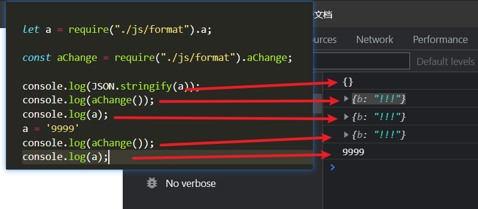
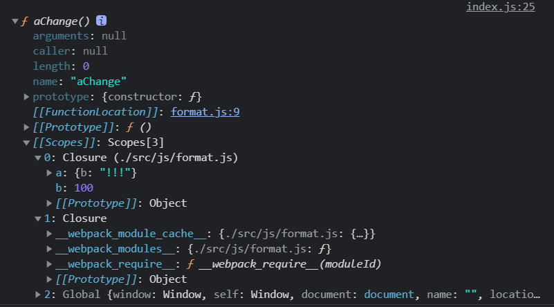

### 0 前言

>ESModule与 CommonJs

万变千化， 不离其中。我始终觉得很多文章说的都很有误解。

总的来说，

ESModule 将每一个js文件视为 `Module`， 一旦 export 导出的便是始终是这个js文件， 我们不管如何访问这个Module，但何处去调用， 其实始终都是访问的都是同一实例。这也是其静态性的定义出现的原因

导出的是 Module对象

而CommonJs是这样认为，运行时导出的是 exports对象

1. 他只能在运行时去加载出来， 每次require其对应文件，其 都会 module.exports对应的内容，此时才可以对应的去导出对应的内容。

   每一次都会这样来执行一遍. 

   ````js
   // CommonJS模块
   let { stat, exists, readfile } = require('fs');
   
   // 等同于
   let _fs = require('fs');
   let stat = _fs.stat;
   let exists = _fs.exists;
   let readfile = _fs.readfile;
   ````

2. 此种特性， 故大家都会说 CommonJs是值的拷贝。但值的拷贝也会有深拷贝与浅拷贝。

   CommonJs可能最开始希望就是每次都可以维护同一份单独的实例，但奈何前端不支持真正的CommonJs模块，故会有一份缓存， 而改变引用对象的地址，也会导致CommonJs此模块的改变。


> 总

1. 但不管如何看待， 真正模块化的原因 是因为 我们存放了一个全局对象， 不管是 Commonjs还是ESModule

2. 两者的本质区别就在于 导入的时候 导入方式与调用方式的不同。

3. ESModule相对而言很简单， CommonJS会更加复杂。

   `CommonJs确实是对象的引用`， 但每次对象的值都会经过一次赋值的过程，这才是最本质的区别。

   

### 1 ESModule

> ESMoudule是按显示导出的（静态的）

#### 导出

1. 单个导出

   ```js
   export const name;
   export const fn = () => {};
   ```

2. 混合导出

   > `一个模块，只能有一个default`

   ```js
   # 这不是导出一个对象，是放置要导出的变量的引用列表
   export { name, fn };     
   
   # 导出一个对象
   export default { num3 };
   
   # 导出时, 可以给变量起别名
   export {
   	name as fName
   }
   
    ❌ 这是一个十分低级的错误语法: export a; 
   ```

#### 导入

导入 相当于 const （这是一种const声明语句）

1. 单独导入

   ````js
   import { name, age } from './index.js'
   
   import { name as lName } from '';
   
   import * as all from './index.js'
   
   import lsh from '';
   ````
   
2. 混合导入

   + 若变量名使用default 那么必须要使用as （default是保留字）

   ```js
   import msg, {name, age} from './index.js'
   
   import { default as all, name, age } from './index.js'
   ```


   #### ⭐ 注意事项

`import`是`静态执行`，所以不能使用表达式和变量，这些只有在运行时才能得到结果的语法结构

   ```javascript
      // 报错 使用了表达式, 无法编译
      import { 'f' + 'oo' } from 'my_module';
      
      // 报错 使用了变量， 无法编译
      let module = 'my_module';
      import { foo } from module;
      
      // 报错 使用了表达式 在运行时 无法进行import的操作!
      if (x === 1) {
        import { foo } from 'module1';
      } else {
        import { foo } from 'module2';
      }
   ```

多次加载import的时候只会执行一次！

 `export` 与 `export default `的用法

>`不是导出一个对象，是放置要导出的变量的引用列表（静态语法分析过程）`

- 本质上 `export default`就是输出一个叫做`default`的变量或方法

  ```javascript
  import { default as foo } from 'modules';
  等价的关系
  import foo from 'modules';
  ```

#### 解释

网上一些人对ESMoudle的解释真的是强行以概念在讲述概念。、

⭐ 简而言之，【拷贝的是引用类型（ECMAScript中的reference）的值，可以解释一切问题】

ECMAScript的reference或许你可以认为是内存地址。

- 模块里面的变量绑定其所在的模块，等到脚本真正执行时，再根据这个只读引用，到被加载的那个模块里面去取值。

  JS 引擎对脚本静态分析的时候，遇到模块加载命令`import`，相当于const声明语句。

  1. ESModule拷贝的是值的引用（此处值的引用，指JS引擎实现上的引用类型）
  2. ES6 模块是动态引用（JS本身便是一门动态语言）、但也有静态编译分析（JS也存在静态语法分析）的过程

- ES6 模块不会缓存运行结果，而是动态地去被加载的模块取值

  当你每一次遇到 标识符的时候，JS语言总是会这么处理，这是语言特性的事情，即JS是动态语言。

  我觉得这句话完全可以删除掉，因为它在强行地复杂化的去描述ES6模块。

- `export`通过接口，输出的是同一个值。`不同的脚本加载这个接口，得到的都是同样的实例。`

  这句话是在讲述，JS引擎实现上对【右值】的处理，既然是【reference】故显然每次都是相同的实例。

  但你应该清楚，这句话是在讲述： 这个reference（引用类型）的物理地址是不能变更的。相当于【const】

  还是在讲述【拷贝的是值的引用】这件事情。

  1. 话句话说话，你每次访问一个 const声明的变量，是不是也都是得到的是一个同样的实例呢？

### 2 CommonJs

简而言之， 导出 一个exports对象， 外部再获取这个exports对象，仅此而已。

⭐ 拷贝的是引用类型（JS语言类型），故而基本类型是浅拷贝、引用类型是深拷贝

CommonJS 模块就是对象，输入时必须查找对象属性。

1. 基于Node环境使用！
2. 浏览器是不识别` module` 与 `require`的
3. `即对象`，你可以去修改其引入的值,但会导致之前导出的单值引用被覆盖

#### 导出

不建议省略`module`的写法 => 因为 module的存在标识了他是CommonJS

````js
exports = {}; // 省略写法

module.exports.name = xxx; // 不省略 module的写法
````

> ❓ 什么是 module.exports ?

加载某个模块，其实是加载该模块的`module.exports`属性

```js
var x = 5;
var addX = function (value) {
  return value + x;
};
module.exports.x = x;
module.exports.addX = addX;

PS: exports.x = x; 也没有任何问题 => Node为每个模块提供一个exports变量，指向module.exports
```

#### 导入

````js
let a = require('./index.js')


// CommonJS模块
let { stat, exists, readfile } = require('fs');

// 等同于
let _fs = require('fs');
let stat = _fs.stat;
let exists = _fs.exists;
let readfile = _fs.readfile;
````

> 上面代码的实质是整体加载`fs`模块（即加载`fs`的所有方法），生成一个对象（`_fs`），然后再从这个对象上面读取 3 个方法。这种加载称为“运行时加载”，因为只有运行时才能得到这个对象，导致完全没办法在编译时做“静态优化”。
>
> 即 只有得到了js模块， 或者时我们才可以获得到。

❓ 什么是 require

> **`require` 命令的基本功能是，读入并执行一个 js 文件，`然后返回该模块的 exports 对象`。如果没有发现指定模块，会报错。**

- `缓存的特性`

  第一次加载某个模块时，Node.js 会缓存该模块。以后再加载该模块，就直接从缓存取出该模块的 `module.exports` 属性。 第二次 require 模块A时，不会重新加载并执行模块A。而是直接返回了第一次 require 时的结果

- CommonJs加载机制

  CommonJS 模块的加载机制是，`require` 的是被导出的值的`赋值`。拷贝说的不对， 赋值更加的确切。

一旦导出一个值，模块内部的变化就影响不到这个值 。不过若是同一地址，另谈。

所以这句话其实是有问题的。

> 看一下此示例



`为什么导出一个值， 模块内部变化就不会影响这个值`？

- 这是值的拷贝、既然是拷贝，两者就毫无关系了。



### 3、进阶

#### 1 ESModule的静态化优点

ES6 模块的设计思想是尽量的静态化，使得编译时就能确定模块的依赖关系，以及输入和输出的变量。

CommonJS 和 AMD 模块，都只能在运行时确定这些东西。比如，CommonJS 模块就是对象，输入时必须查找对象属性。

> CommonJS模块

```js

let { stat, exists, readfile } = require('fs');

// 等同于
let _fs = require('fs');
let stat = _fs.stat;
let exists = _fs.exists;
let readfile = _fs.readfile;
```

上面代码的实质是整体加载`fs`模块（即加载fs的所有方法），生成一个对象（fs），然后再从这个对象上面读取 3 个方法。这种加载称为“运行时加载”，因为只有运行时才能得到这个对象，导致完全没办法在编译时做“静态优化”。即【treeShaking】

> ESModule模块

```javascript
import { stat, exists, readFile } from 'fs';
```

- ES6 模块不是对象，而是通过`export`命令显式指定输出的代码，再通过`import`命令输入。

  这是一种声明手段。

#### 2、 第一个例子

我们使用了 export 导出， ESModule的方式导出， 这是静态的。

我们导出的内容只是一个module的地址， 故是需要结构赋值的。


1. 不解构赋值也可以 反正我们使用的都是


2. import() 正确使用

   这完全就是一个错误的语法！ 不应该出现的这种错误，这返回的就是一个`Promise`

   import() 相当于是 一个函数！这个函数目的是异步的加载模块！

   

   ````js
   # 正确的应该是这样的syntax
   import {
     sum
   } from './js/math.js'
   ````

   首先 应该明白`import()`  => returns a Promise

   ⭐正确的写法

   ```cpp
   import("./specifier.js").then(
   	res => { res.sum(10 ,200) }
   )
   ```


 ❌ 错误的方式示范:


> 出现的原因 是因为 导出的方式为 `export default`，这只是一个语法糖的写法
>
> > 本质是 export {  sum as default   }
>
> ```js
> import a from 'math.js';
> 
> import { default as a } from 'math'; // 语法糖
> ```
>
> 但 若用 require回报错的原因 则是因为 require 并不能将 `default` 使用 import自带的语法糖效果， 
>
> - 这也是你混用了 esmodule、commonjs所带来的隐患
>
> 所以 由于这层混用的关系， require在这种情况 应该: 
>
> 
>
> ````js
> const a = require('./js/math.js').default;
> ````

