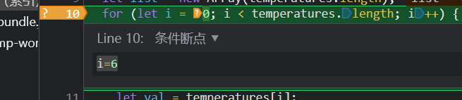

### 01 | alt + click

直接展开所有的子dom

### 命令行

> screen + shift + p  唤醒chrome浏览器的命令行

1.  screen

   你在命令行输入screen 便可以看到相关功能键。你可以实现对节点的截图了

2. dock

   通过dock来调整dock的位置【即控制台】

### CSS调试

1. 颜色代表

   橙色 代表 外间距 margin

   绿色 代表 内间距 padding 

2. crtl + f

   - 你在elemnts面板通过搜索可以查找对应dom节点

   - 你更可以使用选择器来选择它们
   - //section/p 查找dom树 section标签下寻找p标签

3. 你可以通过控制台去寻找节点

   ```js
   inspect(document.querySelector(p))
   ```

4. computed面板

   此处列出所有样式生效的内容。 不管你是class还是style

   点击 此处 ''=>'' 便可以进行快速的定位到其style面板

   若是父元素继承 => 你应该勾选其show all。 否则继承属性在 computed默认不显示

5. layout面板

   1. grid 网格布局

      他会列出所有grid布局的容器

   2. flex 弹性盒子布局容器

      注意： style面板中flex容器其 右侧有小按钮， 你可以通过这个按钮进行 flex布局快速变更。

6. 绑定事件

   Event Listeners

7. properties

   你可以通过elemtns的子面板查看其dom属性

### consle

> crtl + shift + j  => 快速调出控制台
>
> shift + enter可以换行！！

1. 你可以快速打印dom节点 比如 $0 前提你应该选择一个dom节点。

   ```js
   console.dir($0)
   ```

2. console.group

   console.groupEnd()

3. console.time

   console.timeEnd()

### debugger

#### 1 默认显示 paused in debugger

对应有显示标签【debugger paused】告知我们暂定的原因

#### 2 打断点

你可以在 Source面板 对应行上左侧打出断电。并使用 【播放】来跳转断点

对应有显示标签【paused on breakpoint】


#### 3 watch监听变量


#### 条件断点

> i = 6 
>
> 而不是 i === 6 切记！



