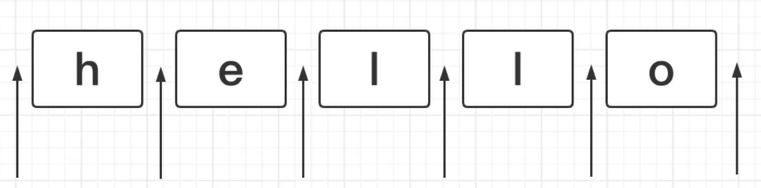
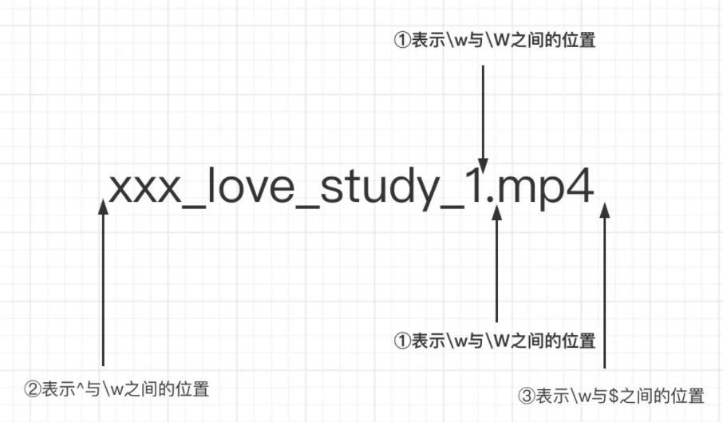
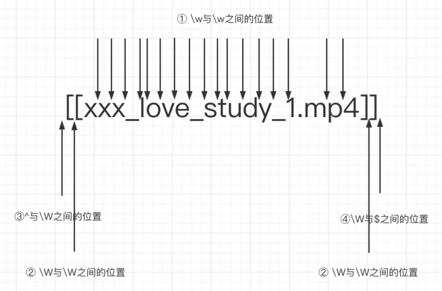
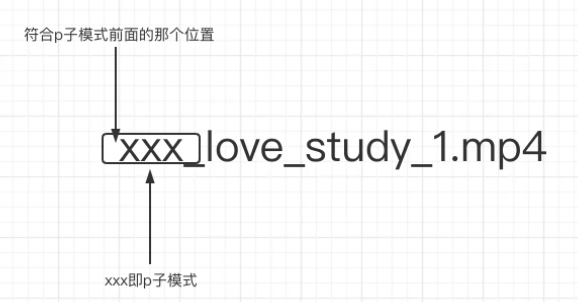

什么是正则表达式？

> 一种被用于从文本中检索符合某些特定模式的`文本`
>
> 1. 正则表达式本身就是文本
>2. 这种文本是有特定的模式的
> 3. 是用  /  ...    /  来标识  正则表达式。 
> 
> 参考文章: 
>
> https://juejin.cn/post/7021672733213720613?share_token=0c3d0a08-89d9-462e-b560-e6dba08d6e47#heading-20

## 一  位置匹配

⭐ 正则表达式是`匹配模式`，要么`匹配字符`，要么`匹配位置`

⭐ 正则表达式是`匹配模式`，要么`匹配字符`，要么`匹配位置`

⭐ 正则表达式是`匹配模式`，要么`匹配字符`，要么`匹配位置`

### 1.1 什么是位置？

匹配位置与匹配字符是两回事， 如以下功能的时候会涉及字位置的概念，

对于字符来说，匹配的便是字符本身

> 如以下场景，都需要判断其位置。
>
> - 千分位分割法: 将123456789转化为123,456,789
> - 手机号3-4-4: 18379836654转化为183-7983-6654

1. 什么是位置？位置可以理解为**相邻字符之间的位置**



```js
#位置       👇		 👇        👇		  👇		  👇		 👇
'hello' === '' + 'h' + '' + 'e' + '' + 'l' + '' +  'l' + '' + 'o' + ''
#字符				👆		   👆		  👆          👆		 👆
```

### 1.2 判断位置

> ^、$、\b、\B、?=p、(?!p)、(?<=p)、(?<!p)

##### 1.  ^

术语： 脱字符

功能： 匹配位置，匹配开头的位置

```js
console.log('hello'.replace(/^/, '😄'))
			
		    👇
'hello' === '' + 'h' + '' + 'e' + '' + 'l' + '' +  'l' + '' + 'o' + ''
```

##### 2. $

功能： 匹配位置，匹配结尾的位置

```js
console.log('hello'.replace(/$/, '😄'));

		    													    👇
'hello' === '' + 'h' + '' + 'e' + '' + 'l' + '' +  'l' + '' + 'o' + ''
```

##### 3. \b 

术语： 单词边界

功能： 匹配位置， 顾名思义定位单词边界

⭐ 单词边界，反倒是将 开头与结尾处的位置，不看做 单词。

- \w 与 \W =>  顾名思义单词边界

  【字母，数字或下划线字符】 与 【非字母、数字或下划线字符】的位置

  ````js
  'hell$'.replace(/\b/g, '❤️')
  
  '❤️hell❤️$'
  
  
  👇										     👇	
  '' + 'h' + '' + 'e' + '' + 'l' + '' +  'l' + '' + '$' + ''
  												  # 此处已然是非单词边界区域了
  ````

- ^ 与 \w

  "_" 也属于 \w 匹配范围，切记！

- $ 与 \w

  ```js
  
  xxx_love_study_1.mp4，=>  ❤️xxx_love_study_1❤️.❤️mp4
  'xxx_love_study_1.mp4'.replace(/\b/g, '❤️')
  
  '192.182.200.333'.replace(/\b/g, '😀') => '😀192😀.😀182😀.😀200😀.😀333😀'

  # 我们讨论的是 g 模式下尽可能匹配的位置
  			👇													    👇
  'hello' === '' + 'h' + '' + 'e' + '' + 'l' + '' +  'l' + '' + 'o' + ''
  
  '' + 'h' + '' + '&' + '' + 'l' + '_' +  'l' + '' + 'o' + ''
  ```
  
  详看此关系



##### 4. \B 

术语：非单词边界

功能： 匹配位置

⭐ 非单词边界，反倒是将 开头与结尾处的位置，看作了单词。

- \w与\w之间的位置  
- \W与\W之间的位置  
- ^与\W 之间的位置、\W与$之间的位置 

```js
'[[xxx_love_study_1.mp4]]'.replace(/\B/g, '❤️');
'❤️[❤️[x❤️x❤️x❤️_❤️l❤️o❤️v❤️e❤️_❤️s❤️t❤️u❤️d❤️y❤️_❤️1.m❤️p❤️4]❤️]❤️'

'[xxx_love_study_1.mp4]'.replace(/\B/g, '❤️')
'❤️[x❤️x❤️x❤️_❤️l❤️o❤️v❤️e❤️_❤️s❤️t❤️u❤️d❤️y❤️_❤️1.m❤️p❤️4]❤️'

'xxx_love_study_1.mp4'.replace(/\B/g, '❤️')
'x❤️x❤️x❤️_❤️l❤️o❤️v❤️e❤️_❤️s❤️t❤️u❤️d❤️y❤️_❤️1.m❤️p❤️4'
```



##### 5. (?=p) 

> 术语: 正向先行【零宽】断言
>
> 符合p子模式前面的那个位置: `有一个位置，紧跟其后需要满足p子模式`

```js
'xxx_love_study_1.mp4'.replace(/xxx/, '❤️') // ❤️_love_study_1.mp4

'xxx_love_study_1.mp4'.replace(/(?=xxx)/g, '❤️')  => '❤️xxx_love_study_1.mp4'


# 其三个字符都满足我的要求, 故我要选中之前的那个位置
       👇  👇  👇
		x 	x 	x 	_love_study_1.mp4
```



##### 6 (?!p) 

术语： 负向先行【零宽】断言。

功能： 匹配位置， 负向 就是反义词， 先行 就是取前面的位置

可以理解为(?=p)匹配到的位置之外的位置都是属于(?!p)的，它也有一个学名叫负向先行断言。

- 正向的相反 

```js
'xxx_love_study_1.mp4'.replace(/(?!xxx)/g, '❤️')

'x❤️x❤️x❤️_❤️l❤️o❤️v❤️e❤️_❤️s❤️t❤️u❤️d❤️y❤️_❤️1❤️.❤️m❤️p❤️4❤️'
```

##### 7 (?<=p) 

正向后行【零宽】断言 

有一个位置，其前面需要满足p子模式。 

- ?<= 代表的是 我要匹配的p在后面了

```js
'xxx_love_study_1.mp4'.replace(/(?<=xxx)/g, '❤️') //xxx❤️_love_study_1.mp4
```

##### 8 (?<!p)

与 【 (?<=p)  】 相反。

### 1.3 三个题目

1. 题目1：数字的千分位分割法3， ⭐ 请牢记这道题目, 以理解正向先行断言

   ```js
   '123456789'.replace(/(?=(\d{3})$)/g, '😊') => 123456😊789
   
   # + 代表的一次 或 多次
   /*
   	❗此处虽然是寻找位置，但更多的是在字符串的层面上去筛选。
   	⭐ 请记住这个思路
       第一次匹配到123456789，即三组数字， 因此1前面加
       23456789不满足
       3456789不满足
       第二次匹配到456789，即两组数字， 因此4前面加 😊
       56789不满足
       6789不满足
       第三次匹配到789，即三组数字， 因此7前面加 😊
   	89不满足
   	9不满足
   */
   '123456789'.replace(/(?=(\d{3})+$)/g, '😊'); => '😊123😊456😊789'
   
   # 但是这个位置不能是^首位 (?!^) 
   '123456789'.replace(/(?!^)(?=(\d{3})+$)/g, '😊');  => '123😊456😊789'
   ```

   - (?!^)除了首位的位置任何位置都可以。

     多个 （）存在时候，强调的是同时满足其条件！

     ````js
     '123456789'.replace(/(?=(\d{3})+$)(^)/g, '😊');
     ````

     1. 小括号的妙用是这样的
     2. (?!) 负向正行零宽断言

2. 题目2： 手机号分隔

   ```js
   '17625936435'.replace(/(?=(\d{4})+$)/g, '-') => '176-2593-6435'
   ```

3. 题目3： 手机号3-4-4分割扩展

   我们希望如此效果 => 用户输入11位手机号的过程中把其转化为3-3-4格式

   ```js
   123 => 123
   1234 => 123-4
   12345 => 123-45
   123456 => 123-456
   1234567 => 123-4567
   12345678 => 123-4567-8
   123456789 => 123-4567-89
   12345678911 => 123-4567-8911
   ```


## 二、 字符串匹配

### 1 两种模糊匹配

- 横向匹配

  【量词】便可以实现横向的匹配，一个正则可匹配的字符串的长度不是固定的，可以是多种情况

  1. +
  2. *
  3. ?
  4. { m, n}

  ```js
  let reg = /ab{2,5}c/g
  let str = 'abc abbc abbbc abbbbc abbbbbc abbbbbbc'
  str.match(reg) // [ 'abbc', 'abbbc', 'abbbbc', 'abbbbbc' ]
  ```

- 纵向匹配 -> ⭐ 使用 中括号的方式，进行纵向的匹配。

  到达某一位的字符时，不确定是某一位的字符串，可以有多种可能。

  纵向匹配规则 为 【 字符组、多选分支 】

  ```js
  let reg = /a[123]b/g
  let str = 'a0b a1b a2b a3b a4b'
  str.match(reg) // [ 'a1b', 'a2b', 'a3b' ]
  ```

### 2 字符组

#### 2.1 字符组写法

虽然是字符组，但其实只能匹配一个字符。

```js
[123456abcdefABCDEF] => [1-6a-fA-F]
```

#### 2.2 排除字符组

```js
[^abc] // abc都不可以是 ^a ^b ^c
```

#### 2.3 简写形式

字符组的简写如下

```js
\d // 数字
\D // 非数字
\w // [0-9a-zA-Z_]
\W // [^0-9a-zA-Z_]
\s // [\t\v\n\r\f]   匹配空格符
\S // [^\t\v\n\r\f]  匹配非空格符：`[^\s]`
```

### 3 量词

```js
1. {m,} // 至少出现m次
2. {m} // 出现m次
3. ? // 出现0次或者1次，等价于{0,1}    
4. + // 至少出现1次,等价于{1,} 
5. * // 出现人一次,等价于{0,}  
```

### 4 贪婪匹配 VS 惰性匹配

> 正则本身是贪婪的，会尽可能的多匹配符合模式的字符

```js
let regex = /\d{2,5}/g
let string = '123 1234 12345 123456'
// 贪婪匹配
// string.match(regex) // [ 123, 1234, 12345, 12345 ]

// 惰性匹配
let regex2 = /\d{2,5}?/g
// string.match(regex) // [ 12, 12, 34, 12, 34, 12, 34, 56  ]
```

惰性匹配:   `量词后面加一个？，即变成了惰性匹配`

```js
贪婪量词          惰性量词
{m,n}            {m,n}?
{m,}             {m,}?
?                ??
+                +?
*                *?  
```

---

### 5 多选分支

> 多选分支并非量词。
>
> *分支结构是惰性的*

一个模式可以实现横向和纵向的模糊匹配，而多选分支可以支持多个子模式任选其一，形式是(p1|p2|p3)

```js
let regex = /good|nice/g
let string = 'good idea, nice try.'

// string.match(regex) // [ 'good', 'nice' ]
```

### 6 题目

1. id的匹配

   ```js
   # 取消贪婪
   '<html id="1000" class="qwe">'.match(/id=".*?"/)
   let regex = /id="[^"]*"/ 
   let string = '<div id="container" class="main"></div>'; 
   ```

2. HH:SS的匹配

   ````js
   let regex = /^([01]\d|2[0-3]):[0-5]\d$/
   console.log(regex.test('23:59')) // true
   # 也可非0
   let regex = /^(0?\d|1\d|2[0-3]):(0?|[1-5])\d/
   console.log( regex.test("7:09") ) // true
   ````

3. 匹配日期

   ```js
   let regex = /\d{4}-(0\d|1[0-2])-(0[1-9]|[12]\d|3[01])/
   ```

## 三、括号的神奇作用

> 如何让量词作用于一个整体？ 使用括号

```js
'ababa abbb ababab'.match(/(ab)+/g) // ["abab", "ab", "ababab"]


# 此外你可以在括号里使用分支结构
let reg = /I love (JavaScript|Regular Expression)/
console.log(reg.test('I love JavaScript')) // true
console.log(reg.test('I love Regular Expression')) // true
```

### 1. 分组引用

> 通过括号创建子表达式，可以进行数据提取和强大的替换操作，
>
> 也可以通过js来引用分组内容

```js
/*
提取年月日
2021-08-14
*/

let reg = /(\d{4})-(\d{2})-(\d{2})/

console.log('2021-08-14'.match(reg))
//  ["2021-08-14", "2021", "08", "14", index: 0, input: "2021-08-14", groups: undefined]

// 第二种解法,通过全局的$1...$9读取 引用的括号数据
let reg = /(\d{4})-(\d{2})-(\d{2})/
let string = '2021-08-14'

reg.test(string)

console.log(RegExp.$1) // 2021
console.log(RegExp.$2) // 08
console.log(RegExp.$3) // 14
```

### 2. 数据替换

```js
/*
提取年月日
2021-08-14
*/

let reg = /(\d{4})-(\d{2})-(\d{2})/

console.log('2021-08-14'.match(reg))
//  ["2021-08-14", "2021", "08", "14", index: 0, input: "2021-08-14", groups: undefined]

// 第二种解法,通过全局的$1...$9读取 引用的括号数据
let reg = /(\d{4})-(\d{2})-(\d{2})/
let string = '2021-08-14'

reg.test(string)

console.log(RegExp.$1) // 2021
console.log(RegExp.$2) // 08
console.log(RegExp.$3) // 14
```


## 四、元字符

|      |       | 描述                                                       |
| ---- | :---- | :--------------------------------------------------------- |
| 1    | .     | 匹配除换行符以外的任意字符。                               |
| 2    | [ ]   | 字符类，匹配方括号中包含的任意字符。                       |
| 3    | [^ ]  | 否定字符类。匹配方括号中不包含的任意字符                   |
| 4    | *     | 匹配前面的子表达式零次或多次                               |
| 5    | +     | 匹配前面的子表达式一次或多次                               |
| 6    | ?     | 匹配前面的子表达式零次或一次，或指明一个非贪婪限定符。     |
| 7    | {n,m} | 量词。 [n, m)    {3}  {3, 5}也是可以的                     |
| 8    | (xyz) | 字符组，按照确切的顺序匹配字符 xyz。                       |
| 9    | \|    | 分支                                                       |
| 10   | \     | `转义符`，允许你匹配保留字符 `[ ] ( ) { } . * + ? ^ $ \ |` |
| 11   | ^     | 匹配行的开始                                               |
| 12   | $     | 匹配行的结束                                               |

---

| .    | 匹配除换行符以外的任意字符                                   |
| ---- | ------------------------------------------------------------ |
| \w   | 匹配所有字母和数字的字符：`[a-zA-Z0-9_]`   字母、数字、下划线 |
| \W   | 匹配非字母和数字的字符：`[^\w]`， 即为特殊符号、与汉字       |
| \d   | 匹配数字：`[0-9]`   英语为 digit                             |
| \D   | 匹配非数字：`[^\d]`                                          |
| \s   | 匹配空格符：`[\t\n\f\r\p{Z}]`                                |
| \S   | 匹配非空格符：`[^\s]`                                        |

#####  基本概念        


基本用法

- reg.text(str);   返回true与false
- str.match(reg);   返回详情信息
- str.replace

https://regex101.com/

- 2 使用对象创建正则表达式

  对象创建的，其实帮我们简写了/reg/flag前面的反斜杠！做了一次转译而已

```javascript
#1 示范1
var param = 3; 
var reg = new RegExp("^[0-9]+"+param+"[a-z]+$","g"); ✔ //得到：/^[0-9]+3[a-z]+$/

# 示范二
let str = '一二三四五六';
let a = '一';
let reg = new RegExp(a, 'g');
console.log(reg.test(str));

# 正则的拓展
// 了解一个替换的语法
"abcdefg".replace(/\w/g, item => { return 'a'; })    这个函数返回aaaaaaa


var reg = new RegExp('a', 'g');
div.innerHTML = div.innerHTML.replace(reg, search => {
    return '<span style="color: red">${search}</span>'
})
// 将页面显示中， 字符串有a的变红色
```

##### 1 regExp符号

1. 字符边界

   \b` 匹配单词的开始与结束!  即 【`单词边界`】

   其本身不占 字符/

   `【0-9|a-Z|_】`, 其范围要比/w要小一些，/w毕竟也可以匹配汉字！

4. 模式修正符`

   1. i 	=> `不敏感匹配`   匹配时不区分大小写。

   2. g    => `全局匹配`

   3. m    => `多行模式`， 每一行单独处理

      ```js
      更改^和$的含义，使它们分别在任意一行的行首和行尾匹配，而不仅仅在整个字符串的开头和结尾匹配。(在此模式下,$的精确含意是:匹配\n之前的位置以及字符串结束前的位置.)
      ```

   4. s => `单行模式`

      更改.的含义，使它与每一个字符匹配（包括换行符\n）。

   5. u 宽字符匹配， 可以识别汉字

   6. I 忽略空白 忽略表达式中的非转义空白并启用由#标记的注释。

   7. y 一直要满足我的条件，应用场景比较少，匹配大量内容时可以提高效率

`反义`

1. \W 

   ```js
   /[^(A-z)^(0-9)^_^(汉字)]/;   // 汉字没法表示，用这个代表了！
   ```

2. \S

   ````js
   /[^ ]/
   \S+匹配不包含空白符的字符串。
   ````

3. \D

   ```js
   /[^(0-9)]/
   ```

4. \B

   ```js
   长度为0， 只是一个标识作用。
   \b的含义是 判断是否是连续的单词与数字或_
   \B则是 则是判断是否 不是连续的单词与数字或_
   ```

5. 取反

   ```js
   [^x]
   [^aeiou]	
   <a[^>]+>匹配用尖括号括起来的以a开头的字符串
   ```

##### 2 regEep方法

`正则对象`

1. `exec()`
2. `test（）`

----

`字符串`的正则方法

1. `match()`
2. `replace()`
3. `search()`
4. `split()`

例子：

`正则对象`👇

```js
#1  exec
var hd = 'houderen';
var reg = /\w/g;
// exec返回一个数组，其中存放匹配的结果， 若不存在， 则返回null
while((res = reg.exec(hd))) { 
  console.log(res);
}
// 打印结果 👇
test.js:8 ["h", index: 0, input: "houderen", groups: undefined]0: "h"groups: 
test.js:8 ["o", index: 1, input: "houderen", groups: undefined]0: "o"groups: 
test.js:8 ["u", index: 2, input: "houderen", groups: undefined]0: "u"groups: 
test.js:8 ["d", index: 3, input: "houderen", groups: undefined]0: "d"groups: 
test.js:8 ["e", index: 4, input: "houderen", groups: undefined]0: "e"groups: 
test.js:8 ["r", index: 5, input: "houderen", groups: undefined]0: "r"groups:
test.js:8 ["e", index: 6, input: "houderen", groups: undefined]0: "e"groups:


当没有全局的变量g时，由于index和lastindex的值不会变化（除非手动修改），
则会导致每次的陪匹配都是从字符串的头开始的，
所以只要字符串中有匹配，就会导致死循环，当时设置g后，
会自动改变前面的两个属性，会依次向后匹配直到没有匹配项退出循环

----------------------------------------------------------------------------------------
# 可以打印下， 比较一下 exec 与 match的真正应用场合！
var str = "abc_d,123-中*文_d3=efg汉字a";
var reg = /[\s\S]\b/g;
while(res = reg.exec(str)) {
  console.log(res);  // 9条数组
}
console.log('--------------');
console.log(str.match(reg)) // ["d", ",", "3", "文", "3", "=", "g", "字", "a"]
```

`String`👇

1. `match`的用法主要区分就是,正则表达式是否有全局标示g， 有g返回子匹配！

```js
# match 
1 如果有g全局标志,那么返回的数组保存的是,所有匹配的内容，不包括子匹配!!!!

2 如果没有g全局标志,那么返回的数组arr.!!!
	arr[0]保存的是完整的匹配.
	arr[1]保存的是第一个括号里捕获的字串,
    依此类推arr[n]保存的是第n个括号捕获的内容
    也就是当包含有全局的标志时则返回的结果第一个是正确匹配的结果，后面依次是子匹配的结果


# 示范  无g情况
无g情况会变得【复杂】！（【exec】可以说就是无g情况下的match）
		var str = '123456789000000';
        var reg = /(123)(\d{3})(789)/;
        console.log(str.match(reg));
打印结果为
    ["123456789", 		arr[0]保存的是完整的匹配.
     "123", 	  		arr[1]保存的是第一个括号里捕获的字串,
     "456", 	  		arr[2]保存的是第一个括号里捕获的字串,
     "789", 
     index: 0, 
     input: "123456789", 
     groups: undefined]

#示范二 有g情况
    var str = '12345678900000';
    var reg = /(123)(\d{3})(789)/g;
    console.log(str.match(reg));
								那么返回的数组保存的是,所有匹配的内容		["123456789"]
 
```

##### 3 后向引用（捕获 与 反捕获）

1. 使用小括号 => 指定子表达式 => `匹配子表达式的文本值`

   会对 子表达式分组， 自左向右会给他们组号， 从1开始， 2，3，4依次类推

2. `反向引用的目的`：重复搜索前面某个分组匹配的文本！

3. 捕获方法1： `\1`转义数字代表组别编号

4. 捕获方法2： `?<XXX>`捕获语法， 反捕获语法 `\k<word>` 目的： 指定表达式的组别

   ```js
   \b(\w+)\bs+\1\b    注意此处 \1 指的就是\b(w+)\b, 一般而言指括号内的，但由于有 其他符号修饰
   👆 	意义： 匹配重复两次的单词， 比如go go， to to
   
   也可以这样写!自己手动起一个表达式的组名，不用转义数字表示组了
   \b(?<word>\w+)\bs+\k<word>\b
   ```

##### 4 零宽断言(寻找)

1. 目的： 查找内容之前或之后的东西

2. 它只是一个零宽度的修饰， 类似于\b, $, ^这类修饰符

3. 零宽先行断言： `(?=exp)`

   目的： 判断自身出现的位置后面能否匹配表达式exp

   先行， 然后 再断言！

   ```js
   \b\w+(?=ing\b)  //返回了结尾是ing的以外的部分
   匹配以ing结尾的单词的前面部分(除了ing以外的部分)，
   如查找I'm singing while you're dancing.时，它会匹配sing和danc。
   ```

4. 零宽后发断言: `(?<=exp)`

   ```js
   (?<=\bre)\w+\b
   会匹配以re开头的单词的后半部分(除了re以外的部分)，
   例如在查找reading a book时，它匹配ading。
   ```

5. 假如你想要给一个很长的数字中每三位间加一个逗号(当然是从右边加起了)，

   你可以这样查找需要在前面和里面添加逗号的部分：`((?<=\d)\d{3})+\b`，

   用它对*1234567890*进行查找时结果是234567890。

   

6. 下面这个例子同时使用了这两种断言：(?<=\s)\d+(?=\s)匹配以空白符间隔的数字

   (再次强调，不包括这些空白符)。

##### 5 负零向断言

- 问题： 

  前面我们提到过怎么查找**不是某个字符或不在某个字符类里**的字符的方法(反义)。

  但是如果我们·`只是想要确保某个字符没有出现·`，但并不想去匹配它时怎么办？

- 实例： 它里面出现了字母q, 但是呢， 我们希望q后面跟的不是字母u！

  1. `负零宽断言`

     语法： `(?!exp)`

     含义： 断言此位置的后面不能匹配表达式exp

     例： 

     ​	\d{3}(?!\d)匹配三位数字，而且这三位数字的后面不能是数字

     ​	\b((?!abc)\w)+\b匹配不包含连续字符串abc的单词

  ```js
  普通写法： \b\w*q[^u]\w*\b， //包含后面不是字母u的字母q的单词
  👆
  bug: 如果q出现在单词的结尾的话，像Iraq,Benq，这个表达式就会出错
  resolve：
  	负向零宽断言能解决这样的问题，因为它只匹配一个位置，并不消费任何字符
  # answer:
  	\b\w*q(?!u)\w*\b
  
  ```

- y模式,

```js
let reg = /(\d+),?/y
reg.lastIdex = 7;
var qq = [];
while((res = reg.exec('123456731231232112312qeqwe122131312312qweqweqw12389)) {
	qq.push(res[1]);                      
}
```

例子：

- 原子组

```js
var str = '<h1>123456</h1>'
let reg = /<(h[1-6])>.+</\h\1>/i;  // 这里的\1指的是【1-6】
str.match(reg); => 其返回 一个数组， 下标0为 <h1>123456</h1>， 下标1为 原子组中额度内容 h1
用括号包住原子组
----------------------------------------------------------------------------------------
邮箱验证体验原子组
1215656702@qq.com
let reg =
    /^[\w-]+@[\w]+\.(com|org|cc|cn|net)$/i
1215656702qq@sina.com.cn
```

##### 6 regx中写注解

```js
   	  (?<=    # 断言要匹配的文本的前缀
      <(\w+)> # 查找尖括号括起来的内容
              # (即HTML/XML标签)
      )       # 前缀结束
      .*      # 匹配任意文本
      (?=     # 断言要匹配的文本的后缀
      <\/\1>  # 查找尖括号括起来的内容
              # 查找尖括号括起来的内容
      )       # 后缀结束
```

##### **”贪婪的”匹配**

- **贪婪的”匹配**，它总是尽可能多地匹配,且允许后续的正则表达式继续匹配。
- 非贪婪匹配 
  - `/a+/`:匹配”aaa”时,三个字符都被匹配,
  - `/a+?/`:匹配”aaa”时,因其尽可能少的匹配,只能匹配第一个a

##### 10 RegExp题目

- 题目

```js
一 基础练习

0 试一试在正则表达式中通过变量来控制
0 请演示一下 exec test match 这个三个函数的用法


1 基础练习(元符号练习)
	1.0 想一下， 元字符有哪些？
	1.1【数字】【空格】【任意字符，除了换行】【非特殊符号】  				例： 9 *_
	1.2【非数字】【非空格】【换行符】【特殊符号】【下划线】				例： s1/n*_
	1.3 哪些可以牵涉到一个数字呢？
    1.4 哪些可以牵涉到一个字母呢？
    1.5 哪些可以牵涉到一个特殊符号呢？ 如 *
    1.6 哪些可以 牵涉到 数字与字母呢？
    1.7 哪些可以判断 下划线呢？
    1.8 哪些可以判断 空格符号呢？
    1.9 我想任意匹配！ 除了换行符

2 限定符（选定符号）的练习
	2.1 


------------------------------------------------------------------------------------------
二 题目
1 请精确寻找 【hi】 这个单词！  hi, hiiii, hello! him,history, high!!

2 假如你要找的是hi后面不远处跟着一个Lucy

3 开头为010或020，然后是一个-，并且结尾跟着 7到8位的数字 str = '020-88888888';

4 请解释 \ba\w*\b  这个 regExp

5 请演示下 选择符的用法，匹配0个以上数字， 匹配1次或者更多次， 匹配0或一个， 
	并写出qq号regx（5到12位的数字）
6 请示范[]这个符号的妙用
	6.1 匹配任何一个英语元音字母
    6.2 使用[]来表示/w, 当然不用考虑汉字， 汉字太多了
    6.3 请解释 \(?0\d{2}[) -]?\d{8} 这个正则表达式
7 了解 | 分支用法
	7.1 	0\d{2}-\d{8}|0\d{3}-\d{7}
	7.2 	\(0\d{2}\)[- ]?\d{8}|0\d{2}[- ]?\d{8}
    7.3 	\d{5}-\d{4}|\d{5}
8 分组
	8.1 匹配类似 256.300.888.999 这种格式
9
```


- 答案

```js
一 
1
	1.1 /\w\s../
    1.2 /\D\S\n\W_/ 
---------------------------------------------------------------------------------------
二 题目
#1  请精确寻找 【hi】 这个单词！  hi, hiiii, hello! him,history, high!!
	\bhi\b
#2 假如你要找的是hi后面不远处跟着一个Lucy
	\bhi\b.*\bLucy\b
#3 
	reg = /^(010|020)-\d{7,8}$/g;
# 4 请解释 \ba\w*\b  这个 regExp
    index   expression 
    0       \b:  左边这个符号必须存在单词边界(不连续的字母数字或下划线)
    1       a:   匹配一个a
    2       \w:  [(a-z)|(0-9)|(_)|(汉字)] 原谅我用正则来解释正则, 加括号只是为了更加清楚，仅此而已
    3       *：  任意
    4       \b   同上，右边
    综上： 匹配以字母a开头的单词。
             str = 'hello,abandon！！！a bird!abnormal!';
             reg = /\ba\w*\b/g;
             console.log(str.match(reg)); 👉  ["abandon", "a", "abnormal"]
	这便是 \b的意义！
# 5 请演示下 选择符的用法
	str = '1123465789';
    reg = /^\d+$/; // 1次以上
    reg = /^\d?$/; // 0次或1次
    reg = /^\d*$/  // 任意次
	console.log(str.match(reg));
	#5.1  
		QQ号： ^\d{5,12}$
# 6 []符号
	6.1 匹配元音字母开头的单词
        str = 'ooooqwessqwe'
        reg = /^[aeiou][a-z]*$/;
        console.log(str.match(reg));
	6.2 用[]表示出/w, 不需要匹配汉字
		reg = /[0-9a-zA-Z_]/;
	6.3 \(?0\d{2}[) -]?\d{8}
    	像(010)88886666，或 022-22334455，或 02912345678等
		010)12345678或(022-87654321这样的“不正确”的格式也可以被匹配到！
#7 分支
 	7.1 	0\d{2}-\d{8}|0\d{3}-\d{7}
			0开头 两位数字 - 八位数字 或者 0开头 三位数字 - 七位数字 
	7.2 	\(0\d{2}\)[- ]?\d{8}|0\d{2}[- ]?\d{8}
    		(0 两位数字) 零个或一个 _或空格  或者
    7.3 	\d{5}-\d{4}|\d{5}
                12345-1234
                12345
			5位数字 - 4位数字  或者 5位数字
#8  理解分组的魅力
	8.1  256.300.888.999
	(\d{1,3}\.){3}\d{1,3}、
#9 

```

---

````js
//正整数
/^[0-9]*[1-9][0-9]*$/;
//负整数
/^-[0-9]*[1-9][0-9]*$/;
//正浮点数
/^(([0-9]+\.[0-9]*[1-9][0-9]*)|([0-9]*[1-9][0-9]*\.[0-9]+)|([0-9]*[1-9][0-9]*))$/;   
//负浮点数
/^(-(([0-9]+\.[0-9]*[1-9][0-9]*)|([0-9]*[1-9][0-9]*\.[0-9]+)|([0-9]*[1-9][0-9]*)))$/;  
//浮点数
/^(-?\d+)(\.\d+)?$/;
//email地址
/^[\w-]+(\.[\w-]+)*@[\w-]+(\.[\w-]+)+$/;
//url地址
/^[a-zA-z]+://(\w+(-\w+)*)(\.(\w+(-\w+)*))*(\?\S*)?$/;
或：^http:\/\/[A-Za-z0-9]+\.[A-Za-z0-9]+[\/=\?%\-&_~`@[\]\':+!]*([^<>\"\"])*$ 
//年/月/日（年-月-日、年.月.日）
/^(19|20)\d\d[- /.](0[1-9]|1[012])[- /.](0[1-9]|[12][0-9]|3[01])$/;
//匹配中文字符
/[\u4e00-\u9fa5]/;
//匹配帐号是否合法(字母开头，允许5-10字节，允许字母数字下划线)
/^[a-zA-Z][a-zA-Z0-9_]{4,9}$/;
//匹配空白行的正则表达式
/\n\s*\r/;
//匹配中国邮政编码
/[1-9]\d{5}(?!\d)/;
//匹配身份证
/\d{15}|\d{18}/;
//匹配国内电话号码
/(\d{3}-|\d{4}-)?(\d{8}|\d{7})?/;
//匹配IP地址
/((2[0-4]\d|25[0-5]|[01]?\d\d?)\.){3}(2[0-4]\d|25[0-5]|[01]?\d\d?)/;
//匹配首尾空白字符的正则表达式
/^\s*|\s*$/;
//匹配HTML标记的正则表达式
< (\S*?)[^>]*>.*?|< .*? />;
//sql 语句
^(select|drop|delete|create|update|insert).*$
//提取信息中的网络链接
(h|H)(r|R)(e|E)(f|F) *= *('|")?(\w|\\|\/|\.)+('|"| *|>)? 
//提取信息中的邮件地址
\w+([-+.]\w+)*@\w+([-.]\w+)*\.\w+([-.]\w+)* 
//提取信息中的图片链接
(s|S)(r|R)(c|C) *= *('|")?(\w|\\|\/|\.)+('|"| *|>)? 
//提取信息中的 IP 地址
(\d+)\.(\d+)\.(\d+)\.(\d+)
//取信息中的中国手机号码
(86)*0*13\d{9} 
//提取信息中的中国邮政编码
[1-9]{1}(\d+){5} 
//提取信息中的浮点数（即小数）
(-?\d*)\.?\d+ 
//提取信息中的任何数字
(-?\d*)(\.\d+)?
//电话区号
^0\d{2,3}$
//腾讯 QQ 号
^[1-9]*[1-9][0-9]*$ 
//帐号（字母开头，允许 5-16 字节，允许字母数字下划线）
^[a-zA-Z][a-zA-Z0-9_]{4,15}$ 
//中文、英文、数字及下划线
^[\u4e00-\u9fa5_a-zA-Z0-9]+$
````


````js
密码验证类
6-16位字符，区分大小写（不能是9位以下的纯数字，不含空格）:^(?!\d{6,8}$)(?! )(?=.*[a-z])(?=.*[0-9])[a-zA-Z0-9_]{6,16}$
6-16位字符，区分大小写（不能是9位以下的纯数字，不含空格），必须包含大写字母:^(?!\d{6,8}$)(?! )(?=.*[A-Z])(?=.*[a-z])(?=.*[0-9])[a-zA-Z0-9_]{6,16}$
密码不能为纯数字或字母，不少于6位:^(?![0-9]+$)(?![a-zA-Z]+$)[0-9A-Za-z]{6,}$
号码验证类
验证微信号:^[a-zA-Z]{1}[-_a-zA-Z0-9]{5,19}$
腾讯QQ号码:[1-9][0-9]{4,}
国内电话号码:\d{3}-\d{8}|\d{4}-\{7,8}
带中划线的手机号码:^[+]{0,1}(d){1,3}[ ]?([-]?((d)|[ ]){1,12})+$
普通手机号码:^1[34578]\d{9}$
普通电话、传真号码：可以“+”开头，除数字外，可含有“-”:^[+]{0,1}(d){1,3}[ ]?([-]?((d)|[ ]){1,12})+$
18位身份证号码:^(\d{6})(\d{4})(\d{2})(\d{2})(\d{3})([0-9]|X|x)$
中国邮政编码:[1-9]\d{5}(?!\d)
地址类
IP地址：(25[0-5]|2[0-4]\d|[0-1]\d{2}|[1-9]?\d).(25[0-5]|2[0-4]\d|[0-1]\d{2}|[1-9]?\d).(25[0-5]|2[0-4]\d|[0-1]\d{2}|[1-9]?\d).(25[0-5]|2[0-4]\d|[0-1]\d{2}|[1-9]?\d)
URL:[a-zA-z]+://[^\s]*
Email地址:[\w!#$%&'*+/=?^_{|}~-]+(?:.[\w!#$%&'*+/=?^_{|}~-]+)*@(?:[\w](?:[\w-]*[\w])?\.)+[\w](?:[\w-]*[\w])?
匹配数字
验证数字：^[0-9]*$
验证n位的数字：^\d{n}$
验证至少n位数字：^\d{n,}$
验证m-n位的数字：^\d{m,n}$
验证零和非零开头的数字：^(0|[1-9][0-9]*)$
验证有两位小数的正实数：^[0-9]+(.[0-9]{2})?$
验证有1-3位小数的正实数：^[0-9]+(.[0-9]{1,3})?$
验证非零的正整数：^\+?[1-9][0-9]*$
验证非零的负整数：^\-[1-9][0-9]*$
验证非负整数（正整数 + 0） ^\d+$
验证非正整数（负整数 + 0） ^((-\d+)|(0+))$
验证长度为3的字符：^.{3}$
验证由26个英文字母组成的字符串：^[A-Za-z]+$
验证由26个大写英文字母组成的字符串：^[A-Z]+$
验证由26个小写英文字母组成的字符串：^[a-z]+$
验证由数字和26个英文字母组成的字符串：^[A-Za-z0-9]+$
验证由数字、26个英文字母或者下划线组成的字符串：^\w+$
验证用户密码:^[a-zA-Z]\w{5,17}$ 正确格式为：以字母开头，长度在6-18之间，只能包含字符、数字和下划线。
验证是否含有 ^%&',;=?$\" 等字符：[^%&',;=?$\x22]+
验证汉字：^[\u4e00-\u9fa5],{0,}$
验证Email地址：^\w+[-+.]\w+)*@\w+([-.]\w+)*\.\w+([-.]\w+)*$
验证InternetURL：^http://([\w-]+\.)+[\w-]+(/[\w-./?%&=]*)?$ ；^[a-zA-z]+://(w+(-w+)*)(.(w+(-w+)*))*(?S*)?$
验证电话号码：^(\(\d{3,4}\)|\d{3,4}-)?\d{7,8}$：--正确格式为：XXXX-XXXXXXX，XXXX-XXXXXXXX，XXX-XXXXXXX，XXX-XXXXXXXX，XXXXXXX，XXXXXXXX。
验证身份证号（15位或18位数字）：^\d{15}|\d{}18$
验证一年的12个月：^(0?[1-9]|1[0-2])$ 正确格式为：“01”-“09”和“1”“12”
验证一个月的31天：^((0?[1-9])|((1|2)[0-9])|30|31)$ 正确格式为：01、09和1、31。
整数：^-?\d+$
非负浮点数（正浮点数 + 0）：^\d+(\.\d+)?$
正浮点数 ^(([0-9]+\.[0-9]*[1-9][0-9]*)|([0-9]*[1-9][0-9]*\.[0-9]+)|([0-9]*[1-9][0-9]*))$
非正浮点数（负浮点数 + 0） ^((-\d+(\.\d+)?)|(0+(\.0+)?))$
负浮点数 ^(-(([0-9]+\.[0-9]*[1-9][0-9]*)|([0-9]*[1-9][0-9]*\.[0-9]+)|([0-9]*[1-9][0-9]*)))$
浮点数 ^(-?\d+)(\.\d+)?$
其他
手机号码中间四位用*代替

function encryptPhone(val){
    if(!val) return;
    return val.replace(/^(\d{3})(\d{4})(\d+)/, '$1****$3')
}

encryptPhone('13173786224'); // 131****6224
格式化金额

var money = 1003450.89;
console.log(money.toString().replace(/(?=\B(?:\d{3})+\b)(\d{3}(?:\.\d+$)?)/g,',$1'));
// 1,003,450.89
JS替换字符串中的空格

var reg = /([^\s])\s+([^\s\b])/g;
var str = " 中国  北京   朝阳区  df "; 
str = str.replace(reg, "$1%$2")
不允许输入如下字符: (像 !@#$%^& 等)*

var userName = $("#userRegistName").val(); 
var first = userName.charCodeAt(0); 
function CheckUserNameFormat(){
    if ((first>=65 && first <= 90)||(first>=97 && first <=122)){
    var pattern =/^[A-Za-z0-9_]+$/;  //首字母必须是A-Z或者a-z
    if(pattern.test(userName)){ 
         ......
    }
} 
tips
匹配中文字符：[\u4e00-\u9fa5]
````

