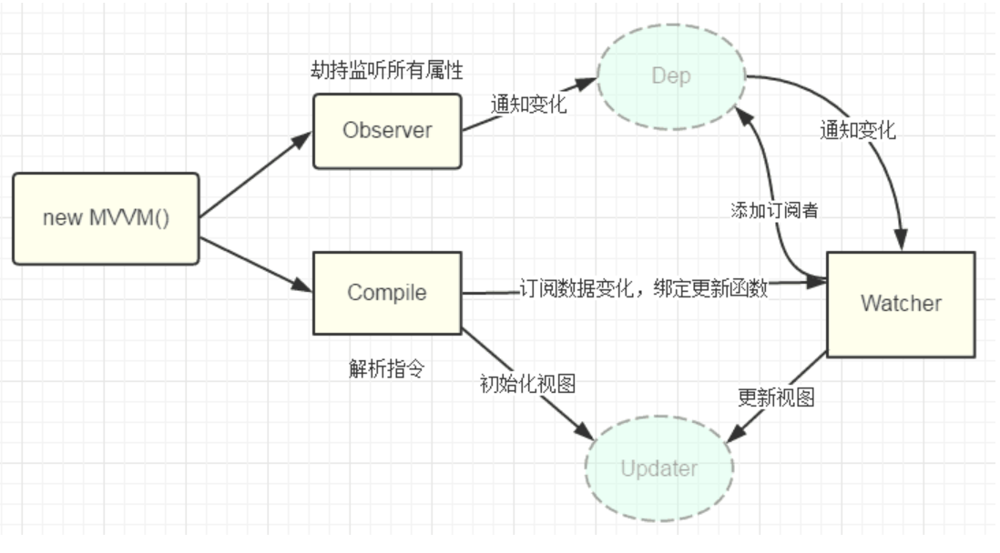
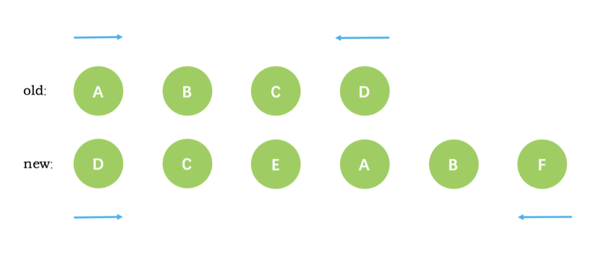
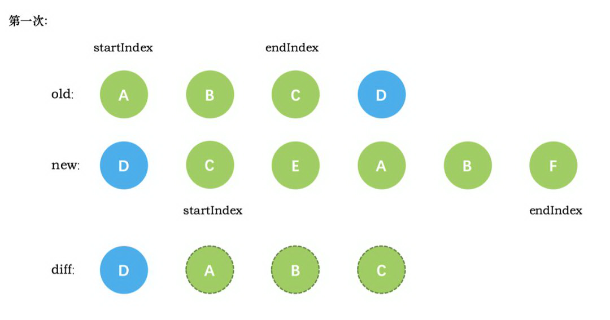
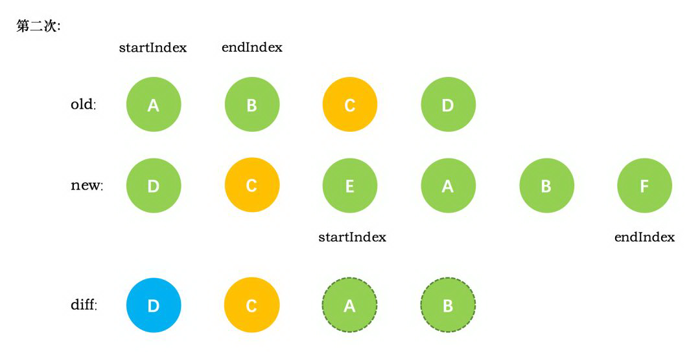
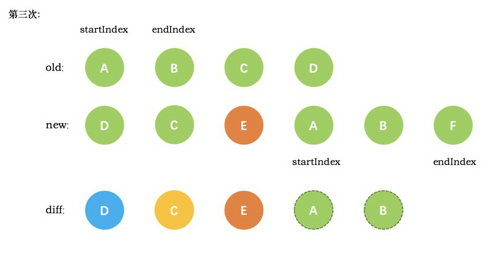
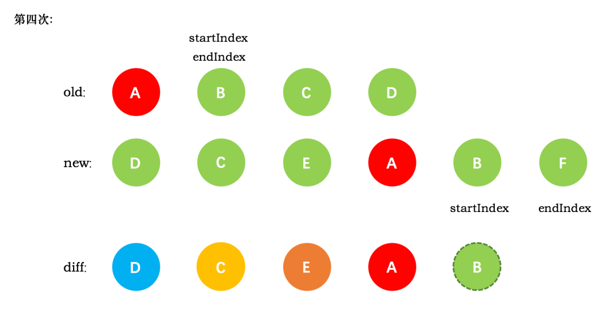

### 0 自问

https://vue3js.cn/interview/vue/mixin.html#%E4%B8%89%E3%80%81%E6%BA%90%E7%A0%81%E5%88%86%E6%9E%90

1. vue组件传递方式
2. 父组件监听子组件的生命周期
3. 浏览器的dom解析过程
4. 谈一下VODM

   - 为什么说vdom更快？

   - vue可以探测数据变化，为什么还需要VDOM的diff算法？

   - VDOM的意义是什么？ （回流重绘）
5. Vue双向绑定原理
6. scoped 与 module
7. computed与watch
8. vue.use
9. 你对vue的理解
10. v-if

11. ⭐ vue实例的挂载过程
12. 为什么vue的data是一个函数

    - vue.extend
    - initState
13. mixin
14. 插槽
15. vue的key的原理
16. keep-alive的理解

### 1 vueX

> vuex的store有State、 Getter、Mutation 、Action、 Module五种属性\

1. **state** 为单一状态树
2. **getters** 类似vue的计算属性，主要用来过滤一些数据
3. **mutation** 更改store中state状态的唯一方法就是提交mutation
4. **action**  异步操作数据， view 层通过 store.dispath 来分发 action

### 2 vue传值方式

1. 依赖注入 provide / inject => **一个祖先组件向其所有子孙后代注入一个依赖**

2. `$attrs`/`$listeners` => **跨级组件之间的通讯变得更简单** 

   一个负责收纳属性，一个负责收纳事件。$attrs存在了父元素但未被prop所识别。配合 inheritAttrs: false 来使用。

   ```js
<child-com1
         :foo="foo"
      :boo="boo"
         :coo="coo"
         :doo="doo"
         title="前端工匠"
   ></child-com1>
   
   
   在 child-com1 中再引用这些
    <child-com2 v-bind="$attrs"></child-com2>
    可获取  this.$attrs
   
   childCom2.vue
    props: {
       coo: String,
       title: String
     }
   
    this.$listeners.two()
   ```
   
   - 关于 listener
   
     ```js
    <child 
         :foo="foo" 
      :bar="bar"
         @one.native="triggerOne"
         @two="triggerTwo">
     </child>
     
     则再child里 this.$listeners.two(); => 便可以访问到 triggerTwo
     # v-on="$listeners" 一级级的往下传递，子子孙孙无穷尽也！
     ```
   
     
   
3. bus通信。

4. 父子传值 props / $emit

5. vuex

6. `$parent` / `$children`与 `ref`

7. 插槽

### 3 父组件监听子组件的生命周期

1. @hook对应的生命周期即可

   ```html
   <Child @hook:mounted="doSomething" ></Child>
   ```

2. 对应声明周期 $emit即可

### 3 真实DOM的解析过程

创建DOM树 => 创建StyleRules => 创建Render树 => 布局layOut=> 绘制Painting

1. 创建DOM树: 用HTML分析器，分析HTML元素，**构建一颗DOM树**
2. StyleRules:  用CSS分析器，分析CSS文件和元素上的inline样式，生成页面的样式表
3. 将DOM树和样式表，关联起来，构建一颗Render树
4. 有了Render树，浏览器开始布局。为每个Render树上的节点确定一个在显示屏上出现的精确坐标， 此为Layout
5. Render树和节点显示坐标都有了，就调用每个节点**paint方法，把它们绘制**

### 4 虚拟DOM

#### 02 | 为什么虚拟DOM快？

- 虚拟DOM是真实DOM的一层抽象数据（AST）

  1. 虚拟DOM更快？

     - 占用了更多的内存， 以内存换取原本操作DOM的操作。Javascript 操作 Javascript 对象自然是快。

       但你不能说比整个过程都比【直接操作DOM】快。

     - 正数再小也不可能比零还小，  Virtual DOM 仍然需要调用 DOM API 去生成真实的 DOM。

  2. 多次修改可以规避成一次修改。最终再一次性渲染出最终的实体dom

     - ⭐ 这是优化了JavasCript的执行速度， 而非 reflow / repaint的性能


- VDOM的优点

  - 实现跨平台，服务端渲染

    只要有 JS 引擎就能运行在任何地方运行。

  - 提供一个性能还算不错 Dom 更新策略，

    有 diff 算法，可以减少没必要的 DOM 操作

  - 为了框架的实现而存在。

#### 03 | 关于源码

https://segmentfault.com/a/1190000008291645

#### 04 | Vue通过数据劫持可以进准探测数据变化，为什么还需要虚拟DOM进行diff检测差异？

如果给每个属性都添加watcher用于更新的话，会产生大量的watcher从而降低性能

所以vue采用了组件级的watcher配合diff来检测差异。

⭐ vue 2.x中为了降低Watcher粒度，每个组件只有一个Watcher与之对应，只有引入diff才能精确找到  发生变化的地方

#### 05 | VDOM真的减少了回流和重绘吗？

- 支撑的观点

  1. DOM 操作会先改变 Virtual DOM， 所以一些无效改变就不会调用到DOM的API

     如 文本 A 修改为 B ，然后再修改为 A

  2. Virtual DOM 调用 `patch` 方法批量操作 DOM ，不会导致过程中出现无意义的回流和重绘

- 无效回流与重绘

  1. **多次的DOM的API的调用不会触发多次的回流与重绘**

     ⭐ 事实上，Javascript 线程和 UI 线程是互斥的，故执行期间不可能触发回流与重绘。

     浏览器的渲染本身机制决定回流与渲染，而不是DOM API的调用。

     简而言之：

     ❗**无论你在一次事件循环中调用多少次的 DOM API ，浏览器也只会触发一次回流与重绘（如果需要），并且如果多次调用并没有修改 DOM 状态，那么回流与重绘一次都不会发生**。

  2. **批量操作并不能减少回流与重绘**

     依旧是【Javascript 单线程引擎且与 UI 线程互斥】这个理由。无论你在一次事件循环中调用多少次的 DOM API ，浏览器也只会触发一次回流与重绘。


#### 06 | 总结 

1. 操作VDOM很快，但这并不是它的优势。

2. Virtual DOM 可以避免频繁操作 DOM ，但与有效减少回流和重绘次数无关。

3. Virtual DOM 有跨平台优势

   跨平台是 Javascript 的优势，而不是VDOM的优势

4. VDOM的真正优点

   - **其抽象能力和常驻内存的特性**
   - **让框架能更容易实现更强大的 diff 算法，缺点是增加了框架复杂度，也占用了更多的内存**

### 5 Vue 双向绑定原理

https://vue3js.cn/interview/vue/bind.html#%E4%BA%8C%E3%80%81%E5%8F%8C%E5%90%91%E7%BB%91%E5%AE%9A%E7%9A%84%E5%8E%9F%E7%90%86%E6%98%AF%E4%BB%80%E4%B9%88



1. 观察者 Observer 

   正因为 Observe，所以可以实现数据劫持，在初始getter时（Compile阶段），将Wachter依赖收集至Dep.

   正因为 Observe，所以可以实现数据改动，触发setter中的Dep， Dep去notify其中收集的Wachter（订阅者）的update，以触发其Watcher其update方法。

2. Compile

   对于Wachter， 初始getter时（Compile阶段），将Wachter依赖收集至Dep。

3. Wachter (订阅者)

   即连接 Observer 和 Compile 的桥梁， 存储对应回调事件，从而实现双绑。

   Vue 内部再通过 diff 算法，patch 相应的更新完成对订阅者视图的改变。

   （此外 Compile也是初始化视图的手段，Watcher强调的是更新）

   ```js
   # 注意此处是极其精细化的处理，真实开发其用的是diff算法来更新。
   Watcher.prototype = {
       update: function() {
           this.get();
           this.node[this.type] = this.value; // 订阅者执行相应操作
       },
       // 获取data的属性值
       get: function() {
           console.log(1)
           this.value = this.vm[this.name]; //触发相应属性的get
       }
   }
   ```

4. Dep

   vue响应式属性都要经过Object.defineProperty()，每一个属性便是有一个dep

   - 为每个属性分配一个订阅者集合的管理数组dep， 每一个dep下可能有一个或多个Wachter
   
     一般而言，Watcher处理的对象是VueComponent。
   
- 编译的时候在该属性的数组dep中添加订阅者
  
   - v-model会添加一个订阅者，{{}}也会，v-bind也会，只要用到该属性的指令理论上都会。
   
   - 触发该属性的set方法，在set方法内通知订阅者数组dep，订阅者数组循环调用各订阅者的update方法更新视图
   
   ```js
   	Object.defineProperty(obj, key, {
                get: function() {
                       if(Dep.target) {
                           dep.addSub(Dep.target);
                       }
                       return val;
                },
                set: function (newVal) {
                       if(newVal === val) return;
                       val = newVal;
                       dep.notify();
                }
          })
   ```

### 6 computed与watch实现机理

1. computed

   - 当模板中的某个值需要通过一个或多个数据计算得到时，就可以使用计算属性.

   - 计算属性的本质是属性，当访问到其 【计算属性】时，才会触发getter再依赖收集。

     当触发内部状态的任一setter时，computed会重新计算（当然内部是响应数据）

2. watch

   属性主要是监听某个值发生变化后，对新值去进行逻辑处理

   ```js
   #1 initWatch
   	初始化watch
   #2 this.$watch
   	触发对应的getter，令watcher加入到dep
   #3 new Watcher
   	若是 render-watcher，此时实例化render-wachter
   #4 vm._render
   	触发对应的getter，以让dep收集到此watcher
   ```

### 7 vue的nextTick

ick 即指的是微任务！与微任务进行了联动！

nextTick的主要目的就是为了让你获取到更新后的dom元素。

实现

1. Promise.then

2. MutationsObserve 

   - 由于IOS存在bug， 已于2.5版本废弃。

   主动去监听与修改textNode节点的内容，以便于事件加入到微任务中

3. setImmdiate => 通过宏任务去调用微任务process.nextTick

   - vue2.5废弃MutationsObserve 的代替品

   Node.js提供的`setImmediate()`函数

   事件循环的当前迭代中执行传递给`process.nextTick()`函数

4. MessageChannel 宏任务

   - setTimeout 是有最小延迟时间的， 5 层以上的定时器嵌套会导致至少 4ms 的延迟
   - `无延迟的定时器！`

5. setTimeout宏任务

### 8 scoped与module

#### 01 | scoped

其实现插件： PostCss

1. 给每一个html的dom节点添加不重复的data属性
2. 在每句css选择器的末尾，添加属性选择器 (特指data)， 来私有化选择器。

```html
<div data-v-2311c06a class="button-warp">
    <button data-v-2311c06a class="button">text</button>
</div>

<style>
.button-warp[data-v-2311c06a]{
    display: inline-block;
}
</style>
```

#### 02 | module原理

module是一种替代 scoped的方案。了解即可。

赋予组件特定的类名， 不产生副作用也能达到私有化样式的效果（默认配置为文件名称）

1. template使用的示范

   ```vue
   <template>
     <p :class="$style.red">
       This should be red
     </p>
   </template>
   
   <style module>
   .red {color: red;}
   </style>
   ```

2. js

   - 深层子组件也可以获取到了
   - script中也能拿到css module

   ```js
   mounted () {
       console.log(this.$style)
       // { border: "App_border_y_ncl",titleColor: "red" }
   }
   ```

### 9 vue的use

是Vue作为插件给全局添加的功能。它要求你是一个对象，且拥有install方法，以此实现更加复杂的功能。

- vue.component
- vue.mixins
- ...

什么是Vue的插件

- 实现上

  vue的插件的实现总是暴露install方法，如Element-UI就可看作是一个插件。

- 功能

   插件增强Vue的功能模块，比如Vue-router、VueX这些。

### 10 对vue的理解

- MVVM  （VM是V -> M单项数据的中间层，也实现双向绑定）
- 组件化
- 指令系统 -> 作用于DOM
- 与react的区别
  1. react一直推崇单向数据流，以至于redux的实现并非在react的考虑范围内
  2. vue使用的响应式数据
  3. diff算法不同。react是【diff队列保存哪些更新的dom】，vue是双指针【对比比较，再更新】。

### 11 源码之v-if 与 v-show

v-if 的注意事项

1. 与key结合使用，可以复用已有元素。
2. 配合组件使用，会触发组件生命周期函数
3. 与transition使用，根据transition触发过渡动画效果

v-show

1. 仅在修改其元素的display （v-show时也会判断有无transition属性而触发动画）

### 12 源码之Vue实例的挂载过程

https://www.cnblogs.com/gerry2019/p/12001661.html

https://vue3js.cn/interview/vue/new_vue.html#%E4%B8%80%E3%80%81%E5%88%86%E6%9E%90

1. init

   ```js
   new Vue()
   function Vue(options) {
       this._init(options);
   }
   Vue.prototype._init = function(options) {
       #01 合并实例和mixins/extend上的数据
       mergeOptions(...);
       #02 初始化组件生命周期标志位
       initLifecycle(vm)
       #03 初始化组件事件侦听
       initEvents(vm)
       #04 初始化渲染方法
       initRender(vm)
       callHook(vm, 'beforeCreate')
       #05 初始化依赖注入内容，在初始化data、props之前
       initInjections(vm)
       #06 初始化props/data/method/watch/methods
       initState(vm) -> 其中 initData -> observe(data);	
       initProvide(vm)
       callHook(vm, 'created')
   }
   
   # initData 
   class Observe {
    construcotr() {
       this.walk(value);
    }
    walk (obj: Object) {
       const keys = Object.keys(obj)
       for (let i = 0; i < keys.length; i++) {
         defineReactive(obj, keys[i])
       }
     }
   }
   ```

2. 组件依赖注入内容（inject）

   初始化initState （initProps、initMethods、initData、computed、初始化watch）

3. created触发

4. 解析template、挂载dom

   ```js
   # 若无render函数情况下
   Vue.prototype.$mount = function() {
       #01 template 经过compileToFunctions 成为render函数
       const { render, staticRenderFns } = compileToFunctions();
       options.render = render;
   	return mount.call(this, el, hydrating);
   }
   # 生成render函数，挂载到vm上后，会再次调用mount方法 (复写方法)
   Vue.prototype.$mount = function() {
       return mountComponent(this, el, hydrating)
   }
   
   function mountComponent() {
    	// 若vm.$options.render不存在此处也会抛出异常
   	#02 beforeMount钩子
   	callHook(vm, 'beforeMount');
       #03 定义updateComponent => 目的是update
       updateComponent = () => { 
       	vm._update(vm._render(), hydrating)
       }
       #04 监听当前组件状态，当有数据变化时，更新组件 -> 调用updateComponent
       new Watcher(vm, updateComponent, noop, {
           before () {
             if (vm._isMounted && !vm._isDestroyed) {
               callHook(vm, 'beforeUpdate')
             }
           }
     	}, true)
       #end mounted
       callHook(vm, 'mounted')
   }
   ```


### 13 为什么data是一个函数？

1. vue实例注册时data既可以是对象也可以是一个函数。

   Vue实例只会存在一个。

2. 组件data属性，只可为函数。

   vue`最终都会通过`Vue.extend()`构成组件实例。故不可以要避免data同时指向一个地址。

   即 一个组件可能会被多次使用。

   具体是在 `initData`时会将其作为工厂函数都会返回全新`data`对象

### 14 mixin

- 目的

  代码复用 + 独立继承

- 实现形式

  传入对象，将公用功能混入到该组件本身的选项中来

- 常见场景

  弹窗组件、Tooltip组件

- 源码

  替换型的合并有`props`、`methods`、`inject`、`computed`

  单纯的合并： data

  队列性的合并： 生命周期、watch， 合并成数组，再正序执行

  叠加的合并： `component`、`directives`、`filters`，通过原型链进行层层的叠加

### 15 slot的理解

- 场景

  1. 复用组件而不重写
  2. 传递内容，以便场景复用

- 插槽

  1. 默认插槽
  2. 具名插槽
  3. 作用域插槽

- 插槽的实现

  1. Vue的组件的渲染

     template -> render function -> VNODE -> NODE

  2. renderSlot

     类似如此， 不过变成了 【resolveSlots】方法，以获得渲染函数，以生成vnodes。

     在此函数中，会根据children做节点归类和过滤处理，以生成slots。

  3. 由于我们在渲染插槽函数时，我们传入了props

     故父组件可以获得子组件的值。

### 16 vue.observable

数据劫持的暴露方法。

1. walk函数

   遍历key，通过defineReactive创建响应式对象

2. defineReactive

   劫持数据

使用场景： 使用observe 代替vuex的实现。状态管理。

本质其实就是数据劫持，方法触发，页面响应。

````js
// 引入vue
import Vue from 'vue
// 创建state对象，使用observable让state对象可响应
export let state = Vue.observable({
  name: '张三',
  'age': 38
})
// 创建对应的方法
export let mutations = {
  changeName(name) {
    state.name = name
  },
  setAge(age) {
    state.age = age
  }
}
# ----------
import { state, mutations } from '@/store
export default {
  // 在计算属性中拿到值
  computed: {
    name() {
      return state.name
    },
    age() {
      return state.age
    }
  },
  // 调用mutations里面的方法，更新数据
  methods: {
    changeName: mutations.changeName,
    setAge: mutations.setAge
  }
}
````

### 17 vue的key的原理

- 什么是key

  给vnode添加唯一的id，服务于diff的优化策略，使得 diff算法可以根据key更加快捷的寻找到vnode节点。

  （key在列表渲染中的作用是：在复杂的列表渲染中快速准确的找到与`newVnode`相对应的`oldVnode`）

- 加与不加的区别

  不添加，就地复用。

  若添加了key，根据keys的顺序记录element（若以前的key不再出现，便remove此节点）

- 不添加key -> 就地复用

  ````js
   	  data: { items: ['a', 'b', 'c', 'd', 'e'] },
        mounted () {
          setTimeout(() => { 
            this.items.splice(2, 0, 'f')  // 
         }, 2000);
            
  ````

  

  比较节点，A与A相同类型的节点，故进行patch，数据相同，故不发生dom操作

  BB、

  比较节点，C与F相同类型的节点，故进行patch，数据不同，发生dom操作。

  同理，D -> C 与 E -> D

  故三次更新操作，一次插入操作。

- 使用了key的情况

  AA、BB同上，不变化，复用key比较。

  会根据`newStartVnode`的`key`去对比`oldCh`数组中的`key`，从而找到相应`oldVnode`。

  当然若你设置key为其顺序的index，那么diff是毫无意义的比较方案。

### 18 keep-alive的理解

- 什么是keep-alive

  keep-alive是内置的组件，目的是状态保留于内存中，防止重复渲染DOM。

  此外，我们总是用keep-alive包裹活动组件，这样就可以实现缓存不活动的组件实例，而不是切换销毁。

  ```js
  # render函数
  vnode.componentInstance = cache[key].componentInstance
  ```

  1. 进行keep-alive的新的生命周期

     activated与deactivated

  2. 生命周期

     beforeRouterEnter -> beforeCreate -> created -> mounted -> activated

     beforeRouterLeave -> deactivated

- 源码

  keep-alive组件的缓存功能在render函数中实现

  1. 根据key来命中缓存。
  2. 若无key，表明此组件未被缓存过，则将其存入cache对象。cache存储的是其组件的vnode

- 番外，你怎么获取到缓存数据

  1. beforeRouteEnter生命周期的next会传入vm, vm.getData
  2. activated生命周期调用this.getData()

### 19 自定义指令

1. 是什么？

   vue的指令系统，vue也支持自定义的指令系统

2. 如何实现

   - el 绑定元素
   - bingding 包含其属性
   - vnode参数

   除了 `el` 之外，其它参数都应该是只读的，切勿进行修改。如果需要在钩子之间共享数据，建议通过元素的 `dataset` 来进行

3. 应用场景

   - 防抖

     ````js
     // 1.设置v-throttle自定义指令
     Vue.directive('throttle', {
       bind: (el, binding) => {
         let throttleTime = binding.value; // 防抖时间
         if (!throttleTime) { // 用户若不设置防抖时间，则默认2s
           throttleTime = 2000;
         }
         let cbFun;
         el.addEventListener('click', event => {
           if (!cbFun) { // 第一次执行
             cbFun = setTimeout(() => {
               cbFun = null;
             }, throttleTime);
           } else {
             event && event.stopImmediatePropagation();
           }
         }, true);
       },
     });
     // 2.为button标签设置v-throttle自定义指令
     <button @click="sayHello" v-throttle>提交</button>
     ````

   - 图片懒加载

     ````js
     const LazyLoad = {
         // install方法
         install(Vue,options){
         	  // 代替图片的loading图
             let defaultSrc = options.default;
             Vue.directive('lazy',{
                 bind(el,binding){
                     LazyLoad.init(el,binding.value,defaultSrc);
                 },
                 inserted(el){
                     // 兼容处理
                     if('IntersectionObserver' in window){
                         LazyLoad.observe(el);
                     }else{
                         LazyLoad.listenerScroll(el);
                     }
                     
                 },
             })
         },
         // 初始化
         init(el,val,def){
             // data-src 储存真实src
             el.setAttribute('data-src',val);
             // 设置src为loading图
             el.setAttribute('src',def);
         },
         // 利用IntersectionObserver监听el
         observe(el){
             let io = new IntersectionObserver(entries => {
                 let realSrc = el.dataset.src;
                 if(entries[0].isIntersecting){
                     if(realSrc){
                         el.src = realSrc;
                         el.removeAttribute('data-src');
                     }
                 }
             });
             io.observe(el);
         },
         // 监听scroll事件
         listenerScroll(el){
             let handler = LazyLoad.throttle(LazyLoad.load,300);
             LazyLoad.load(el);
             window.addEventListener('scroll',() => {
                 handler(el);
             });
         },
         // 加载真实图片
         load(el){
             let windowHeight = document.documentElement.clientHeight
             let elTop = el.getBoundingClientRect().top;
             let elBtm = el.getBoundingClientRect().bottom;
             let realSrc = el.dataset.src;
             if(elTop - windowHeight<0&&elBtm > 0){
                 if(realSrc){
                     el.src = realSrc;
                     el.removeAttribute('data-src');
                 }
             }
         },
         // 节流
         throttle(fn,delay){
             let timer; 
             let prevTime;
             return function(...args){
                 let currTime = Date.now();
                 let context = this;
                 if(!prevTime) prevTime = currTime;
                 clearTimeout(timer);
                 
                 if(currTime - prevTime > delay){
                     prevTime = currTime;
                     fn.apply(context,args);
                     clearTimeout(timer);
                     return;
                 }
     
                 timer = setTimeout(function(){
                     prevTime = Date.now();
                     timer = null;
                     fn.apply(context,args);
                 },delay);
             }
         }
     }
     export default LazyLoad;
     ````

### 20 vue的diff算法

1. 概述

   - 双指针： 从两边到中间开始比较。
   - 策略：深度优先、同层比较。

2. patch函数，传入参数为 oldNode与newNode （只是同级比较）

   当数据发生改变时，`set`方法会调用`Dep.notify`通知所有订阅者`Watcher`，订阅者就会调用`patch`给真实的`DOM`打补丁，更新相应的视图

   - 没有新节点，触发旧节点的destory
   - 没有旧节点，即初始化
   - 若是新旧节点相同（sameNode）【⭐patchVNode】，比较子节点
   - 若是非 sameNode，则创建新节点，删除旧节点

   此外sameNode的key也是判断节点的表示之一。

3. patchVnoe （实际操作节点的过程）

   判断节点类型

   - 新节点是文本，则更新文本内容。 【setTextContent】
   - 依旧存在子节点，比较更新子节点。 子节点不完全一致，则调用`updateChildren`
   - 若新节点有子节点，但旧的没有，则直接初始化，添加至节点。【addVnodes】
   - 若旧有，新无，则删除。 【removeVnodes】

4. updateChildren （difff核心比较方案）

   updateChildren若是满足sameNode则调用 `patchVnode`。

   - 设置新旧的头尾指针（双指针）。

     新旧头尾指针进行比较，循环向中间靠拢。

     ````js
     # 双指针比较 
     while (oldStartIdx <= oldEndIdx && newStartIdx <= newEndIdx) {
     }
     ````

   - 在比较的过程中总结：

     根据情况调用`patchVnode`进行patch那一套的重复流程。

     调用`createElem`创建一个新节点，从哈希表寻找 `key`一致的`VNode` 节点再分情况操作

   - 新旧start相同， patchVnode，两个startIndex + 1

     新旧endIndex相同， 两个endIndex减一。

   - 老start与新end相同，patchVnode，并移动真实DOM节点位置

   - 老end与新start相同，patchVnode，移动真实DOM

   - 若不相同，新旧start、end无法匹配

     识别旧node的key，再从新node的key进行匹配，将其patchVnode，再移动真实DOM

5. 事件（updateChildren）

   

   - 第一次循环

     新节点的D 与 旧节点的D，绑定的key相同的，其内容相同，故复用旧节点的D.

     此时 old的endIndex 加1，startIndex不变。

     new的startIndex加1，endIndex不变。

     

   - 第二次循环

     旧节点的endIndex是C， 新节点的startImdex也是C，同上。

     

   - 第三次循环

     new的的startIndex为E，old中没有寻找到，故创建E插入到C后。

     

   - 第四次循环

     在old中寻找到 A，

     

### 21 vue的权限管理

1. 是什么？

   确保用户只能访问到被分配的资源，前端是控制请求的发起权。

   - 路由方面
   - 视图方面， 用户只能看到自己有权浏览的内容及有权操作的控件。
   - 请求控制兜底

2. 如何实现？

   - 接口权限

     token控制。

   - 按钮权限

     1. 每个页面页面都要获取用户权限`role`和路由表里的`meta.btnPermissions`，然后再做判断。
     2. 自定义指令进行按钮权限的判断

   - 菜单权限

     菜单与路由分离， 菜单由后端控制，路由由后端格式处理。

     要求前后端的配合度高。

   - 路由权限

     1. 用户的权限信息，然后筛选有权限访问的路由，即按需加载。
     2. 每次路由跳转前做校验，路由上标记相应的权限信息

### 22 部署服务器的404问题

SPA： 不管我们应用有多少页面，构建物都只会产出一个`index.html`

而ngnix的配置，根据路径匹配便是会出现404的情况。

- hash模式没有此问题

  `hash` 虽然出现在 `URL` 中，但不会被包括在 `HTTP` 请求中，故对服务器端的请求没有影响。

  即更改hash不会导致重载页面

- 解决方案

  重定向为index.html

### 23 vue的错误处理

1. 后端接口错误

   - 路由拦截

2. 代码错误

   - `errorCaptured`

     是 2.5.0 新增的一个生命钩子函数，当捕获到一个来自子孙组件的错误时被调用

   - Vue.config.errorHandler

     组件的渲染和观察期间未捕获错误的处理函数

### 24 vue.extnd

https://juejin.cn/post/6890072682864476168

- 挂载组件的方式

  data选项在Vue.extend中必须是一个函数。

  Element-UI的弹窗组件甚至支持你的虚拟节点。

  ```js
  const Profile = Vue.extend({});
  new Profile().$mount('#mount-point')
  ```

- 实现源码

  1. 继承Vue，创建子类， 拥有Vue的_init方法

  2. 这便是new Vue的过程了。不同之处在于【resolveConstructorOptions】

     ```js
     vm.$options = mergeOptions(
         resolveConstructorOptions(vm.constructor),
         options || {},
         vm
       )
     ```

  3. $mount

     render -> update -> patch

- 

### 25 vue的三类Watcher

https://www.cnblogs.com/WindrunnerMax/p/14864214.html

- 三类watcher

  1. 定义函数时的render watcher

     负责视图更新 （数据变化，视图更新）

  2. computed watcher

     负责计算属性更新，由【dirty】开关决定是否重新计算还是复用之前的值。

     （计算属性变化，使用计算属性的视图更新）

  3. watcher api

     数据变化，开发者注册的watch回调函数触发。

- render-watcher

  1. Observe： 劫持数据
  2. Watcher： 监听数据改变，执行响应回调函数。
  3. Dep：链接【Observe】和【Watcher】

- computed watcher

  根据依赖的数据动态显示新的计算结果，且是存在计算属性的依赖的。

- watcher api

### 26 vm.$mount

template 经过compileToFunction -> render

vm._render -> vnode

vnode -> vm._update -> vm.$el

1. 提取el元素
2. 若本vue实例无render函数，则将template编译成render函数
3. 挂载函数为 mountComponent
4. 更新渲染函数是updateComponent